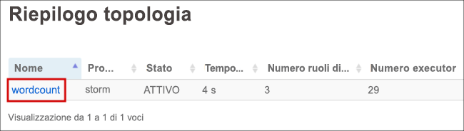
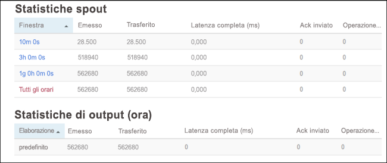

# <a name="quickstart-create-and-monitor-an-apache-storm-topology-in-azure-hdinsight"></a>Guida introduttiva: Creare e monitorare una topologia Apache Storm in Azure HDInsight

Apache Storm è un sistema di calcolo in tempo reale scalabile, a tolleranza di errore e distribuito per l'elaborazione di flussi di dati. Con Storm in Azure HDInsight è possibile creare un cluster Storm basato sul cloud che esegue analisi di Big Data in tempo reale.

In questo argomento di avvio rapido si userà un esempio del progetto Apache [storm-starter](https://github.com/apache/storm/tree/v2.0.0/examples/storm-starter) per creare e monitorare una topologia Apache Storm in un cluster Apache Storm esistente.

## <a name="prerequisites"></a>Prerequisiti

* Un cluster Apache Storm in HDInsight. Consultare [Creare cluster di Apache Hadoop usando il portale di Azure](../hdinsight-hadoop-create-linux-clusters-portal.md) e selezionare **Storm** per **Tipo di cluster**.

* Un client SSH. Per altre informazioni, vedere [Connettersi a HDInsight (Apache Hadoop) con SSH](../hdinsight-hadoop-linux-use-ssh-unix.md).

## <a name="create-the-topology"></a>Creare la topologia

1. Connettersi al cluster Storm. Modificare il comando seguente sostituendo `CLUSTERNAME` con il nome del cluster Storm in uso e quindi immettere il comando:

    ```cmd
    ssh sshuser@CLUSTERNAME-ssh.azurehdinsight.net
    ```

2. L'esempio **WordCount** è disponibile nel cluster HDInsight all'indirizzo `/usr/hdp/current/storm-client/contrib/storm-starter/`. Questa topologia genera frasi casuali e conta le occorrenze di ogni parola. Usare il comando seguente per avviare la topologia **wordcount** nel cluster:

    ```bash
    storm jar /usr/hdp/current/storm-client/contrib/storm-starter/storm-starter-topologies-*.jar org.apache.storm.starter.WordCountTopology wordcount
    ```

## <a name="monitor-the-topology"></a>Monitorare la topologia

Storm offre un'interfaccia Web da usare con le topologie in esecuzione, inclusa nel cluster HDInsight.

Usare la procedura seguente per monitorare la topologia con l'interfaccia utente Storm:

1. Per visualizzare l'interfaccia utente di Storm, aprire un Web browser alla pagina `https://CLUSTERNAME.azurehdinsight.net/stormui`. Sostituire `CLUSTERNAME` con il nome del cluster.

2. Nella sezione **Riepilogo topologia** selezionare la voce **wordcount** nella colonna **Nome**. Verranno visualizzate informazioni sulla topologia.

    

    Nella nuova pagina sono disponibili le informazioni seguenti:

    |Proprietà | DESCRIZIONE |
    |---|---|
    |Topology stats|Informazioni di base sulle prestazioni della topologia, organizzate in intervalli di tempo. La selezione di un intervallo di tempo specifico determina la modifica dell'intervallo di tempo relativo a informazioni visualizzate in altre sezioni della pagina.|
    |Spouts|Informazioni di base sugli spout, incluso l'ultimo errore restituito da ciascuno di essi.|
    |Bolts|Informazioni di base sui bolt.|
    |Topology configuration|Informazioni dettagliate sulla configurazione della topologia.|
    |Activate|riprende l'elaborazione di una topologia disattivata.|
    |Disattivare|sospende una topologia in esecuzione.|
    |Ribilanciare|regola il parallelismo della topologia. È necessario ribilanciare le topologie in esecuzione dopo aver modificato il numero di nodi del cluster. Il ribilanciamento regola il parallelismo per compensare l'aumento o la diminuzione del numero di nodi del cluster. Per altre informazioni, vedere [Understanding the parallelism of an Apache Storm topology](https://storm.apache.org/documentation/Understanding-the-parallelism-of-a-Storm-topology.html) (Informazioni sul parallelismo di una topologia Apache Storm).|
    |Kill|arresta una topologia Storm dopo il timeout specificato.|

3. In questa pagina selezionare una voce nella sezione **Spouts** o **Bolts**. Verranno visualizzate informazioni relative al componente selezionato.

    

    Nella nuova pagina vengono visualizzate le informazioni seguenti:

    |Proprietà | DESCRIZIONE |
    |---|---|
    |Spout/Bolt stats|Informazioni di base sulle prestazioni, organizzate in intervalli di tempo. La selezione di un intervallo di tempo specifico determina la modifica dell'intervallo di tempo relativo a informazioni visualizzate in altre sezioni della pagina.|
    |Input stats (solo bolt)|Informazioni sui componenti che generano i dati usati dal bolt.|
    |Output stats|Informazioni sui dati generati dal bolt.|
    |Executors|Informazioni sulle istanze del componente.|
    |Errors|Errori generati dal componente.|

4. Quando si visualizzano i dettagli di uno spout o di un bolt, selezionare una voce nella colonna **Porta** della sezione **Esecutori** per visualizzare i dettagli relativi a una specifica istanza del componente.

        2015-01-27 14:18:02 b.s.d.task [INFO] Emitting: split default ["with"]
        2015-01-27 14:18:02 b.s.d.task [INFO] Emitting: split default ["nature"]
        2015-01-27 14:18:02 b.s.d.executor [INFO] Processing received message source: split:21, stream: default, id: {}, [snow]
        2015-01-27 14:18:02 b.s.d.task [INFO] Emitting: count default [snow, 747293]
        2015-01-27 14:18:02 b.s.d.executor [INFO] Processing received message source: split:21, stream: default, id: {}, [white]
        2015-01-27 14:18:02 b.s.d.task [INFO] Emitting: count default [white, 747293]
        2015-01-27 14:18:02 b.s.d.executor [INFO] Processing received message source: split:21, stream: default, id: {}, [seven]
        2015-01-27 14:18:02 b.s.d.task [INFO] Emitting: count default [seven, 1493957]

    In questo esempio, la parola **seven** è stata rilevata 1493957 volte. In altri termini, il numero indica le occorrenze della parola dall'avvio della topologia.

## <a name="stop-the-topology"></a>Arrestare la topologia

Tornare alla pagina **Riepilogo topologie** per la topologia relativa al conteggio delle parole e quindi fare clic sul pulsante **Kill** dalla sezione **Topology actions** (Azioni di topologia). Quando richiesto, immettere 10 per il numero di secondi di attesa prima dell'arresto della topologia. Dopo il periodo di timeout, la topologia non viene più visualizzata nella sezione **Interfaccia utente di Storm** del dashboard.

## <a name="clean-up-resources"></a>Pulire le risorse

Al termine dell'argomento di avvio rapido, può essere opportuno eliminare il cluster. Con HDInsight, i dati vengono archiviati in Archiviazione di Azure ed è possibile eliminare tranquillamente un cluster quando non viene usato. Vengono addebitati i costi anche per i cluster HDInsight che non sono in uso. Poiché i costi per il cluster sono decisamente superiori a quelli per l'archiviazione, economicamente ha senso eliminare i cluster quando non vengono usati.

Per eliminare un cluster, vedere [Eliminare un cluster HDInsight tramite browser, PowerShell o l'interfaccia della riga di comando di Azure](../hdinsight-delete-cluster.md).

## <a name="next-steps"></a>Passaggi successivi

In questo argomento di avvio rapido è stato usato un esempio del progetto Apache [storm-starter](https://github.com/apache/storm/tree/v2.0.0/examples/storm-starter) per creare e monitorare una topologia Apache Storm in un cluster Apache Storm esistente. Passare all'articolo successivo per apprendere i concetti di base relativi alla gestione e al monitoraggio di topologie Apache Storm.

> [!div class="nextstepaction"]
>[Distribuire e gestire le topologie Apache Storm su Azure HDInsight](./apache-storm-deploy-monitor-topology-linux.md)