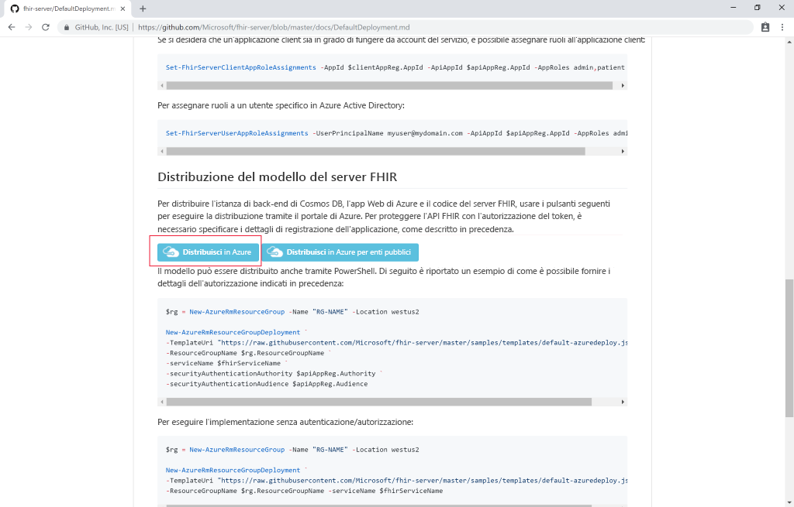
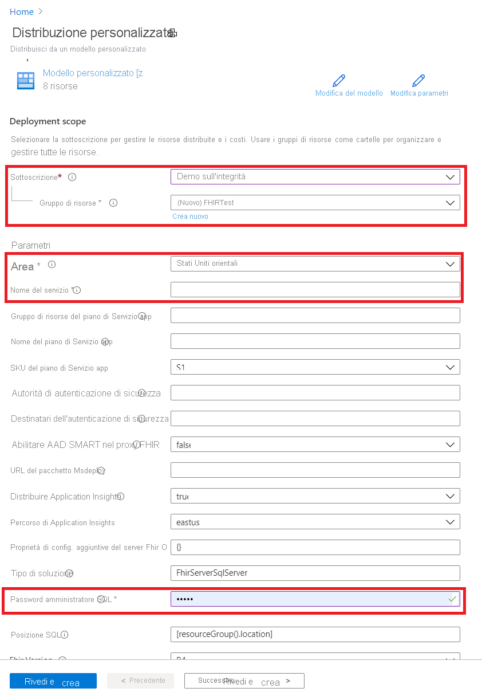

# Avvio rapido: Distribuire il server FHIR open source con il portale di Azure

Questa guida di avvio rapido illustra come distribuire il server FHIR open source in Azure con il portale di Azure. Verranno usati collegamenti di distribuzione semplici nel [repository open source](https://github.com/Microsoft/fhir-server)

Se non si ha una sottoscrizione di Azure, creare un [account gratuito](https://azure.microsoft.com/free/?WT.mc_id=A261C142F) prima di iniziare.

## Repository open source in GitHub

Passare alla [pagina di distribuzione di GitHub](https://github.com/Microsoft/fhir-server/blob/master/docs/DefaultDeployment.md) e individuare i pulsanti "Distribuisci in Azure":

Fare clic sul pulsante distribuzione per aprire il portale di Azure.

## Specificare i parametri di distribuzione

Scegliere di creare un nuovo gruppo di risorse e assegnargli un nome. L'unico altro parametro obbligatorio è un nome per il servizio.

Si noti che la distribuzione eseguirà il pull del codice sorgente direttamente dal repository open source in GitHub. Se è stato creata una copia del repository tramite fork, è possibile puntare al proprio repository e a un ramo specifico.

Dopo aver specificato i dettagli, è possibile avviare la distribuzione.

## Verificare che il server FHIR sia in esecuzione

Una volta completata la distribuzione, è possibile puntare il browser all'indirizzo `https://SERVICENAME.azurewebsites.net/metadata` per ottenere una dichiarazione di funzionalità. La prima volta, il server impiegherà circa un minuto per rispondere.

## Pulire le risorse

Quando non sono più necessari, è possibile eliminare il gruppo di risorse e tutte le risorse correlate. A tale scopo, selezionare il gruppo di risorse contenente le risorse di cui è stato effettuato il provisioning, selezionare **Elimina gruppo di risorse**, quindi confermare il nome del gruppo di risorse da eliminare.

## Passaggi successivi

In questa esercitazione è stato distribuito il server FHIR open source Microsoft per Azure nella sottoscrizione. Per informazioni su come accedere all'API FHIR tramite Postman, passare all'esercitazione su Postman.
 
>[!div class="nextstepaction"]
>[Accedere all'API FHIR con Postman](access-fhir-postman-tutorial.md)