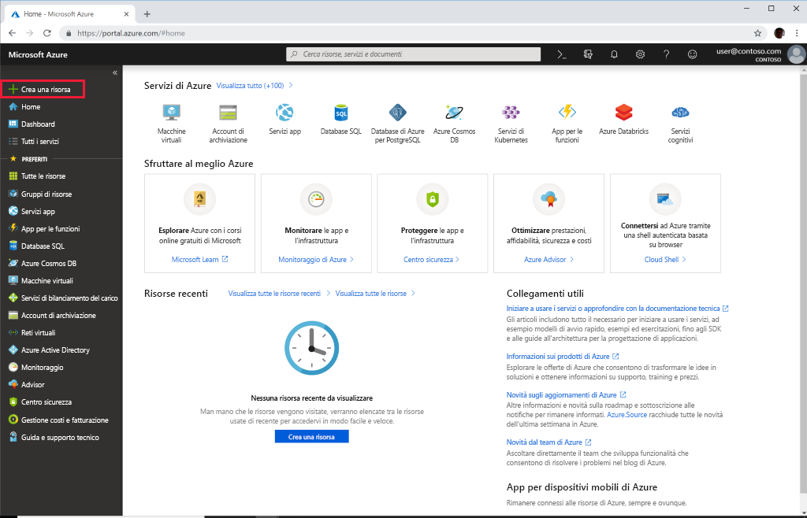

# Avvio rapido: Distribuire l'API di Azure per FHIR con il portale di Azure

Questa guida di avvio rapido illustra come distribuire l'API di Azure per FHIR con il portale di Azure.

Se non si ha una sottoscrizione di Azure, creare un [account gratuito](https://azure.microsoft.com/free/?WT.mc_id=A261C142F) prima di iniziare.

## Create new resource (Crea nuova risorsa)

Aprire il [portale di Azure](https://portal.azure.com) e fare clic su **Crea una risorsa**

## Cercare l'API di Azure per FHIR

È possibile trovare l'API di Azure per FHIR digitando "FHIR" nella casella di ricerca:

:::image type="content" source="media/quickstart-paas-portal/portal-search-healthcare-apis.png" alt-text="Cercare le API per i servizi sanitari":::

## Creare l'account API di Azure per FHIR

Selezionare **crea** per creare un nuovo account API di Azure per FHIR:

:::image type="content" source="media/quickstart-paas-portal/portal-create-healthcare-apis.png" alt-text="Cercare le API per i servizi sanitari":::

## Immettere i dettagli dell'account

Selezionare un gruppo di risorse esistente o crearne uno nuovo, scegliere un nome per l'account, infine fare clic su **Rivedi e crea**:

:::image type="content" source="media/quickstart-paas-portal/portal-new-healthcareapi-details.png" alt-text="Cercare le API per i servizi sanitari":::

Confermare la creazione e attendere la distribuzione dell'API FHIR.

## Impostazioni aggiuntive (facoltativo)

È anche possibile fare clic su **Avanti: Impostazioni aggiuntive** per visualizzare le impostazioni di autenticazione. La configurazione predefinita per l'API di Azure per FHIR consiste nell'[usare il Controllo degli accessi in base al ruolo Azure per l'assegnazione di ruoli del piano dati](configure-azure-rbac.md). Se viene usata questa modalità di configurazione, l'opzione "Autorità" per il servizio FHIR verrà impostata sul tenant di Azure Active Directory della sottoscrizione:

:::image type="content" source="media/rbac/confirm-azure-rbac-mode-create.png" alt-text="Cercare le API per i servizi sanitari":::

Si noti che la casella per l'immissione degli ID oggetto consentiti è disabilitata perché in questo caso viene usato Controllo degli accessi in base al ruolo Azure per la configurazione delle assegnazioni di ruolo.

Se si vuole configurare il servizio FHIR per usare un tenant esterno o secondario di Azure Active Directory, è possibile modificare il valore di Autorità e immettere ID oggetto per utenti e gruppi che devono essere autorizzati ad accedere al server. Per altre informazioni, vedere la guida alla [configurazione del Controllo degli accessi in base al ruolo locale](configure-local-rbac.md).

## Recuperare la dichiarazione di funzionalità dell'API FHIR

Per verificare l'avvenuto provisioning del nuovo account API FHIR, recuperare una dichiarazione di funzionalità indirizzando un browser a `https://<ACCOUNT-NAME>.azurehealthcareapis.com/metadata`.

## Pulire le risorse

Quando non servono più, è possibile eliminare il gruppo di risorse, l'API di Azure per FHIR e tutte le risorse correlate. A tale scopo, selezionare il gruppo di risorse contenente l'API di Azure per FHIR, selezionare **Elimina gruppo di risorse**, quindi confermare il nome del gruppo di risorse da eliminare.

## Passaggi successivi

In questa guida di avvio rapido è stata distribuita l'API di Azure per FHIR nella sottoscrizione. Per configurare le impostazioni aggiuntive nell'API di Azure per FHIR, passare alla guida pratica sulle impostazioni aggiuntive.

>[!div class="nextstepaction"]
>[Impostazioni aggiuntive nell'API di Azure per FHIR](azure-api-for-fhir-additional-settings.md)
