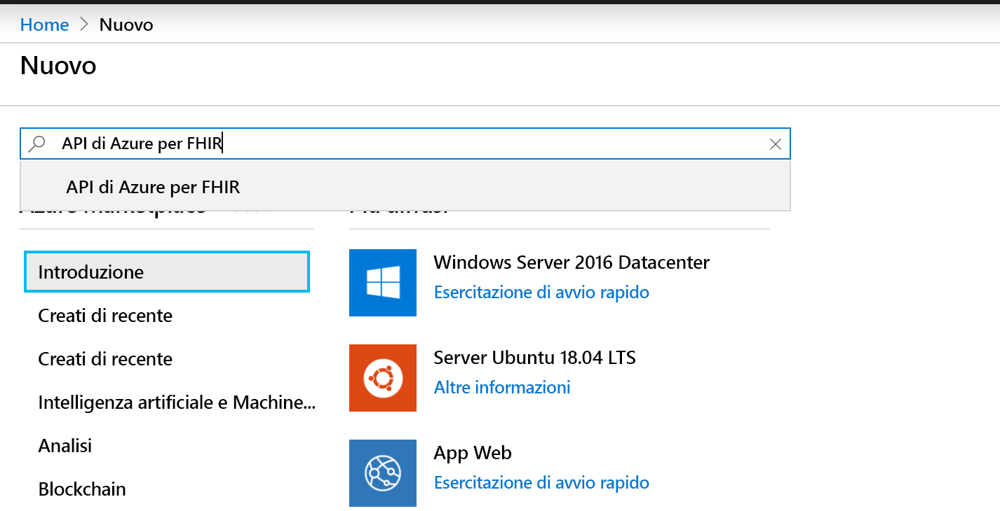
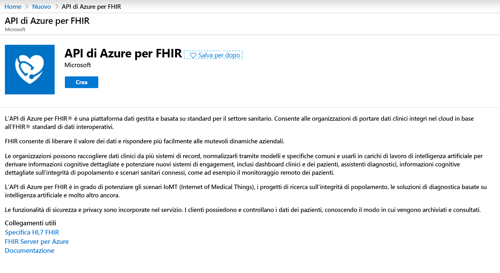
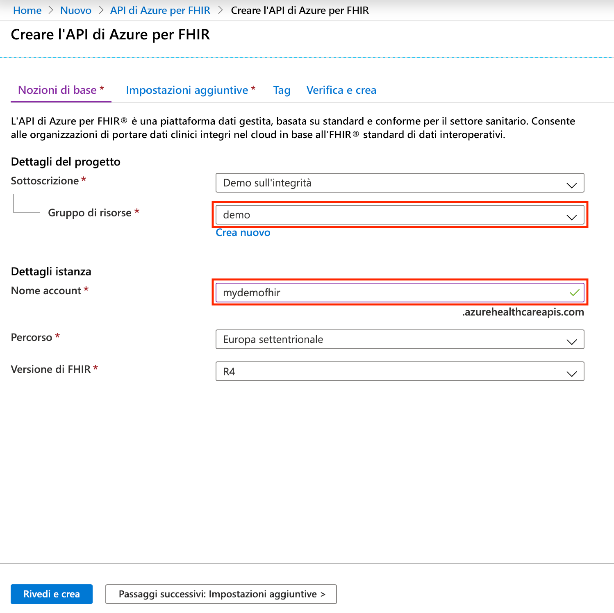

# Avvio rapido: Distribuire l'API di Azure per FHIR con il portale di Azure

Questa guida di avvio rapido illustra come distribuire l'API di Azure per FHIR con il portale di Azure.

Se non si ha una sottoscrizione di Azure, creare un [account gratuito](https://azure.microsoft.com/free/?WT.mc_id=A261C142F) prima di iniziare.

## Create new resource (Crea nuova risorsa)

Aprire il [portale di Azure](https://portal.azure.com) e fare clic su **Crea una risorsa**

## Cercare l'API di Azure per FHIR

È possibile trovare l'API di Azure per FHIR digitando "FHIR" nella casella di ricerca:

## Creare l'account API di Azure per FHIR

Selezionare **crea** per creare un nuovo account API di Azure per FHIR:

## Immettere i dettagli dell'account

Selezionare un gruppo di risorse esistente o crearne uno nuovo, scegliere un nome per l'account, infine fare clic su **Rivedi e crea**:

Confermare la creazione e attendere la distribuzione dell'API FHIR.

## Impostazioni aggiuntive

Fare clic su **Avanti: Impostazioni aggiuntive** per configurare l'autorità, i destinatari, gli ID oggetto identità che devono essere autorizzati ad accedere a questa API di Azure per FHIR, abilitare SMART on FHIR se necessario e configurare la velocità effettiva del database:

- **Autorità:** è possibile specificare un tenant di Azure AD diverso da quello a cui si è connessi come autorità di autenticazione per il servizio.
- **Destinatari:** la procedura consigliata, che è anche l'impostazione predefinita, prevede che i destinatari siano impostati sull'URL del server FHIR. È possibile modificare questa impostazione qui. Il campo Destinatari identifica la risorsa di destinazione del token. In questo contesto, deve essere impostato su un elemento che rappresenta l'API FHIR stessa.
- **Allowed object IDs:** (ID oggetto consentiti) è possibile specificare gli ID oggetto identità autorizzati ad accedere a questa API di Azure per FHIR. Per altre informazioni su come trovare l'ID oggetto per gli utenti e le entità servizio, vedere la guida pratica [Trovare ID oggetto identità](find-identity-object-ids.md).  
- **Smart On FHIR proxy:** (Proxy SMART On FHIR) È possibile abilitare il proxy SMART On FHIR. Per informazioni dettagliate su come configurare il proxy SMART On FHIR, vedere l'esercitazione [Proxy SMART On FHIR dell'API di Azure per FHIR](https://docs.microsoft.com/azure/healthcare-apis/use-smart-on-fhir-proxy)  
- **Provisioning velocità effettiva (UR/sec):** consente di specificare le impostazioni della velocità effettiva per il database sottostante per l'API di Azure per FHIR. È possibile modificare questa impostazione in un secondo momento nel pannello Database. Per informazioni dettagliate, vedere la pagina [Configurare le impostazioni del database](configure-database.md).

## Recuperare la dichiarazione di funzionalità dell'API FHIR

Per verificare l'avvenuto provisioning del nuovo account API FHIR, recuperare una dichiarazione di funzionalità indirizzando un browser a `https://<ACCOUNT-NAME>.azurehealthcareapis.com/metadata`.

## Pulire le risorse

Quando non servono più, è possibile eliminare il gruppo di risorse, l'API di Azure per FHIR e tutte le risorse correlate. A tale scopo, selezionare il gruppo di risorse contenente l'API di Azure per FHIR, selezionare **Elimina gruppo di risorse**, quindi confermare il nome del gruppo di risorse da eliminare.

## Passaggi successivi

In questa guida di avvio rapido è stata distribuita l'API di Azure per FHIR nella sottoscrizione. Per configurare le impostazioni aggiuntive nell'API di Azure per FHIR, passare alla guida pratica sulle impostazioni aggiuntive.

>[!div class="nextstepaction"]
>[Impostazioni aggiuntive nell'API di Azure per FHIR](azure-api-for-fhir-additional-settings.md)
