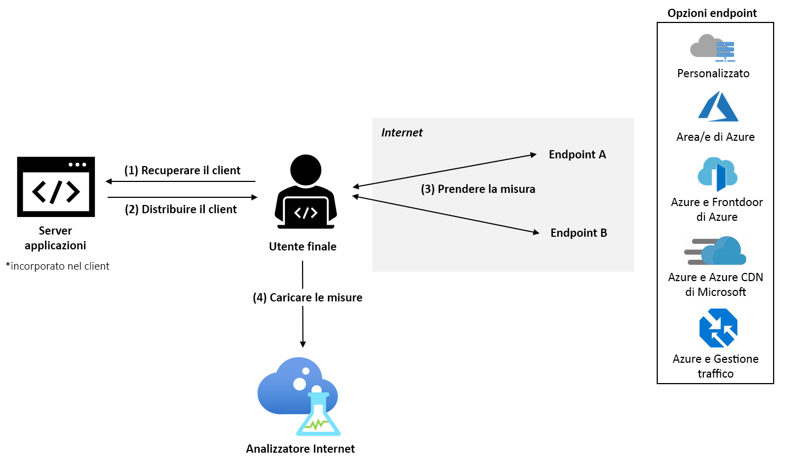

# Che cos'è l'analizzatore Internet? (Anteprima)

L'analizzatore Internet è una piattaforma di misurazione lato client che consente di testare l'impatto delle modifiche apportate all'infrastruttura di rete sulle prestazioni dei clienti. Indipendentemente dal fatto che si esegua la migrazione da locale ad Azure o che si stia valutando un nuovo servizio di Azure, l'analizzatore Internet consente di acquisire dai dati degli utenti e dalle analisi avanzate di Microsoft le informazioni necessarie sull'architettura di rete per ottimizzarla con Azure prima della migrazione.

L'analizzatore Internet usa un piccolo client JavaScript incorporato nell'applicazione Web per misurare la latenza dagli utenti finali al set selezionato di destinazioni di rete, denominate _endpoint_. L'analizzatore Internet permette di configurare più test affiancati, consentendo di valutare diversi scenari in base all'evoluzione dell'infrastruttura e delle esigenze dei clienti. L'analizzatore Internet fornisce endpoint personalizzati e preconfigurati, per garantire al tempo stesso la praticità e la flessibilità di prendere decisioni attendibili sulle prestazioni per gli utenti finali. 

> [!IMPORTANT]
> L'anteprima pubblica viene messa a disposizione senza contratto di servizio e non deve essere usata per i carichi di lavoro di produzione. Alcune funzionalità potrebbero non essere supportate, potrebbero avere funzioni limitate o potrebbero non essere disponibili in tutte le località di Azure. Vedere [Condizioni supplementari per l'uso delle anteprime di Microsoft Azure](https://azure.microsoft.com/support/legal/preview-supplemental-terms/).
>

## Test rapidi e personalizzabili

L'analizzatore Internet permette di rispondere alle domande relative alle prestazioni per la migrazione cloud, la distribuzione in aree di Azure nuove o aggiuntive o il test di nuove piattaforme per la distribuzione di contenuto e applicazioni in Azure, ad esempio [Frontdoor di Azure](https://azure.microsoft.com/services/frontdoor/) e [Rete CDN di Microsoft Azure](https://azure.microsoft.com/services/cdn/). 

Ogni test creato nell'analizzatore Internet è costituito da due endpoint: endpoint A ed endpoint B. Le prestazioni dell'endpoint B vengono analizzate rispetto a quelle dell'endpoint A. 

È possibile configurare un endpoint personalizzato o selezionarne uno tra un'ampia gamma di endpoint di Azure preconfigurati. È consigliabile usare gli endpoint personalizzati per valutare i carichi di lavoro locali, le istanze in altri provider di servizi cloud o le configurazioni personalizzate di Azure. I test possono essere costituiti da due endpoint personalizzati. Tuttavia, almeno un endpoint personalizzato deve essere ospitato in Azure. Gli endpoint di Azure preconfigurati sono un modo rapido e semplice per valutare le prestazioni delle piattaforme di rete di Azure più diffuse, ad esempio Frontdoor di Azure, Gestione traffico di Azure e Rete CDN di Azure. 

Durante l'anteprima sono disponibili gli endpoint preconfigurati seguenti: 

* **Aree di Azure**
    * Brasile meridionale
    * India centrale
    * Stati Uniti centrali
    * Asia orientale
    * Stati Uniti orientali
    * Giappone occidentale
    * Europa settentrionale
    * Sudafrica settentrionale
    * Asia sud-orientale 
    * Emirati Arabi Uniti settentrionali
    * Regno Unito occidentale  
    * Europa occidentale
    * Stati Uniti occidentali 
    * Stati Uniti occidentali 2
* **Combinazioni di più aree di Azure** 
    * Stati Uniti orientali, Brasile meridionale 
    * Stati Uniti orientali, Asia orientale 
    * Europa occidentale, Brasile meridionale
    * Europa occidentale, Asia sud-orientale
    * Europa occidentale, Emirati Arabi Uniti settentrionali
    * Stati Uniti occidentali, Stati Uniti orientali 
    * Stati Uniti occidentali, Europa occidentale
    * Stati Uniti occidentali, Emirati Arabi Uniti settentrionali
    * Europa occidentale, Emirati Arabi Uniti settentrionali, Asia sud-orientale
    * Stati Uniti occidentali, Europa occidentale, Asia orientale
    * Stati Uniti occidentali, Europa settentrionale, Asia sud-orientale, Emirati Arabi Uniti settentrionali, Sudafrica settentrionale 
* **Azure + Frontdoor di Azure**: distribuiti in qualsiasi combinazione singola o di più aree di Azure tra quelle elencate sopra
* **Azure + Rete CDN di Azure di Microsoft**: distribuiti in qualsiasi combinazione singola di aree di Azure tra quelle elencate sopra
* **Azure + Gestione traffico di Azure**: distribuiti in qualsiasi combinazione di più aree di Azure tra quelle elencate sopra

## Scenari di test suggeriti 

Per aiutare l'utente a prendere le decisioni ottimali in termini di prestazioni per i clienti, l'analizzatore Internet consente di valutare due endpoint per la tipologia di utenti finali specifica. 

L'analizzatore Internet può rispondere a numerose domande e di seguito vengono riportate alcune delle più comuni: 
* Qual è l'impatto sulle prestazioni della migrazione cloud? 
    * *Test suggerito: Confronto tra personalizzato (infrastruttura locale corrente) e Azure (qualsiasi endpoint preconfigurato)*
* Quali sono le differenze tra ospitare i dati nella rete perimetrale rispetto al data center? 
    *  *Test suggerito: Confronto tra Azure e Frontdoor di Azure, Azure e Rete CDN di Azure di Microsoft*
* Quali sono i vantaggi in termini di prestazioni di Frontdoor di Azure?
    *  *Test suggerito: Confronto tra personalizzato/Azure/Rete CDN e Frontdoor di Azure*
* Quali sono i vantaggi in termini di prestazioni di Rete CDN di Azure di Microsoft? 
    *  *Test suggerito: Confronto tra personalizzato/Azure/Frontdoor di Azure e Rete CDN di Azure di Microsoft*
* Come funziona la rete CDN di Azure di Microsoft? 
    *  *Test suggerito: Confronto tra personalizzato (altro endpoint rete CDN) e Rete CDN di Azure di Microsoft*
* Qual è il cloud migliore per la tipologia di utenti finali in ogni area? 
    *  *Test suggerito: Confronto tra personalizzato (altro servizio cloud) e Azure (qualsiasi endpoint preconfigurato)*

## Funzionamento

Per usare l'analizzatore Internet, configurare una risorsa analizzatore Internet nel portale di Microsoft Azure e installare il piccolo client JavaScript nell'applicazione. Il client consente di misurare la latenza dagli utenti finali agli endpoint selezionati scaricando un'immagine di un pixel tramite HTTPS. Dopo aver raccolto le misurazioni di latenza, il client invia i dati delle misurazioni all'analizzatore Internet.

Quando un utente visita l'applicazione Web, il client JavaScript seleziona due endpoint da misurare in tutti i test configurati. Per ogni endpoint, il client esegue una misurazione _a freddo_ e una _a caldo_. La misurazione _a freddo_ comporta una latenza aggiuntiva oltre alla latenza di rete pura tra l'utente e l'endpoint, ad esempio la risoluzione DNS, l'handshake della connessione TCP e la negoziazione SSL/TLS. La misurazione _a caldo_ viene eseguita immediatamente al termine della misurazione _a freddo_ e sfrutta i vantaggi della gestione della connessione TCP persistente dei browser moderni per ottenere una misura accurata della latenza end-to-end. Quando supportata dal browser dell'utente, viene usata l'API Resource Timing W3C per ottenere tempi di misurazione accurati. Al momento, per l'analisi vengono usate solo le misurazioni della latenza a caldo.

## Scorecard 

Una volta avviato un test, i dati di telemetria sono visibili nella scheda Scorecard della risorsa analizzatore Internet. Questi dati sono sempre aggregati. Per modificare la visualizzazione dei dati, usare i filtri seguenti: 

* **Test:** Selezionare il test per cui visualizzare i risultati. I dati del test vengono visualizzati quando sono disponibili dati sufficienti per completare l'analisi, nella maggior parte dei casi, entro 24 ore. 
* **Periodo di tempo e data di fine:** L'analizzatore Internet genera tre scorecard al giorno: ogni scorecard riflette un periodo di tempo di aggregazione diverso, ovvero le 24 ore precedenti (giorno), i sette giorni precedenti (settimana) e i 30 giorni precedenti (mese). Usare il filtro "Data di fine" per selezionare il periodo di tempo che si vuole visualizzare. 
* **Paese:** Usare questo filtro per visualizzare i dati specifici degli utenti finali che risiedono in un paese. Il filtro globale mostra i dati per tutte le aree geografiche.  

Per altre informazioni sugli scorecard, vedere la pagina relativa all'[interpretazione dello scorecard](internet-analyzer-scorecard.md). 

## Passaggi successivi

* Informazioni su come [creare la prima risorsa analizzatore Internet](internet-analyzer-create-test-portal.md).
* Leggere le [Domande frequenti sull'analizzatore Internet](internet-analyzer-faq.md). 
