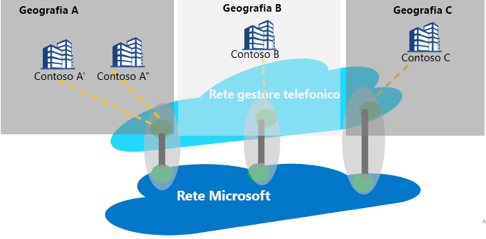

# Confronto tra peering Internet e Servizio di peering

Il peering Internet si riferisce a qualsiasi interconnessione tra la rete globale Microsoft (AS8075) e la rete di operatori o provider di servizi. Un provider di servizi può diventare un partner del servizio di peering implementando i requisiti di partnership di tale servizio descritti di seguito per offrire connettività pubblica affidabile e a elevate prestazioni con routing ottimale dal cliente alla rete Microsoft.

## Informazioni sul Servizio di peering
Il servizio di peering è un programma di partnership con i principali provider di servizi, il cui obiettivo è offrire connettività Internet pubblica di livello superiore agli utenti aziendali. I partner che partecipano al programma riceveranno connessioni dirette con ridondanza geografica, disponibilità elevata e routing ottimizzato con Microsoft. Il servizio di peering è un componente aggiuntivo della gamma di soluzioni Microsoft per la connettività:
*   ExpressRoute per la connettività privata con risorse IaaS o PaaS (supporto per lo spazio IP privato)
    *   Connettività basata sui partner
    *   Connettività diretta 100 G con Microsoft
*   IPSEC su Internet per la connettività VPN con il cloud
*   Connettività SD-WAN con Azure tramite rete WAN virtuale

Il segmento target per il servizio di peering è costituito da clienti con connettività SaaS e SD-WAN disposti a stabilire un breakout Internet a livello di filiale, nonché da qualsiasi cliente con una doppia strategia che include MPLS e Internet di classe enterprise.

L'obiettivo principale quando ci si connette a Microsoft Cloud è minimizzare la latenza riducendo il tempo di round trip (RTT) da un sito utente alla rete globale Microsoft, ovvero il backbone di rete pubblica di Microsoft che interconnette tutti i data center di Microsoft e più punti di ingresso delle applicazioni cloud. Vedere [Ottimizzare la connettività e le prestazioni in Office 365](https://techcommunity.microsoft.com/t5/Office-365-Blog/Getting-the-best-connectivity-and-performance-in-Office-365/ba-p/124694).

> [!div class="mx-imgBorder"]
> 

Nella figura qui sopra ogni filiale di un'azienda globale si connette alla posizione perimetrale Microsoft più vicina possibile tramite la rete del partner.

**Vantaggi del servizio di peering per i clienti:**
* Miglior routing pubblico su Internet verso i servizi cloud Microsoft per livelli ottimali di prestazioni e affidabilità.
* Possibilità di scegliere il provider di servizi preferito per connettersi a Microsoft Cloud.
* Informazioni dettagliate sul traffico, ad esempio sulla latenza, e monitoraggio dei prefissi.
* Hop di rete ottimali (hop AS) da Microsoft Cloud.
* Analisi e statistiche delle route: eventi relativi ad anomalie delle route [BGP](https://en.wikipedia.org/wiki/Border_Gateway_Protocol) (Border Gateway Protocol), come il rilevamento di dispersioni/hijack, e routing non ottimale.

## Requisiti della partnership per il servizio di peering
* Connettività a Microsoft Cloud in una posizione più vicina al cliente. Un provider di servizi partner instraderà il traffico verso la rete perimetrale Microsoft più vicina all'utente. Analogamente, Microsoft instraderà il traffico verso l'utente alla posizione perimetrale più vicina all'utente (usando il tag BGP) e il provider di servizi lo distribuirà all'utente.
* Il partner manterrà una connettività con ridondanza geografica, a velocità effettiva elevata e a disponibilità elevata con la rete globale Microsoft.
* Il partner può utilizzare il peering esistente per supportare il servizio di peering, se soddisfa i requisiti.

## Domande frequenti
Per le domande frequenti, vedere [Domande frequenti sul servizio di peering](service-faqs.md).

## Passaggi successivi

* Altre informazioni sui vantaggi del [servizio di peering](https://docs.microsoft.com/azure/peering-service/) per il clienti.
* Informazioni sui passaggi per abilitare il peering diretto per il servizio di peering con la [procedura dettagliata per i partner del servizio di peering](walkthrough-peering-service-all.md).
