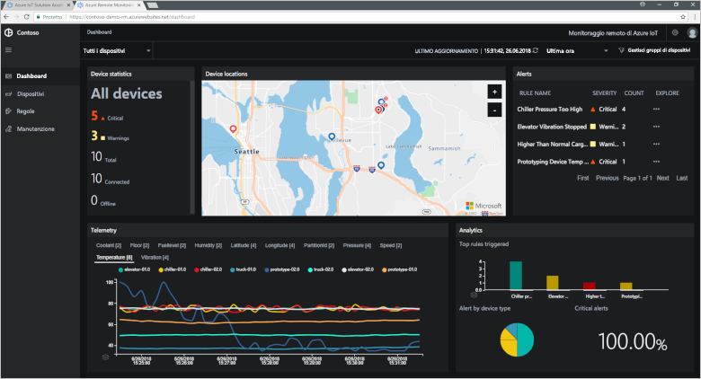
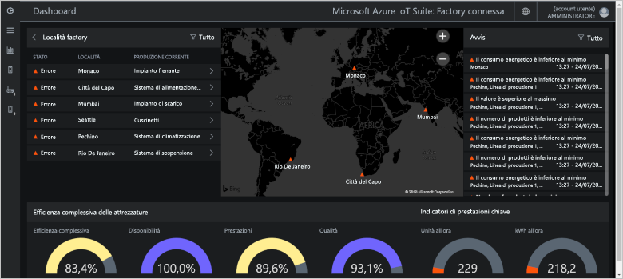
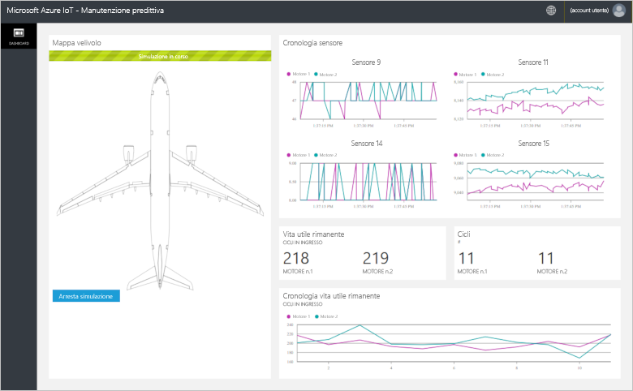
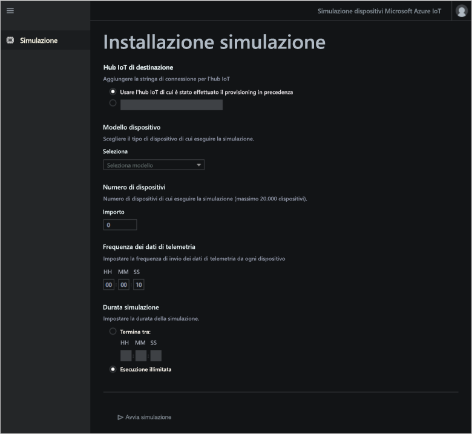

# Informazioni sugli acceleratori di soluzioni Azure IoT

Una soluzione IoT basata su cloud usa in genere codice personalizzato e servizi cloud per gestire la connettività dei dispositivi, l'elaborazione e l'analisi dei dati e la presentazione.

Gli acceleratori di soluzioni IoT sono soluzioni IoT complete pronte per la distribuzione che implementano scenari IoT comuni. Gli scenari includono il monitoraggio remoto, Connected Factory, la manutenzione predittiva e la simulazione dei dispositivi. Quando si implementa un acceleratore di soluzioni, la distribuzione include tutti i servizi basati su cloud necessari insieme a qualsiasi codice applicativo richiesto.

Gli acceleratori di soluzioni sono punti di partenza per le soluzioni IoT. Il codice sorgente per tutti gli acceleratori di soluzioni è open source ed è disponibile in GitHub. Si consiglia di scaricare e personalizzare acceleratori di soluzioni adatti alle proprie esigenze.

Gli acceleratori di soluzioni possono essere usati anche come strumenti di apprendimento prima di compilare una soluzione IoT personalizzata ex novo. Gli acceleratori di soluzioni implementano pratiche collaudate per le soluzioni IoT basate su cloud da seguire.

Il codice dell'applicazione in ogni acceleratore di soluzioni include un'app Web che consente di gestire l'acceleratore di soluzioni.

## Scenari IoT supportati

Attualmente, sono disponibili per la distribuzione quattro acceleratori di soluzioni:

### Monitoraggio remoto

Usare l'[acceleratore di soluzione Monitoraggio remoto](iot-accelerators-remote-monitoring-sample-walkthrough.md) per raccogliere i dati di telemetria dai dispositivi remoti e per controllarli. I dispositivi di esempio includono sistemi di raffreddamento installati presso i clienti o valvole installate in stazioni di pompaggio remote.

È possibile usare un dashboard di monitoraggio remoto per visualizzare la telemetria dai dispositivi connessi, effettuare il provisioning di nuovi dispositivi o aggiornare il firmware sui dispositivi connessi:

### Connected Factory

Usare l'[acceleratore di soluzione Connected Factory](iot-accelerators-connected-factory-sample-walkthrough.md) per raccogliere i dati di telemetria da asset industriali con un'interfaccia [OPC Unified Architecture](https://opcfoundation.org/about/opc-technologies/opc-ua/) e per controllarli. Gli asset industriali possono includere stazioni di assemblaggio e prova su una linea di produzione factory.

È possibile usare il dashboard di fabbrica connessa per monitorare e gestire i dispositivi industriali:

### Manutenzione predittiva

Usare l'[acceleratore di soluzione Manutenzione predittiva](iot-accelerators-predictive-walkthrough.md) per prevedere i guasti di un dispositivo remoto e poter eseguire la manutenzione prima che si verifichino. Questo acceleratore di soluzioni usa algoritmi di apprendimento macchina per prevedere i guasti a partire dalla telemetria del dispositivo. I dispositivi di esempio possono essere motori di aereo o ascensori.

È possibile usare il dashboard di manutenzione predittiva per visualizzare le analisi di manutenzione predittiva:

### Simulazione dei dispositivi

Usare l'[acceleratore di soluzione Simulazione dispositivi](iot-accelerators-device-simulation-overview.md) per eseguire dispositivi simulati che generano dati di telemetria realistici. È possibile usare questo acceleratore di soluzioni per testare il comportamento degli altri acceleratori di soluzioni o per testare le proprie soluzioni IoT personalizzate.

È possibile usare l'app Web di simulazione dei dispositivi per configurare ed eseguire simulazioni:

## Principi di progettazione

Tutti gli acceleratori di soluzioni seguono gli stessi principi e obiettivi di progettazione. Sono progettati per essere:

* **Scalabili**, ovvero consentono di connettere e gestire milioni di dispositivi connessi.
* **Estendibili**, in quanto consentono di personalizzarli in modo da adattarli alle proprie esigenze.
* **Comprensibili**, in quanto consentono di capire come funzionano e come vengono implementati.
* **Modulari**, perché consentono di scambiare servizi con alternative.
* **Sicuri**, in quanto combinano la sicurezza di Azure con le funzioni di connettività integrata e di sicurezza del dispositivo.

## Architetture e lingue

Gli acceleratori di soluzioni originali sono stati scritti tramite .NET e un'architettura MVC (model-view-controller). Microsoft sta aggiornando gli acceleratori di soluzioni preconfigurati a una nuova architettura di microservizi. La tabella seguente illustra lo stato corrente degli acceleratori di soluzioni con collegamenti ai repository di GitHub:

| Acceleratore di soluzioni   | Architettura  | Lingue     |
| ---------------------- | ------------- | ------------- |
| Monitoraggio remoto      | Microservizi | [Java](https://github.com/Azure/azure-iot-pcs-remote-monitoring-java) e [.NET](https://github.com/Azure/azure-iot-pcs-remote-monitoring-dotnet) |
| Manutenzione predittiva | MVC           | [.NET](https://github.com/Azure/azure-iot-predictive-maintenance)          |
| Connected Factory      | MVC           | [.NET](https://github.com/Azure/azure-iot-connected-factory)          |
| Simulazione dei dispositivi      | Microservizi | [.NET](https://github.com/Azure/device-simulation-dotnet)          |

Per altre informazioni sull'architettura di microservizi, vedere [Introduction to the Azure IoT reference architecture](iot-accelerators-architecture-overview.md) (Introduzione all'architettura di riferimento di Azure IoT).

## Opzioni di distribuzione

È possibile distribuire gli acceleratori di soluzioni dal sito [Acceleratori di soluzioni Microsoft Azure IoT](https://www.azureiotsolutions.com/Accelerators#) o tramite la riga di comando.

È possibile distribuire l'acceleratore di soluzioni Monitoraggio remoto nelle configurazioni seguenti:

* **Standard:** distribuzione di infrastruttura estesa per lo sviluppo di una distribuzione di produzione. Il servizio Azure Container distribuisce i microservizi in diverse macchine virtuali di Azure. Kubernetes orchestra i contenitori Docker che ospitano i singoli microservizi.
* **Basic:** versione a costo ridotto a scopo di dimostrazione o per testare una distribuzione. Tutti i microservizi vengono distribuiti in un'unica macchina virtuale di Azure.
* **Locale:** distribuzione nel computer locale a scopo di test e sviluppo. Questo approccio prevede la distribuzione dei microservizi in un contenitore Docker locale e la connessione a Hub IoT, Cosmos DB e ai servizi di archiviazione di Azure nel cloud.

Il costo di esecuzione di un acceleratore di soluzione è un'aggregazione del [costo di esecuzione dei servizi di Azure sottostanti](https://azure.microsoft.com/pricing). Vengono visualizzati i dettagli dei servizi Azure usati quando si scelgono le opzioni di distribuzione.

## Passaggi successivi

Per provare uno degli acceleratori di soluzioni IoT, vedere le guide introduttive:

* [Provare una soluzione di monitoraggio remoto](quickstart-remote-monitoring-deploy.md)
* [Provare una soluzione di fabbrica connessa](quickstart-connected-factory-deploy.md)
* [Provare una soluzione di manutenzione predittiva](quickstart-predictive-maintenance-deploy.md)
* [Provare una soluzione di simulazione dei dispositivi](quickstart-device-simulation-deploy.md)
