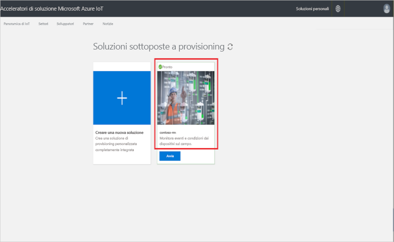

# Connettere un dispositivo IoT DevKit all'acceleratore della soluzione di monitoraggio remoto

[!INCLUDE [iot-suite-selector-connecting](../../includes/iot-suite-selector-connecting.md)]

Questa guida procedurale illustra come eseguire un'applicazione di esempio in un dispositivo IoT DevKit. Il codice di esempio invia i dati di telemetria dai sensori del dispositivo DevKit all'acceleratore della soluzione.

[IoT DevKit](https://aka.ms/iot-devkit) è una scheda all-in-one compatibile con Arduino con sensori e periferiche avanzati. È possibile sviluppare per questa scheda tramite [Azure IoT Workbench](https://marketplace.visualstudio.com/items?itemName=vsciot-vscode.vscode-iot-workbench) in Visual Studio Code. Il [catalogo di progetti](https://microsoft.github.io/azure-iot-developer-kit/docs/projects/) contiene applicazioni di esempio che consentono di creare prototipi di soluzioni IoT.

## Prerequisiti

Seguire la [guida introduttiva a IoT DevKit](https://docs.microsoft.com/azure/iot-hub/iot-hub-arduino-iot-devkit-az3166-get-started) e completare solo le sezioni seguenti:

* Preparare l'hardware
* Configurazione Wi-Fi
* Iniziare a usare il DevKit
* Preparare l'ambiente di sviluppo

## Aprire l'esempio

Per aprire l'esempio della soluzione di monitoraggio remoto in VS Code:

1. Assicurarsi che IoT DevKit non sia connesso al computer. Avviare per prima cosa Visual Studio Code, quindi connettere il DevKit al computer.

1. Fare clic su `F1` per aprire il riquadro comandi, digitare e selezionare **IoT Workbench: Examples** (Workbench IoT: Esempi). Quindi selezionare **IoT DevKit** (DevKit di IoT) come lavagna.

1. Trovare **Remote Monitoring** (Monitoraggio remoto) e fare clic su **Open Sample** (Apri esempio). Si apre una nuova finestra di Visual Studio Code che visualizza la cartella del progetto:

  

## Configurare il dispositivo

Per configurare la stringa di connessione del dispositivo hub IoT al dispositivo DevKit:

1. Attivare la **modalità di configurazione** per IoT DevKit:

    * Tenere premuto il pulsante **A**.
    * Premere e rilasciare il pulsante **Reset**.

1. La schermata visualizza l'ID DevKit e `Configuration`.

    

1. Premere **F1** per aprire il riquadro comandi, digitare e selezionare **IoT Workbench: Device > Config Device Settings** (Workbench IoT: Dispositivo > Impostazioni dispositivo di configurazione).

1. Incollare la stringa di connessione copiata in precedenza e premere **Invio** per configurare il dispositivo.

## Compilare il codice

Per compilare e caricare il codice del dispositivo:

1. Premere **F1**`** per aprire il riquadro comandi, digitare e selezionare **IoT Workbench: Device > Device Upload** (Workbench IoT: Dispositivo > Caricamento dispositivo):

    

1. Visual Studio Code compila e carica il codice nel dispositivo DevKit:

    

1. Il dispositivo DevKit viene riavviato ed esegue il codice caricato.

## Testare l'esempio

Per verificare che l'applicazione di esempio caricata nel dispositivo DevKit funzioni correttamente, completare i passaggi seguenti:

### Visualizzare i dati di telemetria inviati alla soluzione di monitoraggio remoto

Quando viene eseguita l'app di esempio, il dispositivo DevKit invia le informazioni di telemetria dai dati raccolti dai sensori all'acceleratore della soluzione tramite Wi-Fi. Per visualizzare le informazioni di telemetria:

1. Passare al dashboard della soluzione e fare clic su **Dispositivi**.

1. Fare clic sul nome del dispositivo DevKit. Nella scheda a destra è possibile visualizzare i dati di telemetria dal DevKit in tempo reale:

    

### Controllare il dispositivo DevKit

L'acceleratore della soluzione di monitoraggio remoto consente di controllare il dispositivo in remoto. Il codice di esempio implementa tre metodi che è possibile visualizzare nella sezione **Metodo** quando si seleziona il dispositivo nella pagina **Dispositivi**:

Per cambiare il colore di uno dei LED del dispositivo DevKit, usare il metodo **LedColor**:

1. Selezionare il nome del dispositivo dall'elenco dei dispositivi e fare clic su **Processi**:

    

1. Configurare i processi con i valori seguenti e fare clic su **Applica**:

    * Select Job: **Run method** (Selezione processo: Esegui metodo)
    * Method name: **LedColor** (Nome del metodo: LedColor)
    * Job Name: **ChangeLedColor** (Nome del processo: ChangeLedColor)

    

1. Dopo qualche secondo, il DevKit cambierà il colore del LED RGB (sotto il pulsante A):

    

## Pulire le risorse

Se si intende passare alle esercitazioni, lasciare l'acceleratore della soluzione di monitoraggio remoto distribuito.

Se l'acceleratore di soluzione non è più necessario, eliminarlo dalla pagina Soluzioni di cui è stato effettuato il provisioning selezionandolo e facendo clic su Elimina soluzione:

## Problemi e commenti

In caso di problemi, fare riferimento alle [domande frequenti su IoT DevKit](https://microsoft.github.io/azure-iot-developer-kit/docs/faq/) o contattare i canali seguenti per ricevere assistenza:

* [Gitter.im](http://gitter.im/Microsoft/azure-iot-developer-kit)
* [Stackoverflow](https://stackoverflow.com/questions/tagged/iot-devkit)

## Passaggi successivi

Dopo aver appreso come connettere un dispositivo DevKit all'acceleratore della soluzione di monitoraggio remoto, sono consigliati i passaggi successivi seguenti:

* [Panoramica degli acceleratori di soluzioni Azure IoT](https://docs.microsoft.com/azure/iot-accelerators/)
* [Personalizzare l'interfaccia utente](iot-accelerators-remote-monitoring-customize.md)
* [Connettere un dispositivo IoT DevKit all'applicazione Azure IoT Central](../iot-central/howto-connect-devkit.md)