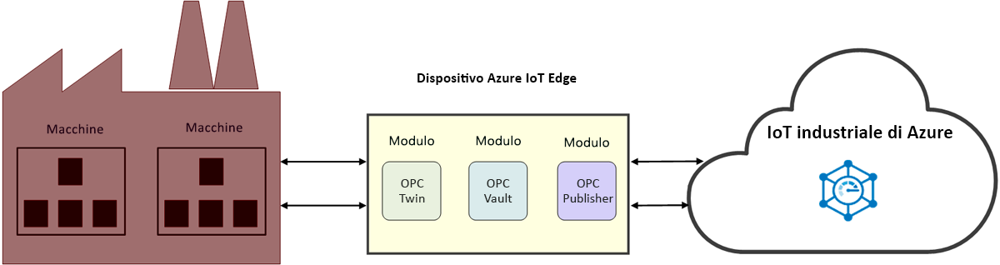

# Informazioni sull'IoT industriale (IIoT)

IIoT è l'Internet delle cose per il settore industriale. Ottimizza l'efficienza industriale tramite l'applicazione dell'IoT nel settore produttivo. 

## Migliorare l'efficienza industriale

Migliorare la redditività e la produttività operative con un acceleratore di soluzione di fabbrica connessa. Connettere e monitorare le apparecchiature industriali e i dispositivi sul cloud, inclusi i computer già in funzione in fabbrica. Analizzare i dati dell'IoT per ottenere informazioni dettagliate utili per migliorare le prestazioni dell'intera fabbrica.

Ridurre le procedure lunghe e laboriose di accesso alle macchine della fabbrica OPC Twin e dedicare il tempo allo sviluppo di soluzioni IIoT. Semplificare la gestione dei certificati e l'integrazione di risorse aziendali con OPC Vault con la certezza che la connettività delle risorse sia protetta. Questi microservizi forniscono un'API di tipo REST in aggiunta ai [componenti dell'IoT industriale di Azure](https://github.com/Azure/azure-iiot-opc-ua). L'API di servizi offre il controllo della funzionalità dei moduli edge. 

> [!NOTE]
> Per altre informazioni sui servizi di IoT industriale di Azure, vedere il [repository ](https://github.com/Azure/azure-iiot-services) GitHub.
Se si ha poca familiarità con il funzionamento dei moduli IoT Edge di Azure, iniziare con gli articoli seguenti:
- [Informazioni su Azure IoT Edge](../iot-edge/about-iot-edge.md)
- [Moduli IoT Edge di Azure](../iot-edge/iot-edge-modules.md)

## Connected factory

[Connected Factory](../iot-accelerators/iot-accelerators-connected-factory-features.md) è un'implementazione dell'architettura di riferimento di IoT industriale di Microsoft Azure che può essere personalizzata per soddisfare requisiti di business specifici. Il codice completo della soluzione è open source ed è disponibile nel repository dell'acceleratore di soluzione Connected Factory di GitHub. È possibile usarlo come punto di partenza per un prodotto commerciale e distribuire una soluzione predefinita nella sottoscrizione di Azure in pochi minuti. 

## Connettività della fabbrica

OPC Twin è un componente dell'IoT che automatizza l'individuazione e la registrazione dei dispositivi e offre il controllo remoto dei dispositivi industriali tramite API REST. OPC Twin usa Azure IoT Edge e l'hub IoT per connettere il cloud e la rete della fabbrica. OPC Twin consente agli sviluppatori di IIoT di concentrarsi sullo sviluppo di applicazioni IIoT senza preoccuparsi dell'accesso sicuro ai sistemi locali.

## Security

OPC Vault è un'implementazione di GDS (Global Discovery Server) OPC UA che consente di configurare, registrare e gestire il ciclo di vita dei certificati per le applicazioni server e client OPC UA nel cloud. OPC Vault semplifica l'implementazione e la manutenzione della connettività sicura delle risorse negli ambienti industriali. Automatizzando la gestione dei certificati, OPC Vault libera gli operatori della fabbrica dai complessi processi manuali associati alla connettività e alla gestione dei certificati.

## Passaggi successivi

Dopo aver letto un'introduzione all'IoT industriale e ai relativi componenti, ecco il passaggio successivo consigliato:

> [!div class="nextstepaction"]
> [Informazioni su OPC Twin](overview-opc-twin.md)
