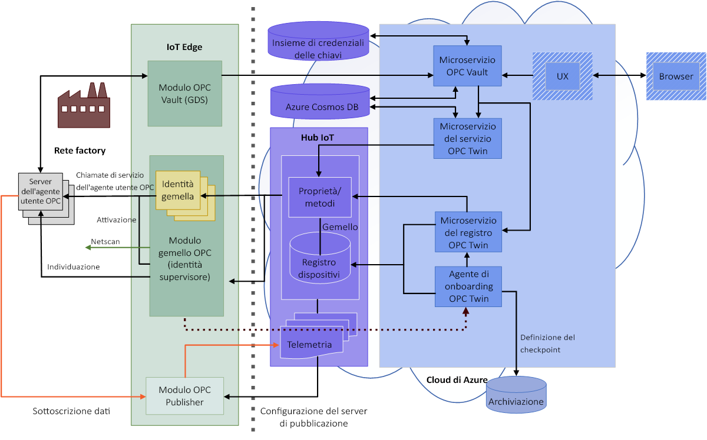

# Informazioni su OPC Vault

OPC Vault è un microservizio che consente di configurare, registrare e gestire il ciclo di vita dei certificati per le applicazioni server e client OPC UA nel cloud. Questo articolo descrive i semplici casi d'uso di OPC Vault.

## Gestione dei certificati

Ad esempio, un'azienda manifatturiera deve connettere il proprio server OPC UA a una nuova applicazione client sviluppata. Quando viene eseguito l'accesso iniziale del server, nell'applicazione server OPC UA viene immediatamente visualizzato un messaggio di errore, a indicare che l'applicazione client non è sicura. Questo meccanismo è integrato nel server OPC UA per impedire l'accesso non autorizzato all'applicazione, evitando attacchi di hacker nella fabbrica.

## Gestione della sicurezza delle applicazioni
Un professionista della sicurezza usa il microservizio OPC Vault per consentire al server OPC UA di comunicare facilmente con qualsiasi applicazione client, perché OPC Vault include tutte le funzioni per la registrazione, l'archiviazione e la gestione del ciclo di vita dei certificati. Una volta connesso in modo sicuro, il server OPC UA può comunicare con la nuova applicazione client sviluppata.

## Architettura OPC Vault completa
Il diagramma seguente illustra l'architettura OPC Vault completa.

