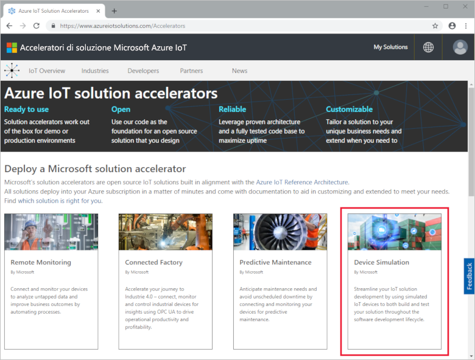
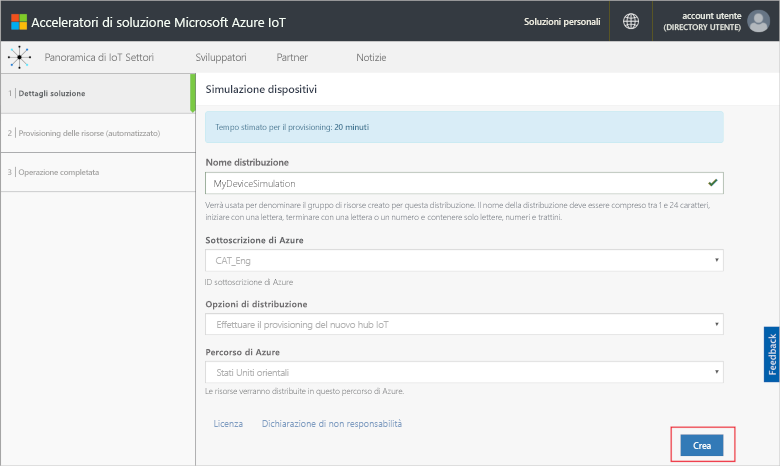
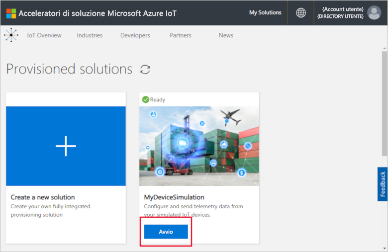
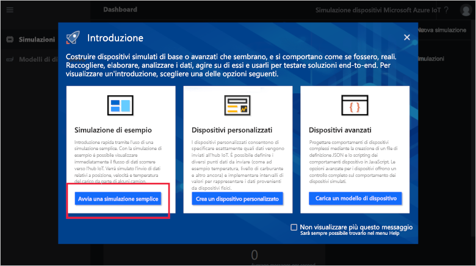
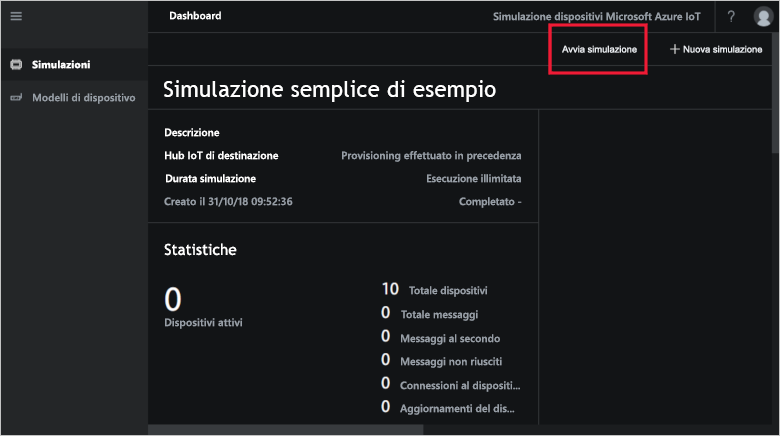
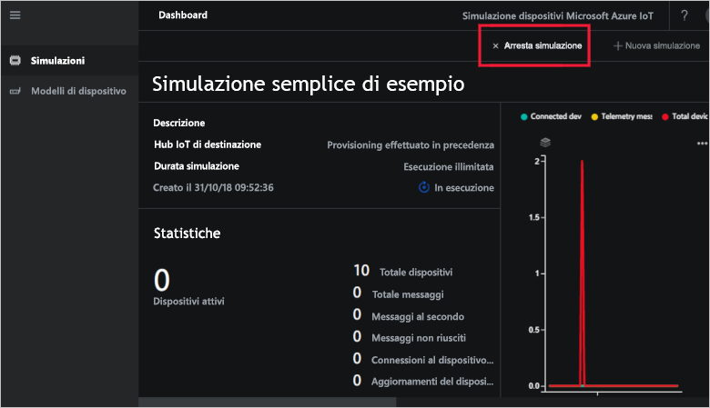
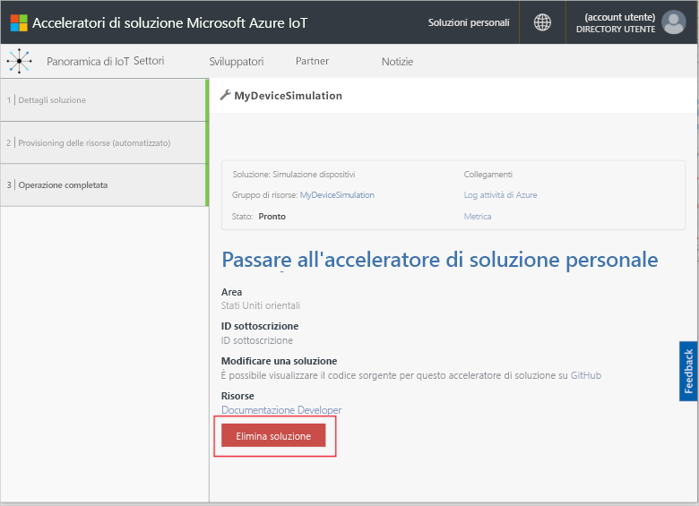

# Avvio rapido: Distribuire ed eseguire una soluzione di simulazione dei dispositivi IoT in Azure

Questa guida introduttiva illustra come distribuire la soluzione Simulazione dispositivi di Azure IoT per testare la soluzione IoT. Dopo aver distribuito l'acceleratore di soluzione, si esegue una simulazione di esempio per iniziare.

Per completare questa guida introduttiva, è necessaria una sottoscrizione di Azure attiva.

Se non si ha una sottoscrizione di Azure, creare un [account gratuito](https://azure.microsoft.com/free/?WT.mc_id=A261C142F) prima di iniziare.

## Distribuire la simulazione dei dispositivi

Prima di distribuire la soluzione di simulazione dei dispositivi nella sottoscrizione di Azure, è necessario impostare alcune opzioni di configurazione.

Accedere ad [azureiotsolutions.com](https://www.azureiotsolutions.com/Accelerators) usando le credenziali dell'account Azure.

Fare clic sul riquadro **Simulazione dispositivi**:

Fare clic su **Prova adesso** nella pagina di descrizione della simulazione dispositivi:

Nella pagina **Crea soluzione Simulazione dispositivi** immettere un **nome soluzione** univoco.

Selezionare **Sottoscrizione** e **Area** da usare per distribuire l'acceleratore della soluzione. In genere, si sceglie l'area più vicina. È necessario essere [amministratore globale o utente](iot-accelerators-permissions.md) nella sottoscrizione.

Selezionare la casella per distribuire un hub IoT da usare con la soluzione Simulazione dispositivi. È sempre possibile modificare in un secondo momento l'hub IoT usato dalla simulazione.

Fare clic su **Crea** per iniziare il provisioning della soluzione. Questo processo richiede almeno cinque minuti:

## Accedere alla soluzione

Al termine del processo di provisioning, è possibile accedere all'istanza della soluzione Simulazione dispositivi facendo clic sul pulsante **Avvia**:

Fare clic su **Accetta** per accettare la richiesta di autorizzazioni. Il dashboard della soluzione Simulazione dispositivi viene visualizzato nel browser.

Alla prima apertura, il dashboard di Simulazione dispositivi viene visualizzato con una **guida introduttiva**. Fare clic sul primo riquadro per aprire una simulazione di esempio. Se si chiude la **guida introduttiva**, è possibile aprire una **semplice simulazione di esempio** dal dashboard facendo clic sul relativo riquadro:

## Simulazione di esempio

Essendo una simulazione di esempio, non è possibile modificare questa simulazione. La simulazione può essere configurata con le impostazioni seguenti:

| Impostazione             | Valore                       |
| ------------------- | --------------------------- |
| Hub IoT di destinazione      | "Use pre-provisioned IoT Hub" (Usa l'hub IoT di cui è già stato eseguito il provisioning) |
| Modello del dispositivo        | Truck (Veicolo)                       |
| Number of devices (Numero di dispositivi)   | 10                          |
| Telemetry frequency (Frequenza telemetria) | 10 secondi                  |
| Simulation duration (Durata simulazione) | Run indefinitely (Esecuzione a tempo indefinito)            |

## Eseguire la simulazione

Fare clic su **Avvia simulazione**. La simulazione verrà eseguita a tempo indefinito, in base alla configurazione. È possibile arrestare la simulazione in qualsiasi momento facendo clic su **Arresta simulazione**. La simulazione mostra le statistiche per l'esecuzione corrente.

È possibile eseguire una sola simulazione alla volta da un'istanza di Simulazione dispositivi.

## Pulire le risorse

Se si prevede di esplorare la soluzione ulteriormente, lasciare distribuita la soluzione Simulazione dispositivi.

Se la soluzione Simulazione dispositivi non è più necessaria, eliminarla dalla pagina [Soluzioni di cui è stato effettuato il provisioning](https://www.azureiotsolutions.com/Accelerators#dashboard) facendo clic sul relativo riquadro e quindi su **Elimina soluzione**:

## Passaggi successivi

In questa guida introduttiva è stata distribuita la soluzione Simulazione dispositivi ed è stata eseguita una simulazione di dispositivi IoT.

> [!div class="nextstepaction"]
> [Creare una simulazione con uno o più tipi di dispositivi](iot-accelerators-device-simulation-create-simulation.md)