# Guida introduttiva: distribuire una soluzione di monitoraggio remoto basata sul cloud

Questa guida introduttiva illustra come distribuire l'acceleratore della soluzione di monitoraggio remoto IoT di Azure da usare come soluzione di monitoraggio remoto basata sul cloud per i dispositivi IoT. Dopo aver distribuito l'acceleratore della soluzione, la pagina **Dashboard** della soluzione viene utilizzata per visualizzare i dispositivi simulati su una mappa e la pagina **Maintenance** (Manutenzione) risponde a un avviso di pressione da un dispositivo refrigeratore simulato.

La distribuzione predefinita configura l'acceleratore della soluzione di monitoraggio remoto per una società denominata Contoso. Contoso gestisce una selezione di diversi tipi di dispositivi, ad esempio refrigeratori, distribuiti in ambienti fisici diversi. Un dispositivo refrigeratore invia temperatura, umidità e dati di telemetria sulla pressione all'acceleratore della soluzione di monitoraggio remoto.

## prerequisiti

Per completare questa guida introduttiva, è necessaria una sottoscrizione di Azure attiva.

Se non si ha una sottoscrizione di Azure, creare un [account gratuito](https://azure.microsoft.com/free/?WT.mc_id=A261C142F) prima di iniziare.

## Distribuire la soluzione

Prima di distribuire l'acceleratore della soluzione nella sottoscrizione di Azure, è necessario impostare alcune opzioni di configurazione.

Accedere ad [azureiotsolutions.com](https://www.azureiotsolutions.com/Accelerators) usando le credenziali dell'account Azure.

Fare clic su **Try Now** (Prova) nel riquadro **Monitoraggio remoto**.

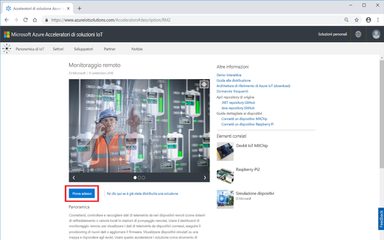

Nella pagina **Create Remote Monitoring solution** (Creare soluzione di monitoraggio remoto), selezionare una distribuzione **Basic** (Base). Se l'acceleratore della soluzione viene distribuito per esplorarne il funzionamento o eseguire una dimostrazione, scegliere l'opzione **Basic** (Base) per ridurre al minimo i costi.

Scegliere **.NET** come linguaggio. Le implementazioni di Java e .NET hanno caratteristiche identiche.

Immettere un valore univoco in **Solution name** (Nome soluzione) per l'acceleratore della soluzione di monitoraggio remoto.

Selezionare **Subscription** (Sottoscrizione) e **Region** (Regione) da usare per distribuire l'acceleratore della soluzione. In genere, si sceglie l'area più vicina. È necessario essere [amministratore globale o utente](iot-accelerators-permissions.md) nella sottoscrizione.

Fare clic su **Create Solution** (Crea soluzione) per iniziare la distribuzione. Questo processo richiede almeno cinque minuti:

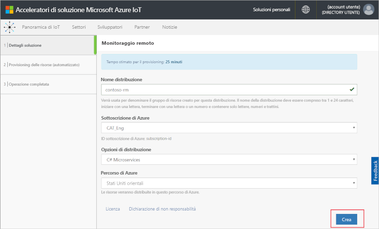

## Accedere alla soluzione

Al termine della distribuzione della sottoscrizione di Azure, è possibile accedere al dashboard dell'acceleratore della soluzione di monitoraggio remoto.

Nella pagina **Provisioned solutions** (Soluzioni di cui è stato effettuato il provisioning), fare clis sul nuovo acceleratore della soluzione di monitoraggio remoto:

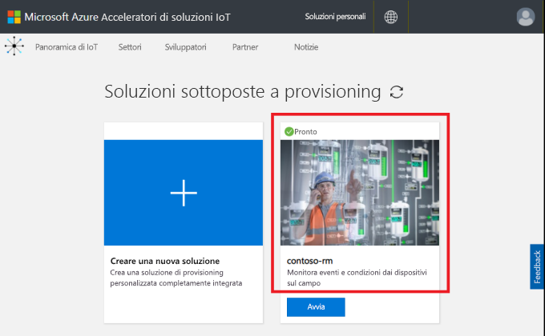

È possibile esaminare le informazioni sull'acceleratore della soluzione di monitoraggio remoto nel pannello visualizzato. Scegliere **Solution dashboard** (Dashboard soluzione) per visualizzare l'acceleratore della soluzione di monitoraggio remoto:

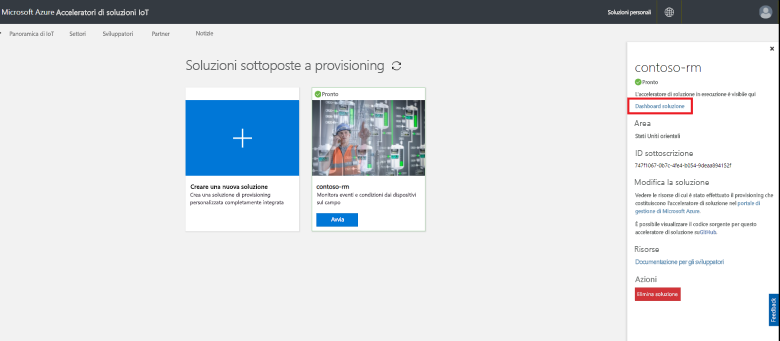

Fare clic su **Accept** (Accetta) per accettare la richiesta di autorizzazioni; il dashboard della soluzione di monitoraggio remoto viene visualizzato nel browser:

[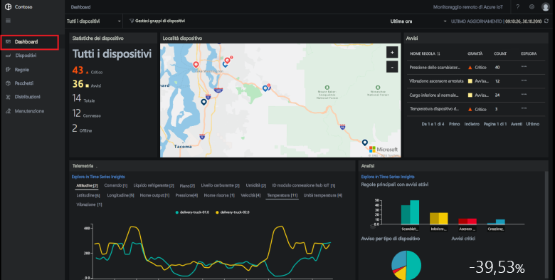](./media/quickstart-remote-monitoring-deploy/solutiondashboard-expanded.png#lightbox)

## Visualizzare i dispositivi

Il dashboard della soluzione mostra le informazioni seguenti sui dispositivi di Contoso:

* **Device statistics** (Statistiche dispositivo): mostra le informazioni di riepilogo sugli avvisi e il numero totale di dispositivi. Nella distribuzione predefinita, Contoso dispone di 10 dispositivi simulati di tipi diversi.

* **Device locations** (Percorsi dispositivo): mostra dove si trovano fisicamente i dispositivi. Il colore del segnaposto indica quando sono presenti avvisi dal dispositivo.

* **Alerts** (Avvisi): mostra i dettagli degli avvisi dai dispositivi.

* **Telemetry** (Dati di telemetria): mostra i dati di telemetria dai dispositivi. È possibile visualizzare flussi di telemetria diversi facendo clic sui tipi di dati di telemetria nella parte superiore.

* **Analytics** (Analitica): mostra informazioni combinate sugli avvisi dai dispositivi.

## Rispondere a un avviso

Gli operatori di Contoso possono monitorare i dispositivi dal dashboard della soluzione. Il pannello **Device statistics** (Device statistics): mostra che sono stati generati alcuni avvisi critici e il pannello **Alerts** (Avvisi) mostra che la maggior parte proviene da un dispositivo refrigeratore. Per i dispositivi refrigeratore di Contoso, una pressione interna oltre 250 PSI indica un malfunzionamento del dispositivo.

### Identificare il problema

Nella pagina **Dashboard** nel pannello **Alerts** (Avvisi) è possibile osservare l'avviso **Chiller pressure too high** (Pressione refrigeratore troppo alta). Il refrigeratore ha un segnaposto rosso sulla mappa (potrebbe essere necessario utilizzare panoramica e zoom sulla mappa):

[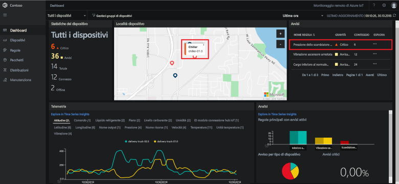](./media/quickstart-remote-monitoring-deploy/dashboardalarm-expanded.png#lightbox)

Nel pannello **Alerts** (Avvisi) fare clic su **...** nella colonna **Explore** (Esplora) accanto alla regola **Chiller pressure too high** (Pressione refrigeratore troppo alta). Viene visualizzata la pagina **Maintenance** (Manutenzione) che consente di visualizzare i dettagli della regola che ha attivato l'avviso.

La pagina **Chiller pressure too high** (Pressione refrigeratore troppo alta) mostra i dettagli della regola che ha attivato gli avvisi. La pagina indica inoltre quando sono stati generati gli avvisi e quale dispositivo li ha attivati:

[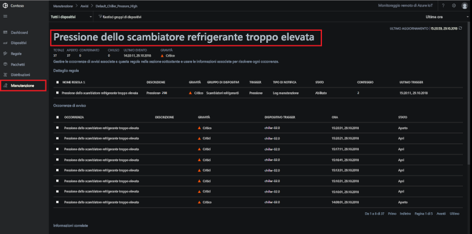](./media/quickstart-remote-monitoring-deploy/maintenancealarmlist-expanded.png#lightbox)

Sono stati ora identificati il problema che ha attivato l'avviso e il dispositivo associato. Per un operatore, i passaggi successivi consistono nel confermare l'avviso e correggere il problema.

### Correggere il problema

Per indicare ad altri operatori che si sta intervenendo sull'avviso, selezionarlo e modificare il valore di **Alert status** (Stato avviso) in **Acknowledged** (Confermato):

[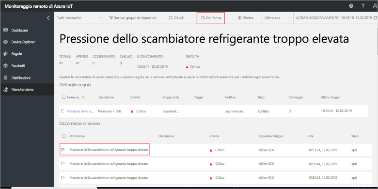](./media/quickstart-remote-monitoring-deploy/maintenanceacknowledge-expanded.png#lightbox)

Il valore nella colonna stato viene modificato in **Acknowledged** (Confermato).

Per intervenire sul refrigeratore, scorrere a **Related information** (Informazioni correlate), selezionare il dispositivo refrigeratore nell'elenco **Alerted devices** (Dispositivi avvisati), quindi scegliere **Jobs** (Processi):

[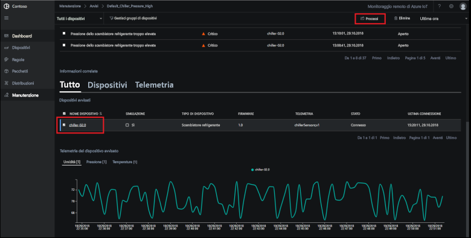](./media/quickstart-remote-monitoring-deploy/maintenanceschedule-expanded.png#lightbox)

Nel pannello **Jobs** (Processi) scegliere **Run method** (Metodo di esecuzione) e il metodo **EmergencyValveRelease**, aggiungere il nome del processo **ChillerPressureRelease** e fare clic su **Apply** (Applica). Queste impostazioni creano un processo che viene eseguito immediatamente.

Per visualizzare lo stato del processo, tornare alla pagina **Maintenance** (Manutenzione) e visualizzare l'elenco di processi nella visualizzazione **Jobs** (Processi). Possono essere necessari alcuni secondi prima di vedere che il processo è stato eseguito per rilasciare la pressione della valvola sul refrigeratore:

[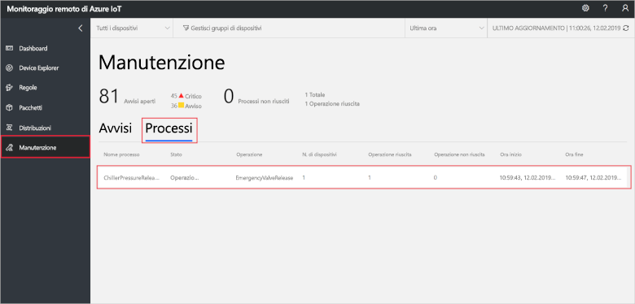](./media/quickstart-remote-monitoring-deploy/maintenancerunningjob-expanded.png#lightbox)

### Controllare che la pressione sia tornata normale

Per visualizzare i dati di telemetria sulla pressione per il refrigeratore, passare alla pagina **Dashboard**, selezionare **Pressure** (Pressione) nel pannello dei dati di telemetria e confermare che la pressione per **chiller-02.0** è tornata normale:

[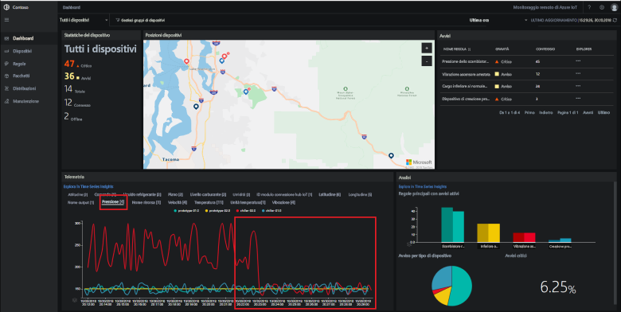](./media/quickstart-remote-monitoring-deploy/pressurenormal-expanded.png#lightbox)

Per chiudere l'evento imprevisto, passare alla pagina **Maintenance** (Manutenzione), selezionare l'avviso e impostare lo stato su **Closed** (Chiuso):

[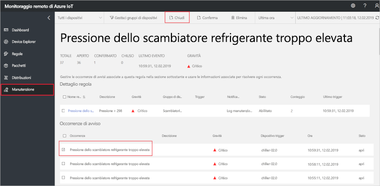](./media/quickstart-remote-monitoring-deploy/maintenanceclose-expanded.png#lightbox)

Il valore nella colonna stato viene modificato in **Closed** (Chiuso).

## Pulire le risorse

Se si intende passare alle esercitazioni, lasciare l'acceleratore della soluzione di monitoraggio remoto distribuito.

Se l'acceleratore della soluzione non è più necessario, eliminarlo dalla pagina [Provisioned solutions](https://www.azureiotsolutions.com/Accelerators#dashboard) (Soluzioni di cui è stato effettuato il provisioning):

## Passaggi successivi

In questa guida introduttiva, è stato distribuito l'acceleratore della soluzione di monitoraggio remoto e completata un'attività di monitoraggio con i dispositivi simulati nella distribuzione di Contoso predefinita.

Per informazioni su come aggiornare il firmware nei dispositivi connessi e organizzare le risorse nell'acceleratore della soluzione, passare all'esercitazione successiva.

> [!div class="nextstepaction"]
> [Esercitazione: monitorare i dispositivi IoT](iot-accelerators-remote-monitoring-monitor.md)