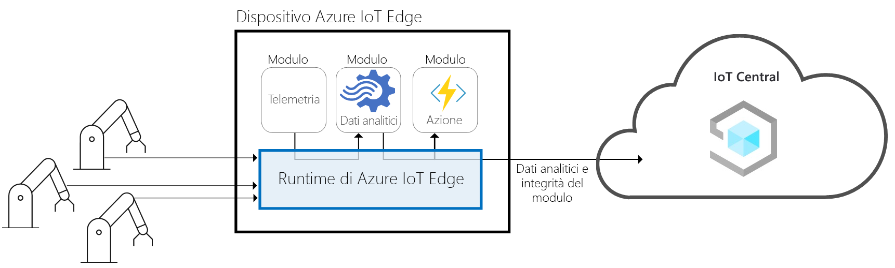
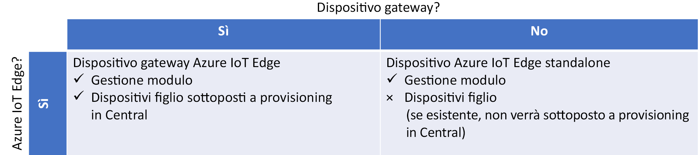
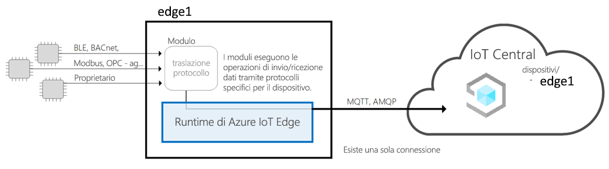
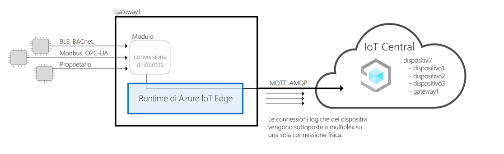
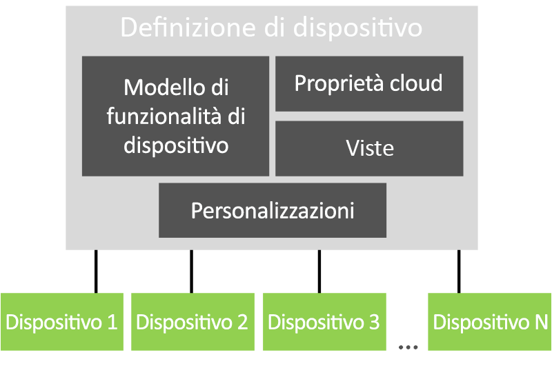

# Architettura di Azure IoT Central

Questo articolo presenta una panoramica dell'architettura di Microsoft Azure IoT Central.

## Dispositivi

I dispositivi scambiano dati con l'applicazione Azure IoT Central. Un dispositivo può:

- Inviare misure, ad esempio dati di telemetria.
- Sincronizzare le impostazioni con l'applicazione.

In Azure IoT Central i dati che un dispositivo può scambiare con l'applicazione sono specificati in un modello di dispositivo. Per altre informazioni sui modelli di dispositivo, vedere [Gestione dei metadati](#metadata-management).

Per altre informazioni sul modo in cui i dispositivi si connettono all'applicazione Azure IoT Central, vedere [Connettività dei dispositivi](concepts-get-connected.md).

## Dispositivi Azure IoT Edge

Oltre ai dispositivi creati tramite [Azure IoT SDK](https://github.com/Azure/azure-iot-sdks), è anche possibile connettere [dispositivi Azure IoT Edge](../../iot-edge/about-iot-edge.md) a un'applicazione IoT Central. IoT Edge consente di eseguire l'intelligenza cloud e la logica personalizzata direttamente sui dispositivi IoT gestiti da IoT Central. Il runtime di IoT Edge consente di:

- Installare e aggiornare i carichi di lavoro nel dispositivo.
- Mantenere gli standard di sicurezza ioT Edge sul dispositivo.
- Assicurare che i moduli di IoT Edge siano sempre in esecuzione.
- Segnalare l'integrità dei moduli al cloud per il monitoraggio remoto.
- Gestire la comunicazione tra i dispositivi foglia downstream e un dispositivo IoT Edge, tra i moduli in un dispositivo IoT Edge e tra un dispositivo IoT Edge e il cloud.

IoT Central consente le seguenti funzionalità per i dispositivi IoT Edge:

- Modelli di dispositivo per descrivere le funzionalità di un dispositivo IoT Edge, ad esempio:Device templates to describe the capabilities of an IoT Edge device, such as:
  - Funzionalità di caricamento del manifesto di distribuzione, che consente di gestire un manifesto per una flotta di dispositivi.
  - Moduli eseguiti sul dispositivo IoT Edge.
  - Dati di telemetria inviati da ogni modulo.
  - Le proprietà di ogni modulo sono nei rapporti.
  - I comandi a cui ogni modulo risponde.
  - Le relazioni tra un modello di funzionalità del dispositivo del gateway IoT Edge e il modello di funzionalità del dispositivo downstream.
  - Proprietà cloud non archiviate nel dispositivo IoT Edge.
  - Personalizzazioni, dashboard e moduli che fanno parte dell'applicazione IoT Central.

  Per altre informazioni, vedere l'articolo [Connettere i dispositivi perimetrali IoT di Azure a un'applicazione di Azure IoT Central.For](./concepts-iot-edge.md) more information, see the Connect Azure IoT Edge devices to an Azure IoT Central application article.

- Possibilità di eseguire il provisioning di dispositivi Perimetrali IoT su larga scala usando il servizio di provisioning dei dispositivi IoT di AzureThe ability to provision IoT Edge devices at scale using Azure IoT device provisioning service
- Regole e azioni.
- Dashboard e analisi personalizzati.
- Esportazione continua dei dati di telemetria dai dispositivi IoT Edge.

### Tipi di dispositivi IoT Edge

IoT Central classifica i tipi di dispositivi Edge IoT come segue:

- Dispositivi foglia. Un dispositivo IoT Edge può avere dispositivi foglia downstream, ma non viene eseguito il provisioning di questi dispositivi in IoT Central.An IoT Edge device can have downstream leaf devices, but these devices are not provisioned in IoT Central.
- Gateway dispositivi con dispositivi downstream. Il provisioning del dispositivo gateway e dei dispositivi downstream viene effettuato in IoT Central

### Modelli di bordo IoT

IoT Central supporta i seguenti modelli di dispositivo IoT Edge:

#### Bordo IoT come dispositivo foglia

Il provisioning del dispositivo IoT Edge viene eseguito in IoT Central e tutti i dispositivi downstream e i relativi dati di telemetria sono rappresentati come provenienti dal dispositivo IoT Edge.The IoT Edge device is provisioned in IoT Central and any downstream devices and their telemetry is represented as coming from the IoT Edge device. I dispositivi downstream connessi al dispositivo IoT Edge non vengono sottoposti a provisioning in IoT Central.Downstream devices connected to the IoT Edge device are not provisioned in IoT Central.

#### Dispositivo gateway IoT Edge connesso a dispositivi downstream con identità

Il provisioning del dispositivo IoT Edge viene eseguito in IoT Central insieme ai dispositivi downstream connessi al dispositivo IoT Edge. Il supporto runtime per il provisioning di dispositivi downstream tramite il gateway non è attualmente supportato.

#### Dispositivo gateway IoT Edge connesso a dispositivi downstream con identità fornita dal gateway IoT Edge

Il provisioning del dispositivo IoT Edge viene eseguito in IoT Central insieme ai dispositivi downstream connessi al dispositivo IoT Edge. Il supporto runtime del gateway che fornisce l'identità ai dispositivi downstream e il provisioning dei dispositivi downstream non è attualmente supportato. Se si porta il proprio modulo di conversione delle identità, IoT Central può supportare questo modello.

## Gateway cloud

Azure IoT Central usa l'hub IoT come gateway del cloud che permette la connettività dei dispositivi. L'hub IoT consente:

- Inserimento dati su larga scala nel cloud.
- Gestione di dispositivi.
- Connettività dei dispositivi sicura.

Per altre informazioni sull'hub IoT, vedere [Documentazione sull'hub IoT](https://docs.microsoft.com/azure/iot-hub/).

Per altre informazioni sulla connettività dei dispositivi in Azure IoT Central, vedere [Connettività dei dispositivi](concepts-get-connected.md).

## Archivi dati

Azure IoT Central archivia i dati dell'applicazione nel cloud. I dati archiviati dell'applicazione comprendono:

- Modelli di dispositivo.
- Identità dei dispositivi.
- Metadati dei dispositivi.
- Dati di utenti e ruoli.

Azure IoT Central usa un archivio di serie temporali per i dati di misura inviati dai dispositivi. Dati di serie temporali dei dispositivi utilizzati dal servizio di analisi.

## Analytics

Il servizio di analisi è responsabile della generazione dei dati dei report personalizzati mostrati dall'applicazione. Un operatore può [personalizzare le analisi](howto-create-analytics.md) visualizzate nell'applicazione. Il servizio di analisi si basa su [Azure Time Series Insights](https://azure.microsoft.com/services/time-series-insights/) ed elabora i dati di misura inviati dai dispositivi.

## Regole e azioni

[Regole e azioni](tutorial-create-telemetry-rules.md) interagiscono strettamente per automatizzare le attività all'interno dell'applicazione. Un costruttore può definire regole basate su dati di telemetria dei dispositivi, ad esempio la temperatura che supera una soglia definita. Azure IoT Central usa un elaboratore di flusso per determinare quando sono soddisfatte le condizioni della regola. Quando una condizione della regola è soddisfatta, attiva un'azione definita dal costruttore. Ad esempio, un'azione può inviare un'e-mail per notificare a un tecnico che la temperatura di un dispositivo è troppo elevata.

## Gestione dei metadati

I modelli di dispositivo in un'applicazione Azure IoT Central definiscono il comportamento e le funzionalità dei tipi di dispositivo. Ad esempio, un modello di dispositivo frigorifero specifica i dati di telemetria che il frigorifero invia all'applicazione.

In un modello di dispositivo dell'applicazione IoT Central contiene:In an IoT Central application device template contains:

- **I modelli** di funzionalità del dispositivo specificano le funzionalità di un dispositivo, ad esempio i dati di telemetria inviati, le proprietà che definiscono lo stato del dispositivo e i comandi a cui il dispositivo risponde. Le funzionalità del dispositivo sono organizzate in una o più interfacce. Per altre informazioni sui modelli di funzionalità dei dispositivi, vedere la documentazione [IoT Plug and Play (anteprima).](../../iot-pnp/overview-iot-plug-and-play.md)
- **Le proprietà cloud** specificano le proprietà Archivi IoT Central per un dispositivo. Queste proprietà vengono archiviate solo in IoT Central e non vengono mai inviate a un dispositivo.
- **Le visualizzazioni** specificano i dashboard e i moduli creati dal generatore per consentire all'operatore di monitorare e gestire i dispositivi.
- **Le personalizzazioni** consentono al generatore di eseguire l'override di alcune delle definizioni nel modello di funzionalità del dispositivo per renderle più pertinenti per l'applicazione IoT Central.Customizations let the builder override some of the definitions in the device capability model to make them more relevant to the IoT Central application.

Un'applicazione può avere uno o più dispositivi simulati e reali basati su ogni modello di dispositivo.

## Esportazione dati

In un'applicazione Azure IoT Central è possibile [esportare continuamente i dati](howto-export-data.md) nelle proprie hub eventi di Azure e nelle istanze del bus di servizio di Azure.In an Azure IoT Central application, you can continuously export your data to your own Azure Event Hubs and Azure Service Bus instances. È anche possibile esportare periodicamente i dati nell'account di archiviazione BLOB di Azure.You can also periodically export your data to your Azure Blob storage account. IoT Central può esportare misure, dispositivi e modelli di dispositivo.

## Aggiornamenti dei dispositivi batch

In un'applicazione Azure IoT Central è possibile [creare ed eseguire processi](howto-run-a-job.md) per gestire i dispositivi connessi. Questi processi consentono di eseguire aggiornamenti in blocco delle proprietà o delle impostazioni del dispositivo o di eseguire comandi. Ad esempio, è possibile creare un lavoro per aumentare la velocità della ventola per più distributori automatici refrigerati.

## Controllo degli accessi in base al ruolo

Un [amministratore può definire regole](howto-manage-users-roles.md) di accesso per un'applicazione Azure IoT Central usando uno dei ruoli predefiniti o creando un ruolo personalizzato. I ruoli determinano le aree dell'applicazione a cui un utente ha accesso e le azioni che può eseguire.

## Security

Le funzionalità di sicurezza all'interno di Azure IoT Central includono:

- I dati sono crittografati quando sono in transito o inattivi.
- L'autenticazione viene fornita tramite Azure Active Directory o l'account Microsoft. È supportata l'autenticazione a due fattori.
- Isolamento del tenant completo.
- Sicurezza a livello di dispositivo.

## Shell dell'interfaccia utente

La shell dell'interfaccia utente è un'applicazione browser HTML5 moderna e reattiva.
Un amministratore può personalizzare l'interfaccia utente dell'applicazione applicando temi personalizzati e modificando i collegamenti della Guida in modo che puntino alle risorse della Guida personalizzate. Per altre informazioni sulla personalizzazione dell'interfaccia utente, vedere [l'articolo Personalizzare l'interfaccia utente di Azure IoT Central.To](howto-customize-ui.md) learn more about UI customization, see Customize the Azure IoT Central UI article.

Un operatore può creare dashboard di applicazioni personalizzati. È possibile avere diversi dashboard che visualizzano dati diversi e passare da uno all'altro.

## Passaggi successivi

Dopo aver appreso l'architettura di Azure IoT Central, il passaggio successivo consigliato consiste nell'apprendere la [connettività dei dispositivi](concepts-get-connected.md) in Azure IoT Central.Now that you've learn about the architecture of Azure IoT Central, the suggestd next step is to learn about device connectivity in Azure IoT Central.
