# Presentazione dell'interfaccia utente di Azure IoT Central

In questo articolo viene presentata l'interfaccia utente di Microsoft Azure IoT Central. È possibile usare l'interfaccia utente per creare, gestire e usare una soluzione Azure IoT Central e i relativi dispositivi connessi.

Un _generatore di soluzioni_ usa l'interfaccia utente di Azure IoT Central per definire la soluzione Azure IoT Central. È possibile usare l'interfaccia utente per:

* Definire i tipi di dispositivo che si connettono alla soluzione.
* Configurare le regole e le azioni per i dispositivi. 
* Personalizzare l'interfaccia utente per un _operatore_ che usa la soluzione.

Gli _operatori_ usano l'interfaccia utente di Azure IoT Central per gestire la soluzione Azure IoT Central. È possibile usare l'interfaccia utente per:

* Eseguire il monitoraggio dei dispositivi.
* Configurare i dispositivi.
* Risolvere e correggere i problemi relativi ai dispositivi.
* Eseguire il provisioning di nuovi dispositivi.

## Home page di IoT Central

La [home page di IoT Central](https://aka.ms/iotcentral-get-started) contiene le novità e le funzionalità più recenti di IoT Central e consente di creare nuove applicazioni nonché di visualizzare e avviare l'applicazione esistente.

> [!div class="mx-imgBorder"]
> 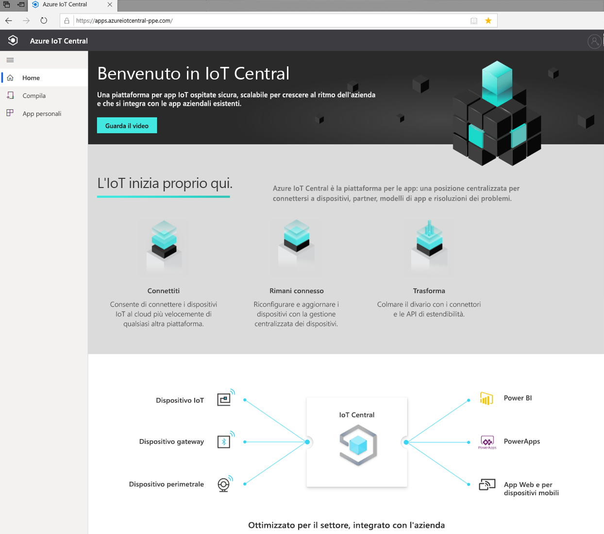

### Creare un'applicazione

Nella sezione di compilazione è possibile esplorare l'elenco di modelli di IoT Central pertinenti per il settore per iniziare rapidamente oppure usare un modello di app personalizzato.  
> [!div class="mx-imgBorder"]
> 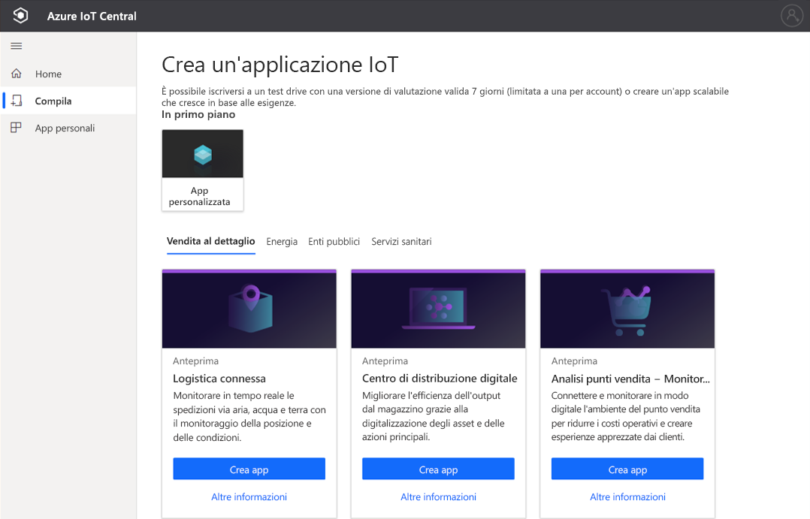

Per altre informazioni, vedere l'argomento di avvio rapido [Creare un'applicazione di Azure IoT Central](quick-deploy-iot-central.md).

### Avviare l'applicazione

Per avviare l'applicazione IoT Central, accedere all'URL scelto dall'utente o dal generatore di soluzioni durante la creazione dell'app. È anche possibile visualizzare un elenco di tutte le applicazioni a cui è possibile accedere nella pagina di [gestione app di IoT Central](https://aka.ms/iotcentral-apps).

> [!div class="mx-imgBorder"]
> 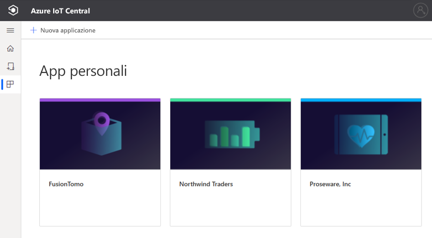

## Esplorare l'applicazione

All'interno dell'applicazione IoT, usare il riquadro sinistro per accedere alle diverse aree. È possibile espandere o comprimere il riquadro sinistro selezionando l'icona con tre linee nella parte superiore del riquadro:

> [!NOTE]
> Le voci visualizzate nel riquadro sinistro dipendono dal ruolo utente. Altre informazioni sulla [gestione di utenti e ruoli](howto-manage-users-roles.md). 

:::row:::
  :::column span="":::
      > [!div class="mx-imgBorder"]
      > 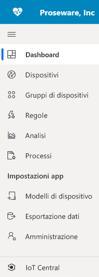
  :::column-end:::
  :::column span="2":::
     **Dashboard** consente di accedere al dashboard dell'applicazione. Un *generatore di soluzioni* può personalizzare il dashboard globale per gli operatori. In base al ruolo utente, gli operatori possono anche creare dashboard personali.
     
     **Dispositivi** consente di gestire i dispositivi connessi, reali e simulati.

     **Gruppi di dispositivi** consente di visualizzare e creare raccolte logiche di dispositivi specificati da una query. È possibile salvare la query e usare i gruppi di dispositivi nell'applicazione per eseguire operazioni in blocco.

     **Regole** consente di creare e modificare le regole per monitorare i dispositivi. Le regole vengono valutate in base ai dati di telemetria del dispositivo e attivano azioni personalizzabili.

     **Analisi** consente di creare visualizzazioni personalizzate sulla base dei dati dei dispositivi per derivare informazioni approfondite dall'applicazione.

     **Processi** consente di gestire i dispositivi con scalabilità eseguendo operazioni in blocco.

     **Modelli di dispositivo** consente di creare e gestire le caratteristiche dei dispositivi che si connettono all'applicazione.

     **Esportazione dati** consente di configurare un'esportazione continua a servizi esterni, ad esempio archiviazione e code.

     **Amministrazione** consente di gestire le impostazioni dell'applicazione, la personalizzazione, la fatturazione, gli utenti e i ruoli.

     **IoT Central** consente agli *amministratori* di accedere alla pagina di gestione delle app di IoT Central.
     
   :::column-end:::
:::row-end:::

### Ricerca, guida, tema e supporto

Il menu superiore viene visualizzato in ogni pagina:

> [!div class="mx-imgBorder"]
> 

* Per cercare modelli di dispositivo e dispositivi, immettere un valore in **Search** (Cerca).
* Per cambiare la lingua o il tema dell'interfaccia utente, scegliere l'icona **Settings** (Impostazioni). Altre informazioni sulla [gestione delle preferenze dell'applicazione](howto-manage-preferences.md)
* Per disconnettersi dall'applicazione, scegliere l'icona **Account**.
* Per accedere alla guida e al supporto tecnico, fare clic sul menu a discesa **Help** (Guida) per visualizzare un elenco di risorse. È possibile [ottenere informazioni sull'applicazione](./howto-get-app-info.md) dal collegamento **Informazioni sull'app**. Nelle applicazioni del piano tariffario gratuito le risorse di supporto includono l'accesso alla [live chat](howto-show-hide-chat.md).

È possibile scegliere tra un tema scuro o un tema chiaro per l'interfaccia utente:

> [!NOTE]
> L'opzione per scegliere il tema chiaro o scuro non è disponibile se l'amministratore ha configurato un tema personalizzato per l'applicazione.

> [!div class="mx-imgBorder"]
> 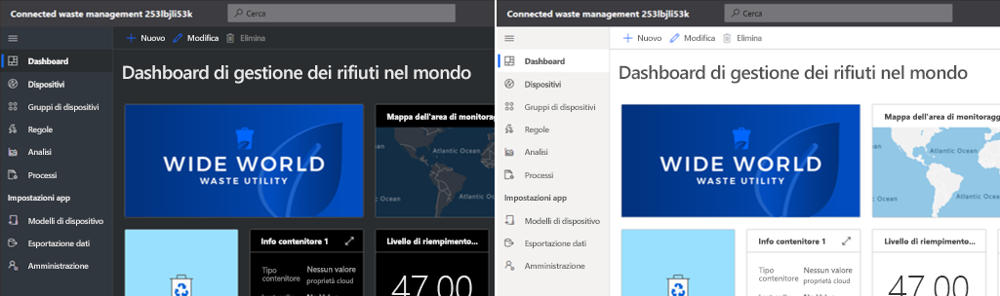

### Dashboard
> [!div class="mx-imgBorder"]
> 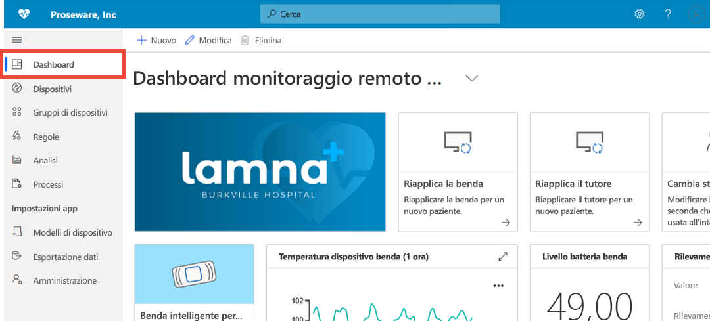

* Il dashboard è la prima pagina visualizzata quando si accede all'applicazione Azure IoT Central. Un *generatore di soluzioni* può creare e personalizzare più dashboard di applicazioni globali per altri utenti. Altre informazioni sull'[aggiunta di riquadri al dashboard](howto-add-tiles-to-your-dashboard.md)

* Un *operatore*, se il ruolo utente lo consente, può creare dashboard personali per monitorare gli elementi che interessano. Per altre informazioni, vedere la procedura dettagliata [Creare dashboard personali di Azure IoT Central](howto-create-personal-dashboards.md).

### Dispositivi

> [!div class="mx-imgBorder"]
> 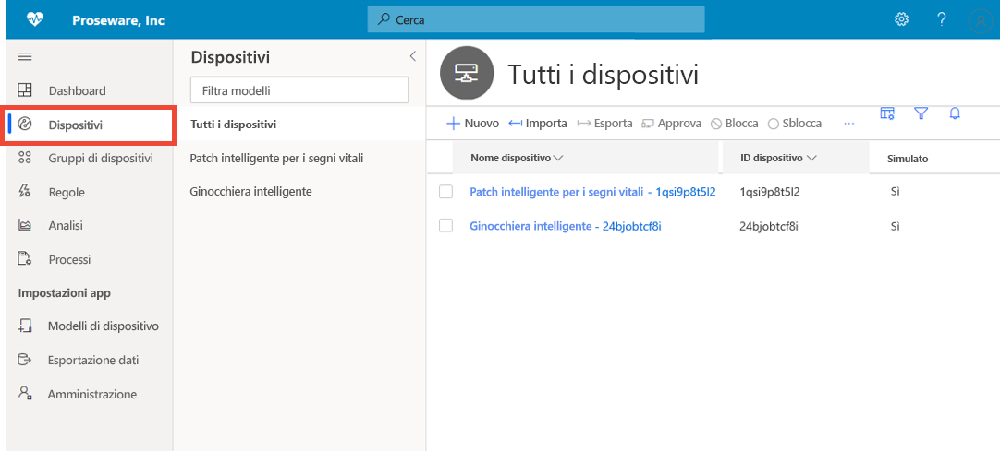

La pagina Explorer visualizza i _dispositivi_ presenti nell'applicazione Azure IoT Central raggruppati per _modello di dispositivo_. 

* Un modello di dispositivo consente di definire un tipo di dispositivo in grado di connettersi all'applicazione.
* Per dispositivo si intende un dispositivo simulato o reale presente nell'applicazione.

Per altre informazioni, vedere la Guida introduttiva [Monitorare i dispositivi](./quick-monitor-devices.md). 

### Gruppi di dispositivi

> [!div class="mx-imgBorder"]
> 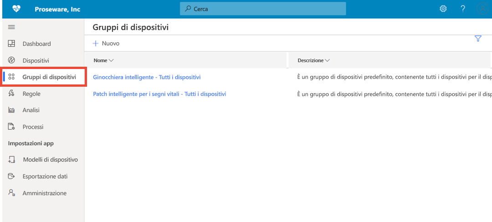

Per gruppo di dispositivi si intende una raccolta di dispositivi correlati. Un *generatore di soluzioni* definisce una query per identificare i dispositivi inclusi in un gruppo di dispositivi. I gruppi di dispositivi vengono usati per eseguire operazioni in blocco nell'applicazione. Per altre informazioni, vedere l'articolo [Usare gruppi di dispositivi nell'applicazione Azure IoT Central](tutorial-use-device-groups.md).

### Regole
> [!div class="mx-imgBorder"]
> 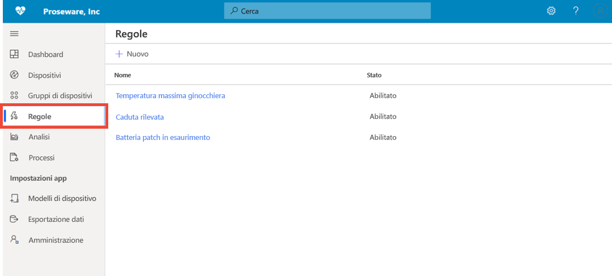

La pagina Regole consente di definire regole in base ai dati di telemetria, allo stato o agli eventi relativi ai dispositivi. Quando una regola viene generata, può attivare una o più azioni, ad esempio l'invio di un messaggio di posta elettronica, la notifica a un sistema esterno tramite gli avvisi del webhook e così via. Per altre informazioni, vedere l'esercitazione [Configurazione di regole](tutorial-create-telemetry-rules.md). 

### Analytics

> [!div class="mx-imgBorder"]
> 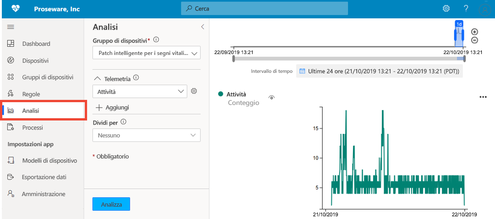

La pagina Analisi consente di creare visualizzazioni personalizzate sulla base dei dati dei dispositivi per derivare informazioni approfondite dall'applicazione. Per altre informazioni, vedere l'articolo [Creare analisi per l'applicazione Azure IoT Central](howto-create-analytics.md).

### Processi

> [!div class="mx-imgBorder"]
> 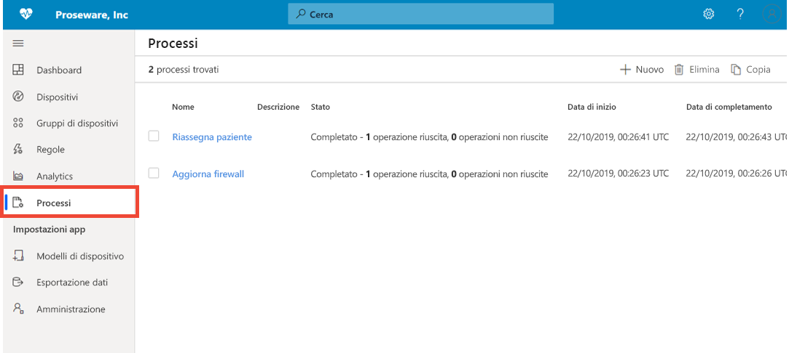

La pagina Processi consente di eseguire operazioni di gestione in blocco dei dispositivi nei propri dispositivi. È possibile aggiornare le proprietà del dispositivo, le impostazioni e i comandi di esecuzione nei gruppi di dispositivi. Per altre informazioni, vedere l'articolo [Eseguire un processo](howto-run-a-job.md).

### Modelli di dispositivo

> [!div class="mx-imgBorder"]
> 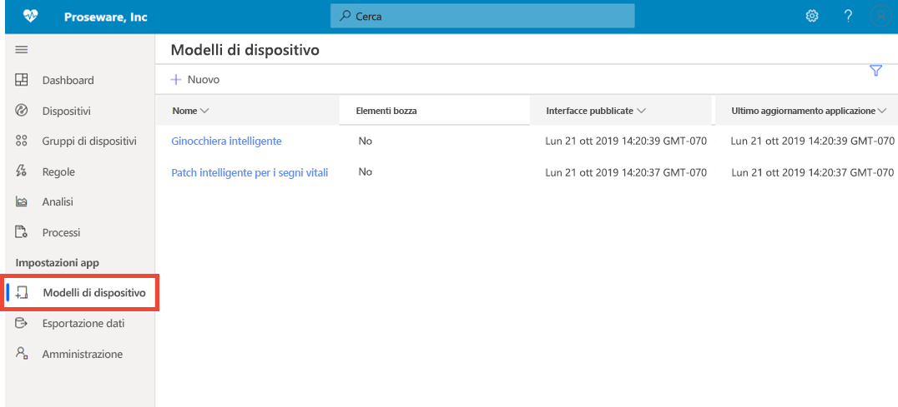

Questa pagina consente a un generatore di creare e gestire i modelli di dispositivo nell'applicazione. Un modello di dispositivo specifica le caratteristiche del dispositivo, ad esempio:

* Dati di telemetria, stato e misure di evento
* Proprietà
* Comandi
* Viste

Il *generatore di soluzioni* può anche creare moduli e dashboard che gli operatori possono usare per gestire i dispositivi.

Per altre informazioni, vedere l'esercitazione sulla [definizione di un nuovo tipo di dispositivo nell'applicazione Azure IoT Central](howto-set-up-template.md). 

### Esportazione dati
> [!div class="mx-imgBorder"]
> 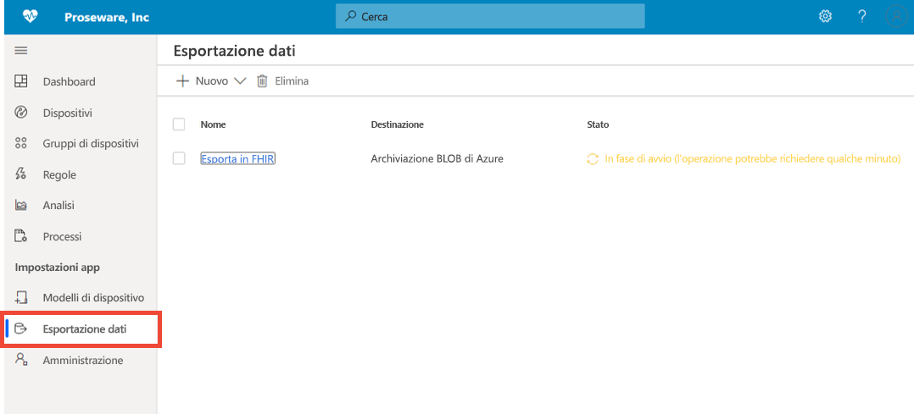

La pagina Esportazione dati consente di configurare flussi di dati, ad esempio di telemetria, dall'applicazione ai sistemi esterni. Per altre informazioni, vedere l'articolo [Esportare i dati in Azure IoT Central](./howto-export-data.md).

### Amministrazione
> [!div class="mx-imgBorder"]
> 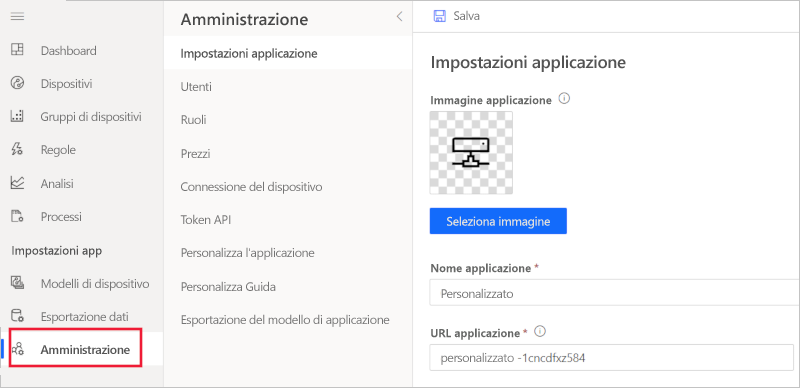

La pagina Amministrazione consente di configurare e personalizzare l'applicazione IoT Central. In tale pagina è possibile modificare nome dell'applicazione, URL e temi, gestire utenti e ruoli, creare token API ed esportare l'applicazione. Per altre informazioni, vedere l'articolo sull'[amministrazione dell'applicazione Azure IoT Central](howto-administer.md).

## Passaggi successivi

A questo punto, dopo aver letto la panoramica di Azure IoT Central e aver acquisito familiarità con il layout dell'interfaccia utente, i passaggi successivi consigliati consistono nel completare la guida introduttiva [Creare un'applicazione Azure IoT Central](quick-deploy-iot-central.md).
