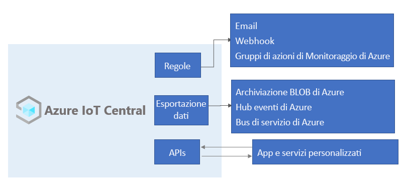

# Informazioni su Azure IoT Central

IoT Central è una piattaforma applicativa di Internet delle cose che riduce il carico di attività e i costi di sviluppo, gestione e manutenzione di soluzioni IoT di livello aziendale. La scelta di compilare con IoT Central consente di concentrare tempo, denaro ed energie per trasformare il business con dati IoT, anziché semplicemente gestire e aggiornare un'infrastruttura IoT complessa e in continua evoluzione.

L'interfaccia utente Web consente di monitorare le condizioni dei dispositivi, di creare regole e di gestire milioni di dispositivi e i relativi dati durante il ciclo di vita. Consente anche di agire sulle informazioni dettagliate sui dispositivi estendendo l'intelligence IoT alle applicazioni line-of-business.

Per IoT Central, questo articolo descrive:

- Descrizione degli utenti tipo associati a un progetto.
- Procedura per la creazione dell'applicazione.
- Procedura per la connessione di dispositivi all'applicazione.
- Procedura per la gestione dell'applicazione.
- Funzionalità Azure IoT Edge in IoT Central.
- Come connettere i dispositivi con runtime Azure IoT Edge alla propria applicazione.

## Problemi noti

- L'esportazione dati continua non supporta il formato Avro (incompatibilità).
- GeoJSON non è attualmente supportato.
- La tessera mappa non è attualmente supportato.
- I processi non supportano i tipi complessi.
- I tipi di schema della matrice non sono supportati.
- Sono supportati solo l'SDK per dispositivi C e gli SDK per dispositivi e servizi Node.js.
- IoT Central è attualmente disponibile nelle località seguenti: Stati Uniti, Europa, Asia Pacifico, Australia, Regno Unito e Giappone.
- Non è possibile usare il modello di applicazione **Applicazione personalizzata (legacy)** nelle località Regno Unito e Giappone.
- I modelli di funzionalità di dispositivo devono includere tutte le interfacce definite inline nello stesso file.
- Il supporto per [Plug and Play IoT](../../iot-pnp/overview-iot-plug-and-play.md) è in anteprima ed è disponibile solo in alcune aree selezionate.

## Utenti tipo

Nella documentazione di IoT Central viene fatto riferimento a quattro utenti tipo che interagiscono con un'applicazione IoT Central:

- Un _generatore di soluzioni_ è responsabile della definizione dei tipi di dispositivi che si connettono all'applicazione e della personalizzazione dell'applicazione per l'operatore.
- Un _operatore_ gestisce i dispositivi connessi all'applicazione.
- Un _amministratore_ è responsabile di attività amministrative, ad esempio la gestione di [ruoli e autorizzazioni degli utenti](howto-administer.md) nell'applicazione.
- Uno _sviluppatori di dispositivi_ crea il codice che viene eseguito in un dispositivo o in un modulo IoT Edge connesso all'applicazione.

## Creare l'applicazione IoT Central

I generatori di soluzioni usano IoT Central per creare una soluzione IoT ospitata nel cloud e personalizzata per l'organizzazione. Una soluzione IoT personalizzata è in genere costituita da:

- Un'applicazione basata sul cloud che riceve i dati di telemetria dai dispositivi e consente di gestire tali dispositivi.
- Più dispositivi che eseguono codice personalizzato connessi all'applicazione basata sul cloud.

È possibile distribuire rapidamente una nuova applicazione IoT Central e quindi personalizzarla in base a requisiti specifici nel browser. È possibile iniziare con un _modello di applicazione_ generico o con uno dei modelli di applicazione specifici per settore come [Retail](../retail/overview-iot-central-retail-pnp.md), [Energia](../energy/overview-iot-central-energy.md), [Enti governativi](../government/overview-iot-central-government.md), [Servizi sanitari](../healthcare/overview-iot-central-healthcare.md).

I generatori di soluzioni possono usare gli strumenti basati sul Web per creare un _modello di dispositivo_ per i dispositivi che si connettono all'applicazione. Un modello di dispositivo è il progetto che definisce le caratteristiche e il comportamento di un tipo di dispositivo, ad esempio:

- I dati di telemetrica che invia.
- Le proprietà di business modificabili da un operatore.
- Le proprietà del dispositivo impostate da un dispositivo che sono di sola lettura nell'applicazione.
- Le proprietà, impostate da un operatore, che determinano il comportamento del dispositivo.

Questo modello di dispositivo include:

- Un _modello di funzionalità di dispositivo_ in cui sono descritte le funzionalità che un dispositivo deve implementare, ad esempio i dati di telemetria inviati e le proprietà segnalate.
- Proprietà cloud non archiviate nel dispositivo.
- Personalizzazioni, dashboard e moduli che fanno parte dell'applicazione IoT Central.

### Prezzi

È possibile creare l'applicazione IoT Central con una versione di valutazione gratuita valida 7 giorni oppure usare un piano tariffario standard.

- Le applicazioni con il piano *gratuito* sono gratuite per sette giorni e supportano fino a cinque dispositivi. È possibile convertirle per l'uso di un piano tariffario standard in qualsiasi momento prima della scadenza.
- Le applicazioni create usando il piano *standard* vengono fatturate in base ai singoli dispositivi; è possibile scegliere il piano tariffario **Standard 1** o **Standard 2** con i primi due dispositivi gratuiti. Per altre informazioni sui piani tariffari gratuito e standard, vedere la pagina sui [prezzi di Azure IoT Central](https://azure.microsoft.com/pricing/details/iot-central/).

### Creare modelli di dispositivo

[Plug and Play IoT (anteprima)](../../iot-pnp/overview-iot-plug-and-play.md) consente a IoT Central di integrare dispositivi senza scrivere il codice del dispositivo incorporato. La base di Plug and Play IoT (anteprima) è costituita da uno schema modello che descrive le funzionalità dei dispositivi. In un'applicazione IoT Central i modelli di dispositivo usano questi modelli di funzionalità di dispositivo di Plug and Play IoT (anteprima).

I generatori di soluzioni hanno a disposizione numerose opzioni per creare modelli di dispositivo:

- Importare un modello di funzionalità di dispositivo dal [catalogo dei dispositivi Azure Certified per IoT](https://aka.ms/iotdevcat) e quindi aggiungere eventuali personalizzazioni, dashboard e proprietà cloud richiesti dell'applicazione IoT Central.
- Progettare il modello di dispositivo in IoT Central e quindi implementarne il modello di funzionalità di dispositivo nel codice del dispositivo.
- Creare un modello di funzionalità di dispositivo con Visual Studio Code e pubblicarlo in un repository. Implementare il codice del dispositivo dal modello e connettere il dispositivo all'applicazione IoT Central. IoT Central trova il modello di funzionalità di dispositivo in un repository e crea automaticamente un modello di dispositivo semplice.
- Creare un modello di funzionalità di dispositivo con Visual Studio Code. Implementare il codice del dispositivo dal modello. Importare manualmente il modello di funzionalità di dispositivo nell'applicazione IoT Central e quindi aggiungere eventuali personalizzazioni, dashboard e proprietà cloud richiesti dell'applicazione IoT Central.

I generatori di soluzioni possono usare IoT Central per generare codice per dispositivi di test utili per convalidare i modelli di dispositivo.

### Personalizzare l'interfaccia utente

I generatori di soluzioni possono anche personalizzare l'interfaccia utente dell'applicazione IoT Central per gli operatori responsabili dell'uso quotidiano dell'applicazione. Le personalizzazioni che possono essere apportate da un generatore di soluzioni includono le seguenti:

- Definizione del layout di proprietà e impostazioni in un modello di dispositivo.
- Configurazione di dashboard personalizzati per consentire agli operatori di individuare informazioni dettagliate e risolvere i problemi più velocemente.
- Configurazione di analisi personalizzate per esplorare i dati della serie temporale dai dispositivi connessi.

## Prezzi

È possibile creare l'applicazione IoT Central con una versione di valutazione gratuita valida 7 giorni oppure usare un piano tariffario standard.

- Le applicazioni con il piano *gratuito* sono gratuite per sette giorni e supportano fino a cinque dispositivi. È possibile convertirle per l'uso di un piano tariffario standard in qualsiasi momento prima della scadenza.
- Le applicazioni create usando il piano *Standard* vengono fatturate in base ai singoli dispositivi; è possibile scegliere il piano tariffario **Standard 1** o **Standard 2** con i primi due dispositivi gratuiti. Altre informazioni sui [prezzi di IoT Central](https://aka.ms/iotcentral-pricing).

## Connettere i dati dell'utente

Azure IoT Central usa il [servizio Device Provisioning in hub IoT di Azure](../../iot-dps/about-iot-dps.md) per gestire la registrazione e la connessione di tutti i dispositivi.

Con il servizio Device Provisioning:

- IoT Central supporta l'onboarding e la connessione dei dispositivi su larga scala.
- È possibile generare credenziali dei dispositivi e configurarli offline senza registrarli tramite l'interfaccia utente di IoT Central.
- I dispositivi si connettono tramite firme di accesso condiviso.
- I dispositivi si connettono tramite certificati X.509 standard di settore.
- È possibile usare ID dispositivo personalizzati per registrare i dispositivi in IoT Central. L'uso di ID dispositivo personalizzati semplifica l'integrazione con i sistemi back-office esistenti.
- È disponibile un singolo modo coerente per connettere i dispositivi a IoT Central.

Per altre informazioni, vedere [Connettersi ad Azure IoT Central](./concepts-get-connected.md).

### Dispositivi Azure IoT Edge

Oltre ai dispositivi creati tramite [Azure IoT SDK](https://github.com/Azure/azure-iot-sdks), è anche possibile connettere [dispositivi Azure IoT Edge](../../iot-edge/about-iot-edge.md) a un'applicazione IoT Central. Azure IoT Edge consente di eseguire funzioni di intelligence e logica personalizzata direttamente nei dispositivi IoT gestiti da IoT Central. Il runtime di IoT Edge consente di:

- Installare e aggiornare i carichi di lavoro nel dispositivo.
- Mantenere gli standard di sicurezza di Azure IoT Edge sul dispositivo.
- Assicurare che i moduli di IoT Edge siano sempre in esecuzione.
- Segnalare l'integrità dei moduli al cloud per il monitoraggio remoto.
- Gestire la comunicazione tra i dispositivi foglia downstream e un dispositivo IoT Edge, tra i moduli in un dispositivo IoT Edge e tra un dispositivo IoT Edge e il cloud.

Per altre informazioni, vedere [Dispositivi Azure IoT Edge e IoT Central](concepts-architecture.md#azure-iot-edge-devices).

## Rimanere connessi

Le applicazioni IoT Central sono completamente ospitate in Microsoft e ciò consente di ridurre il carico amministrativo correlato alla gestione delle applicazioni.

Gli operatori usano l'applicazione IoT Central per gestire i dispositivi nella soluzione IoT Central. Gli operatori eseguono attività quali:

- Eseguire il monitoraggio dei dispositivi connessi all'applicazione.
- Risolvere e correggere i problemi relativi ai dispositivi.
- Eseguire il provisioning di nuovi dispositivi.

Un generatore di soluzioni può definire regole e azioni personalizzate che operano sullo streaming di dati dai dispositivi connessi. Un operatore può abilitare o disabilitare queste regole a livello di dispositivo per controllare e automatizzare le attività all'interno dell'applicazione.

Gli amministratori gestiscono l'accesso all'applicazione con [regole e autorizzazioni utente](howto-administer.md).

Con qualsiasi soluzione IoT progettata per operare su larga scala, è importante adottare un approccio strutturato alla gestione dei dispositivi. Non è sufficiente connettere i dispositivi al cloud, ma è necessario che rimangano connessi e integri. Un operatore può usare le funzionalità di IoT Central seguenti per gestire i dispositivi in tutto il ciclo di vita dell'applicazione:

### Dashboard 

I [dashboard](./howto-set-up-template.md#generate-default-views) predefiniti forniscono un'interfaccia utente personalizzabile per monitorare l'integrità e i dati di telemetria dei dispositivi. È possibile iniziare con un dashboard predefinito in un [modello di applicazione](howto-use-app-templates.md) o creare dashboard personalizzati in base alle esigenze degli operatori. È possibile condividere i dashboard con tutti gli utenti dell'applicazione o mantenerli privati.

### Regole e azioni 

Creare [regole personalizzate](tutorial-create-telemetry-rules.md) in base allo stato e ai dati di telemetria dei dispositivi per identificare quelli che richiedono attenzione. Configurare azioni per avvisare le persone appropriate e assicurarsi che vengano tempestivamente intraprese misure correttive.

### Processi 

I [processi](howto-run-a-job.md) consentono di applicare aggiornamenti singoli o in blocco ai dispositivi impostando proprietà o chiamando comandi. 

### Usare ruoli e autorizzazioni

[Ruoli e autorizzazioni](howto-manage-users-roles.md) consentono all'amministratore di personalizzare l'esperienza utente. L'amministratore usa l'interfaccia utente Web per creare ruoli e assegnare autorizzazioni.

## Trasformare i dati IoT

Essendo una piattaforma applicativa, IoT Central consente di trasformare i dati IoT in informazioni aziendali dettagliate che generano risultati azionabili. Le [regole](./tutorial-create-telemetry-rules.md), l'[esportazione di dati](./howto-export-data.md) e l'[API REST pubblica](https://docs.microsoft.com/learn/modules/manage-iot-central-apps-with-rest-api/) sono esempi delle possibilità offerte per integrare IoT Central con le applicazioni line-of-business:

### Monitorare l'integrità e le operazioni dei dispositivi tramite regole

Quando i dispositivi sono connessi e inviano dati, le regole consentono di identificare quelli in cui si verificano problemi o che inviano messaggi di errore, in modo che sia possibile correggerli con un tempo di inattività minimo. Creare regole nell'applicazione IoT Central per monitorare i dati di telemetria inviati dai dispositivi e avvisare un operatore nel caso una metrica superi una soglia o un dispositivo invii un messaggio specifico. Le azioni tramite posta elettronica e i webhook per le regole avvisano la persona giusta e i sistemi di downstream appropriati.

### Eseguire procedure personalizzate di analisi ed elaborazione dei dati esportati

È possibile generare informazioni aziendali dettagliate, ad esempio per determinare le tendenze di efficienza dei macchinari o prevedere il consumo energetico futuro in una fabbrica, creando pipeline di analisi personalizzate per elaborare i dati di telemetria provenienti dai dispositivi e archiviare i risultati. Configurare le esportazioni dei dati nell'applicazione IoT Central per esportare dati di telemetria, oltre a modifiche delle proprietà e dei modelli dei dispositivi, in altri servizi in cui è possibile analizzarli, archiviarli e visualizzarli con gli strumenti preferiti.

### Creare soluzioni IoT e integrazioni personalizzate con le API REST

Creare soluzioni IoT come:

- App specifiche per dispositivi mobili in grado di configurare e controllare i dispositivi in remoto.
- Integrazioni personalizzate che consentono l'interazione delle attuali applicazioni line-of-business con i dispositivi e i dati IoT.
- Applicazioni di gestione per la modellazione, l'onboarding e l'accesso ai dati dei dispositivi.

## Quote

Le quote predefinite di ogni sottoscrizione di Azure possono influire sull'ambito della soluzione IoT. Attualmente, IoT Central limita il numero di applicazioni distribuibili in una sottoscrizione a 10. Se è necessario aumentare questo limite, contattare il [supporto tecnico Microsoft](https://azure.microsoft.com/support/options/).

## Passaggi successivi

A questo punto, dopo aver letto la panoramica di IoT Central, vengono consigliati alcuni passaggi successivi:

- Conoscere le [tecnologie e i servizi di Azure disponibili per la creazione di soluzioni IoT](../../iot-fundamentals/iot-services-and-technologies.md).
- Acquisire familiarità con l'[interfaccia utente di Azure IoT Central](overview-iot-central-tour.md).
- Iniziare a [creare un'applicazione Azure IoT Central](quick-deploy-iot-central.md).
- Altre informazioni su [Plug and Play IoT (anteprima)](../../iot-pnp/overview-iot-plug-and-play.md).
- Informazioni su come [connettere un dispositivo Azure IoT Edge](./tutorial-add-edge-as-leaf-device.md).
- Altre informazioni su [tecnologie e servizi Azure IoT](../../iot-fundamentals/iot-services-and-technologies.md).
