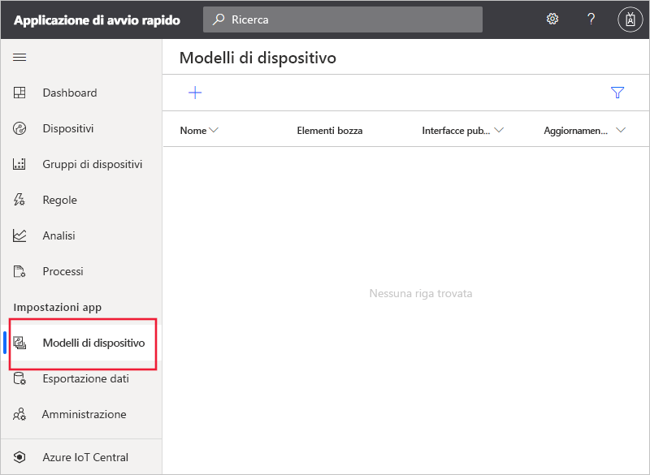
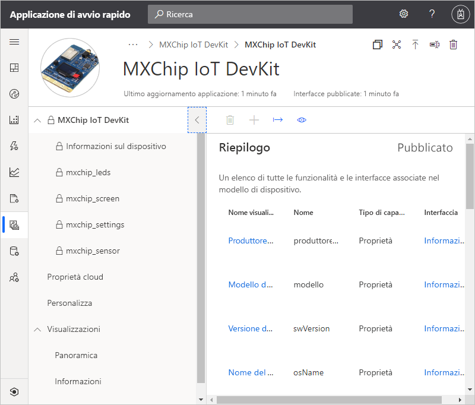
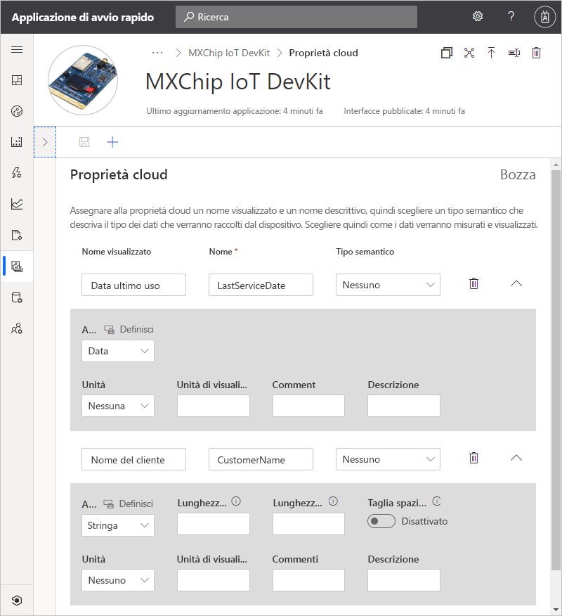
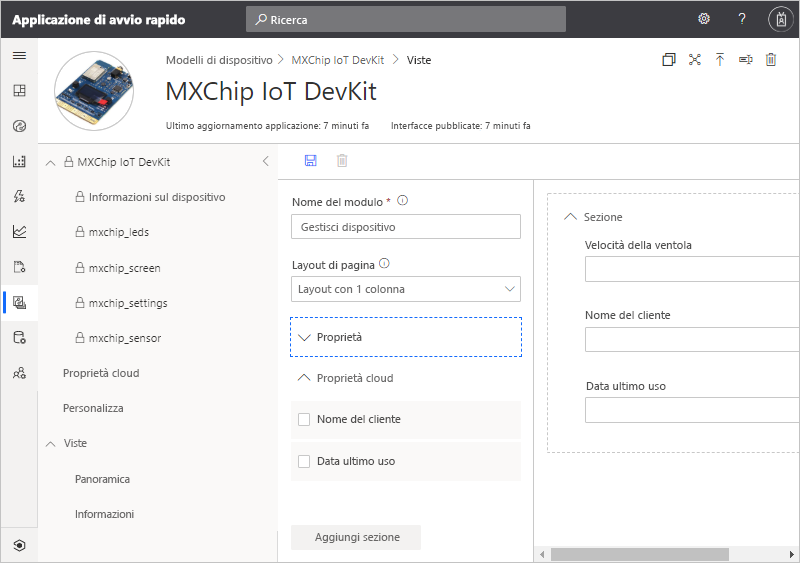
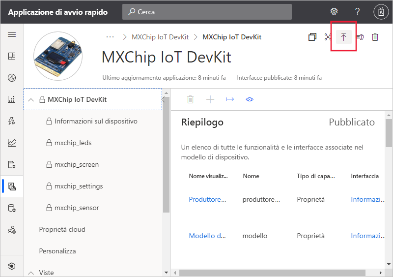
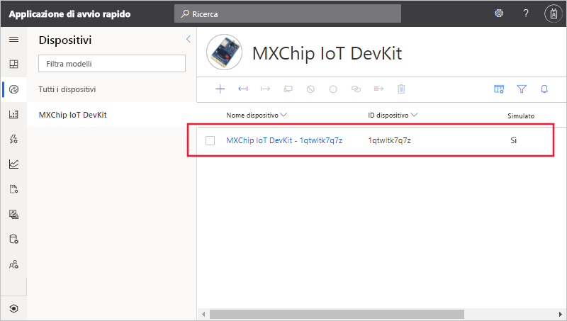
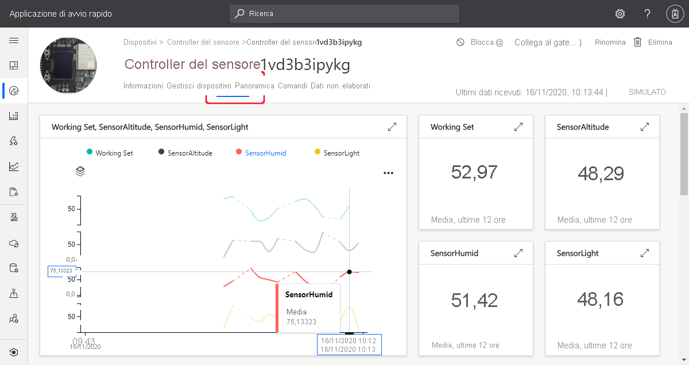
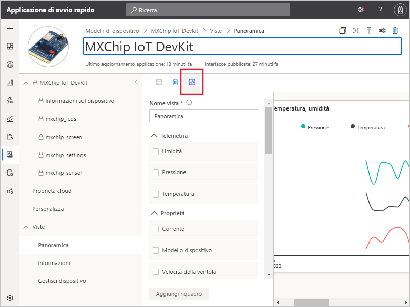

# Guida introduttiva: Aggiungere un dispositivo simulato all'applicazione IoT Central

*Questo articolo è rivolto a operatori, autori e amministratori.*

Un modello di dispositivo definisce le funzionalità di un dispositivo che si connette all'applicazione IoT Central. Le funzionalità includono i dati di telemetria inviati dal dispositivo, le proprietà del dispositivo e i comandi a cui un dispositivo risponde. Da un modello di dispositivo, un creatore o un operatore può aggiungere dispositivi reali e simulati a un'applicazione. I dispositivi simulati sono utili per testare il comportamento dell'applicazione IoT Central prima di connettere dispositivi reali.

In questo argomento di avvio rapido si aggiunge un modello di dispositivo per una scheda [*MXChip IoT DevKit* (DevKit)](https://aka.ms/iot-devkit-purchase) e si crea un dispositivo simulato. Per completare questo argomento di avvio rapido, non è necessario avere un dispositivo reale perché si userà una simulazione. Un dispositivo DevKit:

* Invia dati di telemetria, ad esempio la temperatura.
* Segnala le proprietà specifiche del dispositivo, ad esempio il livello di luminosità.
* Risponde a comandi quali l'attivazione e la disattivazione.
* Segnala le proprietà generiche del dispositivo, ad esempio la versione del firmware e il numero di serie.

## Prerequisiti

Completare la guida di avvio rapido [Creare un'applicazione Azure IoT Central](./quick-deploy-iot-central.md) per creare un'applicazione IoT Central usando il modello **App personalizzata > Applicazione personalizzata**.

## Creare un modello

Lo sviluppatore può creare e modificare i modelli di dispositivo nell'applicazione IoT Central. Dopo aver pubblicato un modello di dispositivo, è possibile generare il dispositivo simulato o connettere dispositivi reali dal modello di dispositivo. I dispositivi simulati consentono di testare il comportamento dell'applicazione prima di collegare un dispositivo reale.

Per aggiungere un nuovo modello di dispositivo all'applicazione, selezionare la scheda **Modelli di dispositivo** nel riquadro sinistro.

Un modello di dispositivo include un modello di funzionalità che definisce i dati di telemetria inviati dal dispositivo, le proprietà del dispositivo e i comandi a cui risponde.

### Aggiungere un modello di funzionalità di dispositivo

Sono disponibili diverse opzioni per aggiungere un modello di funzionalità di dispositivo all'applicazione IoT Central. È possibile creare un modello da zero, importarlo da un file o selezionare un dispositivo nell'apposito catalogo. IoT Central supporta anche un approccio *device-first*, per cui importa automaticamente un modello da un repository la prima volta che un dispositivo si connette. In questo argomento di avvio rapido scegliere un dispositivo dal catalogo per importare il relativo modello di funzionalità.

I passaggi seguenti illustrano come usare il catalogo di dispositivi per importare il modello di funzionalità per un dispositivo **MXChip IoT DevKit**. Questi dispositivi inviano dati di telemetria, ad esempio la temperatura, all'applicazione:

1. Per aggiungere un nuovo modello di dispositivo, selezionare **+** nella pagina **Modelli di dispositivo**.

1. Nella pagina **Selezionare il tipo di modello** scorrere verso il basso fino a trovare il riquadro **MXChip IoT DevKit**.

1. Selezionare il riquadro **MXChip IoT DevKit** e quindi **Avanti: Personalizza**.

1. Nella pagina **Rivedi** selezionare **Crea**.

1. Dopo alcuni secondi, è possibile visualizzare il nuovo modello di dispositivo:

    

    Il modello di funzionalità MXChip IoT DevKit include interfacce come **mxchip_sensor**, **mxchip_settings** e **Informazioni sul dispositivo**. Le interfacce definiscono le funzionalità di un dispositivo MXChip IoT DevKit. Le funzionalità includono i dati di telemetria inviati dal dispositivo, le proprietà segnalate dal dispositivo e i comandi a cui un dispositivo risponde.

### Aggiungere proprietà cloud

Un modello di dispositivo può includere proprietà cloud. Le proprietà cloud esistono solo nell'applicazione IoT Central e non vengono mai inviate a o ricevute da un dispositivo. Per aggiungere una proprietà cloud:

1. Selezionare **Proprietà cloud** e quindi **+ Aggiungi proprietà cloud**. Usare le informazioni nella tabella seguente per aggiungere due proprietà cloud al modello di dispositivo:

    | Nome visualizzato      | Tipo semantico | SCHEMA |
    | ----------------- | ------------- | ------ |
    | Data ultimo utilizzo | nessuno          | Data   |
    | Nome del cliente     | nessuno          | string |

1. Fare clic su **Salva** per salvare le modifiche:

    

## Viste

Lo sviluppatore può personalizzare un'applicazione in modo da visualizzare le informazioni pertinenti sul dispositivo per un operatore. Le personalizzazioni consentono all'operatore di gestire i dispositivi connessi all'applicazione. È possibile creare due tipi di visualizzazioni che un operatore può usare per interagire con i dispositivi:

* Moduli per visualizzare e modificare le proprietà del dispositivo e cloud.
* Dashboard per visualizzare i dispositivi, inclusi i dati di telemetria inviati.

### Visualizzazioni predefinite

La visualizzazioni predefinite consentono di iniziare subito a visualizzare le informazioni importanti sul dispositivo. Per il modello di dispositivo possono essere generate fino a tre visualizzazioni predefinite:

* La visualizzazione **Comandi** consente all'operatore di inviare comandi al dispositivo.
* La visualizzazione **Panoramica** usa grafici e metriche per visualizzare i dati di telemetria del dispositivo.
* La visualizzazione **Informazioni** mostra le proprietà del dispositivo.

Selezionare il nodo **Visualizzazioni** nel modello di dispositivo. Come si può notare, quando è stato aggiunto il modello, IoT Central ha generato automaticamente una visualizzazione **Panoramica** e una visualizzazione **Informazioni**.

Per aggiungere un nuovo modulo **Gestisci dispositivo** che un operatore può usare per gestire il dispositivo:

1. Selezionare il nodo **Visualizzazioni** e quindi il riquadro **Modifica dei dati del dispositivo e del cloud** per aggiungere una nuova visualizzazione.

1. Cambiare il nome del modulo in **Gestisci dispositivo**.

1. Selezionare le proprietà cloud **Nome del cliente** e **Data ultimo utilizzo** e la proprietà **Velocità della ventola**. Selezionare quindi **Aggiungi sezione**:

    

1. Selezionare **Salva** per salvare il nuovo modulo.

## Pubblicare il modello di dispositivo

Prima di creare un dispositivo simulato o connettere un dispositivo reale, è necessario pubblicare il modello di dispositivo. Anche se IoT Central ha pubblicato il modello quando è stato creato, è necessario pubblicare la versione aggiornata.

Per pubblicare un modello di dispositivo:

1. Passare al modello di dispositivo dalla pagina **Modelli di dispositivo**.

1. Selezionare **Pubblica**:

    

1. Nella finestra di dialogo **Pubblica questo modello di dispositivo nell'applicazione** selezionare **Pubblica**. 

Dopo la pubblicazione, il modello di dispositivo è visibile nella pagina **Dispositivi**. In un modello di dispositivo pubblicato non è possibile modificare un modello di funzionalità di dispositivo senza creare una nuova versione. È tuttavia possibile apportare aggiornamenti a proprietà cloud, personalizzazioni e visualizzazioni in un modello di dispositivo pubblicato senza creare una nuova versione. Dopo aver apportato le modifiche, selezionare **Pubblica** per eseguire il push delle modifiche all'operatore.

## Aggiungere un dispositivo simulato

Per aggiungere un dispositivo simulato all'applicazione, usare il modello di dispositivo **MXChip IoT DevKit** creato.

1. Per aggiungere un nuovo dispositivo in qualità di operatore, scegliere **Dispositivi** nel riquadro di sinistra. La scheda **Dispositivi** include l'opzione **Tutti i dispositivi** e il modello di dispositivo **MXChip IoT DevKit**. Selezionare **MXChip IoT DevKit**.

1. Per aggiungere un dispositivo DevKit simulato, selezionare **+** . Usare il valore di **ID dispositivo** suggerito o immetterne uno personalizzato. Un ID dispositivo può contenere lettere, numeri e il carattere `-`. È anche possibile immettere un nome per il nuovo dispositivo. Assicurarsi che l'interruttore **Simulato** sia impostato su **Sì** e quindi selezionare **Crea**.

    

È ora possibile interagire con le visualizzazioni create per il modello di dispositivo usando dati simulati:

1. Selezionare il dispositivo simulato nella pagina **Dispositivi**

    * La visualizzazione **Panoramica** mostra un tracciato dei dati di telemetria simulati:

        

    * La visualizzazione **Informazioni** mostra i valori delle proprietà, tra cui le proprietà cloud aggiunte.

    * La visualizzazione **Comandi** consente di eseguire comandi, come **blink**, nel dispositivo.

    * La visualizzazione **Gestisci dispositivi** è il modulo creato per consentire all'operatore di gestire il dispositivo.

    * La visualizzazione **Dati non elaborati** consente di visualizzare i dati di telemetria non elaborati e i valori delle proprietà inviati dal dispositivo. Questa visualizzazione risulta utile per il debug dei dispositivi.

## Usare un dispositivo simulato per migliorare le visualizzazioni

Dopo aver creato un nuovo dispositivo simulato, il creatore può usare questo dispositivo per continuare a migliorare e arricchire le visualizzazioni per il modello di dispositivo.

1. Scegliere **Modelli di dispositivo** nel riquadro sinistro e selezionare il modello **MXChip IoT DevKit**.

1. Selezionare la visualizzazione che si vuole modificare o creare una nuova visualizzazione. Selezionare **Configura dispositivo in anteprima** e quindi **Seleziona da un dispositivo in esecuzione**. Qui è possibile scegliere di non creare un dispositivo di anteprima, di usare un dispositivo reale configurato per i test oppure di usare un dispositivo esistente aggiunto in IoT Central.

1. Scegliere il dispositivo simulato nell'elenco. Selezionare **Applica**. È ora possibile visualizzare lo stesso dispositivo simulato nell'esperienza di creazione di visualizzazioni dei modelli di dispositivo. Questa visualizzazione è utile per i grafici e altri elementi visivi.

    

## Passaggi successivi

In questo argomento di avvio rapido è stato creato un modello di dispositivo **MXChip IoT DevKit** ed è stato aggiunto un dispositivo simulato all'applicazione.

Per altre informazioni sul monitoraggio dei dispositivi connessi all'applicazione, continuare con l'avvio rapido:

> [!div class="nextstepaction"]
> [Configurare regole e azioni](./quick-configure-rules.md)
