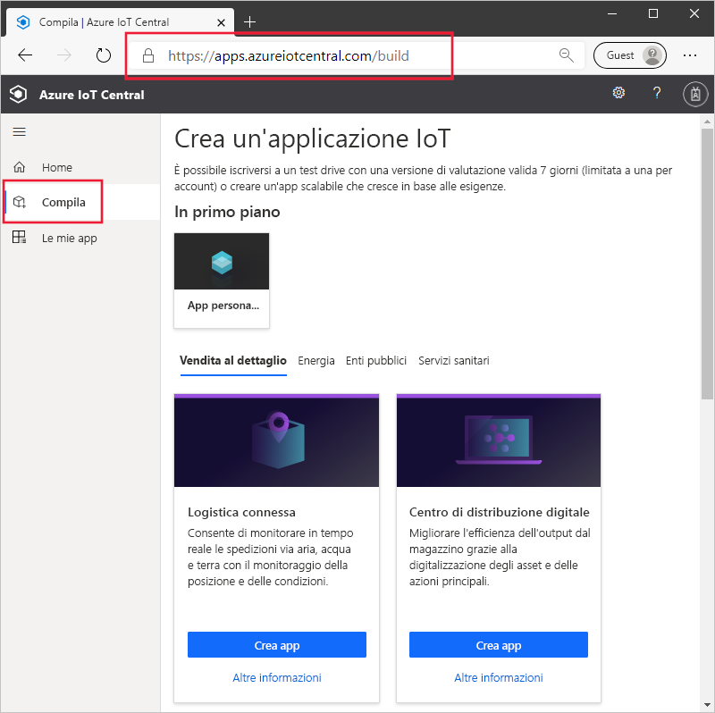
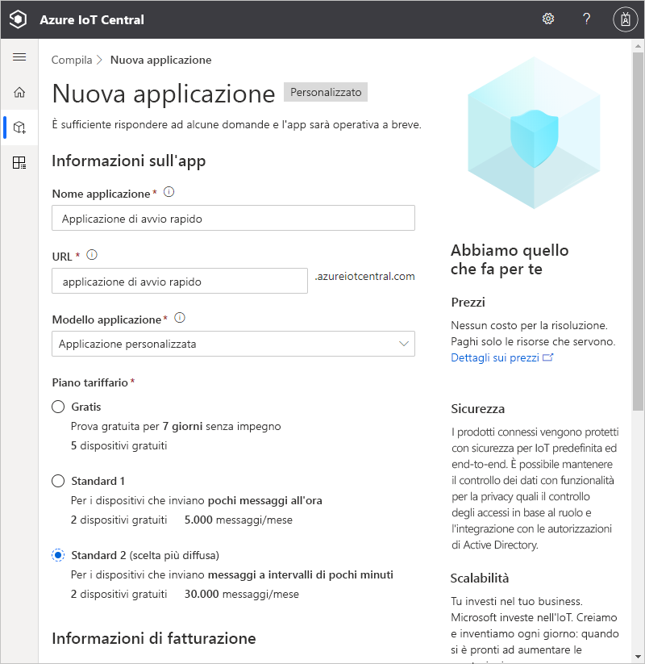
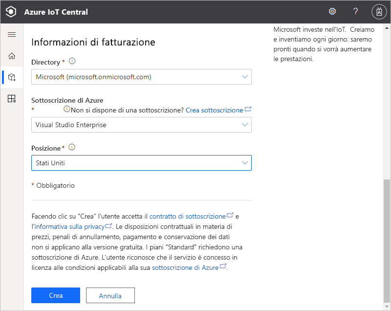
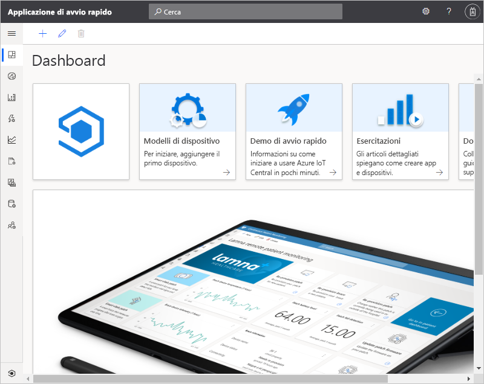

# Creare un'applicazione Azure IoT Central

Questo argomento di avvio rapido illustra come creare un'applicazione Azure IoT Central.

## Creare un'applicazione

Passare al sito per la [creazione di app Azure IoT Central](https://aka.ms/iotcentral). Eseguire quindi l'accesso con un account Microsoft personale, aziendale o dell'istituto di istruzione.

Creare una nuova applicazione dall'elenco di modelli di IoT Central pertinenti per il settore per iniziare rapidamente oppure partire da zero usando un modello **App personalizzate**. In questa guida di avvio rapido si usa il modello **Applicazione personalizzata**.

Per creare una nuova applicazione Azure IoT Central dal modello **Applicazione personalizzata**:

1. Passare alla pagina **Crea**:

    

1. Scegliere **App personalizzate** e assicurarsi che sia selezionato il modello **Applicazione personalizzata**.

1. Azure IoT Central suggerisce automaticamente il **nome di un'applicazione** in base al modello di applicazione selezionato. È possibile usare questo nome oppure immettere un nome descrittivo per l'applicazione.

1. Azure IoT Central genera anche un prefisso **URL di applicazione** univoco in base al nome dell'applicazione. Questo URL viene usato per accedere all'applicazione. Sostituire questo prefisso di URL con un qualcosa di più facile da ricordare.

    

    

    > [!NOTE]
    > Se nella pagina precedente si è scelto **App personalizzata**, si vedrà l'elenco a discesa **Modello di applicazione**. Nell'elenco a discesa potrebbero essere visualizzati anche altri modelli resi disponibili dall'organizzazione. 

    >[!IMPORTANT]
    >Il modello **Applicazione personalizzata (legacy)** (V2) è stato ritirato in quanto tutte le funzionalità precedentemente disponibili in questo modello sono ora disponibili nel modello **Applicazione personalizzata** più recente (V3). 
    
1. Scegliere di creare questa applicazione usando il piano tariffario della versione di valutazione gratuita valida 7 giorni oppure uno dei piani tariffari standard:

    - Le applicazioni con il piano *gratuito* sono gratuite per sette giorni e supportano fino a cinque dispositivi. È possibile convertirle per l'uso di un piano tariffario standard in qualsiasi momento prima della scadenza.
    - Le applicazioni create usando il piano *standard* vengono fatturate in base ai singoli dispositivi; è possibile scegliere il piano tariffario **Standard 1** o **Standard 2** con i primi due dispositivi gratuiti. Per altre informazioni sui piani tariffari gratuito e standard, vedere la pagina sui [prezzi di Azure IoT Central](https://azure.microsoft.com/pricing/details/iot-central/). Se si crea un'applicazione con un piano tariffario standard, è necessario selezionare una *directory*, una *sottoscrizione di Azure* e una *località*:
        - La *directory* è l'istanza di Azure Active Directory in cui creare l'applicazione. Un'istanza di Azure Active Directory contiene le identità degli utenti, le credenziali e altre informazioni dell'organizzazione. Se Azure Active Directory non è disponibile, ne viene creata automaticamente un'istanza quando si crea una sottoscrizione di Azure.
        - Una *sottoscrizione di Azure* consente di creare istanze dei servizi di Azure. IoT Central effettua il provisioning delle risorse nella sottoscrizione. Se non si ha una sottoscrizione di Azure, è possibile crearne una gratuitamente nella [pagina di iscrizione ad Azure](https://aka.ms/createazuresubscription). Dopo aver creato la sottoscrizione di Azure, tornare nella pagina **Nuova applicazione**. La nuova sottoscrizione è ora inclusa nell'elenco a discesa **Sottoscrizione di Azure** (Sottoscrizione di Azure).
        - La *località* è l'[area geografica](https://azure.microsoft.com/global-infrastructure/geographies/) in cui si vuole creare l'applicazione. Per ottenere prestazioni ottimali, è in genere consigliabile scegliere la località fisicamente più vicina ai dispositivi. Dopo aver scelto una località, non è possibile spostare l'applicazione in un'altra località in un secondo momento.

1. Esaminare i termini e le condizioni e selezionare **Crea** nella parte inferiore della pagina. Dopo alcuni minuti, l'applicazione IoT Central è pronta per l'uso:

    

## Passaggi successivi

In questa guida introduttiva è stata creata un'applicazione IoT Central. Ecco il passaggio successivo suggerito per proseguire con la formazione su IoT Central:

> [!div class="nextstepaction"]
> [Aggiungere un dispositivo simulato all'applicazione Azure IoT Central](./quick-create-simulated-device.md)

Per gli sviluppatori di dispositivi che desiderano approfondire il codice, il passaggio successivo suggerito consiste nel:
> [!div class="nextstepaction"]
> [Creare e connettere un'applicazione client all'applicazione Azure IoT Central](./tutorial-connect-device-nodejs.md)
