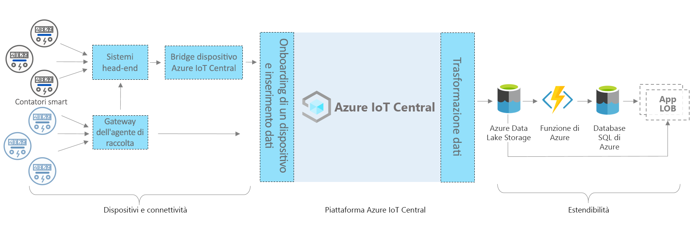

# Azure IoT Central - architettura dell'app per contatori intelligenti

[!INCLUDE [iot-central-pnp-original](../../../includes/iot-central-pnp-original-note.md)]

Questo articolo contiene una panoramica dell'architettura del modello di app per il monitoraggio dei contatori intelligenti. Il diagramma seguente mostra un'architettura di uso comune dell'app per contatori intelligenti in Azure che utilizza la piattaforma IoT Central.

> [!div class="mx-imgBorder"]
> 

L'architettura è costituita dai componenti seguenti. Alcune soluzioni potrebbero non richiedere tutti i componenti elencati qui.

## Contatori intelligenti e connettività 

Un contatore intelligente è uno dei dispositivi più importanti tra tutte le risorse in ambito di energia. Registra e comunica i dati sul consumo di energia alle aziende di pubblica utilità per il monitoraggio e altri casi d'uso, ad esempio la fatturazione e la risposta alla domanda. In base al tipo, il contatore può connettersi a IoT Central tramite gateway o altri dispositivi o sistemi intermedi, ad esempio dispositivi perimetrali e sistemi head-end. Compilare un dispositivo bridge IoT Central per connettere i dispositivi che non possono essere connessi direttamente. Il dispositivo bridge IoT Central è una soluzione open source i cui dettagli completi sono disponibili [qui](https://docs.microsoft.com/azure/iot-central/core/howto-build-iotc-device-bridge). 

## Piattaforma IoT Central

Azure IoT Central è una piattaforma che semplifica la creazione di una soluzione IoT e contribuisce a ridurre il carico di lavoro e i costi di gestione, operazioni e sviluppo IoT. Con IoT Central è possibile connettersi, monitorare e gestire facilmente le risorse di Internet delle cose (IoT) su larga scala. Dopo aver connesso i contatori intelligenti a IoT Central, il modello di app usa funzionalità predefinite, ad esempio modelli di dispositivi, comandi e dashboard. Il modello di app usa anche lo spazio di archiviazione IoT Central per gli scenari in tempo reale, ad esempio monitoraggio, analisi, regole e visualizzazione dei dati del contatore. 

## Opzioni di estendibilità per la compilazione con IoT Central
La piattaforma IoT Central offre due opzioni di estendibilità, ovvero l'esportazione continua dei dati e le API. I clienti e i partner possono scegliere tra queste opzioni di base e personalizzare le proprie soluzioni per esigenze specifiche. Uno dei nostri partner, ad esempio, ha configurato l'esportazione continua dei dati con Azure Data Lake Storage (ADLS). ADLS viene usato per la conservazione dei dati a lungo termine e altri scenari di archiviazione offline sicura, ad esempio per l'elaborazione batch, il controllo e la creazione di report. 

## Passaggi successivi

* Ora che sono state apprese le informazioni sull'architettura, [creare gratuitamente l'app per contatori intelligenti](https://apps.azureiotcentral.com/build/new/smart-meter-monitoring)
* Per altre informazioni su IoT Central, vedere [Panoramica di IoT Central](https://docs.microsoft.com/azure/iot-central/)
