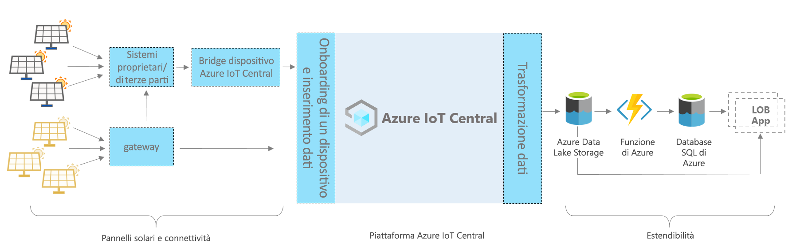

# Azure IoT Central - Architettura dell'app per pannelli solari

[!INCLUDE [iot-central-pnp-original](../../../includes/iot-central-pnp-original-note.md)]

Questo articolo contiene una panoramica dell'architettura del modello di applicazione per il monitoraggio dei pannelli solari. Il diagramma seguente mostra un'architettura di uso comune per l'app per pannelli solari in Azure che utilizza la piattaforma IoT Central.

> [!div class="mx-imgBorder"]
> 

L'architettura è costituita dai componenti seguenti. Alcune applicazioni potrebbero non richiedere tutti i componenti elencati qui.

## Pannelli solari e connettività 

I pannelli solari rappresentano una delle fonti più significative di energia rinnovabile. A seconda del tipo e dell'installazione del pannello solare, è possibile connetterlo tramite gateway o tramite altri dispositivi intermedi e sistemi proprietari. Potrebbe essere necessario compilare un dispositivo bridge IoT Central per connettere i dispositivi che non possono essere connessi direttamente. Il dispositivo bridge IoT Central è una soluzione open-source i cui dettagli completi sono disponibili [qui](https://docs.microsoft.com/azure/iot-central/core/howto-build-iotc-device-bridge). 

## Piattaforma IoT Central
Azure IoT Central è una piattaforma che semplifica la creazione di una soluzione IoT e contribuisce a ridurre il carico di lavoro e i costi di gestione, operazioni e sviluppo IoT. Con IoT Central è possibile connettersi, monitorare e gestire facilmente le risorse di Internet delle cose (IoT) su larga scala. Dopo aver connesso i pannelli solari a IoT Central, il modello di app usa funzionalità predefinite, ad esempio modelli di dispositivi, comandi e dashboard. Il modello di app usa anche lo spazio di archiviazione IoT Central per gli scenari in tempo reale, ad esempio monitoraggio, analisi, regole e visualizzazione dei dati del contatore.

## Opzioni di estendibilità per la compilazione con IoT Central
La piattaforma IoT Central offre due opzioni di estendibilità, ovvero l'esportazione continua dei dati e le API. I clienti e i partner possono scegliere tra queste opzioni di base e personalizzare le proprie soluzioni per esigenze specifiche. Uno dei nostri partner, ad esempio, ha configurato l'esportazione continua dei dati con Azure Data Lake Storage (ADLS). ADLS viene usato per la conservazione dei dati a lungo termine e altri scenari di archiviazione offline sicura, ad esempio per l'elaborazione batch, il controllo e la creazione di report. 

## Passaggi successivi

* Dopo aver appreso le nozioni di base sull'architettura, è possibile [creare un'app per pannelli solari gratuitamente](https://apps.azureiotcentral.com/build/new/solar-panel-monitoring)
* Per altre informazioni su IoT Central, vedere [Panoramica di IoT Central](https://docs.microsoft.com/azure/iot-central/)