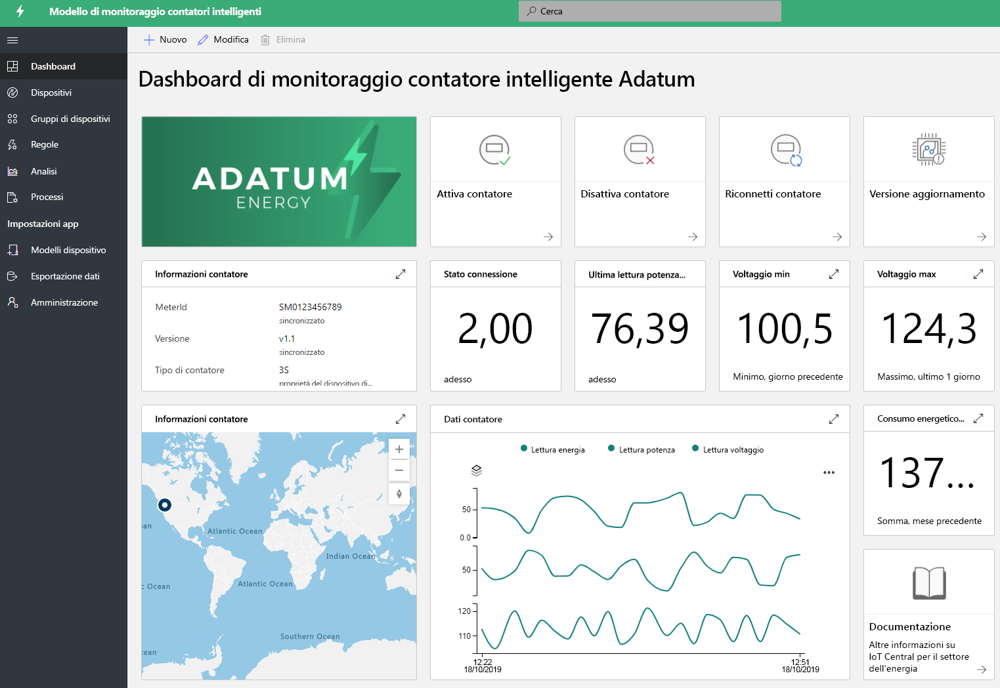
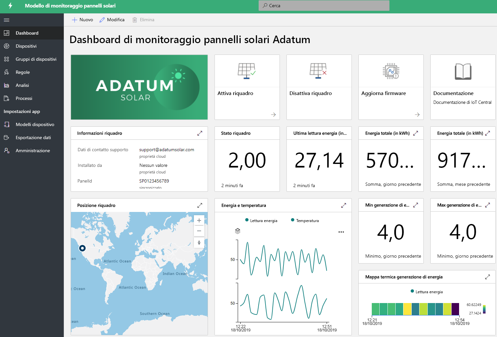

# Creare soluzioni per il settore energetico con IoT Central 

[!INCLUDE [iot-central-pnp-original](../../../includes/iot-central-pnp-original-note.md)]

I contatori intelligenti e i pannelli solari svolgono un ruolo importante nella trasformazione del settore energetico. I contatori intelligenti forniscono più controlli e informazioni dettagliate in tempo reale sui consumi energetici e la crescita dei pannelli solari favorisce il progresso nella generazione di energie rinnovabili. Le app di monitoraggio di contatori intelligenti e pannelli solari sono modelli di esempio per illustrare le varie funzionalità. I partner possono sfruttare questi modelli per creare soluzioni energetiche con IoT Central, al fine di soddisfare esigenze specifiche. Per distribuire e usare queste applicazioni non è richiesta alcuna nuova attività di codifica né sono necessari costi aggiuntivi. Altre informazioni sui modelli di applicazione per il settore energetico e sulle relative funzionalità.

## Che cos'è l'applicazione di monitoraggio di contatori intelligenti?
 Oltre alla fatturazione automatica, i contatori intelligenti abilitano casi d'uso per la misurazione avanzata, come le letture in tempo reale e la comunicazione bidirezionale. Il modello di app per contatori intelligenti consente a utilità e partner di monitorare lo stato e i dati dei contatori intelligenti, nonché definire avvisi e notifiche. Offre inoltre comandi di esempio, come quelli per la disconnessione del contatore e l'aggiornamento del software. I dati del contatore possono essere configurati per l'uscita verso altre applicazioni aziendali e per lo sviluppo di soluzioni personalizzate. 

Funzionalità principali dell'app: 

* Modello di dispositivo di esempio per contatore 
* Informazioni sul contatore e stato attivo 
* Letture del contatore, ad esempio energia, alimentazione e tensioni
* Esempi di comandi del contatore 
* Visualizzazione e dashboard predefiniti
* Estendibilità per lo sviluppo di soluzioni personalizzate

È possibile provare [gratuitamente l'app di monitoraggio di contatori intelligenti](https://apps.azureiotcentral.com/build/new/smart-meter-monitoring) senza una sottoscrizione di Azure né eventuali impegni.

Dopo aver distribuito l'app, verranno visualizzati i dati del contatore simulato nel dashboard, come illustrato nella figura seguente. Questo modello è un'app di esempio che è possibile estendere e personalizzare facilmente per casi d'uso specifici.

> [!div class="mx-imgBorder"]
> 

## Che cos'è l'applicazione di monitoraggio di pannelli solari?
L'app di monitoraggio di pannelli solari consente alle utilità e ai partner di monitorare i pannelli solari, ad esempio la generazione di energia e lo stato di connessione in tempo quasi reale. Può inviare notifiche in base ai criteri di soglia definiti e rende disponibili comandi di esempio, come quelli per l'aggiornamento del firmware e altre proprietà. I dati del pannello solare possono essere configurati per l'uscita verso altre applicazioni aziendali e per lo sviluppo di soluzioni personalizzate. 

Funzionalità principali dell'app: 

* Modello di dispositivo di esempio per pannello solare 
* Informazioni sul pannello solare e stato attivo
* Generazione di energia solare e altre letture
* Esempi di comandi e controlli
* Visualizzazione e dashboard predefiniti
* Estendibilità per lo sviluppo di soluzioni personalizzate

È possibile provare [gratuitamente l'app di monitoraggio di pannelli solari](https://apps.azureiotcentral.com/build/new/solar-panel-monitoring) senza una sottoscrizione di Azure né eventuali impegni.

Dopo aver distribuito l'app, i dati del pannello solare simulato verranno visualizzati nel dashboard entro 1-2 minuti, come illustrato nella figura seguente. Questo modello è un'app di esempio che è possibile estendere e personalizzare facilmente per casi d'uso specifici. 

> [!div class="mx-imgBorder"]
> 

## Passaggi successivi
Per iniziare a creare una soluzione per il settore energetico:
* Creare modelli di applicazione gratuiti: [app per contatori intelligenti](https://apps.azureiotcentral.com/build/new/smart-meter-monitoring), [app per pannelli solari](https://apps.azureiotcentral.com/build/new/solar-panel-monitoring)
* Informazioni sui [concetti relativi all'app di monitoraggio di contattori intelligenti](https://docs.microsoft.com/azure/iot-central/energy/concept-iot-central-smart-meter-app)
* Informazioni sui [concetti relativi all'app di monitoraggio di pannelli solari](https://docs.microsoft.com/azure/iot-central/energy/concept-iot-central-solar-panel-app)
* Informazioni sulla [piattaforma IoT Central](https://docs.microsoft.com/azure/iot-central/)
