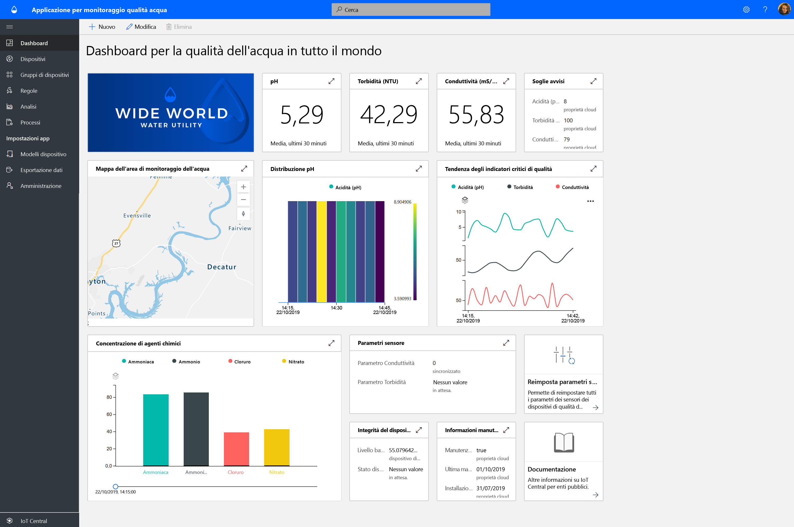
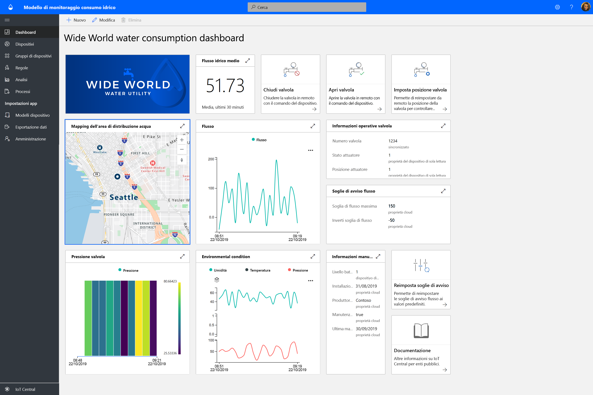
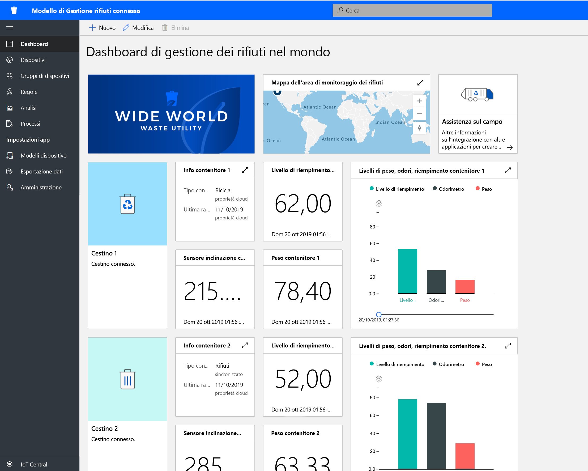

# Creazione di soluzioni per enti pubblici con Azure IoT Central

[!INCLUDE [iot-central-pnp-original](../../../includes/iot-central-pnp-original-note.md)]

Iniziare a creare soluzioni Smart City usando i modelli di applicazione di Azure IoT Central. Iniziare subito con **monitoraggio qualità acqua**, **monitoraggio consumo idrico** e **gestione rifiuti connessa**.

## Che cos'è il modello di applicazione Monitoraggio qualità acqua?   

Il monitoraggio della qualità dell'acqua tradizionale si basa sulle tecniche di campionamento manuale e sulle analisi di laboratorio sul campo, che richiede molto tempo e costi elevati. Il monitoraggio remoto della qualità dell'acqua in tempo reale consente di gestire i problemi di qualità dell'acqua prima che si verifichi un impatto sui cittadini. Inoltre, con l'analisi avanzata, le società di servizi idrici e gli enti ambientali possono risolvere i potenziali problemi di qualità dell'acqua in base ad avvisi tempestivi e pianificare in anticipo il trattamento dell'acqua.  

L'app Monitoraggio qualità acqua è un modello di app di IoT Central che permette di avviare lo sviluppo di soluzioni IoT per consentire alle società di servizi idrici di monitorare digitalmente la qualità dell'acqua nelle città intelligenti. 

Il modello di app è costituito da:
* Dashboard operatore di esempio
* Modelli di dispositivo di monitoraggio della qualità dell'acqua di esempio
* Dispositivi di monitoraggio della qualità dell'acqua simulati
* Regole e processi preconfigurati
* Personalizzazione tramite white-label 

Iniziare con l'[esercitazione sull'applicazione Monitoraggio qualità acqua](./tutorial-water-quality-monitoring.md).

## Che cos'è il modello di applicazione Monitoraggio consumo idrico? 

Il rilevamento dei consumi idrici tradizionale si basa sulla lettura manuale dei contatori di consumo di acqua presso i siti di misurazione da parte degli operatori delle società di servizi idrici. Un numero sempre maggiore di città sta sostituendo i contatori tradizionali con contatori intelligenti avanzati che consentono il monitoraggio remoto dei consumi e la verifica remota delle valvole per controllare il flusso idrico. Il monitoraggio del consumo idrico associato a messaggi di feedback digitali al cittadino può aumentare la consapevolezza e ridurre il consumo di acqua. 

L'app Monitoraggio consumo idrico è un modello di app di IoT Central che permette di avviare lo sviluppo di soluzioni IoT per consentire alle società di servizi idrici e alle città di monitorare e controllare in modalità remota il flusso idrico per ridurne il consumo. 

  

Il modello di app Monitoraggio consumo idrico è costituito dagli elementi preconfigurati seguenti:
* Dashboard operatore di esempio
* Modelli di dispositivo di monitoraggio della qualità dell'acqua di esempio
* Dispositivi di monitoraggio della qualità dell'acqua simulati
* Regole e processi preconfigurati
* Personalizzazione tramite white-label 

 Iniziare con l'[esercitazione sull'applicazione Monitoraggio consumo idrico](./tutorial-water-consumption-monitoring.md).

## Che cos'è il modello applicazione Gestione rifiuti connessa? 

App Gestione rifiuti connessa è un modello di app di IoT Central che permette di avviare lo sviluppo di soluzioni IoT per consentire alle città intelligenti di sfruttare il monitoraggio remoto per ottimizzare la raccolta dei rifiuti. 

 

Il modello di app Gestione rifiuti connessa è costituito dagli elementi preconfigurati seguenti:
* Dashboard operatore di esempio
* Modelli di dispositivo cassonetto connesso di esempio
* Dispositivi cassonetto connesso simulati
* Regole e processi preconfigurati
* Personalizzazione tramite white-label 

Iniziare con l'[esercitazione sull'applicazione Gestione rifiuti connessa](./tutorial-connected-waste-management.md).

## Passaggi successivi

* Provare a usare gratuitamente i modelli di applicazione per enti pubblici in IoT Central e [creare un'app](https://apps.azureiotcentral.com/build/government)
* Informazioni sui [concetti di monitoraggio della qualità dell'acqua](./concepts-waterqualitymonitoring-architecture.md)
* Informazioni sui [concetti di monitoraggio del consumo idrico](./concepts-waterconsumptionmonitoring-architecture.md)
* Informazioni sui [concetti di gestione rifiuti connessa](./concepts-connectedwastemanagement-architecture.md)  
* Per informazioni su IoT Central, vedere [Panoramica di IoT Central](https://docs.microsoft.com/azure/iot-central/core/overview-iot-central)
 