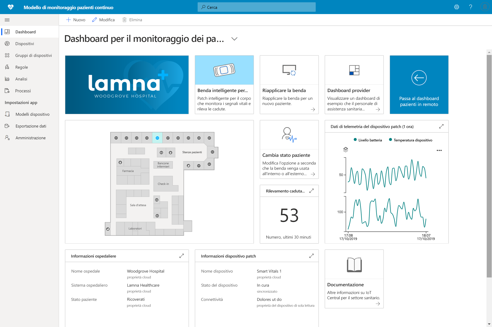

# Creazione di soluzioni per il settore sanitario con Azure IoT Central 

Informazioni su come creare soluzioni per il settore sanitario usando i modelli di applicazione di Azure IoT Central.

## Che cos'è un modello di monitoraggio pazienti continuo?

Nel settore dell'assistenza sanitaria IoT, il monitoraggio dei pazienti continuo è uno dei fattori principali che consentono di ridurre il rischio di ricoveri ripetuti, di gestire le patologie croniche in modo più efficace e di migliorare gli esiti per i pazienti. Il monitoraggio pazienti continuo può essere diviso in due categorie principali:

1. **Monitoraggio pazienti degenti**: Grazie all'uso di dispositivi medicali indossabili e di altri dispositivi in ospedale, i team di assistenza sanitaria possono monitorare i segni vitali dei pazienti e le condizioni mediche senza dover inviare un infermiere più volte al giorno per controllare un paziente. I team di assistenza sanitaria possono sapere quando un paziente necessita di attenzione critica tramite le notifiche e stabilire le priorità in modo più efficace.
1. **Monitoraggio pazienti remoto**: Grazie all'uso di dispositivi medicali indossabili e dei risultati segnalati dai pazienti (personale professionale) per monitorare i pazienti all'esterno dell'ospedale, è possibile ridurre il rischio di ricoveri ripetuti. È possibile raccogliere dati dei pazienti affetti da patologie croniche e dei pazienti in riabilitazione per garantire che i pazienti rispettino le cure prestabilite e che gli avvisi di peggioramento dei pazienti possano essere visualizzati dai team di assistenza sanitaria prima che diventino critici.

Questo modello di applicazione può essere usato per creare soluzioni per entrambe le categorie di monitoraggio pazienti continuo. Questo approccio offre i vantaggi seguenti:

* Connettere facilmente diversi tipi di dispositivi medicali indossabili a un'istanza di IoT Central.
* Monitorare e gestire i dispositivi per assicurarsi che rimangano integri.
* Creare regole personalizzate per i dati dei dispositivi per l'attivazione degli avvisi appropriati.
* Esportare i dati sanitari dei pazienti nell'API di Azure per FHIR, un archivio dati conforme.
* Esportare le informazioni dettagliate aggregate nelle applicazioni aziendali nuove o esistenti.

>[!div class="mx-imgBorder"] 
>

## Passaggi successivi

Per iniziare a creare una soluzione di monitoraggio pazienti continuo:

* [Distribuire il modello di applicazione](tutorial-continuous-patient-monitoring.md)
* [Visualizzare un'architettura di esempio](concept-continuous-patient-monitoring-architecture.md)