# Presentazione dell'interfaccia utente di Azure IoT Central (funzionalità di anteprima)

[!INCLUDE [iot-central-pnp-original](../../includes/iot-central-pnp-original-note.md)]

In questo articolo viene presentata l'interfaccia utente di Microsoft Azure IoT Central. È possibile usare l'interfaccia utente per creare, gestire e usare una soluzione Azure IoT Central e i relativi dispositivi connessi.

I _generatori_ usano l'interfaccia utente di Azure IoT Central per definire la soluzione Azure IoT Central. È possibile usare l'interfaccia utente per:

* Definire i tipi di dispositivo che si connettono alla soluzione.
* Configurare le regole e le azioni per i dispositivi.
* Personalizzare l'interfaccia utente per un _operatore_ che usa la soluzione.

Gli _operatori_ usano l'interfaccia utente di Azure IoT Central per gestire la soluzione Azure IoT Central. È possibile usare l'interfaccia utente per:

* Eseguire il monitoraggio dei dispositivi.
* Configurare i dispositivi.
* Risolvere e correggere i problemi relativi ai dispositivi.
* Eseguire il provisioning di nuovi dispositivi.

## Usare il menu di spostamento a sinistra

Usare il menu di spostamento a sinistra per accedere alle diverse aree dell'applicazione. È possibile espandere o comprimere la barra di spostamento selezionando **<** o **>** :

| Menu | DESCRIZIONE |
| ---- | ----------- |
| 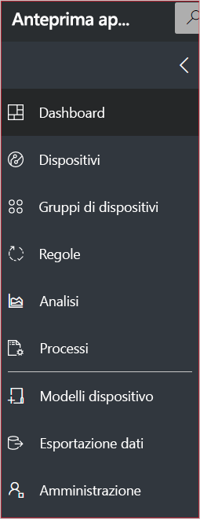 | <ul><li>La pagina **Dashboard** consente di accedere al dashboard dell'applicazione. I creatori possono personalizzare il dashboard per gli operatori. Anche gli utenti possono creare dashboard personalizzati.</li><li>Nella pagina **Dispositivi** sono elencati i dispositivi simulati e reali associati a ogni modello di dispositivo nell'applicazione. Gli operatori usano **Dispositivi** per gestire i dispositivi connessi.</li><li>La pagina **Gruppi di dispositivi** consente di visualizzare e creare gruppi di dispositivi. Gli operatori possono creare gruppi di dispositivi sotto forma di raccolta logica di dispositivi specificati da una query.</li><li>La pagina **Regole** consente di modificare regole che vengono attivate in base ai dati di telemetria dei dispositivi e attivano azioni personalizzabili.</li><li>Nella pagina **Analisi** è visualizzata l'analisi derivata dai dati di telemetria dei dispositivi per dispositivi e gruppi di dispositivi. Gli operatori possono creare visualizzazioni personalizzate basate sui dati dei dispositivi per derivare informazioni dettagliate dall'applicazione.</li><li>La pagina **Processi** consente di gestire i dispositivi in blocco e di creare ed eseguire processi per aggiornare i dispositivi su vasta scala.</li><li>Nella pagina **Modelli di dispositivo** sono visualizzati gli strumenti usati da un generatore per creare e gestire modelli di dispositivo.</li><li>La pagina **Esportazione dati** consente a un amministratore di configurare un'esportazione continua in altri servizi di Azure, come archiviazione e code.</li><li>La pagina **Amministrazione** consente di visualizzare le pagine di amministrazione dell'applicazione in cui un amministratore può gestire impostazioni, utenti e ruoli.</li></ul> |

## Ricerca, guida e supporto tecnico

Il menu superiore viene visualizzato in ogni pagina:

* Per cercare modelli di dispositivo e dispositivi, immettere un valore in **Search** (Cerca).
* Per cambiare la lingua o il tema dell'interfaccia utente, scegliere l'icona **Settings** (Impostazioni).
* Per disconnettersi dall'applicazione, scegliere l'icona **Account**.
* Per accedere alla guida e al supporto tecnico, fare clic sul menu a discesa **Help** (Guida) per visualizzare un elenco di risorse. In una versione di valutazione dell'applicazione le risorse di supporto includono l'accesso alla [live chat](howto-show-hide-chat.md?toc=/azure/iot-central-pnp/toc.json&bc=/azure/iot-central-pnp/breadcrumb/toc.json).

È possibile scegliere tra un tema scuro o un tema chiaro per l'interfaccia utente:

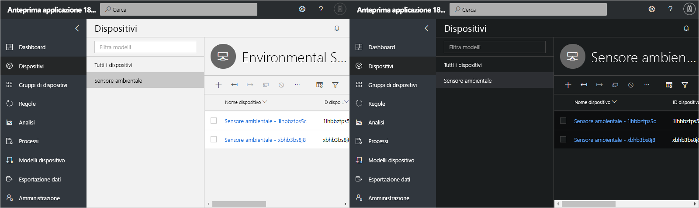

> [!NOTE]
> L'opzione per scegliere il tema chiaro o scuro non è disponibile se l'amministratore ha configurato un tema personalizzato per l'applicazione.

## dashboard

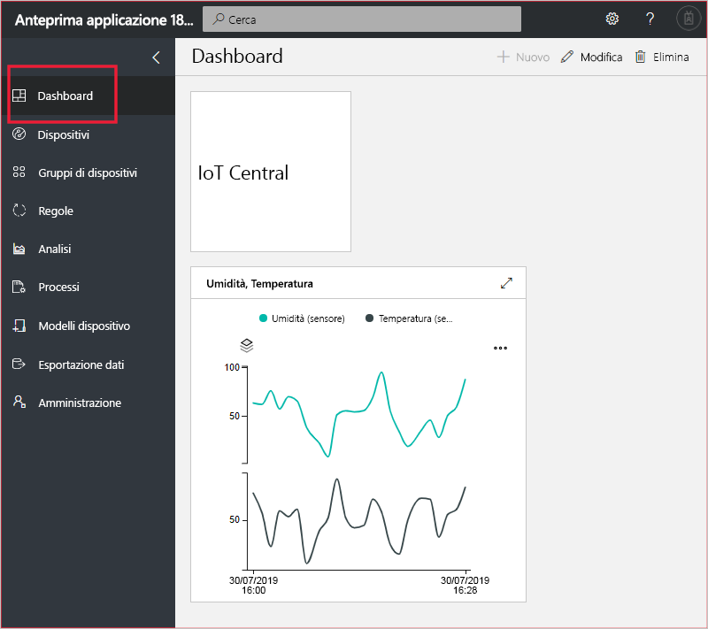

* Il dashboard è la prima pagina visualizzata quando si accede all'applicazione Azure IoT Central. I creatori possono personalizzare il dashboard dell'applicazione per altri utenti aggiungendo riquadri. Per altre informazioni, vedere l'esercitazione [Configurare un modello di dispositivo](tutorial-define-device-type-pnp.md?toc=/azure/iot-central-pnp/toc.json&bc=/azure/iot-central-pnp/breadcrumb/toc.json).

* Gli operatori possono creare dashboard personalizzati e spostarsi tra di essi e il dashboard predefinito. Per altre informazioni, vedere [Creare e gestire i dashboard personali](howto-personalize-dashboard.md?toc=/azure/iot-central-pnp/toc.json&bc=/azure/iot-central-pnp/breadcrumb/toc.json).

## Dispositivi

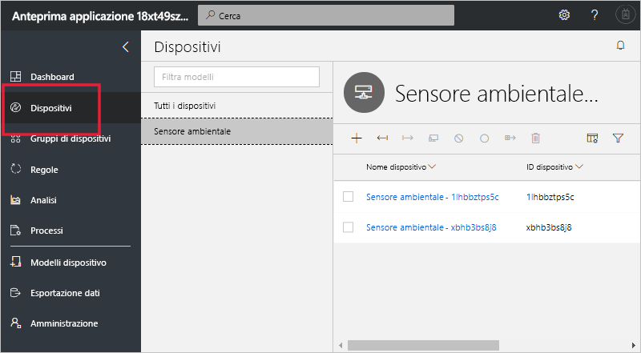

La pagina Explorer visualizza i _dispositivi_ presenti nell'applicazione Azure IoT Central raggruppati per _modello di dispositivo_.

* Un modello di dispositivo consente di definire un tipo di dispositivo in grado di connettersi all'applicazione. Per altre informazioni, vedere l'esercitazione sulla [definizione di un nuovo tipo di dispositivo nell'applicazione Azure IoT Central](tutorial-define-device-type-pnp.md?toc=/azure/iot-central-pnp/toc.json&bc=/azure/iot-central-pnp/breadcrumb/toc.json).
* Per dispositivo si intende un dispositivo simulato o reale presente nell'applicazione. Per altre informazioni, vedere l'esercitazione sull'[aggiunta di un nuovo dispositivo all'applicazione Azure IoT Central](tutorial-add-device-pnp.md?toc=/azure/iot-central-pnp/toc.json&bc=/azure/iot-central-pnp/breadcrumb/toc.json).

## Gruppi di dispositivi

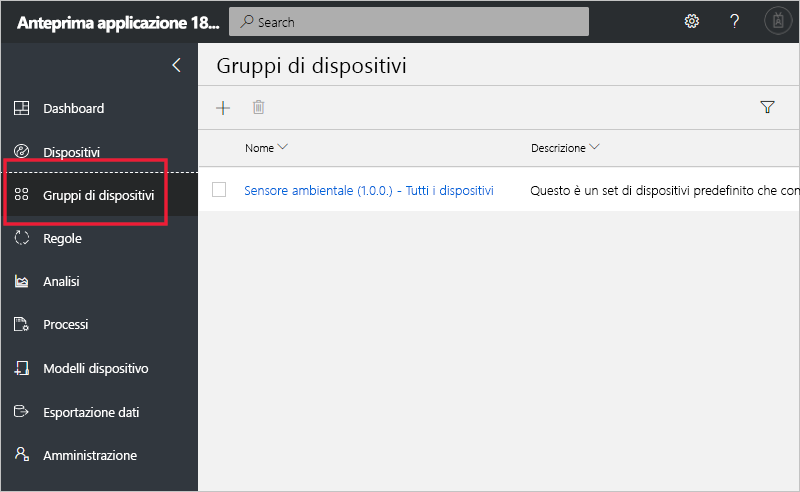

Nella pagina _Gruppi di dispositivi_ sono visualizzati i gruppi di dispositivi creati dal generatore. Per gruppo di dispositivi si intende una raccolta di dispositivi correlati. I generatori definiscono una query per identificare i dispositivi inclusi in un gruppo di dispositivi. I gruppi di dispositivi vengono usati durante la personalizzazione dell'analisi nell'applicazione. Per altre informazioni, vedere l'articolo [Usare gruppi di dispositivi nell'applicazione Azure IoT Central](howto-use-device-groups-pnp.md?toc=/azure/iot-central-pnp/toc.json&bc=/azure/iot-central-pnp/breadcrumb/toc.json).

## Regole

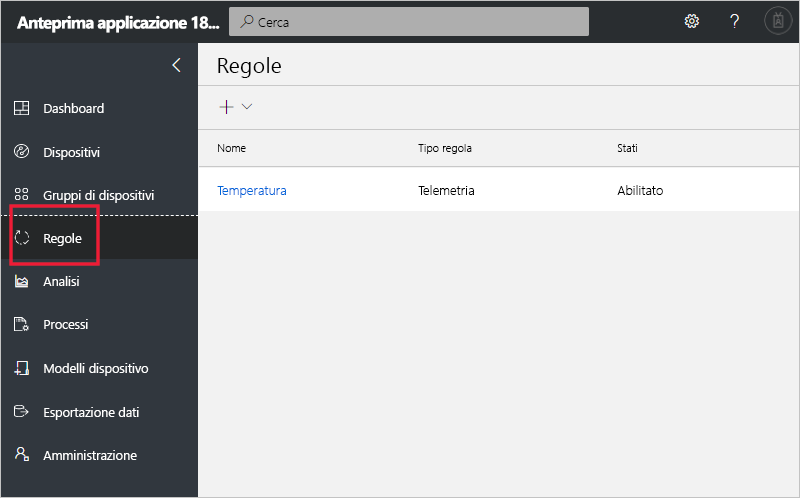

La pagina Regole consente di definire regole in base a dati di telemetria, stato del dispositivo o eventi del dispositivo. Quando viene attivata, una regola può attivare un'azione, ad esempio l'invio di un messaggio di posta elettronica a un operatore. Il generatore usa questa pagina per creare e gestire le regole. Per altre informazioni, vedere l'esercitazione [Configurare regole e azioni per il dispositivo in Azure IoT Central](tutorial-configure-rules-pnp.md?toc=/azure/iot-central-pnp/toc.json&bc=/azure/iot-central-pnp/breadcrumb/toc.json).

## Analytics

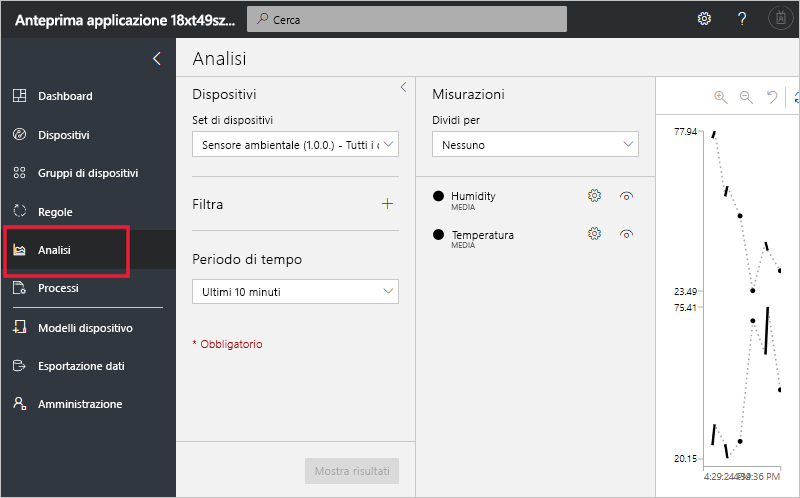

La pagina Analytics (Analisi) visualizza grafici che consentono di comprendere il comportamento dei dispositivi connessi all'applicazione. Gli operatori usano questa pagina per controllare e analizzare i problemi relativi ai dispositivi connessi. I generatori possono definire i grafici visualizzati in questa pagina. Per altre informazioni, vedere l'articolo sulla [creazione di analisi personalizzate per l'applicazione Azure IoT Central](howto-use-device-groups-pnp.md?toc=/azure/iot-central-pnp/toc.json&bc=/azure/iot-central-pnp/breadcrumb/toc.json).

## Processi

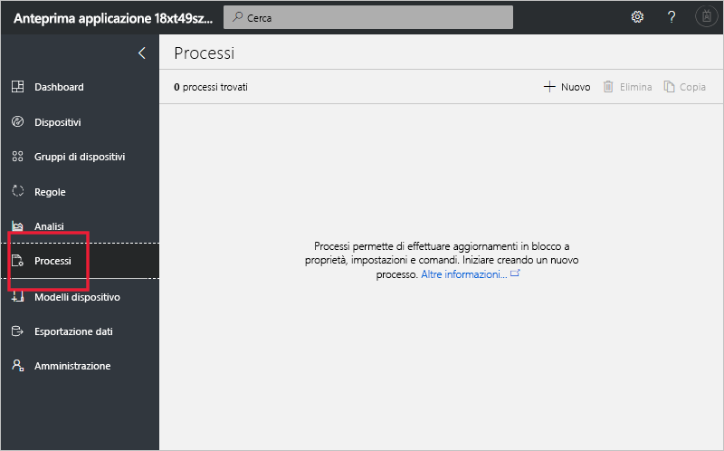

La pagina Processi consente di eseguire operazioni di gestione in blocco dei dispositivi nei propri dispositivi. Il generatore usa questa pagina per aggiornare le proprietà, le impostazioni e i comandi del dispositivo. Per altre informazioni, vedere l'articolo [Eseguire un processo](howto-run-a-job.md?toc=/azure/iot-central-pnp/toc.json&bc=/azure/iot-central-pnp/breadcrumb/toc.json).

## Modelli di dispositivo

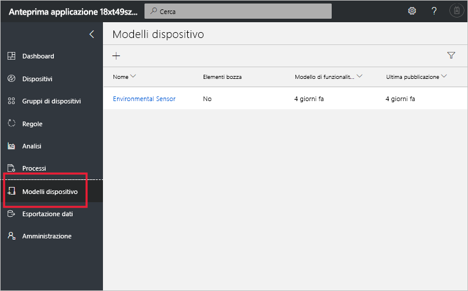

Questa pagina consente a un generatore di creare e gestire i modelli di dispositivo nell'applicazione. Un modello di dispositivo specifica le caratteristiche del dispositivo, come:

* Dati di telemetria, stato e misure di evento.
* Proprietà.
* Comandi.

Il generatore può anche creare moduli e dashboard utilizzabili dagli operatori per gestire i dispositivi.

Per altre informazioni, vedere l'esercitazione sulla [definizione di un nuovo tipo di dispositivo nell'applicazione Azure IoT Central](tutorial-define-device-type-pnp.md?toc=/azure/iot-central-pnp/toc.json&bc=/azure/iot-central-pnp/breadcrumb/toc.json).

## Esportazione dati

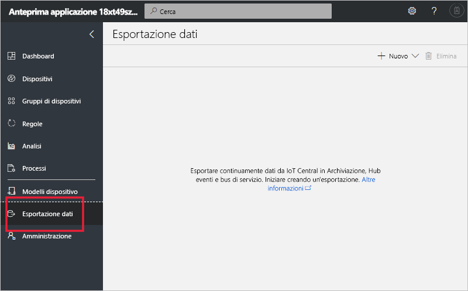

La pagina Esportazione dati consente a un amministratore di definire la modalità di esecuzione dello streaming dei dati, ad esempio di telemetria, dall'applicazione. I dati esportati possono essere archiviati in altri servizi o usati per l'analisi. Per altre informazioni, vedere l'articolo [Esportare i dati in Azure IoT Central](howto-export-data.md?toc=/azure/iot-central-pnp/toc.json&bc=/azure/iot-central-pnp/breadcrumb/toc.json).

## Administration

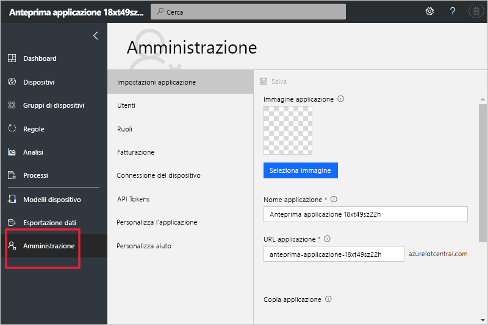

La pagina Administration (Amministrazione) contiene i collegamenti agli strumenti usati da un amministratore, ad esempio per definire utenti e ruoli nell'applicazione e personalizzare l'interfaccia utente. Per altre informazioni, vedere l'articolo sull'[amministrazione dell'applicazione Azure IoT Central](howto-administer-pnp.md?toc=/azure/iot-central-pnp/toc.json&bc=/azure/iot-central-pnp/breadcrumb/toc.json).

## Passaggi successivi

A questo punto, dopo aver letto la panoramica di Azure IoT Central e aver acquisito familiarità con il layout dell'interfaccia utente, i passaggi successivi consigliati consistono nel completare la guida introduttiva [Creare un'applicazione Azure IoT Central](quick-deploy-iot-central-pnp.md?toc=/azure/iot-central-pnp/toc.json&bc=/azure/iot-central-pnp/breadcrumb/toc.json).
