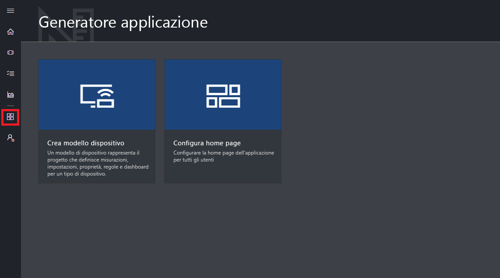

# Presentazione dell'interfaccia utente di Azure IoT Central

In questo articolo viene presentata l'interfaccia utente di Microsoft Azure IoT Central. È possibile usare l'interfaccia utente per creare, gestire e usare una soluzione Azure IoT Central e i relativi dispositivi connessi.

I _generatori_ usano l'interfaccia utente di Azure IoT Central per definire la soluzione Azure IoT Central. È possibile usare l'interfaccia utente per:

- Definire i tipi di dispositivo che si connettono alla soluzione.
- Configurare le regole e le azioni per i dispositivi.
- Personalizzare l'interfaccia utente per un _operatore_ che usa la soluzione.

Gli _operatori_ usano l'interfaccia utente di Azure IoT Central per gestire la soluzione Azure IoT Central. È possibile usare l'interfaccia utente per:

- Eseguire il monitoraggio dei dispositivi.
- Configurare i dispositivi.
- Risolvere e correggere i problemi relativi ai dispositivi.
- Eseguire il provisioning di nuovi dispositivi.

## Usare il menu di spostamento a sinistra

Usare il menu di spostamento a sinistra per accedere alle diverse aree dell'applicazione:

| Menu | DESCRIZIONE |
| ---- | ----------- |
|  | <ul><li>Il pulsante **Home** consente di visualizzare la home page dell'applicazione. I generatori possono personalizzare questa home page per gli operatori.</li><li>Il pulsante **Device Explorer** (Esplora dispositivi) consente di visualizzare un elenco dei modelli di dispositivo definiti nell'applicazione, nonché dei dispositivi simulati e reali associati a ogni modello di dispositivo. Gli operatori usano **Device Explorer** (Esplora dispositivi) per gestire i dispositivi connessi.</li><li>Il pulsante **Device Sets** (Set di dispositivi) consente di visualizzare e creare set di dispositivi. Gli operatori possono creare set di dispositivi come raccolta logica di dispositivi specificati da una query.</li><li>Il pulsante **Analytics** (Analisi) consente di visualizzare l'analisi derivata dai dati di telemetria dei dispositivi per dispositivi e set di dispositivi. Gli operatori possono creare visualizzazioni personalizzate basate sui dati dei dispositivi per derivare informazioni dettagliate dall'applicazione.</li><li>Il pulsante **Processi** abilita la gestione dei dispositivi in blocco consentendo di eseguire aggiornamenti su vasta scala tramite la creazione e l'esecuzione di processi.</li><li>Il pulsante **Application Builder** (Generatore applicazioni) consente di visualizzare gli strumenti usati da un generatore, ad esempio lo strumento **Create Device Template** (Crea modello di dispositivo).</li><li>Il pulsante **Administration** (Amministrazione) consente di visualizzare le pagine di amministrazione dell'applicazione in cui un amministratore può gestire impostazioni, utenti e ruoli.</li></ul> |

## Ricerca, guida e supporto tecnico

Il menu superiore viene visualizzato in ogni pagina:

- Per cercare modelli di dispositivo e dispositivi, scegliere l'icona **Search** (Cerca).
- Per accedere alla guida e al supporto tecnico, fare clic sul menu a discesa **Help** (Guida) per visualizzare un elenco di risorse.
- Per controllare le esercitazioni, modificare il tema dell'interfaccia utente o disconnettersi dall'applicazione, fare clic sull'icona **Account**.

È possibile scegliere tra un tema scuro o un tema chiaro per l'interfaccia utente:

## Home page

La home page è la prima pagina visualizzata quando si accede all'applicazione Azure IoT Central. Per personalizzare la home page per altri utenti dell'applicazione, i generatori possono aggiungere riquadri. Per altre informazioni, vedere l'esercitazione sulla [personalizzazione della visualizzazione operatore di Azure IoT Central](tutorial-customize-operator.md).

## Esplora dispositivi

La pagina Explorer visualizza i _modelli di dispositivo_ e i _dispositivi_ presenti nell'applicazione Azure IoT Central.

* Un modello di dispositivo consente di definire un tipo di dispositivo in grado di connettersi all'applicazione. Per altre informazioni, vedere l'esercitazione sulla [definizione di un nuovo tipo di dispositivo nell'applicazione Azure IoT Central](tutorial-define-device-type.md).
* Per dispositivo si intende un dispositivo simulato o reale presente nell'applicazione. Per altre informazioni, vedere l'esercitazione sull'[aggiunta di un nuovo dispositivo all'applicazione Azure IoT Central](tutorial-add-device.md).

## Device Set (Set di dispositivi)

La pagina _Device Sets_ (Set di dispositivi) visualizza i set di dispositivi creati dal generatore. Per set di dispositivi si intende una raccolta di dispositivi correlati. I generatori definiscono una query per identificare i dispositivi inclusi in un set di dispositivi. I set di dispositivi vengono usati durante la personalizzazione dell'analisi nell'applicazione. Per altre informazioni, vedere l'articolo sull'[uso di set di dispositivi nell'applicazione Azure IoT Central](howto-use-device-sets.md).

## Analytics

La pagina Analytics (Analisi) visualizza grafici che consentono di comprendere il comportamento dei dispositivi connessi all'applicazione. Gli operatori usano questa pagina per controllare e analizzare i problemi relativi ai dispositivi connessi. I generatori possono definire i grafici visualizzati in questa pagina. Per altre informazioni, vedere l'articolo sulla [creazione di analisi personalizzate per l'applicazione Azure IoT Central](howto-create-analytics.md).

## Processi

La pagina dei processi consente di eseguire operazioni di gestione in blocco per i dispositivi. Il generatore usa questa pagina per aggiornare le proprietà, le impostazioni e i comandi del dispositivo. Per altre informazioni, vedere l'articolo [Eseguire un processo](howto-run-a-job.md).

## Application Builder (Generatore applicazioni)

La pagina Application Builder (Generatore applicazioni) contiene i collegamenti agli strumenti usati dai generatori per creare un'applicazione Azure IoT Central, ad esempio per creare modelli di dispositivo e configurare la home page. Per altre informazioni, vedere l'esercitazione sulla [definizione di un nuovo tipo di dispositivo nell'applicazione Azure IoT Central](tutorial-define-device-type.md).

## Administration

La pagina Administration (Amministrazione) contiene i collegamenti agli strumenti usati da un amministratore, ad esempio per definire utenti e ruoli nell'applicazione. Per altre informazioni, vedere l'articolo sull'[amministrazione dell'applicazione Azure IoT Central](howto-administer.md).

## Passaggi successivi

A questo punto, dopo aver letto la panoramica di Azure IoT Central e aver acquisito familiarità con il layout dell'interfaccia utente, i passaggi successivi consigliati consistono nel completare la guida introduttiva [Creare un'applicazione Azure IoT Central](quick-deploy-iot-central.md).