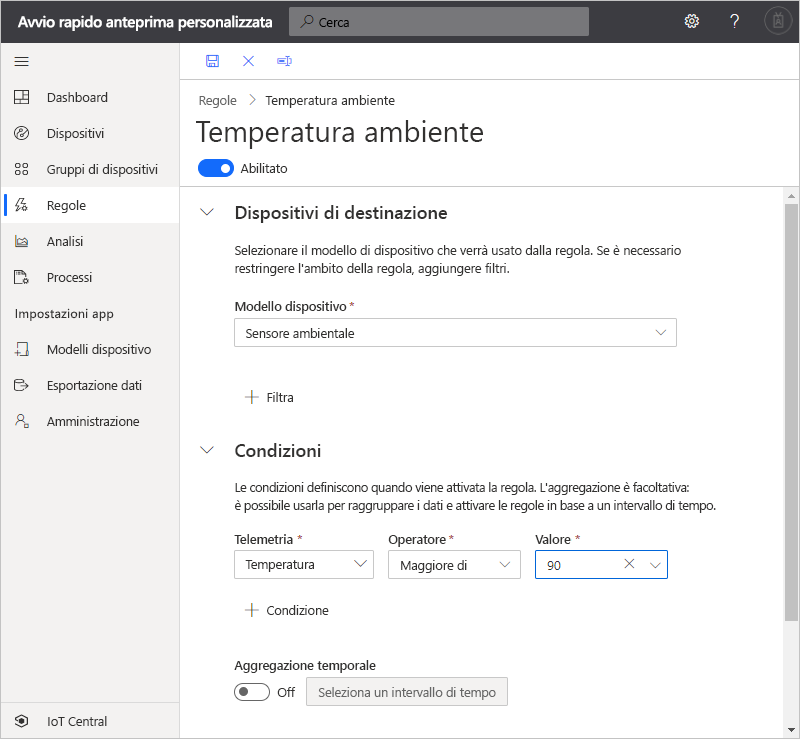
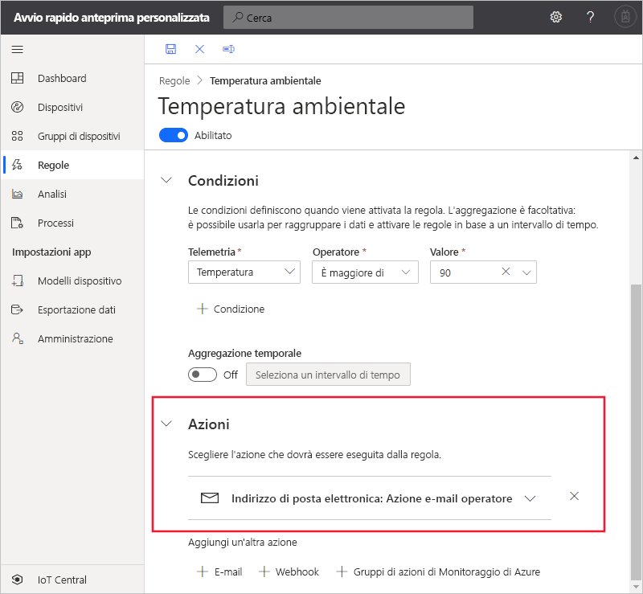

# Guida introduttiva: Configurare regole e azioni per il dispositivo in Azure IoT Central (funzionalità di anteprima)

*Questo articolo è rivolto a operatori, autori e amministratori.*

[!INCLUDE [iot-central-pnp-original](../../../includes/iot-central-pnp-original-note.md)]

In questo avvio rapido si crea una regola che invia un messaggio di posta elettronica quando la temperatura di un dispositivo di tipo sensore ambientale supera 90&deg;F (circa 32 °C).

## Prerequisiti

Prima di iniziare, è necessario completare i due avvii rapidi [Creare un'applicazione Azure IoT Central](./quick-deploy-iot-central.md) e [Aggiungere un dispositivo simulato a un'applicazione IoT Central](./quick-create-pnp-device.md) per creare il modello di dispositivo **Sensore ambientale** da usare.

## Creare una regola basata su dati di telemetria

1. Per aggiungere una nuova regola basata sui dati di telemetria all'applicazione, selezionare **Regole**.

1. Per creare una nuova regola, selezionare **+ Nuovo**.

1. Immettere **Temperatura ambiente** come nome della regola.

1. Nella sezione **Dispositivi di destinazione** selezionare **Sensore ambientale** come modello di dispositivo. Questa opzione filtra i dispositivi a cui si applica la regola per tipo di modello di dispositivo. È possibile aggiungere altri criteri di filtro mediante **+ Filtro**.

1. Nella sezione **Condizioni** definire ciò che attiva la regola. Usare le informazioni seguenti per definire una condizione basata su dati di telemetria relativi alla temperatura:

    | Campo                                        | Valore                             |
    | -------------------------------------------- | ------------------------------    |
    | Misura                                  | Temperatura                       |
    | Operatore                                     | è maggiore di                   |
    | Valore                                        | 90                                |

    Per aggiungere altre condizioni, selezionare **+ Condizione**.

    

1. Per aggiungere un'azione di posta elettronica da eseguire quando la regola viene attivata, selezionare **+ Posta elettronica**.

1. Usare le informazioni nella tabella seguente per definire l'azione:

    | Impostazione   | Valore                                             |
    | --------- | ------------------------------------------------- |
    | Nome visualizzato | Azione di posta elettronica dell'operatore                          |
    | A        | Indirizzo di posta elettronica                                |
    | Note     | La temperatura ambiente ha superato la soglia. |

    > [!NOTE]
    > Per ricevere una notifica, l'indirizzo di posta elettronica deve essere un [ID utente nell'applicazione](howto-administer.md) e tale utente deve aver eseguito almeno una volta l'accesso all'applicazione.

    

1. Selezionare **Salva**. La regola è elencata nella pagina **Regole**.

## Testare la regola

Subito dopo aver salvato la regola, questa viene applicata. Quando vengono soddisfatte le condizioni definite nella regola, l'applicazione invia un messaggio all'indirizzo di posta elettronica specificato nell'azione.

> [!NOTE]
> Al termine del test, disattivare la regola per smettere di ricevere gli avvisi nella posta in arrivo.

## Passaggi successivi

In questa guida introduttiva si è appreso come:

* Creare una regola basata su dati di telemetria
* Aggiungere un'azione

Per altre informazioni sul monitoraggio dei dispositivi connessi all'applicazione, continuare con l'avvio rapido:

> [!div class="nextstepaction"]
> [Usare Azure IoT Central per monitorare i dispositivi](quick-monitor-devices.md).
