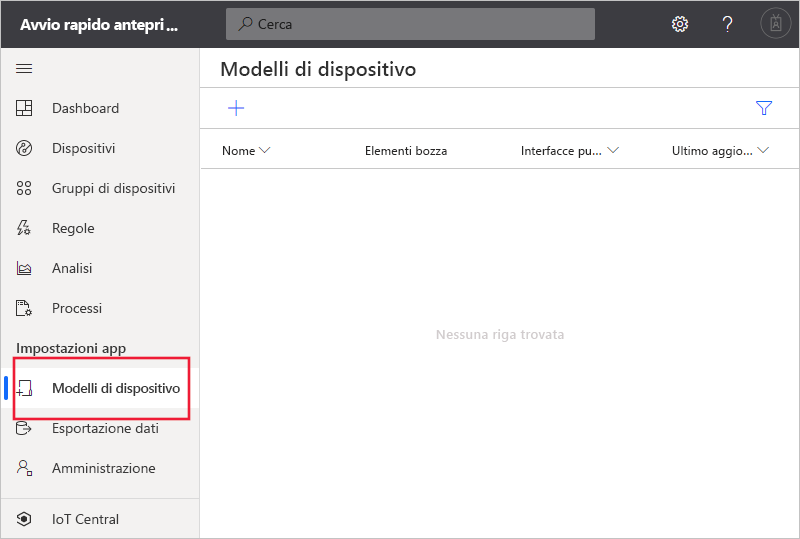
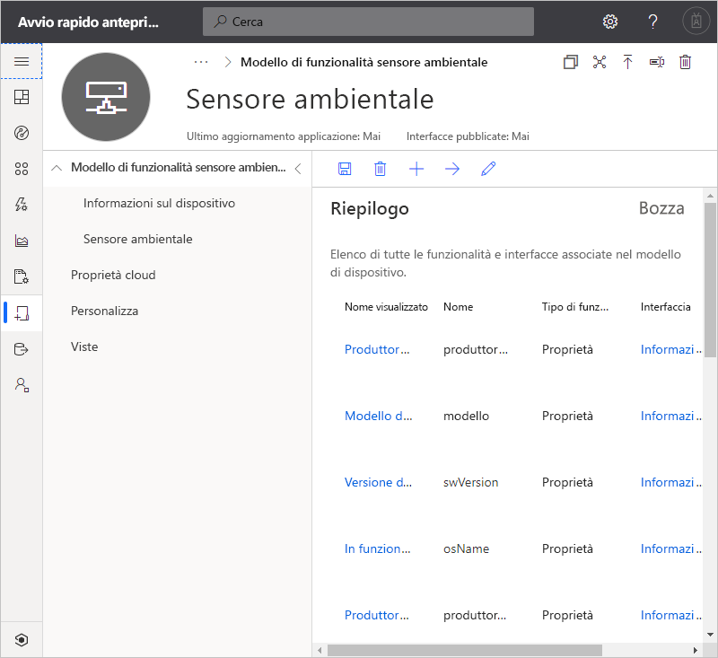
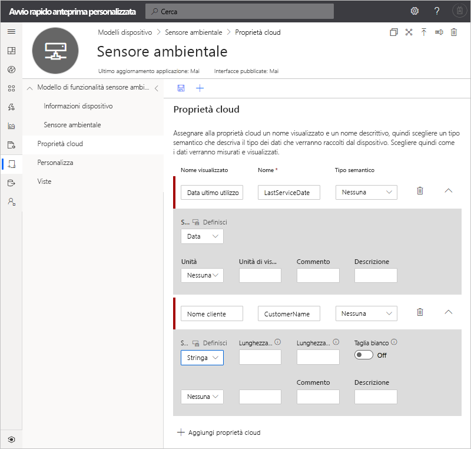
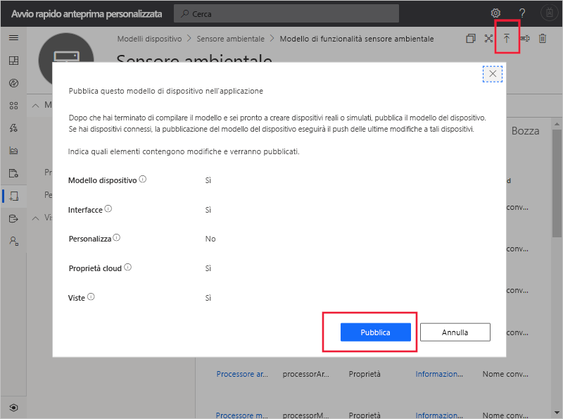
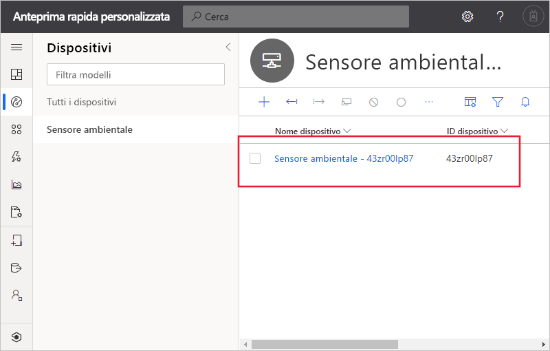
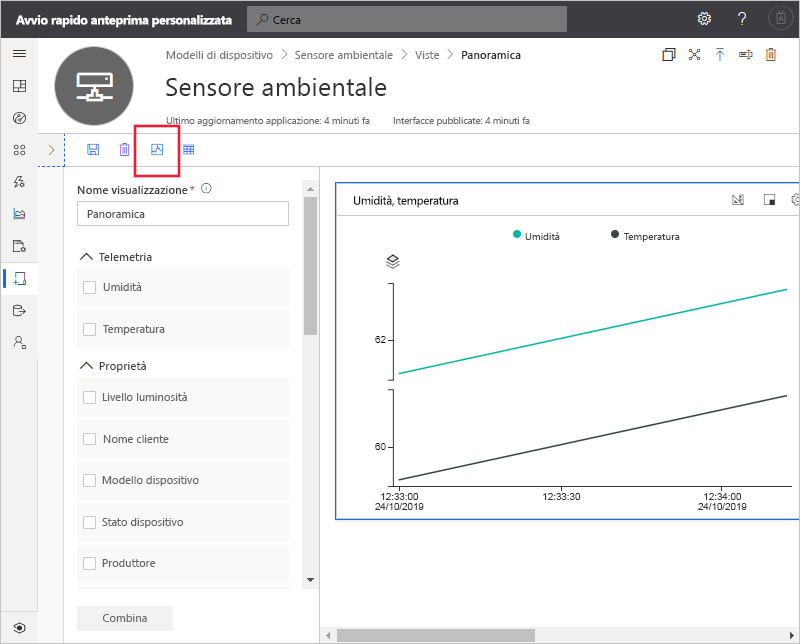

# Guida introduttiva: Aggiungere un dispositivo simulato all'applicazione IoT Central (funzionalità di anteprima)

*Questo articolo è rivolto a operatori, autori e amministratori.*

[!INCLUDE [iot-central-pnp-original](../../../includes/iot-central-pnp-original-note.md)]

Un modello di dispositivo definisce le funzionalità di un dispositivo che si connette all'applicazione IoT Central. Le funzionalità includono i dati di telemetria inviati dal dispositivo, le proprietà del dispositivo e i comandi a cui un dispositivo risponde. Da un modello di dispositivo, un creatore o un operatore può aggiungere dispositivi reali e simulati a un'applicazione. I dispositivi simulati sono utili per testare il comportamento dell'applicazione IoT Central prima di connettere dispositivi reali.

In questo avvio rapido viene creato un modello di dispositivo **Sensore ambientale** e viene aggiunto un dispositivo simulato. Un dispositivo di tipo sensore ambientale:

* Invia dati di telemetria, ad esempio la temperatura.
* Segnala le proprietà specifiche del dispositivo, ad esempio il livello di luminosità.
* Risponde a comandi quali l'attivazione e la disattivazione.
* Segnala le proprietà generiche del dispositivo, ad esempio la versione del firmware e il numero di serie.

## Prerequisiti

Completare l'avvio rapido [Creare un'applicazione Azure IoT Central (funzionalità di anteprima)](./quick-deploy-iot-central.md) per creare un'applicazione IoT Central usando il modello **App personalizzata > Anteprima applicazione**.

È anche necessaria una copia locale del file **EnvironmentalSensorInline.capabilitymodel.json** che contiene il modello di funzionalità di dispositivo [Plug and Play IoT](../../iot-pnp/overview-iot-plug-and-play.md). È possibile scaricarlo [qui](https://raw.githubusercontent.com/Azure/IoTPlugandPlay/master/samples/EnvironmentalSensorInline.capabilitymodel.json). Fare clic con il pulsante destro del mouse sulla pagina e scegliere **Salva con nome**.

Dopo aver scaricato il file, aprirlo in un editor di testo e sostituire le due istanze di `<YOUR_COMPANY_NAME_HERE>` con il proprio nome. Usare solo i caratteri a-z, A-Z, 0-9 e il carattere di sottolineatura.

## Creare un modello

L'utente creatore può creare e modificare i modelli di dispositivo nell'applicazione. Dopo la pubblicazione di un modello di dispositivo, è possibile generare un dispositivo simulato o connettere dispositivi reali che implementano il modello di dispositivo. I dispositivi simulati consentono di testare il comportamento dell'applicazione prima di collegare un dispositivo reale.

Per aggiungere un nuovo modello di dispositivo all'applicazione, passare alla pagina **Modelli di dispositivo**. A tale scopo, selezionare la scheda **Modelli di dispositivo** nel riquadro sinistro.

### Aggiungere un modello di funzionalità di dispositivo

Ci sono diverse opzioni per la creazione di un modello di funzionalità di dispositivo in IoT Central. È possibile scegliere di creare un modello personalizzato da zero, eseguire l'importazione da un file, selezionare in un catalogo di dispositivi o connettere un dispositivo Plug and Play IoT tramite una connessione del dispositivo, in cui il modello di funzionalità di dispositivo è stato pubblicato nel repository pubblico. In questa esercitazione si importa un modello di funzionalità di dispositivo da un file.

La procedura seguente illustra come importare il modello di funzionalità per un dispositivo di tipo **sensore ambientale**. Questi dispositivi inviano dati di telemetria, ad esempio la temperatura, all'applicazione:

1. Per aggiungere un nuovo modello di dispositivo, selezionare **+** nella pagina **Modelli di dispositivo**.

1. Scegliere **Dispositivo IoT** nell'elenco dei modelli di dispositivo personalizzati e selezionare **Avanti: Personalizza**, quindi **Avanti: Verifica** e infine **Crea**.

1. Immettere **Sensore ambientale** come nome per il modello di dispositivo.

1. Scegliere **Importa modello di funzionalità** per creare un nuovo modello di funzionalità di dispositivo da un file JSON. Passare alla cartella in cui è stato salvato il file **EnvironmentalSensorInline.capabilitymodel.json** nel computer locale. Selezionare il file **EnvironmentalSensorInline.capabilitymodel.json** e quindi **Apri**. Il modello di funzionalità del sensore ambientale include le interfacce **Sensore ambientale** e **Informazioni dispositivo**:

    

    Queste interfacce definiscono le funzionalità di un dispositivo di tipo **sensore ambientale**. Le funzionalità includono i dati di telemetria inviati dal dispositivo, le proprietà segnalate dal dispositivo e i comandi a cui un dispositivo risponde.

### Aggiungere proprietà cloud

Un modello di dispositivo può includere proprietà cloud. Le proprietà cloud esistono solo nell'applicazione IoT Central e non vengono mai inviate a o ricevute da un dispositivo.

1. Selezionare **Proprietà cloud** e quindi **+ Aggiungi proprietà cloud**. Usare le informazioni nella tabella seguente per aggiungere proprietà cloud al modello di dispositivo.

    | Nome visualizzato      | Tipo semantico | SCHEMA |
    | ----------------- | ------------- | ------ |
    | Data ultimo utilizzo | Nessuna          | Data   |
    | Nome del cliente     | Nessuna          | string |

1. Fare clic su **Salva** per salvare le modifiche:

    

## Creare viste

Il creatore può personalizzare un'applicazione in modo da visualizzare le informazioni sul dispositivo sensore ambientale utili all'operatore. Le personalizzazioni consentono all'operatore di gestire i sensori ambientali connessi all'applicazione. È possibile creare due tipi di visualizzazioni che un operatore può usare per interagire con i dispositivi:

* Moduli per visualizzare e modificare le proprietà del dispositivo e cloud.
* Dashboard per visualizzare i dispositivi.

### Generare le visualizzazioni predefinite

La generazione di visualizzazioni predefinite è un modo rapido per iniziare a visualizzare le informazioni importanti sul dispositivo. Per il modello di dispositivo possono essere generate fino a tre visualizzazioni predefinite:

* La visualizzazione **Comandi** consente all'operatore di inviare comandi al dispositivo.
* La visualizzazione **Panoramica** usa grafici e metriche per visualizzare i dati di telemetria del dispositivo.
* La visualizzazione **Informazioni** mostra le proprietà del dispositivo.

Selezionare **Visualizzazioni** e quindi **Genera visualizzazioni predefinite**.

### Configurare una visualizzazione per visualizzare i dispositivi

Un dashboard del dispositivo consente a un operatore di visualizzare un dispositivo usando grafici e metriche. I creatori possono definire le informazioni visualizzate sul dashboard di un dispositivo. È possibile definire più dashboard per i dispositivi. Per creare un dashboard per visualizzare i dati di telemetria del sensore ambientale, selezionare **Visualizzazioni** e quindi **Visualizzazione del dispositivo**:

1. Le proprietà del dispositivo, le proprietà cloud, le opzioni statiche e i dati di telemetria sono elencati in **Proprietà**. È possibile trascinare e rilasciare questi elementi nella visualizzazione. Trascinare la proprietà **Brightness Level** (Livello luminosità) nella visualizzazione. È possibile configurare il riquadro usando l'icona a forma di ingranaggio.

1. Per aggiungere un grafico che traccia i dati di telemetria, selezionare **Umidità** e **Temperatura** e quindi selezionare **Combina**. Per visualizzare questo grafico in un formato diverso, ad esempio come grafico a torta o grafico a barre, selezionare il pulsante **Modifica visualizzazione** nella parte superiore del riquadro.

1. Fare clic su **Salva** per salvare la visualizzazione:

È possibile aggiungere altri riquadri che mostrano proprietà o valori di telemetria diversi. È anche possibile aggiungere testo statico, collegamenti e immagini. Per spostare o ridimensionare un riquadro nel dashboard, spostare il puntatore del mouse sul riquadro e trascinare il riquadro in una nuova posizione o ridimensionarlo.

### Aggiungere un modulo di dispositivo

Un modulo di dispositivo consente a un operatore di modificare le proprietà del dispositivo scrivibili e le proprietà cloud. Il creatore può definire più moduli e scegliere le proprietà del dispositivo e cloud da visualizzare in ogni modulo. È anche possibile visualizzare le proprietà del dispositivo di sola lettura in un modulo.

Per creare un modulo per la visualizzazione e la modifica delle proprietà del sensore ambientale:

1. Passare a **Viste** nel modello **Sensore ambientale**. Selezionare il riquadro **Modifica dei dati del dispositivo e del cloud** per aggiungere una nuova vista.

1. Immettere il nome di modulo **Proprietà sensore ambientale**.

1. Trascinare le proprietà cloud **Nome cliente** e **Data ultima assistenza** nella sezione esistente del modulo.

1. Selezionare le proprietà del dispositivo **Brightness Level** (Livello luminosità) e **Stato dispositivo**. Selezionare quindi **Aggiungi sezione**. Modificare il titolo della sezione in **Proprietà sensore**. Selezionare **Applica**.

1. Selezionare le proprietà del dispositivo **Modello del dispositivo**, **Versione del software**, **Produttore** e **Produttore processore**. Selezionare quindi **Aggiungi sezione**. Modificare il titolo della sezione in **Proprietà dispositivo**. Selezionare **Applica**.

1. Fare clic su **Salva** per salvare la visualizzazione.

## Pubblicare il modello di dispositivo

Prima di poter creare un sensore ambientale simulato o di connettere un sensore ambientale reale, è necessario pubblicare il modello di dispositivo.

Per pubblicare un modello di dispositivo:

1. Passare al modello di dispositivo dalla pagina **Modelli di dispositivo**.

1. Selezionare **Pubblica**.

1. Nella finestra di dialogo **Publish a Device Template** (Pubblica un modello di dispositivo) scegliere **Pubblica**:

    

Dopo la pubblicazione, un modello di dispositivo viene visualizzato nella pagina **Dispositivi** ed è visibile all'operatore. In un modello di dispositivo pubblicato non è possibile modificare un modello di funzionalità di dispositivo senza creare una nuova versione. È tuttavia possibile apportare aggiornamenti a proprietà cloud, personalizzazioni e visualizzazioni in un modello di dispositivo pubblicato senza creare una nuova versione. Dopo aver apportato le modifiche, selezionare **Pubblica** per eseguire il push delle modifiche all'operatore.

## Aggiungere un dispositivo simulato

Per aggiungere un dispositivo simulato all'applicazione, usare il modello di dispositivo **Sensore ambientale** creato.

1. Per aggiungere un nuovo dispositivo in qualità di operatore, scegliere **Dispositivi** nel riquadro di sinistra. La scheda **Dispositivi** include l'opzione **Tutti i dispositivi** e il modello di dispositivo **Sensore ambientale**. Selezionare **Sensore ambientale**.

1. Per aggiungere un dispositivo di tipo sensore ambientale simulato, selezionare **+ Nuovo**. Usare il valore di **ID dispositivo** suggerito o immettere un **ID dispositivo** personalizzato in lettere minuscole. È anche possibile immettere un nome per il nuovo dispositivo. Impostare l'interruttore **Simulato** su **Sì** e quindi selezionare **Crea**.

    

È ora possibile interagire con le visualizzazioni create per il modello di dispositivo usando dati simulati.

## Usare un dispositivo simulato per migliorare le visualizzazioni

Dopo aver creato un nuovo dispositivo simulato, il creatore può usare questo dispositivo per continuare a migliorare e arricchire le visualizzazioni per il modello di dispositivo.

1. Scegliere **Modelli di dispositivo** nel riquadro sinistro e selezionare il modello **Sensore ambientale**.

1. Selezionare la visualizzazione che si vuole modificare o creare una nuova visualizzazione. Fare clic su **Configura dispositivo in anteprima**, quindi **Seleziona da un dispositivo in esecuzione**. Qui è possibile scegliere di non creare un dispositivo di anteprima, di usare un dispositivo reale che è possibile configurare per i test oppure di usare un dispositivo esistente aggiunto in IoT Central.

1. Scegliere il dispositivo simulato nell'elenco. Selezionare **Applica**. È ora possibile visualizzare lo stesso dispositivo simulato nell'esperienza di creazione di visualizzazioni dei modelli di dispositivo. Questa visualizzazione è utile per i grafici e altri elementi visivi.

    

## Passaggi successivi

In questo avvio rapido è stato creato un modello di dispositivo **Sensore ambientale** e aggiunto un dispositivo simulato all'applicazione.

Per altre informazioni sul monitoraggio dei dispositivi connessi all'applicazione, continuare con l'avvio rapido:

> [!div class="nextstepaction"]
> [Configurare regole e azioni](./quick-configure-rules.md)
