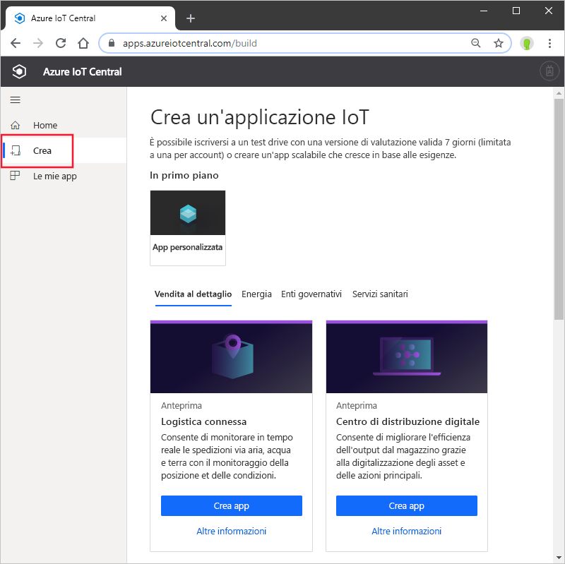
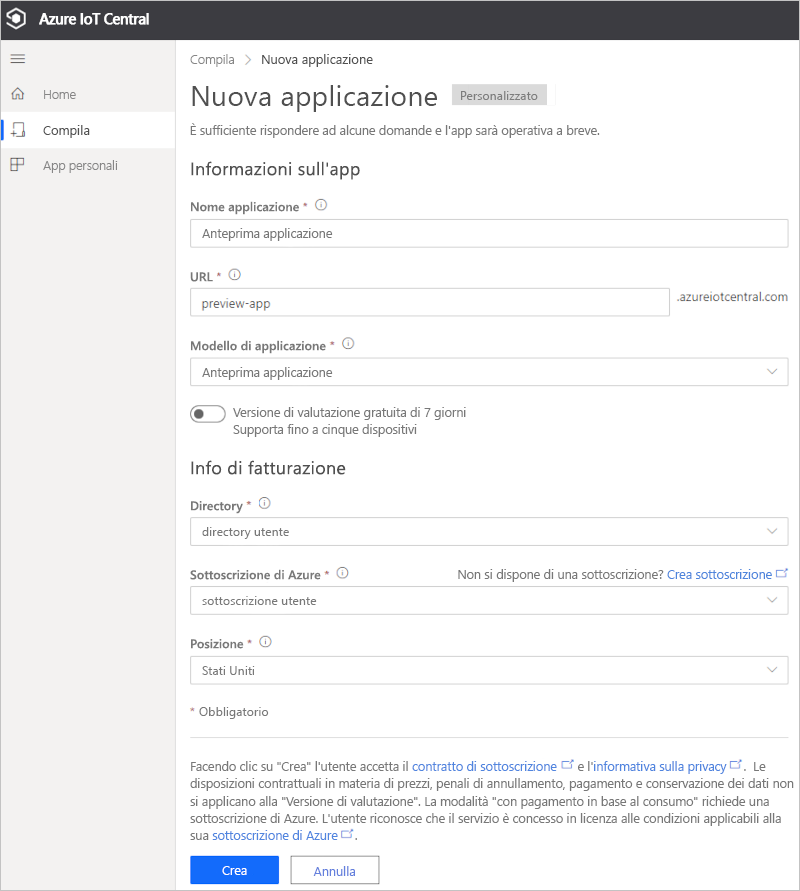

# Creare un'applicazione Azure IoT Central (funzionalità di anteprima)

[!INCLUDE [iot-central-pnp-original](../../../includes/iot-central-pnp-original-note.md)]

Questo avvio rapido illustra come creare un'applicazione Azure IoT Central che contiene funzionalità di anteprima, come Plug and Play IoT.

> [!WARNING]
> Le funzionalità Plug and Play IoT incluse in Azure IoT Central sono attualmente disponibili in anteprima pubblica. Non usare per i carichi di lavoro di produzione un'applicazione IoT Central abilitata per Plug and Play IoT. Per gli ambienti di produzione usare un'applicazione IoT Central creata da un modello di applicazione corrente e disponibile a livello generale.

## Creare un'applicazione

Passare al sito per la [creazione di app Azure IoT Central](https://aka.ms/iotcentral). Eseguire quindi l'accesso con un account Microsoft personale, aziendale o dell'istituto di istruzione.

Creare una nuova applicazione dall'elenco di modelli di IoT Central pertinenti per il settore per iniziare rapidamente oppure partire da zero usando il modello **App personalizzata**.

Per creare una nuova applicazione Azure IoT Central:

1. Per creare una nuova applicazione Azure IoT Central da un *modello di settore*, selezionare un modello di applicazione dall'elenco dei modelli disponibili in uno dei settori. È anche possibile iniziare da zero scegliendo *App personalizzata*.
1. Azure IoT Central suggerisce automaticamente il **nome di un'applicazione** in base al modello di applicazione selezionato. È possibile usare questo nome oppure immettere un nome descrittivo per l'applicazione.
1. Azure IoT Central genera anche un prefisso **URL di applicazione** univoco in base al nome dell'applicazione. Questo URL viene usato per accedere all'applicazione. È possibile modificare questo prefisso URL in modo da renderlo più facile da ricordare.

    

    > [!NOTE]
    > Se si usa il modello App personalizzata, verrà visualizzato il campo a discesa **Modello di applicazione**. Da qui è possibile passare dall'anteprima ai modelli disponibili a livello generale e viceversa. Potrebbero essere visualizzati anche altri modelli resi disponibili per l'organizzazione.

1. Scegliere se si intende creare l'applicazione usando una versione di valutazione gratuita di 7 giorni oppure una sottoscrizione con pagamento in base al consumo.
    - Le applicazioni con **versione di valutazione** sono gratuite per sette giorni e supportano fino a cinque dispositivi. Possono essere convertite in applicazioni con pagamento in base al consumo in qualsiasi momento prima della scadenza. Se si crea un'applicazione con versione di valutazione, è necessario immettere le informazioni sul contatto e scegliere se ricevere informazioni e suggerimenti da Microsoft.
    - Le applicazioni **con pagamento in base al consumo** prevedono un addebito per dispositivo, con i primi cinque dispositivi offerti gratuitamente. Altre informazioni sui [prezzi di IoT Central](https://aka.ms/iotcentral-pricing). Se si crea un'applicazione con pagamento in base al consumo, è necessario selezionare una *directory*, una *sottoscrizione di Azure* e un'*area*:
        - La *directory* è l'istanza di Azure Active Directory (AD) in cui creare l'applicazione. Un'istanza di Azure AD contiene le identità degli utenti, le credenziali e altre informazioni sull'organizzazione. Se non si ha un'istanza di Azure AD, ne viene creata una automaticamente quando si crea una sottoscrizione di Azure.
        - Una *sottoscrizione di Azure* consente di creare istanze dei servizi di Azure. IoT Central effettua il provisioning delle risorse nella sottoscrizione. Se non si ha una sottoscrizione di Azure, è possibile crearne una nella [pagina di iscrizione ad Azure](https://aka.ms/createazuresubscription). Dopo aver creato la sottoscrizione di Azure, passare alla pagina **Create Application** (Crea applicazione). La nuova sottoscrizione viene visualizzata nella casella di riepilogo a discesa **Sottoscrizione di Azure**.
        - L'*area* è la posizione fisica in cui verranno archiviati i dati dei dispositivi. Per ottenere prestazioni ottimali e per garantire la conformità della sovranità dei dati, in genere è consigliabile scegliere l'area fisicamente più vicina ai dispositivi. Dopo aver scelto un'area, non è possibile spostare l'applicazione in un'altra area geografica in un secondo momento.

        > [!NOTE]
        > Durante l'anteprima pubblica, le uniche aree disponibili per le **applicazioni in anteprima** sono **Europa settentrionale** e **Stati Uniti centrali**.

1. Esaminare i termini e le condizioni e selezionare **Crea** nella parte inferiore della pagina.

## Passaggi successivi

In questa guida introduttiva è stata creata un'applicazione IoT Central. Ecco il passaggio successivo suggerito:

> [!div class="nextstepaction"]
> [Aggiungere un dispositivo simulato all'applicazione Azure IoT Central](./quick-create-pnp-device.md)
