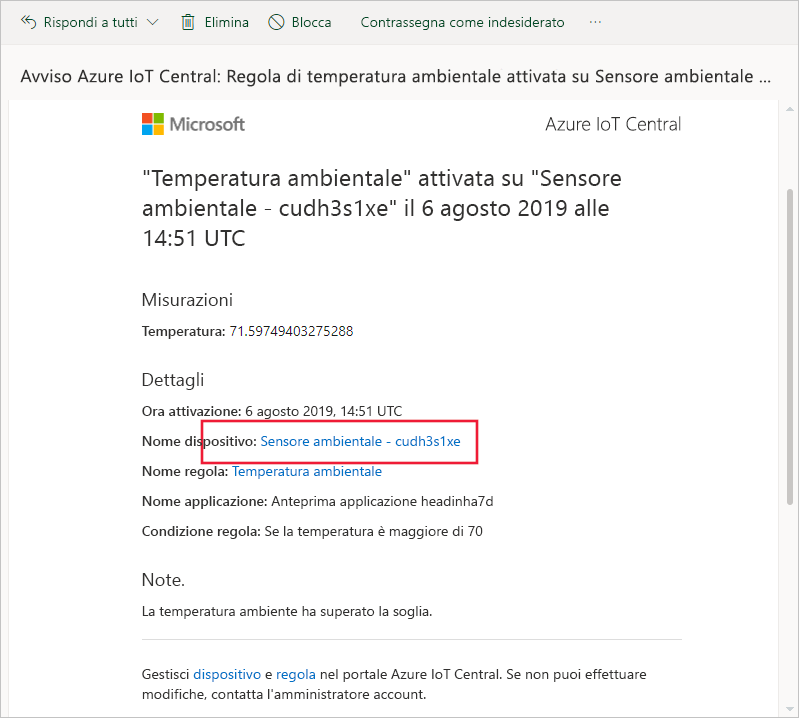
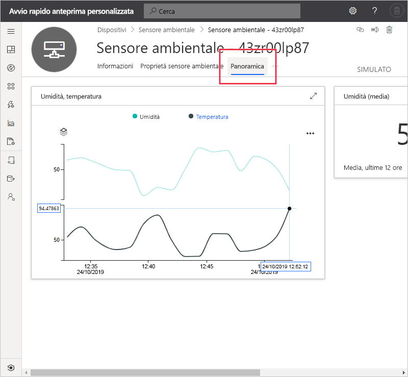
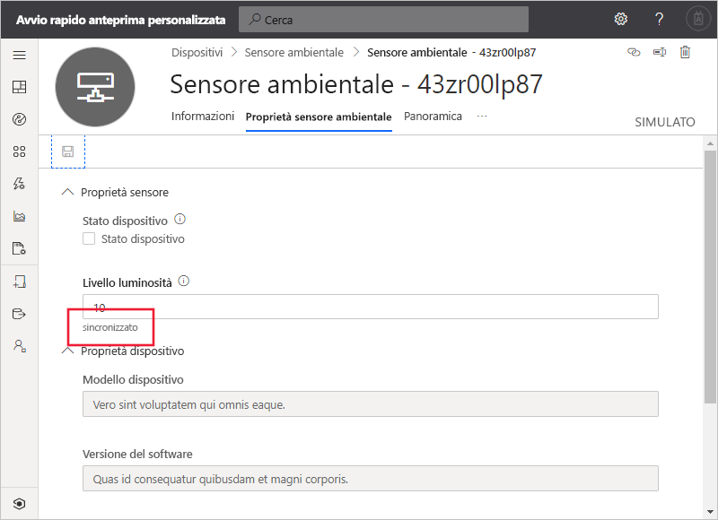

# Guida introduttiva: Usare Azure IoT Central per monitorare i dispositivi (funzionalità di anteprima)

*Questo articolo è rivolto a operatori, autori e amministratori.*

[!INCLUDE [iot-central-pnp-original](../../../includes/iot-central-pnp-original-note.md)]

Questo avvio rapido illustra come un operatore può usare l'applicazione Microsoft Azure IoT Central per monitorare i dispositivi e modificare le impostazioni.

## Prerequisiti

Prima di iniziare, è opportuno completare i tre avvii rapidi precedenti [Creare un'applicazione Azure IoT Central](./quick-deploy-iot-central.md), [Aggiungere un dispositivo simulato a un'applicazione IoT Central](./quick-create-pnp-device.md) e [Configurare le regole e le azioni per il dispositivo](quick-configure-rules.md).

## Ricevere una notifica

Azure IoT Central invia le notifiche sui dispositivi come messaggi di posta elettronica. Il creatore ha aggiunto una regola che prevede l'invio di una notifica quando la temperatura in un dispositivo con sensore ambientale connesso supera una determinata soglia. Controllare i messaggi di posta elettronica inviati all'account scelto dal generatore per la ricezione delle notifiche.

Aprire il messaggio di posta elettronica ricevuto al termine dell'avvio rapido [Configurare le regole e le azioni per il dispositivo](quick-configure-rules.md). Nel messaggio di posta elettronica selezionare il collegamento al dispositivo:

Nel browser viene aperta la visualizzazione **Dashboard** per il dispositivo simulato con sensore ambientale creato negli avvii rapidi precedenti:

## Ricercare la causa di un problema

Un operatore può visualizzare le informazioni sul dispositivo nelle pagine **Informazioni generali**, **Proprietà sensore ambientale** e **Comandi**. Il creatore ha personalizzato le pagine **Dashboard** e **Proprietà sensore ambientale** in modo da visualizzare informazioni importanti relative a un dispositivo di tipo sensore ambientale connesso.

Scegliere la visualizzazione **Informazioni generali** per vedere le informazioni sul dispositivo.

Il grafico del dashboard mostra il tracciato della temperatura del dispositivo. Si decide che la temperatura del dispositivo è troppo alta.

## Correggere un problema

Per apportare una modifica al dispositivo, usare la pagina **Proprietà sensore ambientale**.

Scegliere **Proprietà sensore ambientale**. Modificare **Brightness Level** (Livello luminosità) impostandolo su 10. Scegliere **Salva** per aggiornare il dispositivo. Quando il dispositivo conferma la modifica delle impostazioni, lo stato della proprietà cambia in **sincronizzato**:

## Passaggi successivi

In questa guida introduttiva si è appreso come:

* Ricevere una notifica
* Ricercare la causa di un problema
* Correggere un problema

Ora che si sa come monitorare il dispositivo, il passaggio successivo consigliato è il seguente:

> [!div class="nextstepaction"]
> [Creare e gestire un modello di dispositivo](howto-set-up-template.md).
