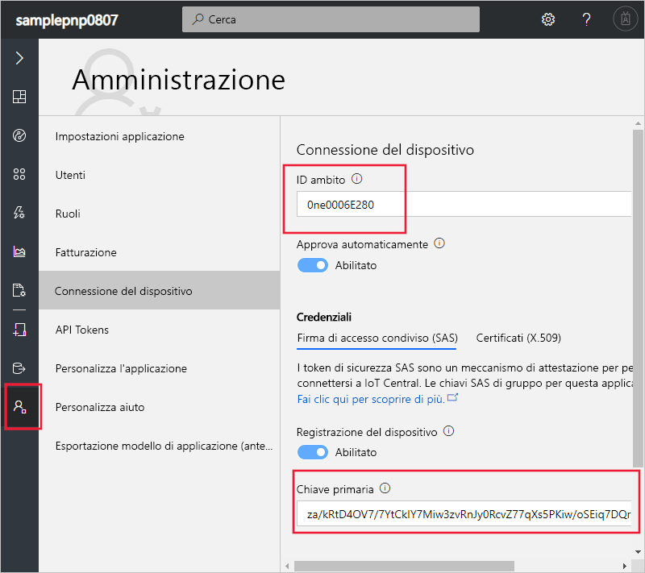
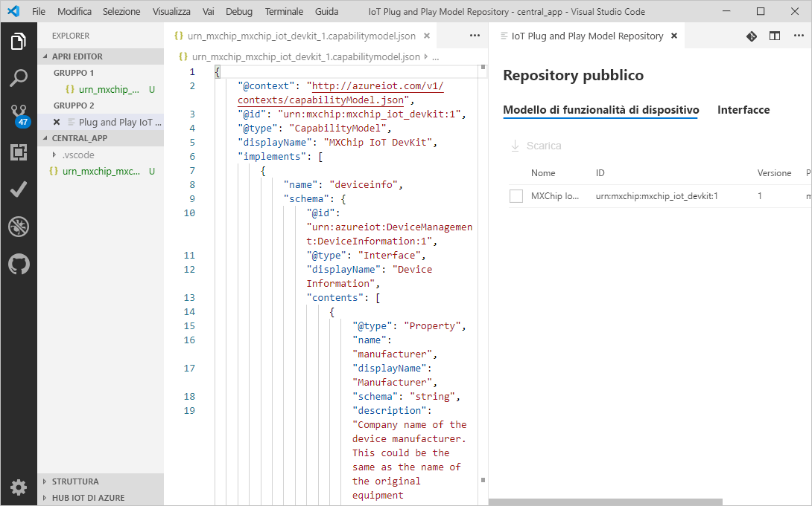
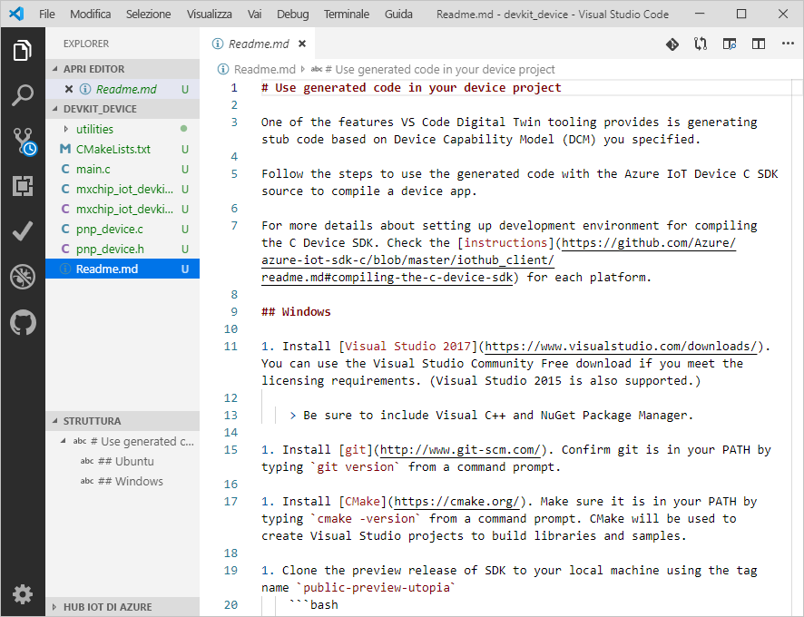
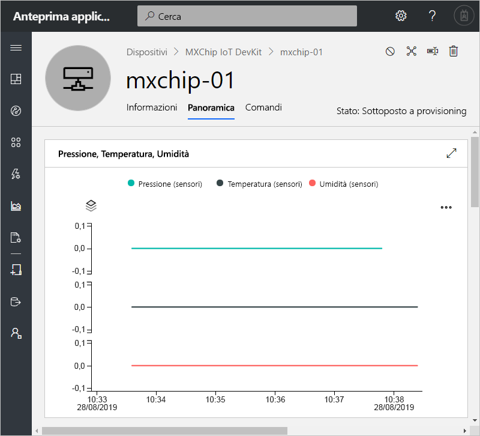
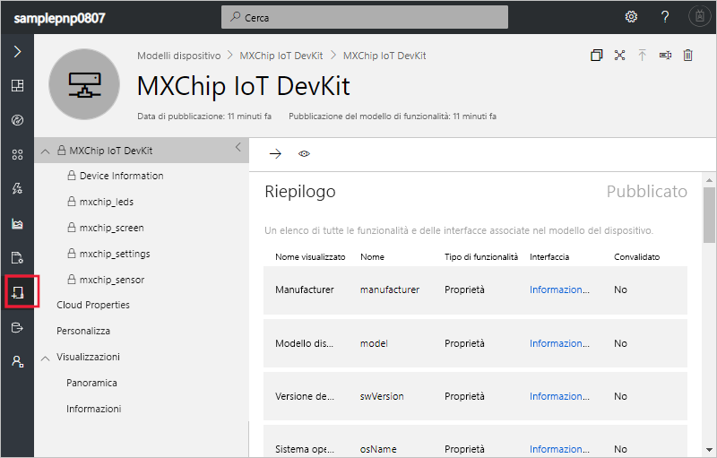

# <a name="quickstart-use-a-device-capability-model-to-create-an-iot-plug-and-play-device-and-connect-it-to-your-iot-central-application"></a>Guida introduttiva: Usare un modello di funzionalità di dispositivo per creare un dispositivo Plug and Play IoT e connetterlo all'applicazione IoT Central

[!INCLUDE [iot-central-pnp-original](../../includes/iot-central-pnp-original-note.md)]

Un _modello di funzionalità di dispositivo_ descrive le funzionalità di un dispositivo [Plug and Play IoT](../iot-pnp/overview-iot-plug-and-play.md). IoT Central può usare un modello di funzionalità di dispositivo per creare un modello e le visualizzazioni per un dispositivo alla prima connessione del dispositivo. Questa guida introduttiva illustra come effettuare le operazioni seguenti:

* Usare Visual Studio Code per creare un dispositivo Plug and Play IoT usando un modello di funzionalità di dispositivo.
* Eseguire il codice del dispositivo in Windows per connetterlo all'applicazione IoT Central.
* Visualizzare i dati di telemetria simulati inviati dal dispositivo.

## <a name="prerequisites"></a>Prerequisiti

Completare la guida di avvio rapido [Creare un'applicazione Azure IoT Central (funzionalità di anteprima)](./quick-deploy-iot-central-pnp.md?toc=/azure/iot-central-pnp/toc.json&bc=/azure/iot-central-pnp/breadcrumb/toc.json) per creare un'applicazione IoT Central usando il modello **Anteprima applicazione**.

Per completare questa guida di avvio rapido, è necessario installare il software seguente nel computer locale:

* [Visual Studio (Community, Professional o Enterprise)](https://visualstudio.microsoft.com/downloads/): assicurarsi di includere il componente **Gestione pacchetti NuGet** e il carico di lavoro **Sviluppo per desktop con C++** quando si installa Visual Studio.
* [Git](https://git-scm.com/download/).
* [CMake](https://cmake.org/download/): quando si installa **CMake**, selezionare l'opzione **Add CMake to the system PATH** (Aggiungi CMake a PATH di sistema).
* [Visual Studio Code](https://code.visualstudio.com/).
* [Node.js](https://nodejs.org/)
* L'utilità `dps-keygen`:

    ```cmd/sh
    npm i -g dps-keygen
    ```

### <a name="install-azure-iot-device-workbench"></a>Installare Azure IoT Device Workbench

Usare la procedura seguente per installare l'estensione Azure IoT Device Workbench in VS Code:

1. In VS Code selezionare **Estensioni**.
1. Cercare **Azure IoT Device Workbench**.
1. Selezionare **Installa**.

## <a name="prepare-the-development-environment"></a>Preparare l'ambiente di sviluppo

### <a name="get-azure-iot-device-sdk-for-c"></a>Ottenere Azure IoT SDK per dispositivi per C

Preparare un ambiente di sviluppo che è possibile usare per compilare Azure IoT SDK per dispositivi per C.

1. Aprire un prompt dei comandi. Eseguire il comando seguente per clonare il repository GitHub [Azure IoT C SDK](https://github.com/Azure/azure-iot-sdk-c):

    ```cmd/sh
    git clone https://github.com/Azure/azure-iot-sdk-c --recursive -b public-preview
    ```

    Il completamento di questa operazione richiederà alcuni minuti.

1. Creare una cartella `central_app` nella radice del clone locale del repository. Questa cartella viene usata per i file del modello di dispositivo e lo stub del codice del dispositivo.

    ```cmd/sh
    cd azure-iot-sdk-c
    mkdir central_app
    ```

## <a name="generate-device-key"></a>Generare la chiave del dispositivo

Per connettere un dispositivo a un'applicazione Azure IoT Central, è necessaria una chiave del dispositivo. Per generare una chiave del dispositivo:

1. Accedere all'applicazione IoT Central creata nella guida di avvio rapido precedente.

1. Passare alla pagina **Amministrazione** e selezionare **Connessione del dispositivo**.

1. Prendere nota dei valori di **ID ambito** e **Chiave primaria**. Questi nomi verranno usati più avanti in questa guida introduttiva.

    

1. Aprire un prompt dei comandi ed eseguire il comando seguente per generare una chiave del dispositivo:

    ```cmd/sh
    dps-keygen  -di:mxchip-01 -mk:{Primary Key from previous step}
    ```

    Prendere nota della _chiave del dispositivo_ generata. Questo valore verrà usato in un passaggio successivo di questa guida di avvio rapido.

## <a name="download-your-model"></a>Scaricare il modello

In questa guida di avvio rapido si userà il modello di funzionalità di dispositivo pubblico per un dispositivo MxChip IoT DevKit. Per eseguire il codice, non è necessario un dispositivo DevKit effettivo. In questa guida di avvio rapido verrà compilato il codice per l'esecuzione in Windows.

1. Aprire la cartella `azure-iot-sdk-c\central_app` con VS Code.

1. Premere **CTRL+MAIUSC+P** per aprire il riquadro comandi, immettere **Plug and Play IoT** e selezionare **Open Model Repository** (Apri repository dei modelli). Selezionare **Public repository** (Repository pubblico). VS Code visualizza un elenco di modelli di funzionalità di dispositivo nel repository dei modelli pubblico.

1. Selezionare il modello di funzionalità di dispositivo **MXChip IoT DevKit** con ID `urn:mxchip:mxchip_iot_devkit:1`. Selezionare quindi **Scarica**. A questo punto nella cartella `central_app` è presente una copia del modello di funzionalità di dispositivo.



> [!NOTE]
> Per usare IoT Central, il modello di funzionalità di dispositivo deve includere tutte le interfacce definite inline nello stesso file.

## <a name="generate-the-c-code-stub"></a>Generare lo stub del codice C

A questo punto, si dispone del modello di funzionalità di dispositivo **MXChip IoT DevKit** e delle relative interfacce associate ed è possibile generare il codice del dispositivo che implementa il modello. Per generare lo stub del codice C in VS Code:

1. Dopo avere aperto la cartella con i file del modello di funzionalità di dispositivo, premere **CTRL+MAIUSC+P** per aprire il riquadro comandi, immettere **Plug and Play IoT** e selezionare **Generate Device Code Stub** (Genera stub codice dispositivo).

    > [!NOTE]
    > La prima volta che si usa l'utilità del generatore di codice di Plug and Play IoT è necessario attendere alcuni secondi il completamento del download.

1. Selezionare il file del modello di funzionalità di dispositivo **MXChip IoT DevKit** appena scaricato.

1. Immettere il nome di progetto **devkit_device**.

1. Scegliere **ANSI C** come linguaggio.

1. Scegliere **Progetto CMake** come tipo di progetto. Non scegliere **MXChip IoT DevKit Project** (Progetto MXChip IoT DevKit) perché questa opzione presuppone che sia disponibile un dispositivo DevKit effettivo.

1. Scegliere **Via DPS (Device Provisioning Service) symmetric key** (Tramite chiave simmetrica DPS) come metodo di connessione.

1. VS Code apre una nuova finestra contenente i file stub di codice generati nella cartella `devkit_device`.



Per aggiungere le informazioni di connessione al codice del dispositivo generato:

1. Nella finestra di VS Code che contiene il codice C generato. Aprire il file `main.c` .

1. Sostituire `[DPS Id Scope]` con il valore di **ID ambito** annotato in precedenza.

1. Sostituire `[DPS symmetric key]` con la chiave del dispositivo generata in un passaggio precedente.

1. Sostituire `[device registration Id]` con `mxchip-01`.

1. Salvare le modifiche.

## <a name="build-the-code"></a>Compilare il codice

Per compilare lo stub del codice del dispositivo generato, si usa l'SDK per dispositivi. L'applicazione creata simula un dispositivo **MXChip IoT DevKit** e si connette all'applicazione IoT Central. L'applicazione invia proprietà e dati di telemetria e riceve comandi.

1. In VS Code aprire il file `CMakeLists.txt` nella cartella `azure-iot-sdk-c`. Assicurarsi di aprire il file `CMakeLists.txt` nella cartella `azure-iot-sdk-c` e non quello nella cartella `devkit_device`.

1. Aggiungere la riga seguente alla fine del file `CMakeLists.txt` per includere la cartella dello stub del codice del dispositivo durante la compilazione:

    ```txt
    add_subdirectory(central_app/devkit_device)
    ```

1. Creare una cartella `cmake` nella cartella `azure-iot-sdk-c` e passare a tale cartella a un prompt dei comandi:

    ```cmd\sh
    mkdir cmake
    cd cmake
    ```

1. Eseguire i comandi seguenti per compilare l'SDK del dispositivo e lo stub del codice generato:

    ```cmd\sh
    cmake .. -Duse_prov_client=ON -Dhsm_type_symm_key:BOOL=ON
    cmake --build . -- /m /p:Configuration=Release
    ```

1. Al termine della compilazione, eseguire l'applicazione dallo stesso prompt dei comandi:

    ```cmd\sh
    .\central_app\devkit_device\Release\devkit_device.exe
    ```

1. L'applicazione del dispositivo inizia a inviare dati all'applicazione IoT Central.

## <a name="view-the-device"></a>Visualizzare il dispositivo

Dopo che il codice del dispositivo è connesso a IoT Central, è possibile visualizzare le proprietà e i dati di telemetria inviati:

1. Nell'applicazione IoT Central passare alla pagina **Dispositivi** e selezionare il dispositivo **mxchip-01**. Questo dispositivo è stato aggiunto automaticamente alla connessione del codice del dispositivo:

    

    Dopo un paio di minuti, questa pagina mostra i grafici dei dati di telemetria inviati dal dispositivo.

1. Selezionare la pagina **Informazioni su** per visualizzare i valori delle proprietà inviate dal dispositivo.

1. Selezionare la pagina **Comandi** per chiamare comandi nel dispositivo. È possibile notare che dispositivo risponde al prompt dei comandi in cui è in esecuzione il codice del dispositivo.

1. Passare alla pagina **Modelli di dispositivo** per visualizzare il modello creato da IoT Central usando il modello di funzionalità di dispositivo del repository pubblico:

    

## <a name="next-steps"></a>Passaggi successivi

In questa guida di avvio rapido si è appreso come connettere un dispositivo Plug and Play IoT generato da un modello di funzionalità di dispositivo nel repository dei modelli pubblico.

Per altre informazioni sui modelli di funzionalità di dispositivo e su come creare modelli personalizzati, continuare con la guida pratica:

> [!div class="nextstepaction"]
> [Configurare e gestire un modello di dispositivo](./howto-set-up-template-pnp.md?toc=/azure/iot-central-pnp/toc.json&bc=/azure/iot-central-pnp/breadcrumb/toc.json)
