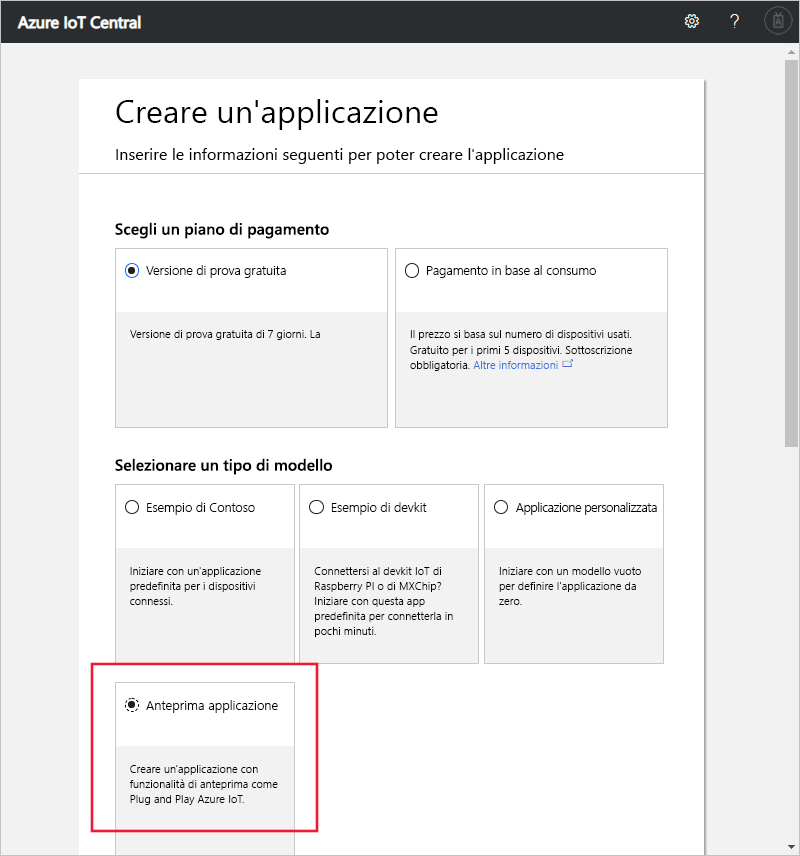

# Creare un'applicazione Azure IoT Central (funzionalità di anteprima)

[!INCLUDE [iot-central-pnp-original](../../includes/iot-central-pnp-original-note.md)]

Questa guida di avvio rapido illustra come creare una nuova applicazione Azure IoT Central che usa funzionalità di anteprima, come Plug and Play IoT.

> [!WARNING]
> Le funzionalità Plug and Play IoT incluse in Azure IoT Central sono attualmente disponibili in anteprima pubblica. Non usare per i carichi di lavoro di produzione un'applicazione IoT Central abilitata per Plug and Play IoT. Per gli ambienti di produzione usare un'applicazione IoT Central creata da un modello di applicazione corrente e disponibile a livello generale.

## Creare un'applicazione

Passare al sito Web di [gestione applicazioni di Azure IoT Central](https://aka.ms/iotcentral). Eseguire quindi l'accesso con un account Microsoft personale o con un account aziendale o dell'istituto di istruzione.

Per iniziare a creare una nuova applicazione Azure IoT Central, selezionare **Nuova applicazione**. Questo collegamento consente di accedere alla pagina **Creare un'applicazione**.

Per creare una nuova applicazione Azure IoT Central che includa le funzionalità di anteprima, tra cui Plug and Play IoT:

1. Scegliere un piano di pagamento:
   - Le applicazioni di tipo **Versione di prova** sono gratuite per sette giorni prima della scadenza. Possono essere convertite in applicazioni con pagamento in base al consumo in qualsiasi momento prima della scadenza. Se si crea un'applicazione di tipo **Versione di valutazione**, è necessario immettere le informazioni sul contatto e scegliere se ricevere informazioni e suggerimenti da Microsoft.
   - Le applicazioni di tipo **Con pagamento in base al consumo** prevedono un addebito per ogni dispositivo, con i primi cinque dispositivi offerti gratuitamente. Se si crea un'applicazione di tipo **Con pagamento in base al consumo**, è necessario selezionare un'opzione in *Directory*, *Sottoscrizione di Azure* e *Area*:
      - *Directory* è l'istanza di Azure Active Directory (AD) in cui creare l'applicazione. Contiene le identità degli utenti, le credenziali e altre informazioni sull'organizzazione. Se non si ha un'istanza di Azure AD, ne viene creata una automaticamente quando si crea una sottoscrizione di Azure.
      - Una *sottoscrizione di Azure* consente di creare istanze dei servizi di Azure. IoT Central effettuerà il provisioning delle risorse nella sottoscrizione. Se non si ha una sottoscrizione di Azure, è possibile crearne una nella [pagina di iscrizione ad Azure](https://aka.ms/createazuresubscription). Dopo aver creato la sottoscrizione di Azure, passare alla pagina **Create Application** (Crea applicazione). Selezionare la sottoscrizione nella casella di riepilogo a discesa **Azure Subscription** (Sottoscrizione di Azure).
      - *Area* è la posizione fisica in cui si vuole creare l'applicazione. Durante l'anteprima pubblica, le uniche aree disponibili per un'**anteprima applicazione** sono **Europa settentrionale** e **Stati Uniti centrali**.

      Per altre informazioni sui prezzi, vedere la [pagina dei prezzi di Azure IoT Central](https://azure.microsoft.com/pricing/details/iot-central/).

1. Scegliere un nome descrittivo per l'applicazione, ad esempio **Contoso IoT**. Azure IoT Central genera un prefisso URL univoco. È possibile modificare questo prefisso URL in modo da renderlo più facile da ricordare.

1. Scegliere il modello di applicazione **Anteprima applicazione**. Un modello di applicazione può contenere elementi predefiniti, ad esempio modelli di dispositivi e dashboard che facilitano le cose.

1. Selezionare **Crea** nella parte inferiore della pagina.

## Passaggi successivi

In questa guida di avvio rapido è stata creata un'applicazione IoT Central che usa le funzionalità di anteprima. Il passaggio successivo suggerito è:

> [!div class="nextstepaction"]
> [Definire un nuovo tipo di dispositivo nell'applicazione Azure IoT Central](./tutorial-define-device-type-pnp.md?toc=/azure/iot-central-pnp/toc.json&bc=/azure/iot-central-pnp/breadcrumb/toc.json)
