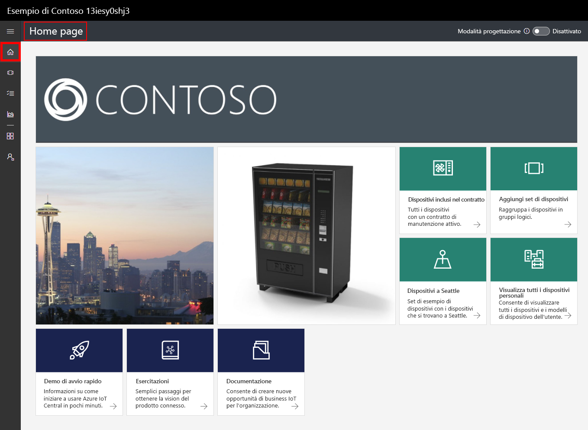
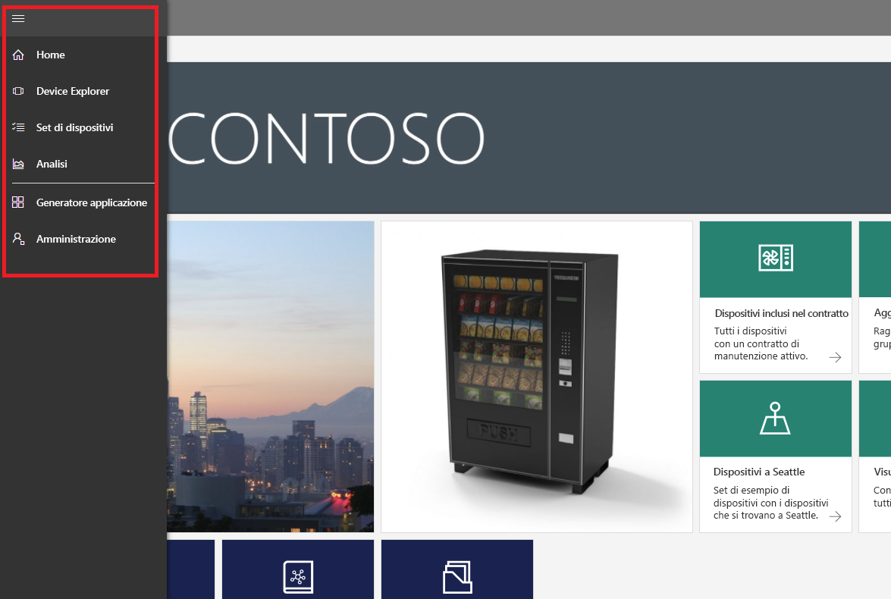
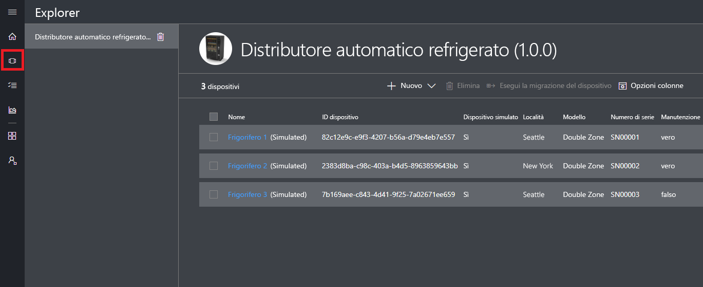
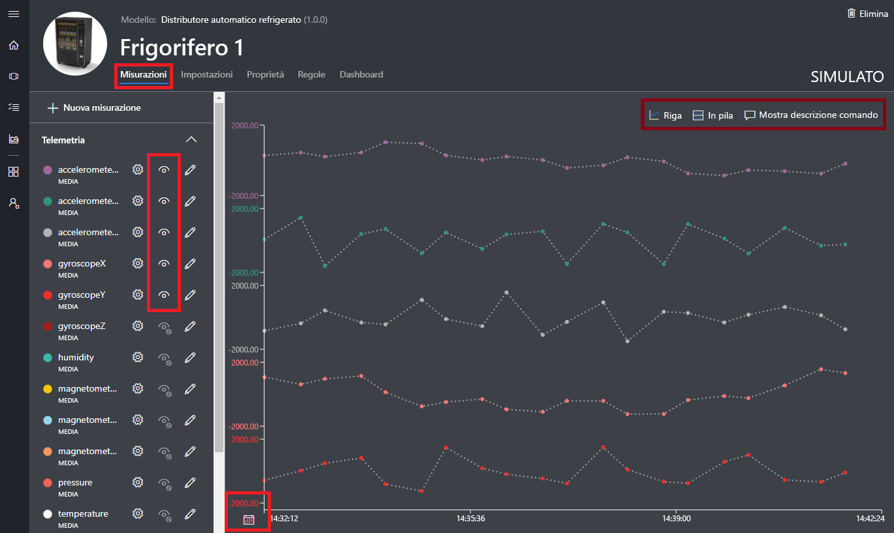
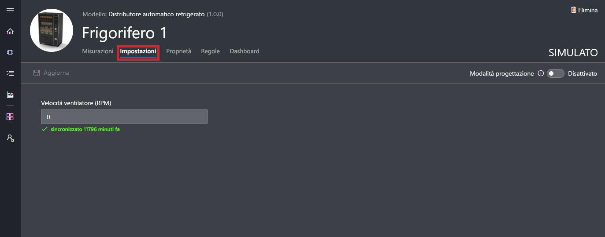
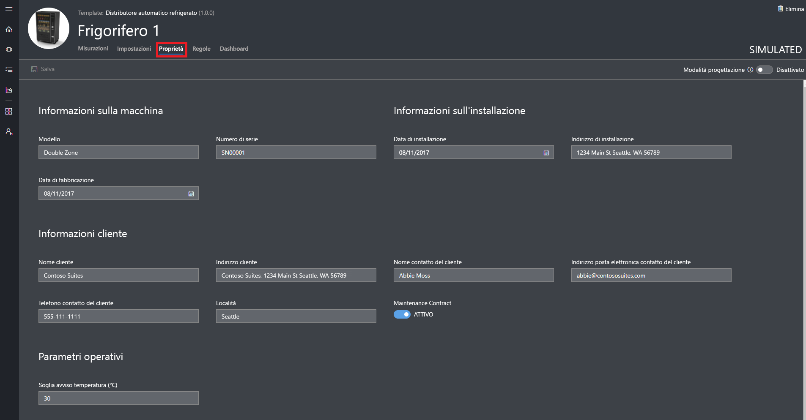
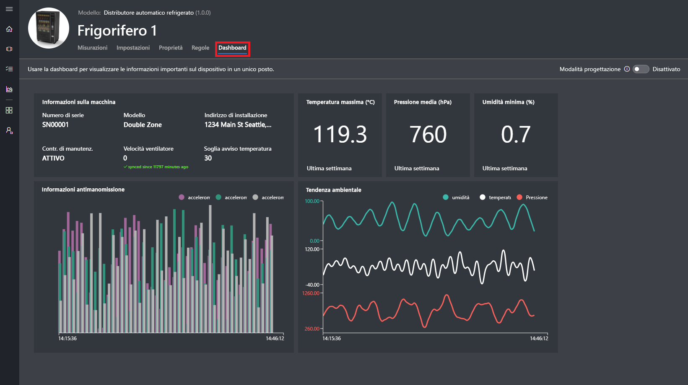
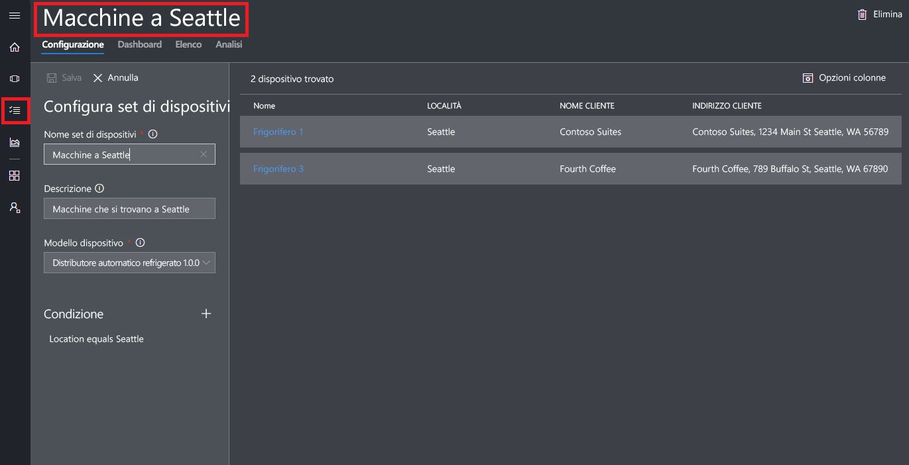
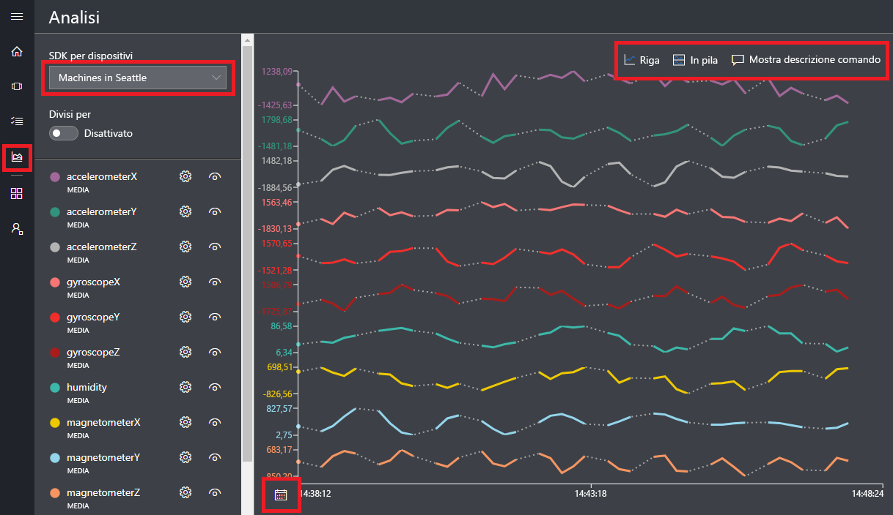

# Creare un'applicazione Azure IoT Central

I _produttori_ usano l'interfaccia utente di Azure IoT Central per definire l'applicazione Microsoft Azure IoT Central. Questa guida introduttiva illustra come effettuare le operazioni seguenti:

- Creare un'applicazione Azure IoT Central contenente un _modello di dispositivo_ e _dispositivi_ simulati.
- Visualizzare le funzionalità del modello di dispositivo **Macchina per la distribuzione di bevande refrigerate** nell'applicazione.
- Visualizzare i dati di telemetria e le analisi dai dispositivi **Frigorifero**.

In questa guida introduttiva viene visualizzato un dispositivo **Frigorifero** simulato da un modello di dispositivo. Il dispositivo simulato:

* Invia dati di telemetria, ad esempio temperatura e pressione, all'applicazione.
* Segnala i valori delle proprietà del dispositivo, ad esempio un avviso di movimento, all'applicazione.
* Dispone delle impostazioni del dispositivo, ad esempio velocità della ventola, che è possibile impostare nell'applicazione.

Quando si crea un dispositivo simulato da un modello di dispositivo in un'applicazione Azure IoT Central, il dispositivo simulato consente di testare l'applicazione prima di connettere un dispositivo reale.

## Creazione dell'applicazione

Per completare questa guida introduttiva, è necessario creare un'applicazione Azure IoT Central dal modello di applicazione **Sample Contoso**.

Passare alla pagina [Application Manager](https://aka.ms/iotcentral) (Gestione applicazioni). Quindi immettere l'indirizzo di posta elettronica e la password usati per accedere alla sottoscrizione di Azure:

Per iniziare a creare una nuova applicazione Azure IoT Central, scegliere **Nuova applicazione**:

Per creare una nuova applicazione Azure IoT Central:

1. Scegliere il piano di pagamento **Free Trial Application** (Applicazione di prova gratuita).
1. Scegliere un nome descrittivo per l'applicazione, ad esempio **Contoso IoT**. Azure IoT Central genera un prefisso URL univoco. È possibile modificare questo prefisso URL in modo da renderlo più facile da ricordare.
1. Scegliere il modello di applicazione **Sample Contoso**.
1. quindi scegliere **Crea**.

## Passare all'applicazione

Quando l'applicazione è pronta, viene visualizzata la sua **home page**. Per modificare la home page, è possibile attivare/disattivare la _modalità progettazione_ in alto a destra. L'URL dell'applicazione è l'URL specificato nel passaggio precedente:

Usare il _menu di spostamento a sinistra_ per accedere alle diverse aree della nuova applicazione Azure IoT Central:

Per visualizzare i modelli di dispositivi e i dispositivi nell'applicazione, scegliere **Device Explorer** nel menu di spostamento a sinistra. L'applicazione di esempio include il modello di dispositivo **Macchina per la distribuzione di bevande refrigerate**. Esistono tre dispositivi simulati già creati da questo modello di dispositivo:

## Visualizzare il modello di dispositivo e i dispositivi

Usare i passaggi seguenti per visualizzare un frigorifero creato a partire dal modello di dispositivo **Macchina per la distribuzione di bevande refrigerate**. Un modello di dispositivo definisce:

* Le _misure_, ad esempio i dati di telemetria della temperatura, inviate da un dispositivo.
* Le _impostazioni_, ad esempio la velocità della ventola, che consentono di controllare il dispositivo.
* Le _proprietà_, ad esempio il numero di serie, che archiviano informazioni sul dispositivo.
* Le [regole](howto-create-telemetry-rules.md), che consentono di automatizzare le azioni in base al comportamento del dispositivo.
* Un _dashboard_ personalizzabile, che visualizza le informazioni sul dispositivo.

Partendo da un modello di dispositivo, è possibile creare dispositivi sia simulati che reali.

### Misure

Viene visualizzata la pagina **Measurements** (Misure) per il dispositivo **Frigorifero 1**. È possibile visualizzare l'elenco di misure inviato dal dispositivo simulato. La pagina visualizza anche un grafico personalizzabile delle misure visibili:

È possibile attivare o disattivare la visibilità dei singoli elementi e personalizzare il grafico. Il grafico corrente mostra i dati di telemetria di un dispositivo simulato. Se si dispone delle autorizzazioni appropriate, è possibile aggiungere nuove misure al modello di dispositivo.

> [!NOTE]
> Potrebbe essere necessario attendere un breve periodo di tempo prima che i dati simulati vengano visualizzati nel grafico.

### Impostazioni

Scegliere **Impostazioni**. Nella pagina **Impostazioni** è possibile controllare il dispositivo. Ad esempio, è possibile aggiornare la velocità della ventola del frigorifero:

Un'impostazione viene visualizzata come **sincronizzata** quando un dispositivo riconosce la modifica.

### Properties

Scegli **Proprietà**. Nella pagina **Proprietà** è possibile:

* Gestire le informazioni sul dispositivo, ad esempio il nome del cliente.
* Visualizzare i valori delle proprietà segnalati dal dispositivo, ad esempio un avviso di movimento.

### dashboard

Chiudere il **dashboard**. Il dashboard è una visualizzazione personalizzabile delle informazioni sul dispositivo, ad esempio misure, proprietà e indicatori KPI:

## Visualizzare l'analisi

Nella sezione precedente è stato illustrato come visualizzare informazioni su un singolo dispositivo. È possibile usare [set di dispositivi](howto-use-device-sets.md) e [analisi](howto-create-analytics.md) per visualizzare informazioni consolidate provenienti da più dispositivi.

Un set di dispositivi usa una query per selezionare in modo dinamico un set di dispositivi che corrispondono a un criterio. Ad esempio, il set di dispositivi **Macchine di Seattle** seleziona i frigoriferi la cui posizione è Seattle. Per visualizzare il set di dispositivi **Macchine di Seattle**, scegliere **Device Sets** (Set di dispositivi) nel menu di navigazione a sinistra, quindi scegliere **Macchine di Seattle**:

È possibile visualizzare i dati delle analisi per i dispositivi in un set di dispositivi nella pagina **Analytics** (Analisi):

## Passaggi successivi

In questa guida introduttiva è stata creata un'applicazione Azure IoT Central già popolata contenente un modello di dispositivo **Macchina per la distribuzione di bevande refrigerate** e dispositivi simulati. Per altre informazioni su come definire i propri modelli di dispositivi personalizzati in qualità di produttore, vedere [Define a new device template in your application](tutorial-define-device-type.md) (Definire un nuovo modello di dispositivo nell'applicazione).
