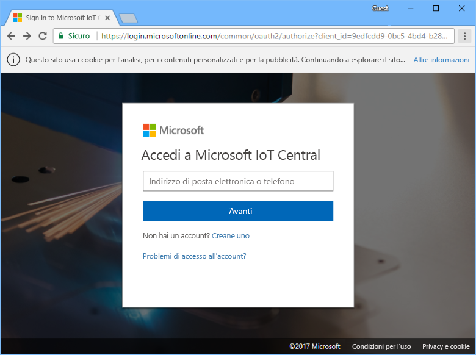
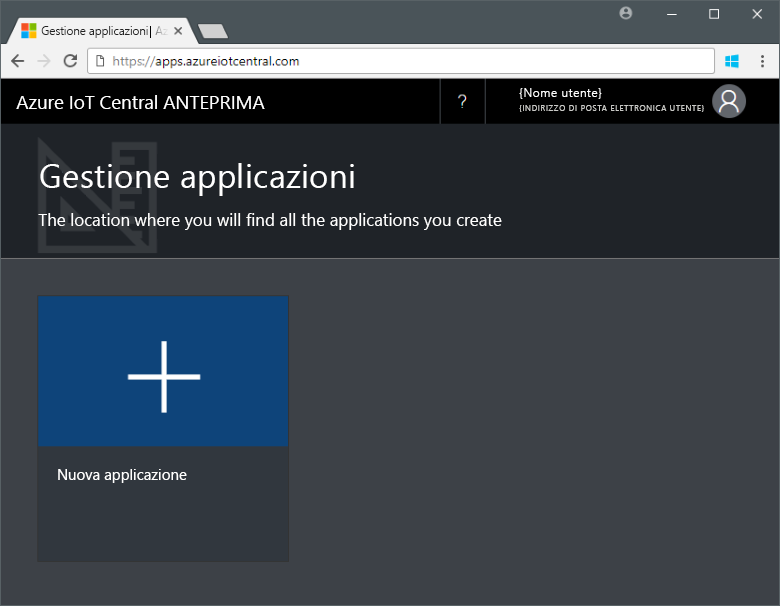
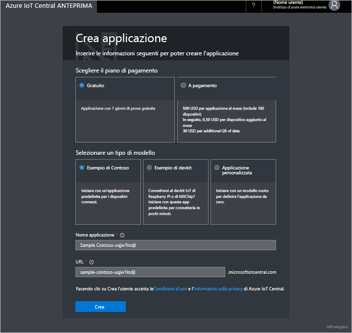

# Creare un'applicazione Azure IoT Central

I _produttori_ usano l'interfaccia utente di Azure IoT Central per definire l'applicazione Microsoft Azure IoT Central. Questa guida introduttiva illustra come creare un'applicazione Azure IoT Central contenente un _modello di dispositivo_ di esempio e _dispositivi_ simulati.

## Creazione dell'applicazione

Per completare questa guida introduttiva, è necessario creare un'applicazione Azure IoT Central dal modello di applicazione **Sample Contoso**.

Passare alla pagina [Application Manager](https://aka.ms/iotcentral) (Gestione applicazioni). Quindi immettere l'indirizzo di posta elettronica e la password usati per accedere alla sottoscrizione di Azure:

Per iniziare a creare una nuova applicazione Azure IoT Central, scegliere **Nuova applicazione**:

Per creare una nuova applicazione Azure IoT Central:

1. Scegliere il piano di pagamento **Free Trial Application** (Applicazione di prova gratuita).
1. Scegliere un nome descrittivo per l'applicazione, ad esempio **Contoso IoT**. Azure IoT Central genera un prefisso URL univoco. È possibile modificare questo prefisso URL in modo da renderlo più facile da ricordare.
1. Scegliere il modello di applicazione **Sample Contoso**.
1. quindi scegliere **Crea**.

## Passaggi successivi

In questa guida introduttiva è stata creata un'applicazione Azure IoT Central già popolata contenente un modello di dispositivo **Macchina per la distribuzione di bevande refrigerate** e dispositivi simulati. Per altre informazioni su come definire i propri modelli di dispositivi personalizzati in qualità di produttore, vedere [Define a new device template in your application](tutorial-define-device-type.md) (Definire un nuovo modello di dispositivo nell'applicazione).
