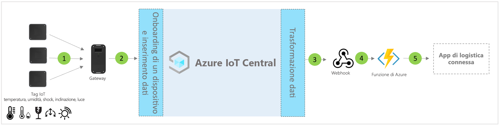

# Architettura del modello di applicazione per la logistica connessa di IoT Central

[!INCLUDE [iot-central-pnp-original](../../../includes/iot-central-pnp-original-note.md)]

Partner e clienti possono usare il modello di app e le indicazioni riportate di seguito per sviluppare **soluzioni di logistica connessa** end-to-end.

> [!div class="mx-imgBorder"]
> 

1. Set di tag IoT che inviano dati di telemetria a un dispositivo gateway
2. Dispositivi gateway che inviano dati di telemetria e dati analitici aggregati a IoT Central
3. I dati vengono indirizzati al servizio di Azure desiderato per la manipolazione
4. I servizi di Azure quali ASA o Funzioni di Azure possono essere usati per riformattare i flussi dei dati e inviarli agli account di archiviazione indicati 
5. Le applicazioni aziendali dell'utente finale possono supportare vari flussi di lavoro aziendali

## Dettagli
La sezione seguente illustra ogni parte dell'architettura concettuale di inserimento di dati di telemetria da tag IoT e gateway

## Tag IoT
I tag IoT offrono funzionalità per sensori fisici, di ambiente e ambientali, ad esempio temperatura, umidità, collisione, inclinazione e luce. I tag IoT in genere si connettono al dispositivo gateway tramite ZigBee (802.15.4). I tag sono sensori economici. Di conseguenza, possono essere rimossi al termine di un tipico percorso logistico per evitare problemi con la logistica inversa.

## Gateway
Grazie alle funzionalità di rilevamento ambientale, i gateway possono anche fungere da tag IoT. Il gateway consente la connettività cloud Azure IoT upstream (MQTT) tramite canali cellulari e Wi-Fi.  Per la comunicazione downstream con i tag IoT vengono usate le modalità Bluetooth, NFC e 802.15.4 Wireless Sensor Network (WSN). I gateway offrono una connettività cloud protetta end-to-end, l'abbinamento di tag IoT, l'aggregazione dei dati del sensore, la conservazione dati e la possibilità di configurare soglie di avviso.

## Gestione dei dispositivi con IoT Central 
Azure IoT Central è una piattaforma per lo sviluppo di soluzioni che semplifica la connettività, la configurazione e la gestione dei dispositivi IoT. La piattaforma riduce in modo significativo il carico e i costi di gestione, delle operazioni e delle attività di sviluppo correlate ai dispositivi IoT. Clienti e partner possono sviluppare soluzioni aziendali end-to-end per ottenere un ciclo di feedback digitale nella logistica.

## Dati analitici aziendali e azioni tramite i dati in uscita 
La piattaforma IoT Central offre opzioni di estendibilità avanzate tramite l'esportazione continua dei dati (CDE) e le API. I dati analitici aziendali basati sull'elaborazione dei dati di telemetria o sulla telemetria non elaborata vengono in genere esportati in un'applicazione line-of-business preferita. Ciò è possibile tramite l'uso di un webhook, un bus di servizio, un hub eventi o l'archiviazione BLOB per creare modelli di Machine Learning, eseguirne il training e distribuirli arricchendo ulteriormente i dati analitici.

## Passaggi successivi
* Informazioni su come distribuire un [modello di soluzione logistica connessa](./tutorial-iot-central-connected-logistics-pnp.md)
* Altre informazioni sui [modelli di IoT Central per la vendita al dettaglio](./overview-iot-central-retail-pnp.md)
* Per altre informazioni su IoT Central fare riferimento a [Panoramica di IoT Central](../core/overview-iot-central-pnp.md)
