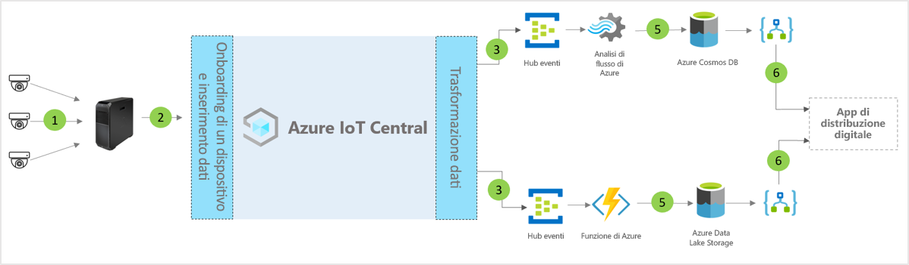

# Architettura del modello di applicazione del centro di distribuzione digitale per IoT Central

Partner e clienti possono usare il modello di app e seguire le indicazioni riportate di seguito per sviluppare soluzioni di **centro di distribuzione digitale** end-to-end.

> [!div class="mx-imgBorder"]
> 

1. Set di sensori IoT che inviano dati di telemetria a un dispositivo gateway
2. Dispositivi gateway che inviano dati di telemetria e dati analitici aggregati a IoT Central
3. I dati vengono indirizzati al servizio di Azure desiderato per la manipolazione
4. I servizi di Azure, ad esempio Analisi di flusso di Azure o Funzioni di Azure, possono essere usati per riformattare i flussi dei dati e inviarli ad account di archiviazione specifici 
5. I dati elaborati vengono archiviati in livelli di archiviazione ad accesso frequente per azioni quasi in tempo reale o nell'archiviazione offline sicura per apportare altri miglioramenti ai dati analitici in base ad analisi ML o batch. 
6. App per la logica può essere usato per supportare vari flussi di lavoro aziendali nelle applicazioni aziendali dell'utente finale

## Dettagli
La sezione seguente illustra ogni parte dell'architettura concettuale

## Videocamere 
Le videocamere sono i sensori principali in questo ecosistema aziendale con connessione digitale. Miglioramenti nell'ambito di Machine Learning e intelligenza artificiale consentono di trasformare i video in dati strutturati ed elaborarli nei dispositivi perimetrali prima dell'invio al cloud. È possibile usare le videocamere IP per acquisire immagini, comprimerle nella videocamera e quindi inviare i dati compressi tramite il calcolo Edge per la pipeline di analisi video oppure usare le videocamere GigE Vision per acquisire immagini sul sensore e quindi inviarle direttamente ad Azure IoT Edge, che esegue la compressione prima dell'elaborazione nella pipeline di analisi video. 

## Gateway Azure IoT Edge
Le "fotocamere come sensori" e i carichi di lavoro perimetrali vengono gestiti localmente da Azure IoT Edge e il flusso della fotocamera viene elaborato dalla pipeline di analisi. La pipeline di elaborazione dell'analisi video in Azure IoT Edge offre numerosi vantaggi, tra cui tempi di risposta più rapidi e utilizzo ridotto di larghezza di banda con conseguente bassa latenza per l'elaborazione rapida dei dati. Solo i metadati, le informazioni dettagliate o le azioni più essenziali vengono inviati al cloud per un'altra azione o analisi. 

## Gestione dei dispositivi con IoT Central 
Azure IoT Central è una piattaforma per lo sviluppo di soluzioni che semplifica la connettività, la configurazione e la gestione del gateway Azure IoT Edge e del dispositivo IoT. La piattaforma riduce in modo significativo il carico e i costi di gestione, delle operazioni e delle attività di sviluppo correlate ai dispositivi IoT. Clienti e partner possono compilare soluzioni aziendali end-to-end per ottenere un ciclo di feedback digitale nei centri di distribuzione.

## Dati analitici aziendali e azioni tramite i dati in uscita 
La piattaforma IoT Central offre opzioni di estendibilità avanzate tramite l'esportazione continua dei dati e le API. I dati analitici aziendali basati sull'elaborazione dei dati di telemetria o su tali dati non elaborati vengono in genere esportati in un'applicazione line-of-business preferita. Ciò è possibile tramite l'uso di un webhook, un bus di servizio, un hub eventi o l'archiviazione BLOB per creare modelli di Machine Learning, eseguirne il training e distribuirli arricchendo ulteriormente i dati analitici.

## Passaggi successivi
* Informazioni su come distribuire un [modello di centro distribuzione digitale](./tutorial-iot-central-digital-distribution-center.md)
* Altre informazioni sui [modelli di IoT Central per la vendita al dettaglio](./overview-iot-central-retail.md)
* Per altre informazioni su IoT Central fare riferimento a [Panoramica di IoT Central](../core/overview-iot-central.md)
