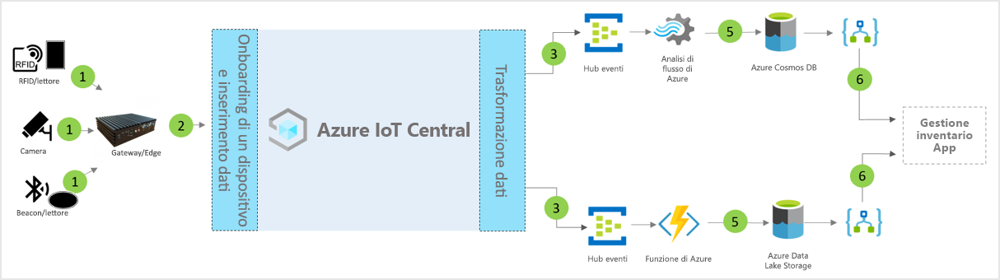

# Architettura del modello di applicazione per la gestione inventario intelligente di IoT Central

Partner e clienti possono usare il modello di app e le indicazioni riportate di seguito per sviluppare soluzioni di **gestione inventario intelligenti** end-to-end.

> [!div class="mx-imgBorder"]
> 

1. Set di sensori IoT che inviano dati di telemetria a un dispositivo gateway
2. Dispositivi gateway che inviano dati di telemetria e dati analitici aggregati a IoT Central
3. I dati vengono indirizzati al servizio di Azure desiderato per la manipolazione
4. I servizi di Azure, ad esempio ASA o Funzioni di Azure, possono essere usati per riformattare i flussi dei dati e inviarli ad account di archiviazione specifici 
5. I dati elaborati vengono archiviati in livelli di archiviazione ad accesso frequente per le azioni quasi in tempo reale o nell'archiviazione offline sicura per apportare altri miglioramenti ai dati analitici in base ad analisi ML o batch. 
6. App per la logica può essere usato per supportare vari flussi di lavoro aziendali nelle applicazioni aziendali dell'utente finale

## Dettagli
La sezione seguente illustra ogni parte dell'architettura concettuale di inserimento di dati di telemetria da tag Radio Frequency Identification (RFID) e Bluetooth Low Energy (BLE)

## Tag RFID
I tag RFID trasmettono i dati relativi a un elemento tramite onde radio. I tag RFID in genere non hanno una batteria, a meno che non sia specificato. I tag ricevono energia dalle onde radio generate dal lettore e restituiscono un segnale al lettore RFID.

## Tag BLE
Il beacon trasmette i pacchetti di dati a intervalli regolari. I dati del beacon vengono rilevati dai lettori BLE o dai servizi installati su smartphone e quindi trasmessi al cloud.

## Lettori RFID e BLE
Il lettore RFID converte le onde radio in un formato dati più utilizzabile. Le informazioni raccolte dai tag vengono quindi archiviate nel server perimetrale locale o inviate al cloud tramite JSON-RPC 2.0 su MQTT.
Il lettore BLE, anche noto come Punti di accesso (AP, Access Points), è simile al lettore RFID. Viene usato per rilevare i segnali Bluetooth vicini e inoltrarne il messaggio all'istanza locale di Azure IoT Edge o al cloud tramite JSON-RPC 2.0 su MQTT.
Molti lettori sono in grado di leggere i segnali RFID e dei beacon e offrono funzionalità per sensori aggiuntivi relativi a temperatura, umidità, accelerometro e giroscopio.

## Gateway Azure IoT Edge
Prima di inviare questi dati al cloud, è possibile pre-elaborarli in locale nel server Azure IoT Edge. È anche possibile distribuire intelligenza artificiale per i carichi di lavoro cloud, servizi di Azure e di terze parti e logica di business tramite contenitori standard.

## Gestione dei dispositivi con IoT Central 
Azure IoT Central è una piattaforma per lo sviluppo di soluzioni che semplifica la connettività, la configurazione e la gestione dei dispositivi IoT. La piattaforma riduce in modo significativo il carico e i costi di gestione, delle operazioni e delle attività di sviluppo correlate ai dispositivi IoT. Clienti e partner possono sviluppare soluzioni aziendali end-to-end per ottenere un ciclo di feedback digitale nella gestione inventario.

## Dati analitici aziendali e azioni tramite i dati in uscita 
La piattaforma IoT Central offre opzioni di estendibilità avanzate tramite l'esportazione continua dei dati (CDE) e le API. I dati analitici aziendali basati sull'elaborazione dei dati di telemetria o sulla telemetria non elaborata vengono in genere esportati in un'applicazione line-of-business preferita. Ciò è possibile tramite l'uso di un webhook, un bus di servizio, un hub eventi o l'archiviazione BLOB per creare modelli di Machine Learning, eseguirne il training e distribuirli arricchendo ulteriormente i dati analitici.

## Passaggi successivi
* Informazioni su come distribuire un [modello di gestione dell'inventario intelligente](./tutorial-iot-central-smart-inventory-management-pnp.md)
* Altre informazioni sui [modelli di IoT Central per la vendita al dettaglio](./overview-iot-central-retail-pnp.md)
* Per altre informazioni su IoT Central fare riferimento a [Panoramica di IoT Central](../preview/overview-iot-central.md)
