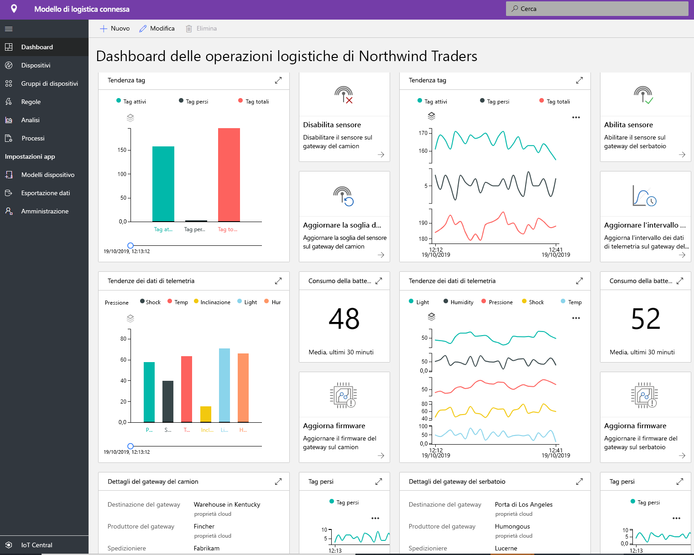
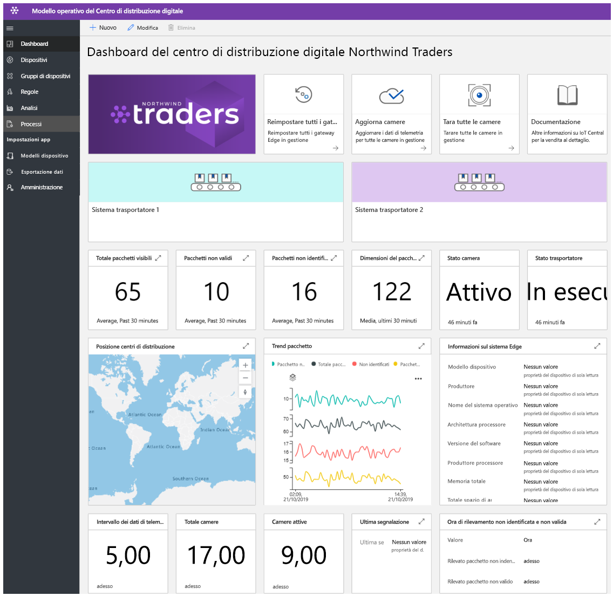
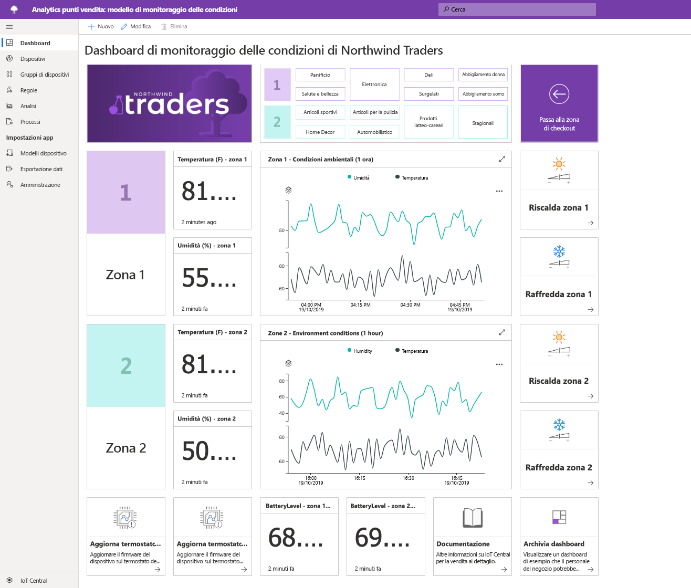
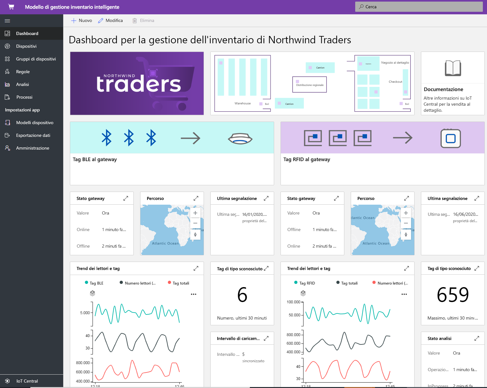

# Creazione di soluzioni per la vendita al dettaglio con Azure IoT Central

[!INCLUDE [iot-central-pnp-original](../../../includes/iot-central-pnp-original-note.md)]

Azure IoT Central è una piattaforma di applicazioni di Internet delle cose (IoT) per i generatori di soluzioni che semplifica la creazione e la gestione di applicazioni scalabili. Questo articolo illustra diversi modelli di applicazione specifici per la vendita al dettaglio all'interno di IoT Central. I generatori di soluzioni possono sfruttare i modelli pubblicati per creare soluzioni IoT per ottimizzare la supply chain, migliorare l'esperienza in negozio per i clienti e tenere traccia dell'inventario in modo più efficiente.

> [!div class="mx-imgBorder"]
> 

## Che cos'è la soluzione logistica connessa?
Si prevede che la spesa globale per la logistica raggiunga $10,6 TRN nel 2020, il PIL più elevato per settore. Il trasporto delle merci costituisce la maggior parte (70%) delle spese di logistica totali. I fornitori di spedizione sono soggetti a forti pressioni e vincoli competitivi. I fornitori 3PL devono affrontare intervalli di tempo in continua diminuzione e costi di compensazione in crescita. La logistica è anche soggetta ai rischi derivanti da eventi geopolitici, eventi climatici estremi e criminalità. 

Grazie al supporto dei sensori IoT, è possibile raccogliere e monitorare i dati sulle condizioni ambientali, ad esempio temperatura, umidità, inclinazione, scosse, luce e posizione di spedizione tramite GPS attraverso la trasformazione multimodale, ad esempio aria, acqua, terreno. I dati raccolti da sensori, dispositivi, meteo ed eventi possono essere integrati con i sistemi di business intelligence basati sul cloud. I vantaggi della soluzione logistica connessa sono:
* Trasferimento delle spedizioni con tracciamento e rilevamento in tempo reale 
* Integrità delle spedizioni con monitoraggio delle condizioni ambientali in tempo reale e catena del freddo
* Protezione da furti, perdite o danni della spedizione
* Geofencing, ottimizzazione dei percorsi, gestione della flotta. Analisi dei veicoli
* Previsione e prevedibilità di partenza e arrivo 

### Esperienza predefinita
I partner possono sfruttare il modello per sviluppare soluzioni logistiche end-to-end connesse e per ottenere i vantaggi riportati. Questo modello pubblicato è incentrato sulla connettività dei dispositivi, la configurazione e la gestione dei dispositivi in IoT Central. 

> [!div class="mx-imgBorder"]
> 

> [!div class="mx-imgBorder"]
> 

Si noti che il dashboard precedente è un'esperienza di esempio ed è possibile personalizzare completamente questa applicazione per adattarla al caso d'uso desiderato.

Introduzione all'[esercitazione end-to-end](./tutorial-iot-central-connected-logistics-pnp.md) che illustra come creare una soluzione sfruttando uno dei modelli di soluzione di logistica connessa.

## Che cos'è la soluzione di centro di distribuzione digitale?
Man mano che un maggior numero di produttori e rivenditori stabilisce presenze in tutto il mondo, le loro supply chain si diramano e diventano sempre più complesse. I centri di distribuzione stanno diventando la sfida principale. I centri di distribuzione/magazzini sentono il peso della pressione dell'e-commerce. I consumer ora si aspettano che siano disponibili vaste selezioni di prodotti e che le merci arrivino entro uno o due giorni dall'acquisto. I centri di distribuzione devono adattarsi a queste tendenze e superare le inefficienze esistenti. 

Attualmente, l'eccessiva dipendenza dal lavoro manuale implica che la selezione e il confezionamento rappresentino il 55-65% dei costi del centro di distribuzione. Anche se è negativo che il lavoro manuale rallenti il centro di distribuzione, la rapida fluttuazione delle esigenze del personale (le vacanze del personale aumentano di 10 volte) rende ancora più difficile soddisfare i volumi di spedizione. Questa fluttuazione stagionale comporta un aumento del ricambio dei dipendenti, della probabilità di errori e della necessità di rilavorazioni costose.
Le soluzioni basate sulle fotocamere con IoT abilitato possono offrire vantaggi di trasformazione, grazie a un ciclo di feedback digitale. Questo afflusso di dati da tutto il centro di distribuzione comporta informazioni dettagliate di utilità pratica che, a loro volta, generano dati migliori.

I vantaggi sono: 
* Monitoraggio con fotocamere delle merci man mano che arrivano e passano attraverso il sistema trasportatore
* Identificazione delle merci difettose e invio per la riparazione
* Possibilità di tenere traccia degli ordini in modo efficiente
* Riduzione dei costi, produttività migliorata e massimizzazione dell'utilizzo

### Esperienza predefinita
I partner possono sfruttare questo modello di applicazione per creare il centro di distribuzione digitale per ottenere informazioni dettagliate di utilità pratica e i vantaggi riportati sopra. Il modello pubblicato è incentrato sulla connettività dei dispositivi, la configurazione e la gestione delle fotocamere e dei dispositivi periferici in IoT Central. 

> [!div class="mx-imgBorder"]
> 

Si noti che il dashboard precedente è un'esperienza di esempio ed è possibile personalizzare completamente questa applicazione per adattarla al caso d'uso desiderato.

Introduzione all'[esercitazione end-to-end](./tutorial-iot-central-digital-distribution-center-pnp.md) che illustra come creare una soluzione sfruttando uno dei modelli di centro di distribuzione digitale.

## Che cos'è Analisi punti vendita - Monitoraggio delle condizioni?
Negli attuali scenari competitivi, i rivenditori cercano nuovi modi per offrire ai clienti una soluzione unica o speciale per indirizzare il traffico attraverso i propri negozi fisici. Molti rivenditori riconoscono l'importanza delle condizioni ambientali all'interno del proprio negozio come strumento per distinguersi dalla concorrenza. I rivenditori vogliono assicurarsi di mantenere condizioni piacevoli nei propri punti vendita in qualsiasi momento, per offrire un'esperienza confortevole ai clienti.  

Il modello di applicazione Analisi punti vendita - Monitoraggio delle condizioni all'interno di IoT Central fornisce al generatore di soluzioni un'area di disegno che può essere usata per creare una soluzione end-to-end. Il modello di applicazione consente di connettersi digitalmente e monitorare un ambiente del negozio al dettaglio usando un'ampia gamma di dispositivi di sensori. Questi dispositivi di sensori acquisiscono segnali significativi che possono essere convertiti in informazioni aziendali dettagliate che consentono ai rivenditori di ridurre i costi operativi e creare esperienze apprezzate dai clienti.

Il modello di applicazione consente di:

*  Connettere facilmente un'ampia gamma di sensori IoT a un'istanza dell'applicazione IoT Central.
*  Monitorare e gestire l'integrità della rete di sensori, nonché i dispositivi gateway nell'ambiente.
*  Creare regole personalizzate in base alle condizioni ambientali all'interno di un negozio per attivare gli avvisi appropriati.
*  Trasformare le condizioni ambientali all'interno del negozio in informazioni dettagliate che possono essere sfruttate dal team del negozio al dettaglio.
* Esportare le informazioni aggregate nelle applicazioni aziendali nuove o esistenti offrendo un supporto maggiore ai membri del personale di vendita al dettaglio.

### Esperienza predefinita
Il modello di applicazione è dotato di un set di modelli di dispositivo e di un'esperienza operatore predefinita. Sfrutta un set di dispositivi simulati per popolare gli elementi del dashboard. Quando si distribuisce un'applicazione IoT Central usando il modello di applicazione [Analisi punti vendita - Monitoraggio delle condizioni](https://aka.ms/conditiontemplate), si accederà al dashboard dell'applicazione predefinito, come illustrato qui sotto. 

> [!div class="mx-imgBorder"]
> 

Si noti che il dashboard precedente è un'esperienza di esempio ed è possibile personalizzare completamente questa applicazione per adattarla al caso d'uso desiderato. 

Introduzione all'[esercitazione end-to-end](./tutorial-in-store-analytics-create-app-pnp.md) che illustra come creare una soluzione sfruttando uno dei modelli Analisi punti vendita - Monitoraggio delle condizioni.

## Che cos'è Analisi punti vendita - Pagamento?
Nel panorama sempre più competitivo, i rivenditori di oggi si trovano costantemente ad affrontare pressioni crescenti per offrire un'esperienza in negozio che superi le aspettative dei clienti e li faccia tornare. Mentre diversi rivenditori hanno iniziato a distribuire la tecnologia per soddisfare questa esigenza, un'area che passa piuttosto inosservata è l'esperienza di pagamento.

Il modello di applicazione Analisi punti vendita - Pagamento all'interno di IoT Central consente ai generatori di soluzioni di creare esperienze che consentono al personale di vendita al dettaglio di ottenere informazioni significative sulla zona delle casse del proprio negozio. Sfrutta un set di dispositivi simulati per determinare lo stato di occupazione di ogni cassa all'interno di un negozio al dettaglio. I sensori consentono di acquisire il numero di persone e il tempo medio di attesa per ogni cassa.

Il modello consente al generatore di soluzioni di accelerare i piani di immissione sul mercato fornendo una soluzione IoT di base che consente di: 

* Connettere facilmente un'ampia gamma di sensori IoT a un'istanza dell'applicazione IoT Central.
* Monitorare e gestire l'integrità della rete di sensori e i dispositivi gateway nell'ambiente.
* Creare regole personalizzate in base alle condizioni di pagamento all'interno di un negozio per attivare gli avvisi appropriati.
* Trasformare le condizioni di pagamento all'interno del negozio in informazioni dettagliate che possono essere sfruttate dal team del negozio al dettaglio.
* Esportare le informazioni aggregate nelle applicazioni aziendali nuove o esistenti offrendo un supporto maggiore ai membri del personale di vendita al dettaglio.

### Esperienza predefinita
Il modello di applicazione è dotato di un set di modelli di dispositivo e di un'esperienza operatore predefinita. Sfrutta un set di dispositivi simulati per popolare gli elementi del dashboard. Quando si distribuisce un'applicazione IoT Central usando il modello di applicazione [Analisi punti vendita - Pagamento](https://aka.ms/checkouttemplate), si accederà al dashboard dell'applicazione predefinito, come illustrato qui sotto. 

> [!div class="mx-imgBorder"]
> 

Si noti che il dashboard precedente è un'esperienza di esempio ed è possibile personalizzare completamente questa applicazione per adattarla al caso d'uso desiderato. 

Introduzione all'[esercitazione end-to-end](./tutorial-in-store-analytics-create-app-pnp.md) che illustra come creare una soluzione sfruttando uno dei modelli Analisi punti vendita - Pagamento.

## Che cos'è la gestione dell'inventario intelligente?
L'"Inventario" è la scorta delle merci posseduta da un rivenditore. Ogni rivenditore ha bisogno di un inventario per gestire il lead time della fornitura e della logistica. L'inventario è probabilmente la risorsa più preziosa che ogni rivenditore deve sfruttare. Nel mondo omnicanale di oggi, la gestione dell'inventario è un requisito fondamentale per garantire che il prodotto giusto si trovi nella posto giusto al momento giusto. Un inventario troppo grande o troppo piccolo potrebbe danneggiare l'attività del rivenditore. Ogni anno i rivenditori perdono tra l'8-10% dei ricavi a causa della mancanza di capacità di gestione dell'inventario.

I dati IoT abilitati da RFID (Radio Frequency Identification), Beacon e fotocamera rappresentano la possibilità di affrontare questa enorme sfida in scala. La connettività e l'analisi in tempo reale caratteristiche dei segnali IoT sono diventate l'elemento di svolta per i problemi di inventario del rivenditore.  I dati raccolti da sensori, dispositivi, meteo ed eventi possono essere integrati con i sistemi di business intelligence basati sul cloud.  
I vantaggi della gestione dell'inventario intelligente sono: 
* Protezione dell'organizzazione dagli esaurimenti e garanzia del livello di servizio clienti desiderato 
* Analisi approfondita e informazioni dettagliate sull'accuratezza dell'inventario quasi in tempo reale
* Decisione della quantità corretta di inventario sufficiente per soddisfare gli ordini dei clienti

### Esperienza predefinita
I partner possono sfruttare il modello per sviluppare soluzioni di gestione dell'inventario intelligente e per ottenere i vantaggi riportati. Questo modello pubblicato è incentrato sulla connettività dei dispositivi, la configurazione e la gestione dei lettori RFID e Bluetooth a basso consumo in IoT Central. 

> [!div class="mx-imgBorder"]
> 

Si noti che il dashboard precedente è un'esperienza di esempio ed è possibile personalizzare completamente questa applicazione per adattarla al caso d'uso desiderato. 

Introduzione all'[esercitazione end-to-end](./tutorial-iot-central-smart-inventory-management-pnp.md) che illustra come creare una soluzione sfruttando uno dei modelli di gestione dell'inventario intelligente.

## Passaggi successivi
Per iniziare a creare una soluzione per la vendita al dettaglio:
* Introduzione all'[esercitazione end-to-end](./tutorial-in-store-analytics-create-app-pnp.md) che illustra come creare una soluzione sfruttando uno dei modelli di applicazione per l'analisi dei punti vendita.
* Informazioni su come distribuire un [modello di soluzione logistica connessa](./tutorial-iot-central-connected-logistics-pnp.md)
* Informazioni su come distribuire un [modello di centro distribuzione digitale](./tutorial-iot-central-digital-distribution-center-pnp.md)
* Informazioni su come distribuire un [modello di gestione dell'inventario intelligente](./tutorial-iot-central-smart-inventory-management-pnp.md)
* Per altre informazioni su IoT Central fare riferimento a [Panoramica di IoT Central](../core/overview-iot-central-pnp.md)
