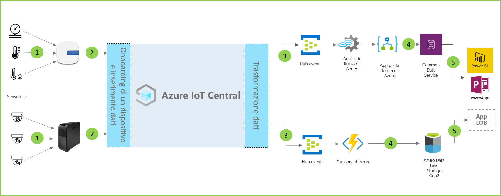

# Architettura di analisi punti vendita

[!INCLUDE [iot-central-pnp-original](../../../includes/iot-central-pnp-original-note.md)]

Le soluzioni per l'analisi dei punti vendita consentono di monitorare varie condizioni all'interno di un ambiente di vendita al dettaglio. Queste soluzioni possono essere create usando uno dei modelli di applicazione disponibili in IoT Central e l'architettura riportata di seguito come materiale sussidiario.

- Set di sensori IoT che inviano dati di telemetria a un dispositivo gateway
- Dispositivi gateway che inviano dati di telemetria e dati analitici aggregati a IoT Central
- Esportazione continua dei dati al servizio di Azure desiderato per la manipolazione
- I dati possono essere strutturati nel formato desiderato e inviati a un servizio di archiviazione
- Le applicazioni aziendali possono eseguire query sui dati e generare dati analitici a supporto delle operazioni di vendita al dettaglio
 
Verranno ora esaminati i componenti chiave che in genere fanno parte di una soluzione per l'analisi dei punti vendita.

## Sensori di monitoraggio delle condizioni

Una soluzione IoT inizia con un set di sensori che acquisiscono segnali significativi all'interno di un ambiente di vendita al dettaglio, come indicato dalla varietà di sensori nella parte sinistra del diagramma dell'architettura riportato sopra.

## Dispositivi gateway

Molti sensori IoT possono inviare segnali non elaborati direttamente al cloud o a un dispositivo gateway situato nelle vicinanze. Il dispositivo gateway esegue l'aggregazione dei dati a livello perimetrale prima di inviare dati analitici di riepilogo a un'applicazione IoT Central. I dispositivi gateway sono anche responsabili dell'inoltro delle operazioni di comando e controllo ai dispositivi del sensore quando applicabile. 

## Applicazione IoT Central

L'applicazione Azure IoT Central inserisce i dati provenienti da una varietà di sensori IoT e dispositivi gateway all'interno dell'ambiente di vendita al dettaglio e genera un set di dati analitici significativi.

Azure IoT Central offre all'esercente anche un'esperienza personalizzata consentendo di monitorare e gestire in remoto i dispositivi dell'infrastruttura.

## Trasformazione dei dati
L'applicazione Azure IoT Central all'interno di una soluzione può essere configurata per l'esportazione di dati analitici non elaborati o aggregati in un set di servizi Azure PaaS (Platform-as-a Service) che possono eseguire la manipolazione dei dati e arricchirli prima di inviarli a un'applicazione aziendale. 

## Applicazione aziendale
I dati IoT possono essere utili per supportare diverse applicazioni aziendali distribuite all'interno di un ambiente di vendita al dettaglio. Un responsabile del punto vendita al dettaglio o un membro del personale può usare queste applicazioni per visualizzare dati analitici aziendali e intraprendere azioni significative in tempo reale. Per informazioni su come creare una dashboard Power BI in tempo reale per il team di vendita al dettaglio, seguire l'[esercitazione](./tutorial-in-store-analytics-create-app-pnp.md).

## Passaggi successivi
* Iniziare con i modelli di applicazione [Analisi punti vendita - Pagamento](https://aka.ms/checkouttemplate) e [Analisi punti vendita - Monitoraggio delle condizioni](https://aka.ms/conditiontemplate). 
* Vedere l'[esercitazione end-to-end](https://aka.ms/storeanalytics-tutorial) che illustra come creare una soluzione sfruttando uno dei modelli di applicazione per l'analisi dei punti vendita.
