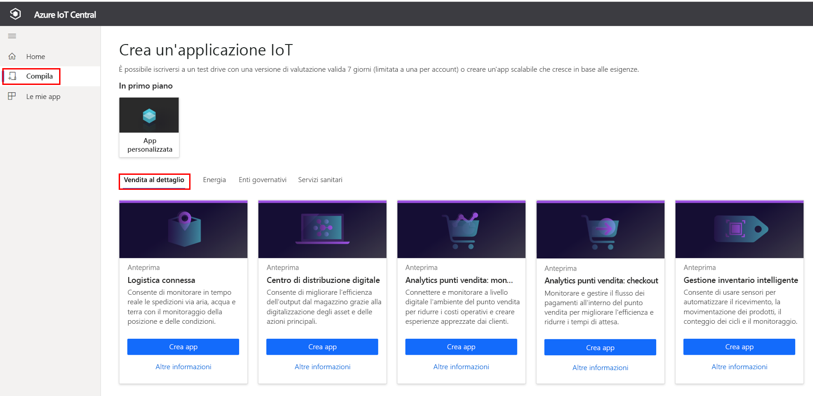
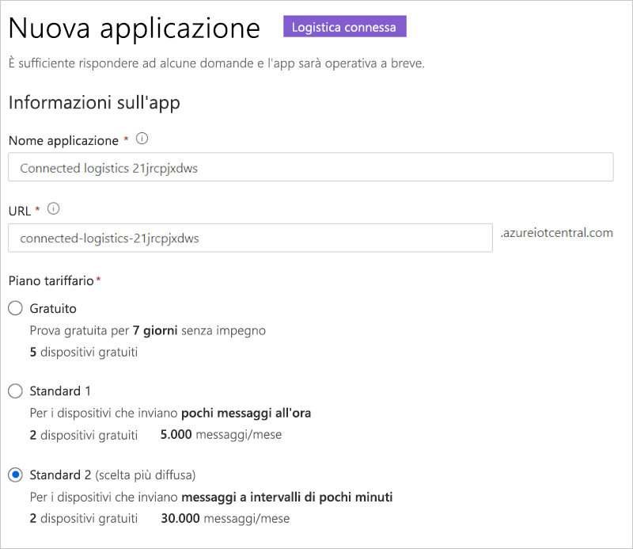
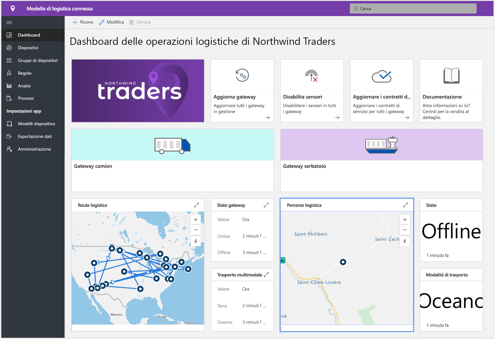
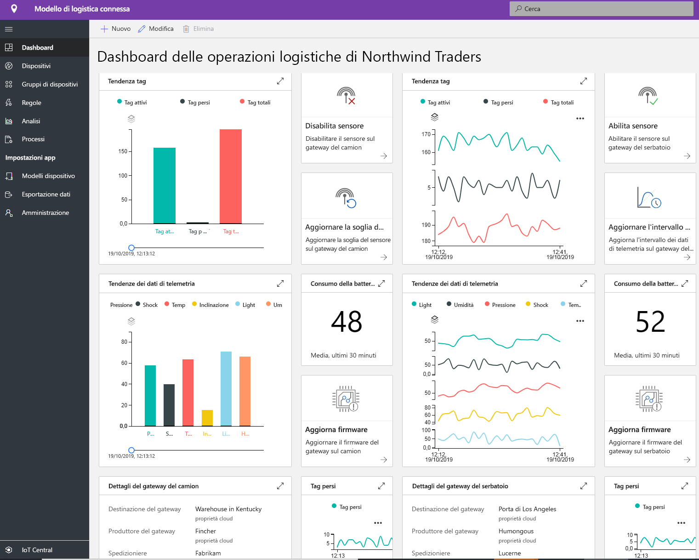
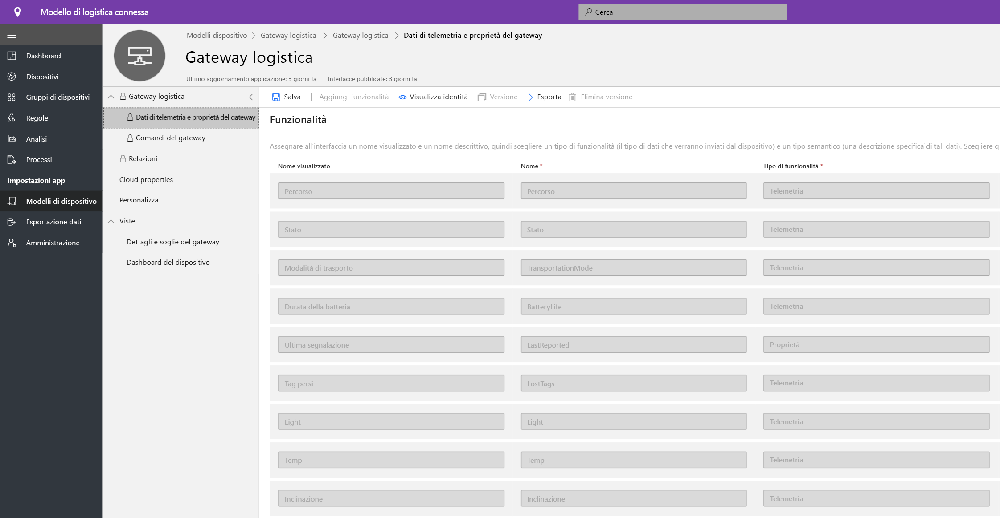
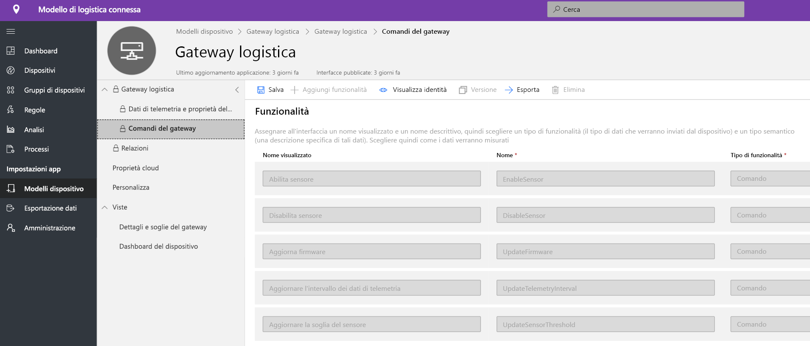
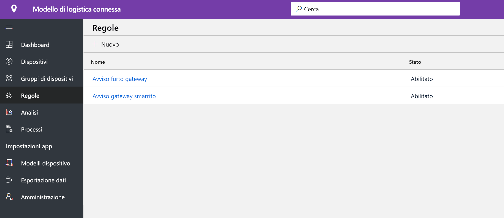
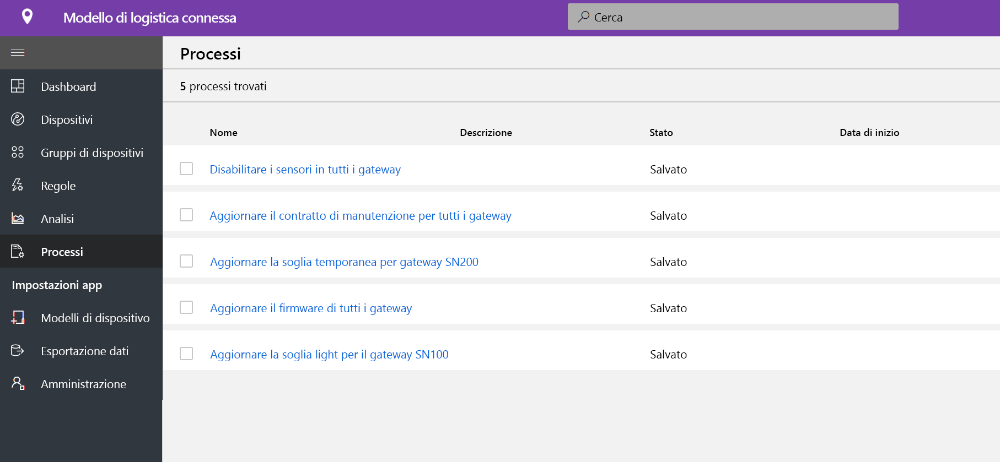
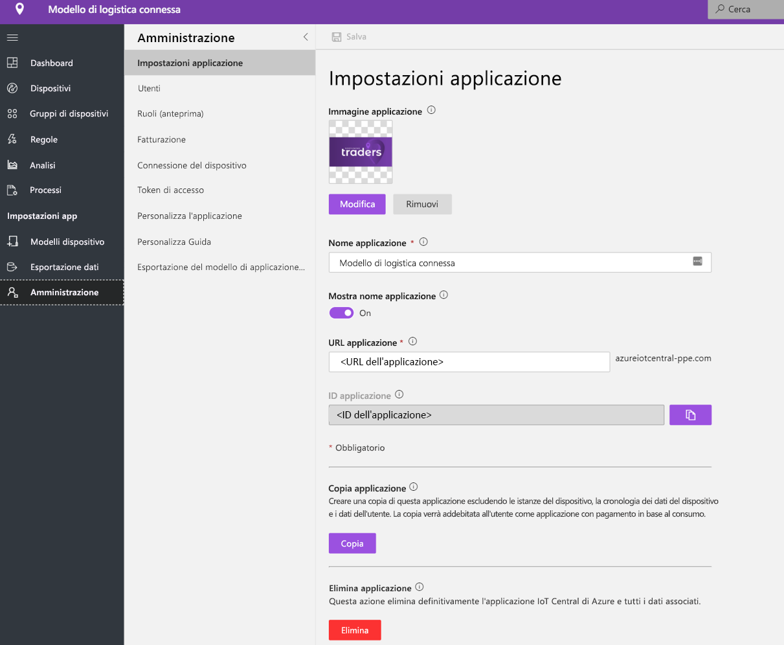

# Esercitazione: Distribuire ed esaminare un modello di applicazione di logistica connessa

[!INCLUDE [iot-central-pnp-original](../../../includes/iot-central-pnp-original-note.md)]

Questa esercitazione illustra come iniziare a distribuire un modello di applicazione di **logistica connessa** per IoT Central. Si apprenderà come distribuire il modello e quali sono gli elementi inclusi per impostazione predefinita. Verranno inoltre fornite informazioni sulle possibili operazioni successive.

In questa esercitazione si apprenderà come: 
* Creare un'applicazione di logistica connessa 
* Esaminare l'applicazione 

## Prerequisiti
* Non sono richiesti prerequisiti specifici per distribuire l'app
* È consigliabile avere una sottoscrizione di Azure, ma è anche possibile provare senza

## Creare un modello di applicazione di logistica connessa
È possibile creare un'applicazione seguendo questa procedura:
1. Passare al sito Web di gestione applicazioni di Azure IoT Central. Selezionare **Compila** dalla barra di spostamento a sinistra e quindi fare clic sulla scheda **Retail**.

> [!div class="mx-imgBorder"]
> 

2. Selezionare **Crea app** in **Connected Logistics Application** (Applicazione di logistica connessa)

3. **Crea app** consente di aprire il modulo Nuova applicazione e di specificare i dettagli richiesti, come illustrato di seguito.
   * **Nome applicazione**: è possibile usare il nome suggerito predefinito o immettere il nome descrittivo dell'applicazione.
   * **URL**: è possibile usare l'URL predefinito suggerito o immettere un URL univoco descrittivo facile da ricordare. L'impostazione predefinita è consigliata se si ha già una sottoscrizione di Azure. In caso contrario, è possibile iniziare con una versione di valutazione gratuita di sette giorni e scegliere di convertire il pagamento in base al consumo in qualsiasi momento prima della scadenza della versione di valutazione gratuita.
   * **Info di fatturazione**: Per effettuare il provisioning delle risorse sono necessari i dettagli relativi alla directory, alla sottoscrizione di Azure e all'area.
   * **Crea**: Selezionare Crea nella parte inferiore della pagina per distribuire l'applicazione.

> [!div class="mx-imgBorder"]
> 

## Esaminare l'applicazione 

## dashboard

Dopo aver distribuito il modello di app, la dashboard predefinita sarà un portale incentrato sull'operatore di logistica connessa. Northwind Trader è un provider di logistica fittizio che gestisce la flotta di mezzi per trasporto merci via mare e via terra. Nella dashboard verranno visualizzati due gateway diversi che forniscono dati di telemetria sulle spedizioni insieme ai comandi, ai processi e alle azioni associati che è possibile eseguire. La dashboard è preconfigurata per presentare l'attività critica delle operazioni del dispositivo di logistica.
La dashboard è suddivisa logicamente tra due diverse operazioni di gestione dei dispositivi gateway, 
   * Il percorso logistico della spedizione dei camion e i dettagli relativi alla località della spedizione oceanica è un elemento essenziale per tutto il trasporto multimodale
   * Visualizzare lo stato del gateway e le informazioni rilevanti 

> [!div class="mx-imgBorder"]
> 

   * È possibile tenere traccia facilmente del numero totale di gateway, dei tag attivi e sconosciuti.
   * È possibile eseguire operazioni di gestione dei dispositivi, ad esempio l'aggiornamento del firmware, la disabilitazione del sensore, l'abilitazione del sensore, l'aggiornamento della soglia del sensore, l'aggiornamento degli intervalli di telemetria e l'aggiornamento dei contratti di servizio dei dispositivi.
   * Visualizzare il consumo della batteria del dispositivo

> [!div class="mx-imgBorder"]
> 

## Modello di dispositivo

Fare clic sulla scheda Modelli di dispositivo per visualizzare il modello di funzionalità del gateway. Un modello di funzionalità è strutturato su due interfacce diverse: **Gateway Telemetry & Property** (Telemetria e proprietà gateway) e **Gateway Commands** (Comandi gateway)

**Gateway Telemetry & Property** (Telemetria e proprietà gateway): questa interfaccia rappresenta tutti i dati di telemetria correlati a sensori, le informazioni sulla posizione e il dispositivo e la funzionalità della proprietà di dispositivo gemello, ad esempio le soglie dei sensori e gli intervalli di aggiornamento.

> [!div class="mx-imgBorder"]
> 

**Gateway Commands** (Comandi gateway): questa interfaccia organizza tutte le funzionalità dei comandi del gateway

> [!div class="mx-imgBorder"]
> 

## Regole
Selezionare la scheda delle regole per visualizzare due regole diverse presenti in questo modello di applicazione. Queste regole sono configurate per inviare notifiche tramite posta elettronica agli operatori per altre indagini.
 
**Gateway theft alert** (Avviso di furto gateway): Questa regola viene attivata in caso di rilevamento di luce imprevista da parte dei sensori durante il viaggio. Gli operatori devono ricevere una notifica al più presto per esaminare i potenziali furti.
 
**Unresponsive Gateway** (Nessuna risposta del gateway): Questa regola verrà attivata se il gateway non comunica con il cloud per un periodo prolungato. Il gateway potrebbe non rispondere a causa della modalità di batteria scarica, della perdita di connettività, dell'integrità del dispositivo.

> [!div class="mx-imgBorder"]
> 

## Processi
Selezionare la scheda dei processi per visualizzare cinque diversi processi che fanno parte di questo modello di applicazione:

> [!div class="mx-imgBorder"]
> 

È possibile usare la funzionalità dei processi per eseguire operazioni a livello di soluzione. In questo caso i processi usano i comandi del dispositivo e la funzionalità di dispositivo gemello per eseguire attività come la disabilitazione di sensori specifici in tutto il gateway o la modifica della soglia del sensore a seconda della modalità di spedizione e del percorso. 
   * Si tratta di un'operazione standard per disabilitare i sensori d'urto durante la spedizione via mare per conservare la batteria o diminuire la soglia della temperatura durante il trasporto con catena del freddo. 
 
   * I processi consentono di eseguire operazioni a livello di sistema, ad esempio l'aggiornamento del firmware nei gateway o l'aggiornamento del contratto di servizio per rimanere aggiornati sulle attività di manutenzione.

## Pulire le risorse
Se non si intende continuare a usare questa applicazione, eliminare il modello di applicazione scegliendo **Amministrazione** > **Impostazioni applicazione** e facendo clic su **Elimina**.

> [!div class="mx-imgBorder"]
> 

## Passaggi successivi
* Altre informazioni sul [concetto di logistica connessa](./architecture-connected-logistics-pnp.md)
* Altre informazioni sui altri [modelli di vendita al dettaglio di IoT Central](./overview-iot-central-retail-pnp.md)
* Altre informazioni su [IoT Central](../core/overview-iot-central-pnp.md)
