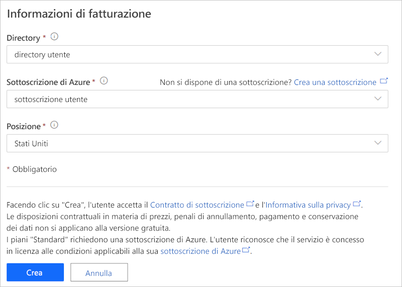

# Esercitazione: Distribuire ed esaminare un modello di applicazione di logistica connessa

Questa esercitazione presenta un'introduzione del modello di applicazione di *logistica connessa* di IoT Central. Verrà illustrato come distribuire e usare il modello.

In questa esercitazione verranno illustrate le procedure per:

> [!div class="checklist"]
> * Creare un'applicazione di logistica connessa.
> * Usare le principali funzionalità dell'applicazione.
> * Usare il dashboard per visualizzare l'attività delle operazioni critiche del dispositivo di logistica.
> * Usare il modello di dispositivo
> * Seguire le regole
> * Usare i processi

## Prerequisiti

* Non sono previsti prerequisiti specifici per distribuire questa app.
* È possibile usare il piano tariffario gratuito o una sottoscrizione di Azure.

## Creare un'applicazione di logistica connessa

Creare l'applicazione seguendo questa procedura:

1. Passare al sito per la [creazione di app Azure IoT Central](https://aka.ms/iotcentral). Eseguire quindi l'accesso con un account Microsoft personale, aziendale o dell'istituto di istruzione. Selezionare **Compila** sulla barra di spostamento sinistra e quindi selezionare la scheda **Vendita al dettaglio**:

    :::image type="content" source="media/tutorial-iot-central-connected-logistics/iotc-retail-homepage.png" alt-text="Modello di logistica connessa":::

2. Selezionare **Crea app** in **Logistica connessa**.

3. Dopo la selezione di **Crea app** viene aperto il modulo **Nuova applicazione**. Immettere i dettagli seguenti:

    * **Nome applicazione**: è possibile usare il nome suggerito predefinito o immettere il nome descrittivo dell'applicazione.
    * **URL**: è possibile usare l'URL predefinito suggerito o immettere un URL univoco descrittivo facile da ricordare. È consigliabile usare l'impostazione predefinita se si dispone già di una sottoscrizione di Azure. È possibile iniziare con il piano tariffario della versione di valutazione gratuita valida 7 giorni e scegliere di convertirlo in un piano tariffario standard in qualsiasi momento prima della scadenza.
    * **Info di fatturazione**: Per effettuare il provisioning delle risorse sono necessari i dettagli relativi alla directory, alla sottoscrizione di Azure e all'area.
    * **Creazione**: Selezionare Crea nella parte inferiore della pagina per distribuire l'applicazione.

    :::image type="content" source="media/tutorial-iot-central-connected-logistics/connected-logistics-app-create.png" alt-text="Modello di logistica connessa":::

    :::image type="content" source="media/tutorial-iot-central-connected-logistics/connected-logistics-app-create-billinginfo.png" alt-text="Modello di logistica connessa":::

## Esaminare l'applicazione

Lo screenshot seguente mostra come selezionare il modello di applicazione di logistica connessa.

> [!div class="mx-imgBorder"]
> 

Le sezioni seguenti illustrano le principali funzionalità dell'applicazione.

### Dashboard

Dopo aver distribuito il modello di applicazione, il dashboard predefinito è un portale di logistica connessa incentrato sull'operatore. Northwind Trader è un provider di logistica fittizio che gestisce una flotta di mezzi per il trasporto merci via mare e via terra. In questo dashboard verranno visualizzati due gateway diversi che forniscono dati di telemetria sulle spedizioni, insieme ai comandi, ai processi e alle azioni associati.

> [!div class="mx-imgBorder"]
> 

> [!div class="mx-imgBorder"]
> 

Il dashboard è preconfigurato per mostrare l'attività delle operazioni critiche del dispositivo di logistica.

Il dashboard rende disponibili due operazioni diverse per la gestione dei dispositivi gateway:

* Visualizzare i percorsi di logistica per le spedizioni tramite camion e i dettagli sulle posizioni delle spedizioni via mare.
* Visualizzare lo stato del gateway e le informazioni pertinenti.

:::image type="content" source="media/tutorial-iot-central-connected-logistics/connected-logistics-dashboard1.png" alt-text="Modello di logistica connessa":::

* È possibile tenere traccia del numero totale di gateway, dei tag attivi e di quelli sconosciuti.
* È possibile eseguire operazioni di gestione dei dispositivi, ad esempio aggiornare il firmware, disabilitare e abilitare i sensori, nonché aggiornare una soglia dei sensori, gli intervalli di telemetria e i contratti di servizio dei dispositivi.
* Visualizzare il consumo della batteria dei dispositivi.

:::image type="content" source="media/tutorial-iot-central-connected-logistics/connected-logistics-dashboard2.png" alt-text="Modello di logistica connessa":::

#### Modello di dispositivo

Selezionare **Modelli di dispositivo** per visualizzare il modello di funzionalità del gateway. Un modello di funzionalità è strutturato in base alle interfacce **Gateway Telemetry & Property** (Telemetria e proprietà gateway) e **Gateway Commands** (Comandi gateway).

**Gateway Telemetry & Property**: questa interfaccia definisce tutti i dati di telemetria relativi a sensori, posizione e informazioni sui dispositivi. Definisce anche le funzionalità delle proprietà dei dispositivi gemelli, ad esempio le soglie dei sensori e gli intervalli di aggiornamento.

:::image type="content" source="media/tutorial-iot-central-connected-logistics/connected-logistics-devicetemplate1.png" alt-text="Modello di logistica connessa":::

**Gateway Commands**: questa interfaccia organizza tutte le funzionalità dei comandi del gateway:

:::image type="content" source="media/tutorial-iot-central-connected-logistics/connected-logistics-devicetemplate2.png" alt-text="Modello di logistica connessa":::

### Regole

Selezionare la scheda **Rules** (Regole) che contiene le regole per questo modello di applicazione. Queste regole sono configurate per inviare notifiche tramite posta elettronica agli operatori per ulteriori indagini:

**Gateway theft alert** (Avviso di furto gateway): questa regola viene attivata in caso di rilevamento di luce imprevista da parte dei sensori durante il viaggio. Gli operatori devono ricevere una notifica immediatamente per indagare su potenziali furti.

**Unresponsive Gateway** (Nessuna risposta del gateway): questa regola verrà attivata se il gateway non comunica con il cloud per un periodo di tempo prolungato. Il gateway potrebbe non rispondere a causa della batteria scarica, della perdita di connettività o di danni al dispositivo.

:::image type="content" source="media/tutorial-iot-central-connected-logistics/connected-logistics-rules.png" alt-text="Modello di logistica connessa":::

### Processi

Selezionare la scheda **Jobs** (Processi) per visualizzare i processi nell'applicazione:

:::image type="content" source="media/tutorial-iot-central-connected-logistics/connected-logistics-jobs.png" alt-text="Modello di logistica connessa":::

È possibile usare i processi per eseguire operazioni a livello di applicazione. I processi in questa applicazione usano i comandi dei dispositivi e le funzionalità dei dispositivi gemelli per eseguire attività come la disabilitazione di specifici sensori in tutti i gateway o la modifica della soglia dei sensori in base alla modalità di spedizione e al percorso:

* Si tratta di un'operazione standard per disabilitare i sensori d'urto durante la spedizione via mare, in modo da conservare carica della batteria, o per diminuire la soglia della temperatura durante il trasporto con catena del freddo.

* I processi consentono di eseguire operazioni a livello di sistema, ad esempio l'aggiornamento del firmware nei gateway o l'aggiornamento del contratto di servizio per rimanere aggiornati sulle attività di manutenzione.

## Pulire le risorse

Se non si intende continuare a usare questa applicazione, eliminare il modello di applicazione scegliendo **Amministrazione** > **Impostazioni applicazione** e quindi **Elimina**.

:::image type="content" source="media/tutorial-iot-central-connected-logistics/connected-logistics-cleanup.png" alt-text="Modello di logistica connessa":::

## Passaggi successivi
* Altre informazioni su: 
> [!div class="nextstepaction"]
> [Concetti della logistica connessa](./architecture-connected-logistics.md)
* Altre informazioni sui altri [modelli di vendita al dettaglio di IoT Central](./overview-iot-central-retail.md)
* Altre informazioni su [IoT Central](../core/overview-iot-central.md)
