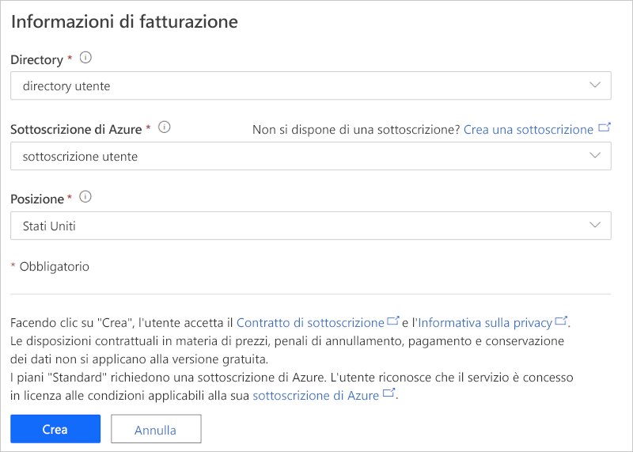

# Esercitazione: Distribuire ed esaminare un modello di applicazione del centro distribuzione digitale

Questa esercitazione illustra come iniziare a distribuire un modello di applicazione del **centro distribuzione digitale** per IoT Central. Si apprenderà come distribuire il modello e quali sono gli elementi inclusi per impostazione predefinita. Verranno inoltre fornite informazioni sulle possibili operazioni successive.

In questa esercitazione si apprenderà come: 
* Creare un'applicazione per il centro distribuzione digitale 
* Esaminare l'applicazione 

## Prerequisiti
* Non sono richiesti prerequisiti specifici per distribuire l'app
* È consigliabile avere una sottoscrizione di Azure, ma è anche possibile provare senza

## Creare un modello di applicazione del centro distribuzione digitale

È possibile creare un'applicazione seguendo questa procedura:

1. Passare al sito Web di gestione applicazioni di Azure IoT Central. Selezionare **Compila** dalla barra di spostamento a sinistra e quindi fare clic sulla scheda **Retail**.

    > [!div class="mx-imgBorder"]
    > 

2. Selezionare la scheda **Retail** e quindi **Crea app** in **Centro di distribuzione digitale**

3. **Crea app** consente di aprire il modulo Nuova applicazione e di specificare i dettagli richiesti, come illustrato di seguito.
   **Nome applicazione**: è possibile usare il nome suggerito predefinito o immettere il nome descrittivo dell'applicazione.
   **URL**: è possibile usare l'URL predefinito suggerito o immettere un URL univoco descrittivo facile da ricordare. È consigliabile usare l'impostazione predefinita se si dispone già di una sottoscrizione di Azure. È possibile iniziare con il piano tariffario della versione di valutazione gratuita valida 7 giorni e scegliere di convertirlo in un piano tariffario standard in qualsiasi momento prima della scadenza.
   **Info di fatturazione**: Per effettuare il provisioning delle risorse sono necessari i dettagli relativi alla directory, alla sottoscrizione di Azure e all'area.
   **Creazione**: Selezionare Crea nella parte inferiore della pagina per distribuire l'applicazione.

    > [!div class="mx-imgBorder"]
    > 

    > [!div class="mx-imgBorder"]
    > 

## Esaminare il dashboard dell'applicazione 

Al termine della distribuzione del modello di app, il dashboard predefinito è rappresentato da un portale incentrato sull'operatore del centro distribuzione. Northwind Trader è un provider di soluzioni per il centro di distribuzione fittizio per la gestione di sistemi di trasmissione. 

In questo dashboard verranno visualizzati un gateway e una telecamera che funge da dispositivo IoT. Il gateway fornisce dati di telemetria su pacchetti, ad esempio pacchetti validi, non validi, non identificati, nonché dimensioni e proprietà dei dispositivi gemelli associati. Tutti i comandi downstream vengono eseguiti su dispositivi IoT, ad esempio una videocamera. Questo dashboard è preconfigurato per presentare l'attività critica delle operazioni del dispositivo del centro distribuzione.

Il dashboard è organizzato in modo logico per mostrare le funzionalità di gestione dei dispositivi del gateway Azure IoT e del dispositivo IoT.  
   * È possibile eseguire comandi del gateway e attività di controllo
   * Gestire tutte le fotocamere che fanno parte della soluzione. 

> [!div class="mx-imgBorder"]
> 

## Modello di dispositivo

Fare clic sulla scheda Modelli di dispositivo per visualizzare il modello di funzionalità del gateway. Un modello di funzionalità è strutturato su due interfacce diverse **Videocamera** e **Digital Distribution Gateway** (Gateway di distribuzione digitale)

> [!div class="mx-imgBorder"]
> 

**Videocamera**: questa interfaccia organizza tutte le funzionalità di comando specifiche della videocamera 

> [!div class="mx-imgBorder"]
> 

**Digital Distribution Gateway** (Gateway di distribuzione digitale): questa interfaccia rappresenta tutti i dati di telemetria provenienti dalla videocamera, le proprietà dei dispositivi gemelli definite nel cloud e le informazioni sul gateway.

> [!div class="mx-imgBorder"]
> 

## Comandi del gateway
Questa interfaccia organizza tutte le funzionalità di comando del gateway

> [!div class="mx-imgBorder"]
> 

## Regole
Selezionare la scheda delle regole per visualizzare due regole diverse presenti in questo modello di applicazione. Queste regole sono configurate per inviare notifiche tramite posta elettronica agli operatori per altre indagini.

 **Too many invalid packages alert** (Troppi avvisi di pacchetti non validi): questa regola viene attivata quando la videocamera rileva un numero elevato di pacchetti non validi che passano attraverso il sistema di trasmissione.
 
**Large package** (Pacchetto grande): questa regola viene attivata se la telecamera rileva un pacchetto enorme per cui non è possibile eseguire il controllo della qualità. 

> [!div class="mx-imgBorder"]
> 

## Processi
Selezionare la scheda dei processi per visualizzare cinque diversi processi che fanno parte di questo modello di applicazione: È possibile usare la funzionalità dei processi per eseguire operazioni a livello di soluzione. I processi del centro di distribuzione digitale usano i comandi del dispositivo e funzionalità dei dispositivi gemelli per eseguire attività, ad esempio:
   * Taratura della videocamera prima dell'avvio del rilevamento del pacchetto 
   * Aggiornamento periodico del firmware della videocamera
   * Modifica dell'intervallo di telemetria per gestire il caricamento dei dati

> [!div class="mx-imgBorder"]
> 

## Pulire le risorse
Se non si intende continuare a usare questa applicazione, eliminare il modello di applicazione scegliendo **Amministrazione** > **Impostazioni applicazione** e facendo clic su **Elimina**.

> [!div class="mx-imgBorder"]
> 

## Passaggi successivi
* Informazioni sull'architettura della soluzione per centro di distribuzione digitale 
> [!div class="nextstepaction"]
> [Concetti del centro di distribuzione digitale](./architecture-digital-distribution-center.md)
* Altre informazioni sui altri [modelli di vendita al dettaglio di IoT Central](./overview-iot-central-retail.md)
* Per altre informazioni su IoT Central fare riferimento a [Panoramica di IoT Central](../core/overview-iot-central.md)
