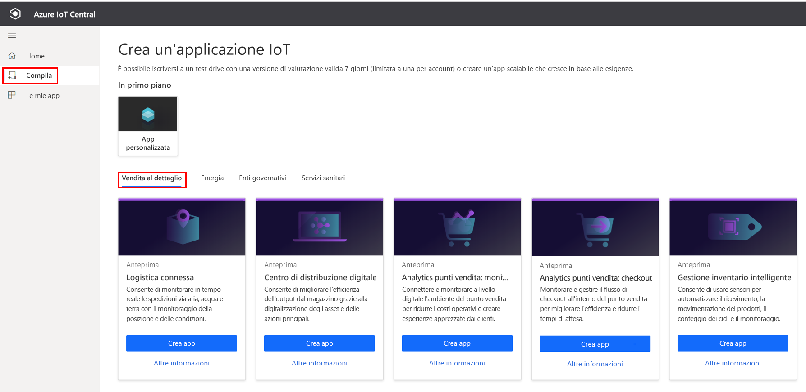
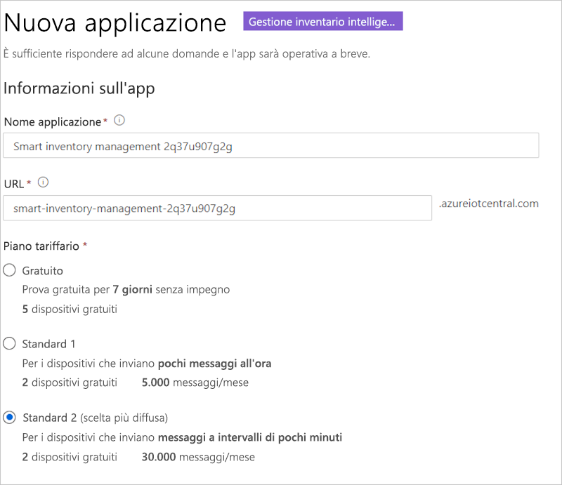
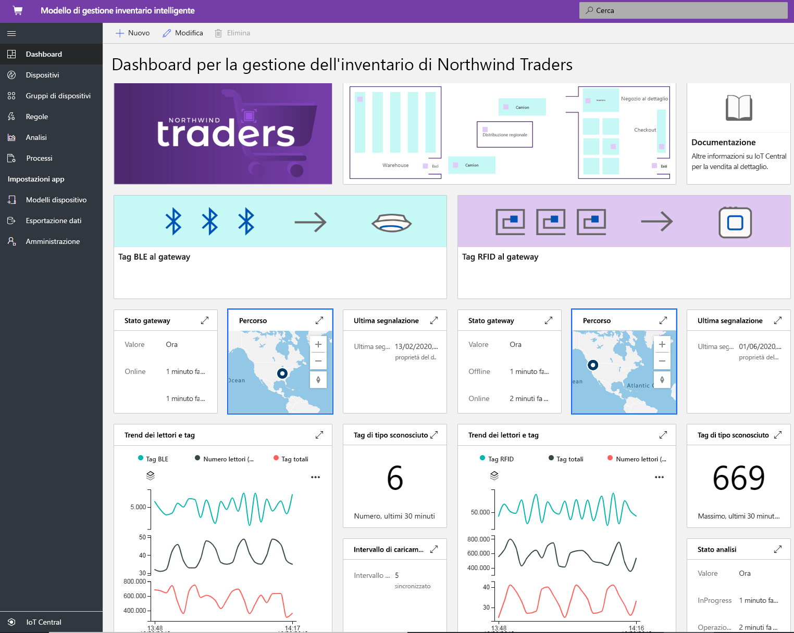
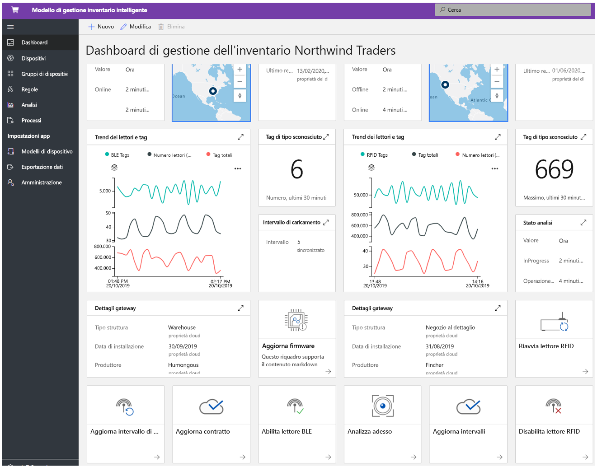
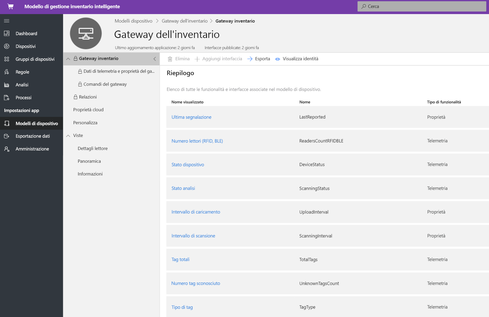
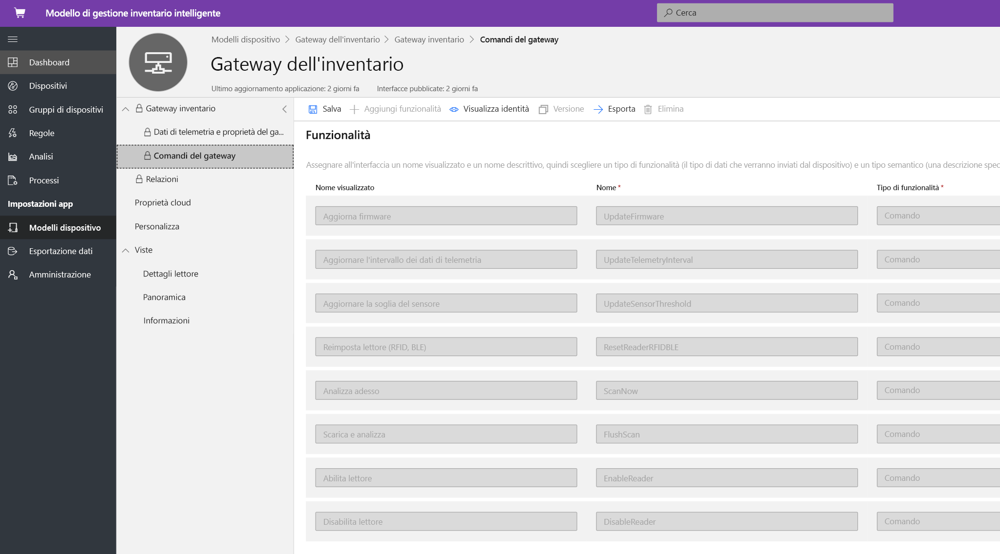
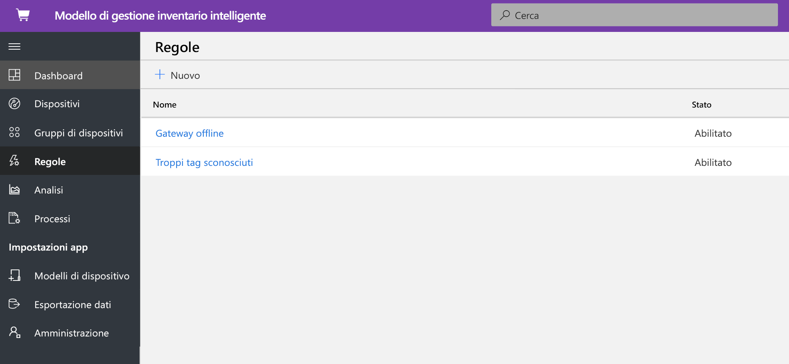
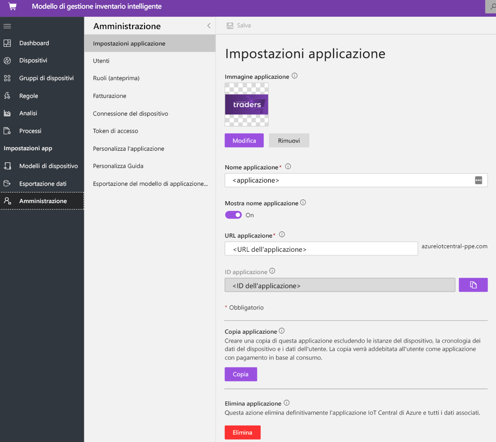

# Esercitazione: Distribuire ed esaminare un modello di applicazione Gestione inventario intelligente

[!INCLUDE [iot-central-pnp-original](../../../includes/iot-central-pnp-original-note.md)]

Questa esercitazione illustra come iniziare a distribuire un modello di applicazione **Gestione inventario intelligente** di IoT Central. Si apprenderà come distribuire il modello e quali sono gli elementi inclusi per impostazione predefinita. Verranno inoltre fornite informazioni sulle possibili operazioni successive.

In questa esercitazione si apprenderà come: 
* Creare un'applicazione di gestione dell'inventario intelligente 
* Esaminare l'applicazione 

## Prerequisiti
* Non sono richiesti prerequisiti specifici per distribuire l'app
* È consigliabile avere una sottoscrizione di Azure, ma è anche possibile provare senza

## Creare un modello di applicazione Gestione inventario intelligente

È possibile creare un'applicazione seguendo questa procedura:
1. Passare al sito Web di gestione applicazioni di Azure IoT Central. Selezionare **Compila** dalla barra di spostamento a sinistra e quindi fare clic sulla scheda **Retail**.

> [!div class="mx-imgBorder"]
> 

2. Selezionare la scheda **Retail** e **Crea app** in ** Gestione inventario intelligente**

3. **Crea app** consente di aprire il modulo Nuova applicazione e di specificare i dettagli richiesti, come illustrato di seguito.
   **Nome applicazione**: è possibile usare il nome suggerito predefinito o immettere il nome descrittivo dell'applicazione.
   **URL**: è possibile usare l'URL predefinito suggerito o immettere un URL univoco descrittivo facile da ricordare. L'impostazione predefinita è consigliata se si ha già una sottoscrizione di Azure. In caso contrario, è possibile iniziare con una versione di valutazione gratuita di sette giorni e scegliere di convertire il pagamento in base al consumo in qualsiasi momento prima della scadenza della versione di valutazione gratuita.
   **Info di fatturazione**: Per effettuare il provisioning delle risorse sono necessari i dettagli relativi alla directory, alla sottoscrizione di Azure e all'area.
   **Creazione**: Selezionare Crea nella parte inferiore della pagina per distribuire l'applicazione.

> [!div class="mx-imgBorder"]
> 

## Esaminare l'applicazione 

### dashboard 
Dopo aver distribuito il modello di app, la dashboard predefinita sarà un portale incentrato sull'operatore di gestione dell'inventario intelligente. Northwind Trader è un provider di inventario intelligente fittizio che gestisce il magazzino con Bluetooth a basso consumo (BLE) e il punto vendita al dettaglio con la tecnologia RFID (Radio Frequency Identification). Nella dashboard verranno visualizzati due gateway diversi che forniscono dati di telemetria sull'inventario insieme ai comandi, ai processi e alle azioni associati che è possibile eseguire. La dashboard è preconfigurata per presentare l'attività critica delle operazioni del dispositivo di gestione dell'inventario intelligente.
La dashboard è suddivisa logicamente tra due diverse operazioni di gestione dei dispositivi gateway, 
   * Il magazzino è dotato di un gateway BLE fisso e tag BLE sui pallet per reperire e rintracciare le merci in una struttura più ampia
   * Il punto vendita al dettaglio è dotato di un gateway RFID fisso e tag RFID a livello di singolo elemento per reperire e rintracciare le merci in un negozio al dettaglio
   * Visualizzare la posizione del gateway, lo stato e i dettagli correlati 

> [!div class="mx-imgBorder"]
> 

   * È possibile tenere traccia facilmente del numero totale di gateway, dei tag attivi e sconosciuti.
   * È possibile eseguire operazioni di gestione dei dispositivi, ad esempio l'aggiornamento del firmware, la disabilitazione del sensore, l'abilitazione del sensore, l'aggiornamento della soglia del sensore, l'aggiornamento degli intervalli di telemetria e l'aggiornamento dei contratti di servizio dei dispositivi
   * I dispositivi gateway possono eseguire la gestione dell'inventario su richiesta con un'analisi completa o incrementale.

> [!div class="mx-imgBorder"]
> 

## Modello di dispositivo
Fare clic sulla scheda Modelli di dispositivo per visualizzare il modello di funzionalità del gateway. Un modello di funzionalità è strutturato su due interfacce diverse: **Gateway Telemetry & Property** (Telemetria e proprietà gateway) e **Gateway Commands** (Comandi gateway)

**Gateway Telemetry & Property** (Telemetria e proprietà gateway): questa interfaccia rappresenta tutti i dati di telemetria correlati a sensori, le informazioni sulla posizione e il dispositivo e la funzionalità della proprietà di dispositivo gemello, ad esempio le soglie dei gateway e gli intervalli di aggiornamento.

> [!div class="mx-imgBorder"]
> 

**Gateway Commands** (Comandi gateway): questa interfaccia organizza tutte le funzionalità dei comandi del gateway

> [!div class="mx-imgBorder"]
> 

## Regole
Selezionare la scheda delle regole per visualizzare due regole diverse presenti in questo modello di applicazione. Queste regole sono configurate per inviare notifiche tramite posta elettronica agli operatori per altre indagini.

**Gateway offline**: Questa regola verrà attivata se il gateway non comunica con il cloud per un periodo prolungato. Il gateway potrebbe non rispondere a causa della modalità di batteria scarica, della perdita di connettività, dell'integrità del dispositivo.

**Unknown tags** (Tag sconosciuti): È fondamentale tenere traccia di ogni tag RFID e BLE associato a un asset. Se il gateway rileva troppi tag sconosciuti significa che sono presenti problemi di sincronizzazione con le applicazioni di generazione dei tag.

> [!div class="mx-imgBorder"]
> 

## Processi
Selezionare la scheda dei processi per visualizzare cinque diversi processi che fanno parte di questo modello di applicazione: È possibile usare la funzionalità dei processi per eseguire operazioni a livello di soluzione. I processi di gestione dell'inventario usano i comandi del dispositivo e funzionalità dei dispositivi gemelli per eseguire attività, ad esempio:
   * disabilitare i lettori in tutto il gateway
   * modificare la soglia di dei dati di telemetria 
   * eseguire un'analisi dell'inventario su richiesta nell'intera soluzione.

> [!div class="mx-imgBorder"]
> 

## Pulire le risorse

Se non si intende continuare a usare questa applicazione, eliminare il modello di applicazione scegliendo **Amministrazione** > **Impostazioni applicazione** e facendo clic su **Elimina**.

> [!div class="mx-imgBorder"]
> 

## Passaggi successivi
* Altre informazioni sul [concetto di gestione dell'inventario intelligente](./architecture-smart-inventory-management-pnp.md)
* Altre informazioni sui altri [modelli di vendita al dettaglio di IoT Central](./overview-iot-central-retail-pnp.md)
* Per altre informazioni su IoT Central fare riferimento a [Panoramica di IoT Central](../preview/overview-iot-central.md)
