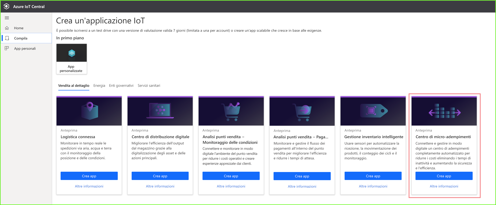
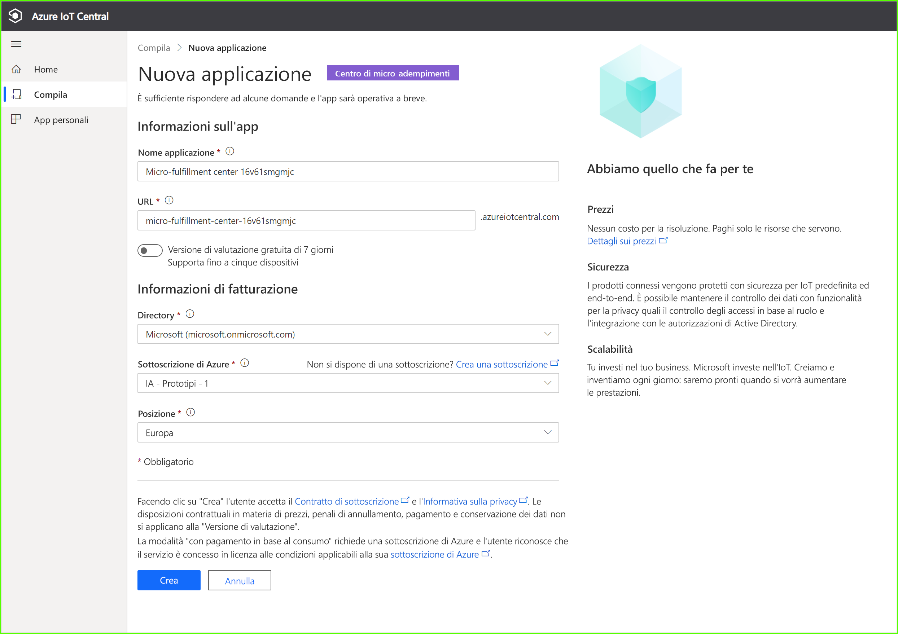
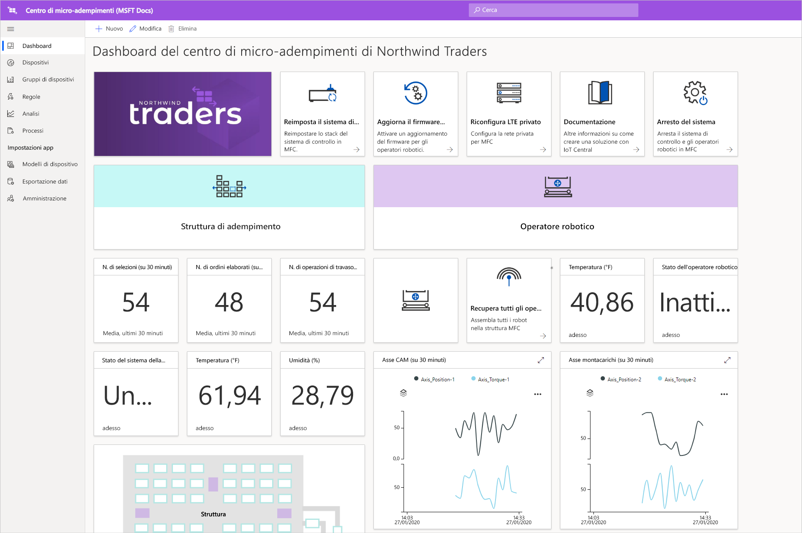
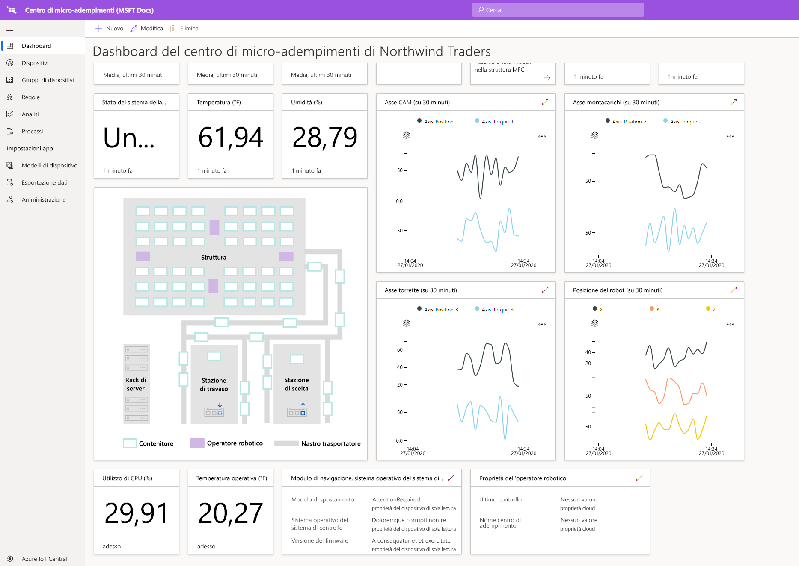
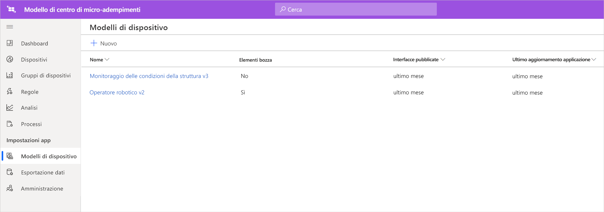
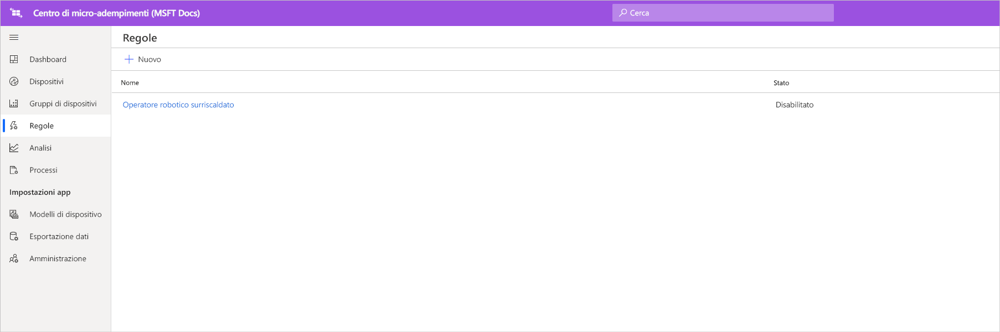
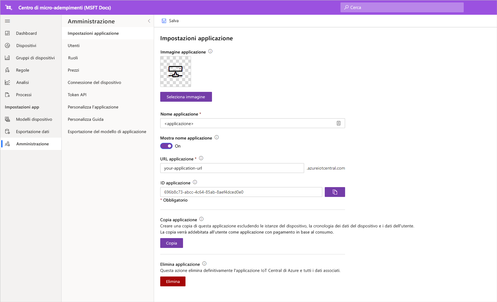

# Esercitazione: Distribuire ed esaminare un modello di applicazione Centro di micro-adempimenti

In questa esercitazione verrà usato il modello di applicazione ***Centro di micro-adempimenti*** di Azure IoT Central per mostrare come creare una soluzione retail. Si apprenderà come distribuire il modello, quali componenti predefiniti sono inclusi e quali operazioni è possibile eseguire successivamente.

In questa esercitazione verranno illustrate le procedure per: 
> [!div class="checklist"]
> * Usare il modello **Centro di micro-adempimenti** di Azure IoT Central per creare un'applicazione retail
> * Esaminare l'applicazione 

## Prerequisites
Per completare questa serie di esercitazioni, sono necessari gli elementi seguenti:
* Una sottoscrizione di Azure. Facoltativamente, è possibile usare una versione di valutazione gratuita valida per 7 giorni. Se non si ha una sottoscrizione di Azure, è possibile crearne una nella [pagina di iscrizione ad Azure](https://aka.ms/createazuresubscription).

## Creare un'applicazione 
In questa sezione viene creata una nuova applicazione Azure IoT Central da un modello. Questa applicazione verrà usata in tutta la serie di esercitazioni per creare una soluzione completa.

Per creare una nuova applicazione Azure IoT Central:

1. Passare al sito Web di [gestione applicazioni di Azure IoT Central](https://aka.ms/iotcentral).
1. Se si ha una sottoscrizione di Azure, accedere con le credenziali usate per tale sottoscrizione, altrimenti accedere usando un account Microsoft:

   

1. Per iniziare a creare una nuova applicazione Azure IoT Central, selezionare **Nuova applicazione**.

1. Selezionare **Vendita al dettaglio**.  Nella pagina relativa alla vendita al dettaglio sono visualizzati diversi modelli di applicazione di vendita al dettaglio.

Per creare una nuova applicazione Centro di micro-adempimenti che usa le funzionalità di anteprima:  
1. Selezionare il modello di applicazione **Centro di micro-adempimenti**. Questo modello include i modelli di tutti i dispositivi usati nell'esercitazione. Include anche un dashboard operatore per il monitoraggio delle condizioni all'interno del centro di adempimenti, oltre che delle condizioni degli operatori robotici. 

    > [!div class="mx-imgBorder"]
    > 
    
1. Facoltativamente, scegliere un **nome applicazione** descrittivo.  Il modello di applicazione si basa sulla società fittizia Northwind Traders. 

    > [!NOTE]
    > Se si usa un **nome applicazione** descrittivo, è comunque necessario usare un valore univoco per l'**URL** dell'applicazione.

1. Se si ha una sottoscrizione di Azure, immettere i valori relativi a *directory, sottoscrizione di Azure e area*. Se non si ha una sottoscrizione, è possibile abilitare la **versione di valutazione gratuita di 7 giorni** e completare le informazioni di contatto richieste.  

    Per altre informazioni su directory e sottoscrizioni, vedere la [guida introduttiva per la creazione di un'applicazione](../preview/quick-deploy-iot-central.md).

1. Selezionare **Create** (Crea).

> [!div class="mx-imgBorder"]
> 

## Esaminare l'applicazione 

### Dashboard 

Dopo aver correttamente distribuito il modello di app, verrà visualizzato prima di tutto il **dashboard del centro di micro-adempimenti di Northwind Traders**. Northwind Traders è un rivenditore fittizio che ha un centro di micro-adempimenti gestito in questa applicazione IoT Central. Nel dashboard operatore si vedranno le informazioni e i dati di telemetria sui dispositivi di tale modello insieme a un set di comandi, processi e azioni che è possibile eseguire. Il dashboard è diviso in modo logico in due sezioni, sinistra e destra. A sinistra è possibile monitorare le condizioni ambientali all'interno della struttura di adempimenti e a destra l'integrità di un operatore robotico nella struttura.  

Dal dashboard è possibile:
   * Visualizzare dati di telemetria, come il numero di prelievi, il numero di ordini elaborati e proprietà come lo stato del sistema della struttura e così via.  
   * Visualizzare la **pianta** e la posizione degli operatori robotici all'interno della struttura di adempimenti.
   * Attivare i comandi, ad esempio per reimpostare il sistema di controllo, aggiornare il firmware degli operatori, riconfigurare la rete e così via.

> [!div class="mx-imgBorder"]
> 
   * Vedere un esempio del dashboard che un operatore può usare per monitorare le condizioni all'interno del centro di adempimenti. 
   * Monitorare l'integrità dei payload in esecuzione del dispositivo gateway all'interno del centro di adempimenti.    

> [!div class="mx-imgBorder"]
> 

## Modello di dispositivo
Se si fa clic sulla scheda Modelli di dispositivo, si noterà che fanno parte del modello due tipi diversi di dispositivi: 
   * **Operatore robotico**: questo modello di dispositivo rappresenta la definizione di operatore robotico funzionante distribuito nella struttura di adempimenti che esegue le operazioni appropriate di archiviazione e recupero. Se si fa clic sul modello, si noterà che il robot invia dati sui dispositivi, come temperatura e posizione dell'asse, e proprietà come stato dell'operatore robotico e così via. 
   * **Monitoraggio delle condizioni della struttura**: questo modello di dispositivo rappresenta una raccolta di dispositivi che consente di monitorare condizioni ambientali, oltre al dispositivo gateway che ospita vari carichi di lavoro perimetrali per supportare il centro di adempimenti. Il dispositivo invia dati di telemetria come temperatura, numero di prelievi, numero di ordini e così via in aggiunta allo stato e all'integrità dei carichi di lavoro di elaborazione in esecuzione nell'ambiente. 

> [!div class="mx-imgBorder"]
> 

Se si fa clic sulla scheda Gruppi di dispositivi, si noterà inoltre che per questi modelli di dispositivi vengono creati automaticamente gruppi di dispositivi.

## Regole
Passando alla scheda Regole, si noterà che il modello di applicazione include una regola di esempio per il monitoraggio delle condizioni della temperatura per l'operatore robotico. È possibile usare questa regola per avvisare l'operatore se un robot specifico nella struttura si sta surriscaldando e deve essere portato offline per la manutenzione. 

Usare la regola di esempio come spunto per definire regole più appropriate per le proprie funzioni aziendali.

   - **Operatore robotico surriscaldato**: questa regola viene attivata se l'operatore robotico raggiunge una soglia di temperatura in un periodo di tempo. 

> [!div class="mx-imgBorder"]
> 

## Pulire le risorse

Se non si intende continuare a usare questa applicazione, eliminare il modello di applicazione scegliendo **Amministrazione** > **Impostazioni applicazione** e facendo clic su **Elimina**.

> [!div class="mx-imgBorder"]
> 

## Passaggi successivi
* Altre informazioni sull'[architettura della soluzione per il centro di micro-adempimenti](./architecture-micro-fulfillment-center-pnp.md)
* Altre informazioni sui altri [modelli di vendita al dettaglio di IoT Central](./overview-iot-central-retail-pnp.md)
* Per altre informazioni su IoT Central fare riferimento a [Panoramica di IoT Central](../preview/overview-iot-central.md)