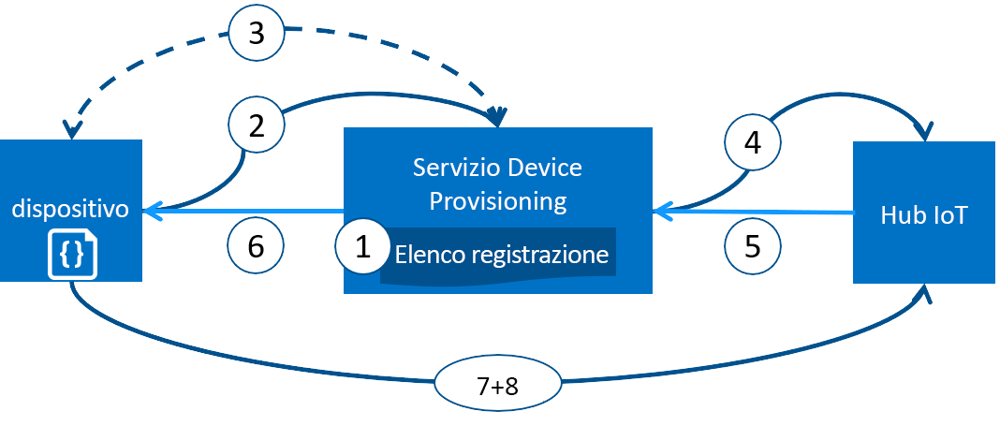

# Provisioning di dispositivi con il servizio di Provisioning di Azure IoT Hub dispositivo
Microsoft Azure include un ampio set di servizi cloud pubblici integrati per tutte le esigenze di soluzioni IoT. Device Provisioning in hub IoT di Azure è un servizio di assistenza per l'hub IoT che consente il provisioning JIT automatico, permettendo ai clienti di effettuare il provisioning di milioni di dispositivi in modo sicuro e scalabile.

## Quando usare il servizio Device Provisioning
Esistono molti scenari in cui il servizio Device Provisioning rappresenta una scelta eccellente per connettere i dispositivi e configurarli nell'hub IoT, ad esempio:

* Provisioning automatico a una singola soluzione IoT senza informazioni di connessione hardcoded nell'hub IoT in fabbrica (configurazione iniziale)
* Bilanciamento del carico dei dispositivi tra più hub
* Connessione di dispositivi alla soluzione IoT del proprietario in base ai dati di transazione delle vendite (multi-tenancy)
* Connessione di dispositivi a una soluzione IoT specifica a seconda del caso di utilizzo (isolamento della soluzione)
* Connessione di un dispositivo all'hub IoT con latenza minima (partizionamento dell'area geografica)
* Nuovo provisioning a seguito di una modifica nel dispositivo
* Distribuzione delle chiavi usate dal dispositivo per connettersi all'hub IoT (quando non usa i certificati X.509 per la connessione)

## Dietro le quinte
Tutti gli scenari elencati nella sezione precedente possono essere applicati usando il servizio di provisioning per effettuare il provisioning automatico con lo stesso flusso. Molti dei passaggi manuali tradizionalmente previsti nel provisioning sono diventati automatici con il servizio Device Provisioning. Questo ha consentito di ridurre il tempo di distribuzione dei dispositivi IoT e il rischio di errori manuali. Di seguito vengono descritte le operazioni che vengono eseguite prima che un dispositivo possa ottenere il provisioning. Il primo passaggio è manuale, mentre tutti gli altri sono automatici.

1. Il produttore del dispositivo aggiunge le informazioni di registrazione del dispositivo all'elenco di registrazione nel portale di Azure.
2. Il dispositivo contatta l'endpoint del servizio di provisioning impostato in fabbrica. Il dispositivo passa al servizio di provisioning le informazioni di identificazione che lo riguardano per dimostrare la propria identità.
3. Il servizio di provisioning convalida l'identità del dispositivo convalidando la chiave e l'ID di registrazione rispetto alla voce che trova nell'elenco di registrazione tramite una richiesta di verifica nonce ([Trusted Platform Module](https://trustedcomputinggroup.org/work-groups/trusted-platform-module/)) o una verifica X.509 standard (X.509).
4. Il servizio di provisioning registra il dispositivo con un hub IoT e popola lo [stato gemello desiderato](../iot-hub/iot-hub-devguide-device-twins.md) del dispositivo.
5. L'hub IoT restituisce le informazioni sull'ID del dispositivo al servizio di provisioning.
6. Il servizio di provisioning restituisce le informazioni di connessione all'hub IoT al dispositivo. Il dispositivo può ora iniziare a inviare i dati direttamente all'hub IoT.
7. Il dispositivo si connette all'hub IoT.
8. Il dispositivo ottiene lo stato desiderato dal dispositivo gemello nell'hub IoT.

## Processo di provisioning
Il processo di distribuzione di un dispositivo a cui partecipa il servizio Device Provisioning prevede due fasi distinte che possono essere svolte in maniera indipendente:

* La **fase di produzione** che riguarda la costruzione e la preparazione in fabbrica del dispositivo.
* La **fase di configurazione del cloud** in cui il servizio Device Provisioning viene configurato per il provisioning automatico.

Entrambe queste fasi rientrano senza soluzione di continuità nei processi di produzione e di distribuzione esistenti. Il servizio Device Provisioning semplifica addirittura alcuni processi di distribuzione che richiedono molto lavoro manuale per ottenere le informazioni di connessione sul dispositivo.

### Fase di produzione
Questa fase riguarda tutto ciò che accade nella linea di produzione. I ruoli coinvolti in questa fase includono il progettista e il produttore dei componenti al silicio, l'integratore e/o il produttore finale del dispositivo. Questa fase riguarda la creazione dell'hardware.

Il servizio Device Provisioning non introduce un nuovo passaggio nel processo di produzione, piuttosto si unisce al passaggio esistente che installa il software iniziale e (idealmente) il modulo di protezione hardware nel dispositivo. Invece di creare un ID dispositivo in questo passaggio, il dispositivo viene semplicemente programmato con le informazioni del servizio di provisioning in modo che, all'accensione, esegua automaticamente la chiamata al servizio di provisioning per ottenere le informazioni di connessione e l'assegnazione della soluzione IoT.

In questa fase il produttore fornisce anche le informazioni della chiave di identificazione al distributore/operatore del dispositivo. Questa operazione può essere semplice quanto confermare che tutti i dispositivi hanno un certificato X.509 generato da un certificato di firma ottenuto dal distributore/operatore del dispositivo o richiedere l'estrazione della parte pubblica di una chiave di verifica autenticità TPM da ogni dispositivo TPM. Questi servizi sono oggi offerti da molti produttori di componenti al silicio.

### Fase di configurazione del cloud
Questa fase riguarda la configurazione del cloud per un corretto provisioning automatico. In questa fase vengono in genere coinvolti due tipi di utenti: uno che conosce il modo in cui eseguire la configurazione iniziale dei dispositivi (un operatore del dispositivo) e uno che sa come devono essere suddivisi i dispositivi tra gli hub IoT (operatore della soluzione).

La configurazione iniziale del provisioning è un'operazione che avviene una volta sola ed è gestita in genere dall'operatore della soluzione. Dopo che è stato configurato, il servizio di provisioning non deve essere più modificato a meno che non sia necessario modificare il caso d'uso.

Il servizio configurato per il provisioning automatico deve successivamente essere preparato per la registrazione dei dispositivi. Questa operazione viene eseguita dall'operatore del dispositivo, che conosce la configurazione desiderata dei dispositivi e che deve assicurarsi che il servizio di provisioning sia in grado di attestare correttamente l'identità del dispositivo quando questo esegue la ricerca del proprio hub IoT. L'operatore del dispositivo riceve le informazioni relative alla chiave di identificazione dal produttore e le aggiunge all'elenco di registrazione. L'elenco di registrazione può essere soggetto ad aggiornamenti successivi man mano che vengono inserite nuove voci o quelle esistenti vengono aggiornate con le informazioni più recenti sui dispositivi.

## Registrazione e provisioning
Il termine *provisioning* implica varie operazioni a seconda del settore in cui viene usato. Nel contesto di provisioning di dispositivi IoT alla relativa soluzione cloud, il provisioning è un processo in due fasi:

1. La prima consiste nello stabilire la connessione iniziale tra il dispositivo e la soluzione IoT tramite la registrazione del dispositivo.
2. La seconda consiste nell'applicare la configurazione adeguata al dispositivo in base ai requisiti specifici della soluzione in cui il dispositivo è stato registrato.

Al termine di questi due passaggi, il provisioning del dispositivo può considerarsi completato. Alcuni servizi cloud prevedono solo il primo passaggio del processo di provisioning, vale a dire la registrazione dei dispositivi presso l'endpoint della soluzione IoT, ma non la configurazione iniziale. Il servizio Device Provisioning automatizza entrambi i passaggi, semplificando così l'esperienza di provisioning dei dispositivi.

## Funzionalità del servizio Device Provisioning
Il servizio Device Provisioning Service include molte funzionalità che lo rendono una soluzione ideale per il provisioning dei dispositivi.

* Supporto dell'**attestazione protetta** sia per le entità basate sul certificato X.509 che per quelle basate sul modulo TPM.
* **Elenco di registrazione** contenente il record completo dei dispositivi/gruppi di dispositivi che con il tempo potrebbero registrarsi. L'elenco di registrazione contiene le informazioni sulla configurazione desiderata del dispositivo registrato e può essere aggiornato in qualsiasi momento.
* **Più criteri di allocazione** per controllare la modalità con cui il servizio Device Provisioning assegna i dispositivi agli hub IoT per supportare gli scenari del cliente.
* **Registri di diagnostica e monitoraggio** per assicurarsi che tutto funzioni correttamente.
* **Supporto di più hub** per consentire al servizio Device Provisioning di assegnare dispositivi a più di un hub IoT. Il servizio Device Provisioning può dialogare con gli hub tramite più sottoscrizioni di Azure.
* **Supporto tra aree** per consentire al servizio Device Provisioning di assegnare dispositivi IoT a hub in altre aree.

È possibile approfondire i concetti e le funzionalità del provisioning dei dispositivi in [device concepts](concepts-device.md) (Concetti sui dispositivi), [service concepts](concepts-service.md) (Concetti sul servizio) e [security concepts](concepts-security.md) (Concetti sulla sicurezza).

## Supporto multipiattaforma
Come tutti i servizi IoT di Azure, il servizio Device Provisioning opera su più piattaforme con vari sistemi operativi. Azure offre SDK open source in un'ampia gamma di [lingue](https://github.com/Azure/azure-iot-sdks) per facilitare la connessione dei dispositivi e la gestione del servizio. Il servizio Device Provisioning supporta i protocolli seguenti per la connessione di dispositivi:

* HTTPS
* AMQP
* AMQP su WebSocket
* MQTT
* MQTT su WebSocket

Il servizio Device Provisioning supporta solo le connessioni HTTPS per le operazioni nel servizio.

## Regioni
Il servizio Device Provisioning è disponibile in numerose aree. L'elenco delle aree esistenti e annunciate di recente per i tutti i servizi viene sempre aggiornato è disponibile in [Aree di Azure](https://azure.microsoft.com/regions/). È possibile visualizzare dove è disponibile il servizio Device Provisioning nella pagina [Stato di Azure](https://azure.microsoft.com/status/).

> [!NOTE]
> Il servizio Device Provisioning è globale e non è associato a una località. Tuttavia, è necessario specificare un'area in cui risiederanno i metadati associati al profilo del servizio Device Provisioning.

## Disponibilità
Manteniamo un Contratto di servizio al 99,9% per il servizio Device Provisioning ed è possibile [leggere tale contratto](https://azure.microsoft.com/support/legal/sla/iot-hub/). La versione completa del [contratto di servizio di Azure](https://azure.microsoft.com/support/legal/sla/) descrive la disponibilità garantita di Azure nel suo complesso.

## Quote
Ogni sottoscrizione di Azure ha limiti di quota predefiniti che possono influire sull'ambito della soluzione IoT del cliente. Il limite attuale per ogni sottoscrizione è di 10 servizi Device Provisioning per sottoscrizione.

Per altre informazioni sui limiti di quota:

* [Limiti del servizio di sottoscrizione di Azure](../azure-subscription-service-limits.md)

## Componenti di Azure correlati
Il servizio Device Provisioning automatizza il provisioning dei dispositivi con l'hub IoT di Azure. Altre informazioni sull'[hub IoT](https://docs.microsoft.com/azure/iot-hub/).

## Passaggi successivi
Dopo questa panoramica del provisioning dei dispositivi IoT in Azure, il passaggio successivo consiste nel provare uno scenario di IoT end-to-end.
> [!div class="nextstepaction"]
> [Set up IoT Hub Device Provisioning Service with the Azure portal](quick-setup-auto-provision.md) (Configurare il servizio Device Provisioning in hub IoT con il portale di Azure) 
> [Create and provision a simulated device](quick-create-simulated-device.md) (Creare un dispositivo simulato ed effettuarne il provisioning) 
> [Set up device for provisioning](tutorial-set-up-device.md) (Configurare il dispositivo per il provisioning)
