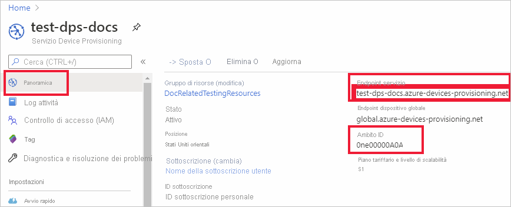
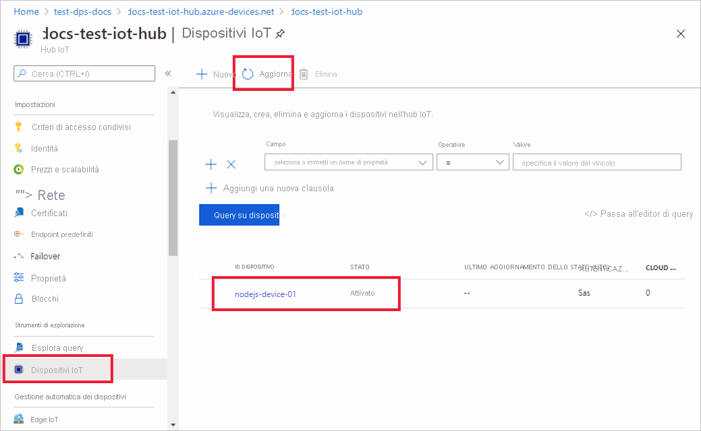

# <a name="quickstart-provision-a-symmetric-key-device-using-nodejs"></a>Avvio rapido: Effettuare il provisioning di un dispositivo con chiave simmetrica in Node.js

Questo argomento di avvio rapido illustra come effettuare il provisioning di un computer di sviluppo Windows come un dispositivo in un hub IoT usando Node.js. Il dispositivo userà una chiave simmetrica e una registrazione singola per l'autenticazione con un'istanza del servizio Device Provisioning per poter essere assegnato a un hub IoT. Per effettuare il provisioning del dispositivo, verrà usato codice di esempio di [Azure IoT SDK per Node.js](https://github.com/Azure/azure-iot-sdk-node.git). 

Questo articolo illustra il provisioning con una registrazione singola, ma è anche possibile usare gruppi di registrazioni. Esistono alcune differenze quando si usano i gruppi di registrazioni. È ad esempio necessario usare una chiave di dispositivo derivata con un ID registrazione univoco per il dispositivo. L'articolo [Come effettuare il provisioning di dispositivi usando gruppi di registrazioni con chiave simmetrica](how-to-legacy-device-symm-key.md) include un esempio di gruppo di registrazioni. Per altre informazioni sui gruppi di registrazioni, vedere [Attestazione con chiave simmetrica delle registrazioni di gruppo](concepts-symmetric-key-attestation.md#group-enrollments).

Se non si ha familiarità con il processo di provisioning automatico, vedere la panoramica sul [provisioning](about-iot-dps.md#provisioning-process). 

Assicurarsi anche di avere completato la procedura descritta in [Configurare il servizio Device Provisioning in hub IoT con il portale di Azure](./quick-setup-auto-provision.md) prima di continuare con questa guida introduttiva. Questa guida introduttiva prevede che sia già stata creata un'istanza del servizio Device Provisioning.

Questo articolo si riferisce a una workstation basata su Windows. Tuttavia, è possibile eseguire le procedure in Linux. Per un esempio di Linux, vedere [Come effettuare il provisioning per la multi-tenancy](how-to-provision-multitenant.md).


[!INCLUDE [quickstarts-free-trial-note](../../includes/quickstarts-free-trial-note.md)]


## <a name="prerequisites"></a>Prerequisiti

- Conoscenza dei concetti relativi al [provisioning](about-iot-dps.md#provisioning-process).
- Completamento dell'esercitazione [Configurare il servizio Device Provisioning in hub IoT con il portale di Azure](./quick-setup-auto-provision.md).
- Un account Azure con una sottoscrizione attiva. [È possibile crearne uno gratuitamente](https://azure.microsoft.com/free/?ref=microsoft.com&utm_source=microsoft.com&utm_medium=docs&utm_campaign=visualstudio).
- [Node.js v4.0 o versioni successive](https://nodejs.org).
- [Git](https://git-scm.com/download/).


## <a name="create-a-device-enrollment"></a>Creare una registrazione dei dispositivi

1. Accedere al [portale di Azure](https://portal.azure.com), selezionare il pulsante **Tutte le risorse** nel menu a sinistra e aprire un'istanza del servizio Device Provisioning.

2. Selezionare **Gestisci registrazioni** e quindi fare clic sul pulsante **Aggiungi registrazione singola** nella parte superiore. 

3. Nel pannello **Aggiungi registrazione** immettere le informazioni seguenti e premere il pulsante **Salva**.

   - **Meccanismo:** selezionare **Chiave simmetrica** come *meccanismo* di attestazione dell'identità.

   - **Genera chiavi automaticamente** : selezionare questa casella.

   - **ID registrazione** : immettere un ID di registrazione per identificare la registrazione. Usare solo caratteri alfanumerici minuscoli e trattini ("-"). Ad esempio, **symm-key-nodejs-device-01**.

   - **ID dispositivo hub IoT:** immettere un identificatore di dispositivo. Ad esempio, **nodejs-device-01**.

     

4. Dopo aver salvato la registrazione, la **chiave primaria** e la **chiave secondaria** verranno generate e aggiunte alla voce di registrazione. La registrazione del dispositivo con chiave simmetrica verrà visualizzata come **symm-key-nodejs-device-01** nella colonna *ID registrazione* della scheda *Registrazioni singole*. 

5. Aprire la registrazione e copiare il valore della **chiave primaria** generata. Questo valore di chiave e l' **ID registrazione** verranno usati successivamente, al momento dell'aggiunta delle variabili di ambiente da usare con il codice di esempio per il provisioning del dispositivo.


## <a name="prepare-the-nodejs-environment"></a>Preparare l'ambiente Node.js 

1. Aprire una shell CMD Git o un ambiente della riga di comando Bash Git. Clonare il repository GitHub di [Azure IoT SDK per Node.js](https://github.com/Azure/azure-iot-sdk-node.git) usando il comando seguente:

    ```cmd
    git clone https://github.com/Azure/azure-iot-sdk-node.git --recursive
    ```


<a id="firstbootsequence"></a>

## <a name="prepare-the-device-provisioning-code"></a>Preparare il codice per il provisioning del dispositivo

In questa sezione verranno aggiunte le quattro variabili di ambiente seguenti che verranno usate come parametri del codice di esempio relativo al provisioning di dispositivi per effettuare il provisioning del dispositivo con chiave simmetrica. 

* `PROVISIONING_HOST`
* `PROVISIONING_IDSCOPE`
* `PROVISIONING_REGISTRATION_ID`
* `PROVISIONING_SYMMETRIC_KEY`

Il codice di provisioning contatterà l'istanza del servizio Device Provisioning in base a queste variabili per autenticare il dispositivo. Il dispositivo verrà quindi assegnato a un hub IoT già collegato all'istanza del servizio Device Provisioning in base alla configurazione della registrazione singola. Una volta effettuato il provisioning, il codice di esempio invierà alcuni dati di telemetria di test all'hub IoT.

1. Nel [portale di Azure](https://portal.azure.com) selezionare **Panoramica** nel menu del servizio Device Provisioning e copiare i valori per _Endpoint servizio_ e _ID ambito_. Questi valori vengono usati per le variabili di ambiente `PROVISIONING_HOST` e `PROVISIONING_IDSCOPE`.

    

2. Aprire un prompt dei comandi per l'esecuzione dei comandi di Node.js e passare alla directory *provisioning/device/samples* seguente.

    ```cmd
    cd azure-iot-sdk-node/provisioning/device/samples
    ```

3. Nella cartella *provisioning/device/samples* aprire *register_symkey.js* ed esaminare il codice. 

    Come si può notare, il codice di esempio imposta un payload personalizzato.

    ```nodejs
    provisioningClient.setProvisioningPayload({a: 'b'});
    ```

    Questo codice non è necessario nell'ambito di questo avvio rapido. È un esempio di impostazione di un payload personalizzato se si vuole usare una funzione di allocazione personalizzata per assegnare il dispositivo a un hub IoT. Per altre informazioni, vedere [Esercitazione: Usare criteri di allocazione personalizzati](tutorial-custom-allocation-policies.md).

    Il metodo `provisioningClient.register()` tenta di eseguire la registrazione del dispositivo.

    Per registrare il dispositivo non sarà necessario apportare modifiche al codice di esempio.

4. Al prompt dei comandi aggiungere le variabili di ambiente per l'host di provisioning, l'ambito ID, l'ID registrazione e la chiave simmetrica primaria copiati dalla registrazione singola nella sezione precedente.  

    I comandi seguenti sono esempi che illustrano la sintassi dei comandi. Assicurarsi di usare i valori corretti.

    ```console
    set PROVISIONING_HOST=test-dps-docs.azure-devices-provisioning.net
    ```

    ```console
    set PROVISIONING_IDSCOPE=0ne00000A0A
    ```

    ```console
    set PROVISIONING_REGISTRATION_ID=symm-key-nodejs-device-01
    ```

    ```console
    set PROVISIONING_SYMMETRIC_KEY=sbDDeEzRuEuGKag+kQKV+T1QGakRtHpsERLP0yPjwR93TrpEgEh/Y07CXstfha6dhIPWvdD1nRxK5T0KGKA+nQ==
    ```


4. Compilare ed eseguire il codice di esempio tramite i comandi seguenti.

    ```console
    npm install
    ```

    ```console
    node register_symkey.js
    ```

5. L'output previsto dovrebbe essere simile a quello riportato di seguito, che mostra l'hub IoT collegato a cui è stato assegnato il dispositivo in base alle impostazioni della registrazione singola. La stringa "Hello World" viene inviata all'hub come messaggio di test:

    ```output
    D:\Docs\test\azure-iot-sdk-node\provisioning\device\samples>node register_symkey.js
    registration succeeded
    assigned hub=docs-test-iot-hub.azure-devices.net
    deviceId=nodejs-device-01
    payload=undefined
    Client connected
    send status: MessageEnqueued    
    ```
    
6. Nel portale di Azure passare all'hub IoT collegato al servizio di provisioning e aprire il pannello **Dispositivi IoT**. Al termine del provisioning del dispositivo a chiave simmetrica nell'hub, l'ID dispositivo verrà visualizzato con lo *STATO* **abilitato**. Potrebbe essere necessario premere il pulsante **Aggiorna** nella parte superiore se il pannello è stato aperto prima dell'esecuzione del codice di esempio del dispositivo. 

     

> [!NOTE]
> Se si è modificato lo *stato iniziale del dispositivo gemello* rispetto al valore predefinito della voce di registrazione del dispositivo, è possibile eseguire il pull dello stato del dispositivo desiderato dall'hub e agire di conseguenza. Per altre informazioni, vedere [Comprendere e usare dispositivi gemelli nell'hub IoT](../iot-hub/iot-hub-devguide-device-twins.md).
>


## <a name="clean-up-resources"></a>Pulire le risorse

Se si prevede di continuare a usare ed esplorare l'esempio di client dispositivo, non eseguire la pulizia delle risorse create in questa guida di avvio rapido. Se non si intende continuare, seguire questa procedura per eliminare tutte le risorse create in questa guida.

1. Nel portale di Azure selezionare **Tutte le risorse** nel menu a sinistra e quindi il servizio Device Provisioning. Aprire **Gestisci registrazioni** per il servizio e quindi selezionare la scheda **Registrazioni singole**. Selezionare la casella di controllo accanto all' *ID registrazione* del dispositivo registrato in questa guida di avvio rapido e fare clic sul pulsante **Elimina** nella parte superiore del riquadro. 
1. Nel menu a sinistra nel portale di Azure selezionare **Tutte le risorse** e quindi selezionare l'hub IoT. Aprire il pannello **Dispositivi IoT** per l'hub, selezionare la casella di controllo accanto all' *ID dispositivo* del dispositivo registrato in questa guida di avvio rapido e quindi fare clic sul pulsante **Elimina** nella parte superiore del riquadro.

## <a name="next-steps"></a>Passaggi successivi

In questa guida di avvio rapido è stato effettuato il provisioning di un dispositivo a chiave simmetrica basato su Windows nell'hub IoT usando il servizio Device Provisioning in hub IoT. Per informazioni su come effettuare il provisioning di dispositivi con certificati X.509 usando Node.js, continuare con la guida di avvio rapido seguente per i dispositivi X.509. 

> [!div class="nextstepaction"]
> [Avvio rapido di Azure - Effettuare il provisioning di dispositivi X.509 con il servizio Device Provisioning e Node.js](quick-create-simulated-device-x509-node.md)
