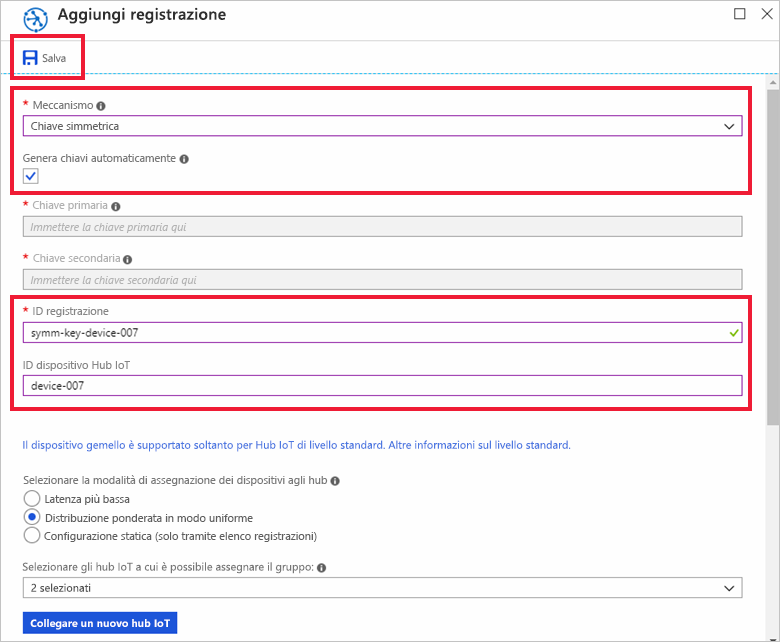
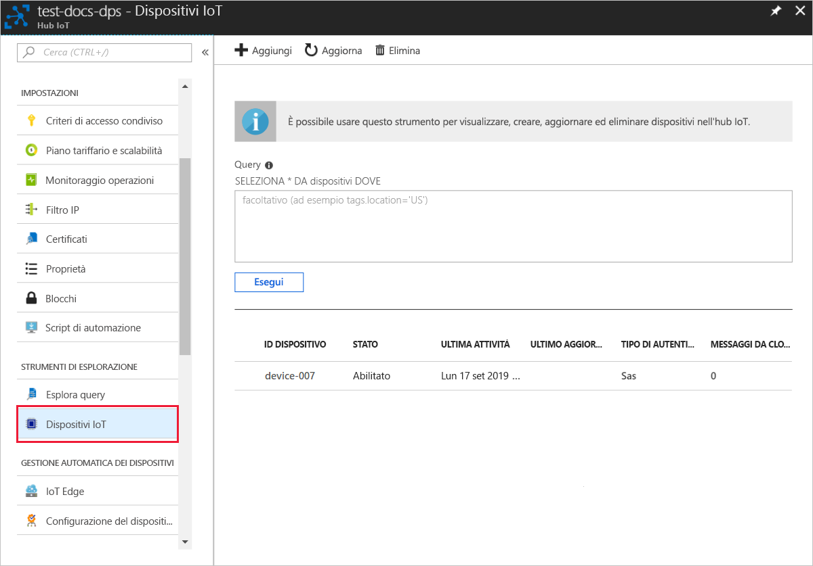

# <a name="quickstart-provision-a-simulated-device-with-symmetric-keys"></a>Guida introduttiva: Effettuare il provisioning di un dispositivo simulato con chiavi simmetriche

In questa guida introduttiva si apprenderà come creare ed eseguire un simulatore di dispositivo in un computer di sviluppo Windows. Si configurerà il dispositivo simulato per usare una chiave simmetrica da autenticare con un'istanza del servizio Device Provisioning e da assegnare a un hub IoT. Si userà un codice di esempio da [Azure IoT C SDK](https://github.com/Azure/azure-iot-sdk-c) per simulare una sequenza di avvio per il dispositivo che avvia il processo di provisioning. Il dispositivo verrà riconosciuto in base alla registrazione singola nell'istanza del servizio di provisioning e assegnato all'hub IoT.

Sebbene questo articolo illustri il provisioning con una registrazione singola, è possibile utilizzare le stesse procedure con i gruppi di registrazioni. L'unica differenza è che è necessario usare una chiave di dispositivo derivata con un ID di registrazione univoco per il dispositivo. Con i gruppi di registrazione, la chiave simmetrica della registrazione non viene utilizzata direttamente. Anche se i gruppi di registrazione di chiave simmetrica non sono limitati per i dispositivi legacy, in [Come eseguire il provisioning di dispositivi legacy usando l'attestazione di chiave simmetrica](how-to-legacy-device-symm-key.md) viene fornito un esempio di gruppo di registrazione. Per altre informazioni, vedere [Attestazione con chiave simmetrica delle registrazioni di gruppo](concepts-symmetric-key-attestation.md#group-enrollments).

Se non si ha familiarità con il processo di provisioning automatico, vedere [Concetti relativi al provisioning automatico](concepts-auto-provisioning.md). 

Assicurarsi anche di avere completato la procedura descritta in [Configurare il servizio Device Provisioning in hub IoT con il portale di Azure](./quick-setup-auto-provision.md) prima di continuare con questa guida introduttiva. Questa guida introduttiva prevede che sia già stata creata un'istanza del servizio Device Provisioning.

Questo articolo si riferisce a una workstation basata su Windows. Tuttavia, è possibile eseguire le procedure in Linux. Per un esempio di Linux, vedere [Come effettuare il provisioning per la multi-tenancy](how-to-provision-multitenant.md).


[!INCLUDE [quickstarts-free-trial-note](../../includes/quickstarts-free-trial-note.md)]


## <a name="prerequisites"></a>Prerequisiti

* [Visual Studio](https://visualstudio.microsoft.com/vs/) 2015 o versione successiva con il carico di lavoro [Sviluppo di applicazioni desktop con C++](https://www.visualstudio.com/vs/support/selecting-workloads-visual-studio-2017/) abilitato.
* La versione più recente di [Git](https://git-scm.com/download/) installata.


<a id="setupdevbox"></a>

## <a name="prepare-an-azure-iot-c-sdk-development-environment"></a>Preparare un ambiente di sviluppo per Azure IoT C SDK

In questa sezione si preparerà un ambiente di sviluppo usato per compilare [Azure IoT C SDK](https://github.com/Azure/azure-iot-sdk-c). 

L'SDK include il codice di esempio per un dispositivo simulato. Il dispositivo simulato tenterà di effettuare il provisioning durante la sequenza di avvio del dispositivo.

1. Scaricare il [sistema di compilazione CMake](https://cmake.org/download/).

    È importante che nel computer siano installati i prerequisiti di Visual Studio (Visual Studio e carico di lavoro 'Sviluppo di applicazioni desktop con C++') **prima** di avviare l'installazione di `CMake`. Quando i prerequisiti sono pronti e il download è stato verificato, installare il sistema di compilazione CMake.

2. Aprire un prompt dei comandi o la shell Git Bash. Eseguire il comando seguente per clonare il repository GitHub Azure IoT C SDK:
    
    ```cmd/sh
    git clone https://github.com/Azure/azure-iot-sdk-c.git --recursive
    ```
    Il completamento di questa operazione richiederà alcuni minuti.


3. Creare una sottodirectory `cmake` nella directory radice del repository Git e passare a tale cartella. 

    ```cmd/sh
    cd azure-iot-sdk-c
    mkdir cmake
    cd cmake
    ```

4. Eseguire il comando seguente che compila una versione dell'SDK specifica per la piattaforma di sviluppo client. Verrà generata una soluzione di Visual Studio per il dispositivo simulato nella directory `cmake`. 

    ```cmd
    cmake -Dhsm_type_symm_key:BOOL=ON -Duse_prov_client:BOOL=ON  ..
    ```
    
    Se `cmake` non trova il compilatore C++, si potrebbero verificare errori di compilazione durante l'esecuzione del comando precedente. In tal caso, provare a eseguire questo comando nel [prompt dei comandi di Visual Studio](https://docs.microsoft.com/dotnet/framework/tools/developer-command-prompt-for-vs). 

    Al termine della compilazione, le ultime righe di output saranno simili all'output seguente:

    ```cmd/sh
    $ cmake -Dhsm_type_symm_key:BOOL=ON -Duse_prov_client:BOOL=ON  ..
    -- Building for: Visual Studio 15 2017
    -- Selecting Windows SDK version 10.0.16299.0 to target Windows 10.0.17134.
    -- The C compiler identification is MSVC 19.12.25835.0
    -- The CXX compiler identification is MSVC 19.12.25835.0

    ...

    -- Configuring done
    -- Generating done
    -- Build files have been written to: E:/IoT Testing/azure-iot-sdk-c/cmake
    ```

## <a name="create-a-device-enrollment-entry-in-the-portal"></a>Creare una voce per la registrazione del dispositivo nel portale

1. Accedere al portale di Azure, selezionare il pulsante **Tutte le risorse** nel menu a sinistra e aprire il servizio Device Provisioning.

2. Selezionare **Gestisci registrazioni** e quindi fare clic sul pulsante **Aggiungi registrazione singola** nella parte superiore. 

3. Nel pannello **Aggiungi registrazione** immettere le informazioni seguenti e premere il pulsante **Salva**.

   - **Meccanismo**: selezionare **Chiave simmetrica** come *meccanismo* di attestazione dell'identità.

   - **Genera chiavi automaticamente**: selezionare questa casella.

   - **ID di registrazione**: immettere un ID di registrazione per identificare la registrazione. Usare solo caratteri alfanumerici minuscoli e trattini ("-"). Ad esempio, **symm-key-device-007**.

   - **ID dispositivo hub IoT:** Immettere un identificatore di dispositivo. Ad esempio: **device-007**.

     

4. Dopo aver salvato la registrazione, la **chiave primaria** e la **chiave secondaria** verranno generate e aggiunte alla voce di registrazione. La registrazione del dispositivo di chiave simmetrica verrà visualizzato come **symm-key-device-007** nella colonna *ID registrazione* della scheda *Registrazioni singole*. 

    Aprire la registrazione e copiare il valore della **chiave primaria** generata.


<a id="firstbootsequence"></a>

## <a name="simulate-first-boot-sequence-for-the-device"></a>Simulare la sequenza del primo avvio per il dispositivo

In questa sezione verrà aggiornato il codice di esempio per inviare la sequenza di avvio del dispositivo all'istanza del servizio Device Provisioning. Con questa sequenza di avvio il dispositivo verrà riconosciuto e assegnato a un hub IoT collegato all'istanza del servizio Device Provisioning.


1. Nel portale di Azure selezionare la scheda **Panoramica** per il servizio Device Provisioning e prendere nota del valore di **_Ambito ID_** .

     

2. In Visual Studio aprire il file di soluzione **azure_iot_sdks.sln** generato in precedenza tramite l'esecuzione di CMake. Il file di soluzione deve trovarsi nel percorso seguente:

    ```
    \azure-iot-sdk-c\cmake\azure_iot_sdks.sln
    ```

3. Nella finestra *Esplora soluzioni* di Visual Studio passare alla cartella **Provision\_Samples**. Espandere il progetto di esempio denominato **prov\_dev\_client\_sample**. Espandere **File di origine** e aprire **prov\_dev\_client\_sample.c**.

4. Trovare la costante `id_scope` e sostituire il valore con il valore **Ambito ID** copiato in precedenza. 

    ```c
    static const char* id_scope = "0ne00002193";
    ```

5. Trovare la definizione per la funzione `main()` nello stesso file. Assicurarsi che la variabile`hsm_type` sia impostata su `SECURE_DEVICE_TYPE_SYMMETRIC_KEY` come illustrato di seguito:

    ```c
    SECURE_DEVICE_TYPE hsm_type;
    //hsm_type = SECURE_DEVICE_TYPE_TPM;
    //hsm_type = SECURE_DEVICE_TYPE_X509;
    hsm_type = SECURE_DEVICE_TYPE_SYMMETRIC_KEY;
    ```

6. Individuare la chiamata a `prov_dev_set_symmetric_key_info()` in **prov\_dev\_client\_sample.c** che è impostata come commento.

    ```c
    // Set the symmetric key if using they auth type
    //prov_dev_set_symmetric_key_info("<symm_registration_id>", "<symmetric_Key>");
    ```

    Rimuovere il commento dalla chiamata alla funzione e sostituire i valori di segnaposto (incluse le parentesi angolari) con l'ID registrazione e i valori di chiave primaria.

    ```c
    // Set the symmetric key if using they auth type
    prov_dev_set_symmetric_key_info("symm-key-device-007", "your primary key here");
    ```
   
    Salvare il file.

7. Fare clic con il pulsante destro del mouse sul progetto **prov\_dev\_client\_sample** e scegliere **Imposta come progetto di avvio**. 

8. Nel menu di Visual Studio selezionare **Debug** > **Avvia senza eseguire debug** per eseguire la soluzione. Nella richiesta di ricompilare il progetto fare clic su **Sì** per ricompilare il progetto prima dell'esecuzione.

    Il seguente output è un esempio di dispositivo simulato che si avvia correttamente e si connette all'istanza del servizio di provisioning da assegnare all'hub IoT:

    ```cmd
    Provisioning API Version: 1.2.8

    Registering Device

    Provisioning Status: PROV_DEVICE_REG_STATUS_CONNECTED
    Provisioning Status: PROV_DEVICE_REG_STATUS_ASSIGNING
    Provisioning Status: PROV_DEVICE_REG_STATUS_ASSIGNING

    Registration Information received from service: 
    test-docs-hub.azure-devices.net, deviceId: device-007    
    Press enter key to exit:
    ```

9. Nel portale passare all'hub IoT a cui è stato assegnato il dispositivo simulato e selezionare la scheda **Dispositivi IoT**. Al termine del provisioning del dispositivo simulato nell'hub, il relativo ID dispositivo verrà visualizzato nel pannello **Dispositivi IoT** con *STATO* **abilitato**. Potrebbe essere necessario premere il pulsante **Aggiorna** nella parte superiore. 

     


## <a name="clean-up-resources"></a>Pulire le risorse

Se si prevede di continuare a usare ed esplorare l'esempio di client dispositivo, non eseguire la pulizia delle risorse create in questa guida di avvio rapido. Se non si intende continuare, seguire questa procedura per eliminare tutte le risorse create in questa guida.

1. Chiudere la finestra di output di esempio di client del dispositivo sul computer.
1. Nel portale di Azure selezionare **Tutte le risorse** nel menu a sinistra e quindi il servizio Device Provisioning. Aprire **Gestisci registrazioni** per il servizio e quindi selezionare la scheda **Registrazioni singole**. Selezionare la casella di controllo accanto all'*ID registrazione* del dispositivo registrato in questa guida di avvio rapido e fare clic sul pulsante **Elimina** nella parte superiore del riquadro. 
1. Nel portale di Azure selezionare **Tutte le risorse** nel menu a sinistra e quindi l'hub IoT. Aprire il pannello **Dispositivi IoT** per l'hub, selezionare la casella di controllo accanto all'*ID dispositivo* del dispositivo registrato in questa guida di avvio rapido e quindi fare clic sul pulsante **Elimina** nella parte superiore del riquadro.

## <a name="next-steps"></a>Passaggi successivi

In questo argomento di avvio rapido è stato creato un dispositivo simulato nel computer Windows e ne è stato effettuato il provisioning nell'hub IoT usando la chiave simmetrica con il servizio Device Provisioning in hub IoT di Azure nel portale. Per informazioni su come registrare il dispositivo a livello di codice, passare all'argomento di avvio rapido per la registrazione a livello di codice dei dispositivi X.509. 

> [!div class="nextstepaction"]
> [Avvio rapido di Azure: Registrare dispositivi X.509 nel servizio Device Provisioning in hub IoT di Azure](quick-enroll-device-x509-java.md)
