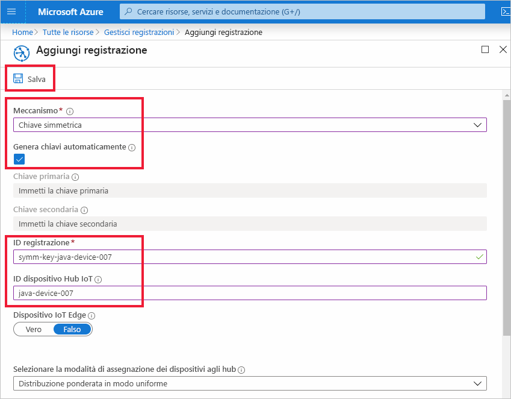
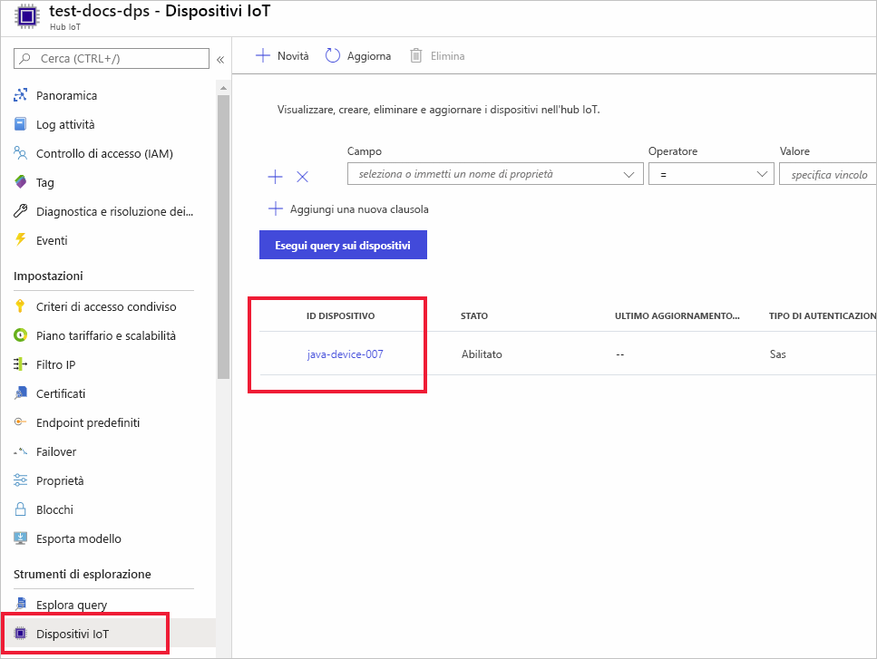

# <a name="quickstart-provision-a-simulated-device-to-iot-hub-with-symmetric-keys"></a>Effettuare il provisioning di un dispositivo simulato nell'hub IoT con chiavi simmetriche

In questa guida introduttiva si apprenderà come creare ed eseguire un simulatore di dispositivo in un computer di sviluppo Windows. Questo dispositivo simulato verrà configurato per usare una chiave simmetrica per l'autenticazione con un'istanza del servizio Device Provisioning e verrà assegnato a un hub IoT. Si userà un codice di esempio degli [SDK per IoT di Microsoft Azure per Java](https://github.com/Azure/azure-iot-sdk-java) per simulare una sequenza di avvio per il dispositivo che avvia il processo di provisioning. Il dispositivo verrà riconosciuto in base alla registrazione singola nell'istanza del servizio di provisioning e verrà assegnato a un hub IoT.

Anche se questo articolo illustra il provisioning con una registrazione singola, è possibile usare gruppi di registrazioni. Esistono alcune differenze quando si usano i gruppi di registrazioni. È ad esempio necessario usare una chiave di dispositivo derivata con un ID registrazione univoco per il dispositivo. Anche se i gruppi di registrazione di chiave simmetrica non sono limitati per i dispositivi legacy, in [Come eseguire il provisioning di dispositivi legacy usando l'attestazione di chiave simmetrica](how-to-legacy-device-symm-key.md) viene fornito un esempio di gruppo di registrazione. Per altre informazioni, vedere [Attestazione con chiave simmetrica delle registrazioni di gruppo](concepts-symmetric-key-attestation.md#group-enrollments).

Se non si ha familiarità con il processo di provisioning automatico, vedere la panoramica sul [provisioning](about-iot-dps.md#provisioning-process). 

Assicurarsi anche di avere completato la procedura descritta in [Configurare il servizio Device Provisioning in hub IoT con il portale di Azure](./quick-setup-auto-provision.md) prima di continuare con questa guida introduttiva. Questa guida introduttiva prevede che sia già stata creata un'istanza del servizio Device Provisioning.

Questo articolo si riferisce a una workstation basata su Windows. Tuttavia, è possibile eseguire le procedure in Linux. Per un esempio di Linux, vedere [Come effettuare il provisioning per la multi-tenancy](how-to-provision-multitenant.md).


[!INCLUDE [quickstarts-free-trial-note](../../includes/quickstarts-free-trial-note.md)]


## <a name="prerequisites"></a>Prerequisiti 

* Verificare che [Java SE Development Kit 8](https://aka.ms/azure-jdks) o versione successiva sia installato nel computer.

* Scaricare e installare [Maven](https://maven.apache.org/install.html).

* La versione più recente di [Git](https://git-scm.com/download/) installata.

<a id="setupdevbox"></a>

## <a name="prepare-the-java-sdk-environment"></a>Preparare l'ambiente Java SDK 

1. Verificare che Git sia installato nel computer e che venga aggiunto alle variabili di ambiente accessibili alla finestra di comando. Vedere gli [strumenti client Git di Software Freedom Conservancy](https://git-scm.com/download/) per la versione più recente degli strumenti `git` da installare, tra cui **Git Bash**, l'app da riga di comando che è possibile usare per interagire con il repository Git locale. 

2. Aprire un prompt dei comandi. Clonare il repository GitHub per l'esempio di codice di simulazione del dispositivo:
    
    ```cmd/sh
    git clone https://github.com/Azure/azure-iot-sdk-java.git --recursive
    ```
3. Passare alla directory radice `azure-iot-sdk-java` e compilare il progetto per scaricare tutti i pacchetti necessari.
   
   ```cmd/sh
   cd azure-iot-sdk-java
   mvn install -DskipTests=true
   ```

## <a name="create-a-device-enrollment"></a>Creare una registrazione dei dispositivi

1. Accedere al [portale di Azure](https://portal.azure.com), selezionare il pulsante **Tutte le risorse** nel menu a sinistra e aprire un'istanza del servizio Device Provisioning.

2. Selezionare **Gestisci registrazioni** e quindi fare clic sul pulsante **Aggiungi registrazione singola** nella parte superiore. 

3. Nel pannello **Aggiungi registrazione** immettere le informazioni seguenti e premere il pulsante **Salva**.

   - **Meccanismo:** selezionare **Chiave simmetrica** come *meccanismo* di attestazione dell'identità.

   - **Genera chiavi automaticamente**: selezionare questa casella.

   - **ID registrazione**: immettere un ID di registrazione per identificare la registrazione. Usare solo caratteri alfanumerici minuscoli e trattini ("-"). Ad esempio, **symm-key-java-device-007**.

   - **ID dispositivo hub IoT:** immettere un identificatore di dispositivo. Ad esempio, **java-device-007**.

     

4. Dopo aver salvato la registrazione, la **chiave primaria** e la **chiave secondaria** verranno generate e aggiunte alla voce di registrazione. La registrazione del dispositivo con chiave simmetrica verrà visualizzata come **symm-key-java-device-007** nella colonna *ID registrazione* della scheda *Registrazioni singole*. 

    Aprire la registrazione e copiare il valore della **chiave primaria** generata. Questo valore di chiave e l'**ID di registrazione** verranno usati in un secondo momento quando si aggiorna il codice Java per il dispositivo.


<a id="firstbootsequence"></a>

## <a name="simulate-device-boot-sequence"></a>Simulare la sequenza di avvio del dispositivo

In questa sezione il codice di esempio del dispositivo verrà aggiornato per inviare la sequenza di avvio all'istanza del servizio Device Provisioning. Con questa sequenza di avvio il dispositivo verrà riconosciuto, autenticato e assegnato a un hub IoT collegato all'istanza del servizio Device Provisioning.

1. Nel menu del servizio Device Provisioning selezionare **Panoramica** e prendere nota dell'_ambito ID_ e dell'_endpoint globale del servizio di provisioning_.

    

2. Aprire il codice di esempio del dispositivo Java per la modifica. Il percorso completo del codice di esempio del dispositivo è:

    `azure-iot-sdk-java/provisioning/provisioning-samples/provisioning-symmetrickey-sample/src/main/java/samples/com/microsoft/azure/sdk/iot/ProvisioningSymmetricKeySampleSample.java`

   - Aggiungere l'_ambito ID_ e l'_endpoint globale del servizio di provisioning_ dell'istanza del servizio Device Provisioning. Includere anche la chiave simmetrica primaria e l'ID di registrazione scelti per l'iscrizione singola. Salvare le modifiche. 

      ```java
        private static final String SCOPE_ID = "[Your scope ID here]";
        private static final String GLOBAL_ENDPOINT = "[Your Provisioning Service Global Endpoint here]";
        private static final String SYMMETRIC_KEY = "[Enter your Symmetric Key here]";
        private static final String REGISTRATION_ID = "[Enter your Registration ID here]";
      ```

3. Aprire un prompt dei comandi per la compilazione. Passare alla cartella del progetto di esempio di provisioning del repository Java SDK.

    ```cmd/sh
    cd azure-iot-sdk-java/provisioning/provisioning-samples/provisioning-symmetrickey-sample
    ```

4. Compilare l'esempio e quindi passare alla cartella `target` ed eseguire il file JAR creato.

    ```cmd/sh
    mvn clean install
    cd target
    java -jar ./provisioning-symmetrickey-sample-{version}-with-deps.jar
    ```

5. L'output previsto dovrebbe avere un aspetto simile al seguente:

    ```cmd/sh
      Starting...
      Beginning setup.
      Waiting for Provisioning Service to register
      IotHUb Uri : <Your DPS Service Name>.azure-devices.net
      Device ID : java-device-007
      Sending message from device to IoT Hub...
      Press any key to exit...
      Message received! Response status: OK_EMPTY
    ```

6. Nel portale di Azure passare all'hub IoT collegato al servizio di provisioning e aprire il pannello **Device Explorer**. Al termine del provisioning del dispositivo con chiave simmetrica simulato nell'hub, il relativo ID dispositivo verrà visualizzato nel pannello **Device Explorer** con *STATO* **abilitato**.  Potrebbe essere necessario premere il pulsante **Aggiorna** nella parte superiore se il pannello è stato aperto prima dell'esecuzione dell'applicazione del dispositivo di esempio. 

     

> [!NOTE]
> Se si è modificato lo *stato iniziale del dispositivo gemello* rispetto al valore predefinito della voce di registrazione del dispositivo, è possibile eseguire il pull dello stato del dispositivo desiderato dall'hub e agire di conseguenza. Per altre informazioni, vedere [Comprendere e usare dispositivi gemelli nell'hub IoT](../iot-hub/iot-hub-devguide-device-twins.md).
>


## <a name="clean-up-resources"></a>Pulire le risorse

Se si prevede di continuare a usare ed esplorare l'esempio di client dispositivo, non eseguire la pulizia delle risorse create in questa guida di avvio rapido. Se non si intende continuare, seguire questa procedura per eliminare tutte le risorse create in questa guida.

1. Chiudere la finestra di output di esempio di client del dispositivo sul computer.
1. Nel portale di Azure selezionare **Tutte le risorse** nel menu a sinistra e quindi il servizio Device Provisioning. Aprire **Gestisci registrazioni** per il servizio e quindi selezionare la scheda **Registrazioni singole**. Selezionare la casella di controllo accanto all'*ID registrazione* del dispositivo registrato in questa guida di avvio rapido e fare clic sul pulsante **Elimina** nella parte superiore del riquadro. 
1. Nel menu a sinistra nel portale di Azure selezionare **Tutte le risorse** e quindi selezionare l'hub IoT. Aprire il pannello **Dispositivi IoT** per l'hub, selezionare la casella di controllo accanto all'*ID dispositivo* del dispositivo registrato in questa guida di avvio rapido e quindi fare clic sul pulsante **Elimina** nella parte superiore del riquadro.

## <a name="next-steps"></a>Passaggi successivi

In questo argomento di avvio rapido è stato creato un dispositivo simulato nel computer Windows e ne è stato effettuato il provisioning nell'hub IoT usando la chiave simmetrica con il servizio Device Provisioning in hub IoT di Azure nel portale. Per informazioni su come registrare il dispositivo a livello di codice, passare all'argomento di avvio rapido per la registrazione a livello di codice dei dispositivi X.509. 

> [!div class="nextstepaction"]
> [Avvio rapido di Azure: Registrare dispositivi X.509 nel servizio Device Provisioning in hub IoT di Azure](quick-enroll-device-x509-java.md)
