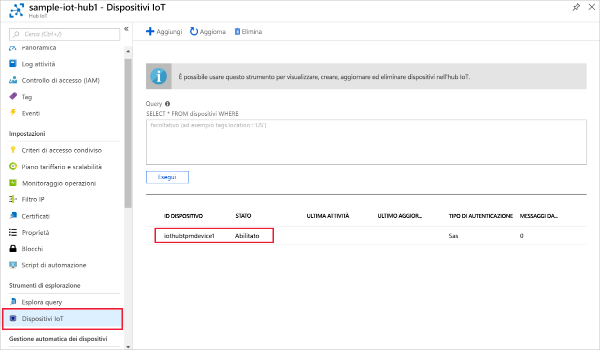

# <a name="create-and-provision-a-simulated-tpm-device-using-c-device-sdk-for-iot-hub-device-provisioning-service"></a>Creare ed effettuare il provisioning di un dispositivo simulato TPM usando l'SDK per dispositivi C# per il servizio Device Provisioning in hub IoT

[!INCLUDE [iot-dps-selector-quick-create-simulated-device-tpm](../../includes/iot-dps-selector-quick-create-simulated-device-tpm.md)]

Questa procedura illustra come usare gli [esempi di Azure IoT per C#](https://github.com/Azure-Samples/azure-iot-samples-csharp) per simulare un dispositivo TPM in un computer di sviluppo che esegue il sistema operativo Windows. L'esempio consente anche di connettere il dispositivo simulato a un hub IoT usando il servizio Device Provisioning. 

Il codice di esempio usa il simulatore Windows TPM come [modulo di protezione hardware](https://azure.microsoft.com/blog/azure-iot-supports-new-security-hardware-to-strengthen-iot-security/) del dispositivo. 

Se non si ha familiarità con il processo di provisioning automatico, è necessario vedere [Concetti relativi al provisioning automatico](concepts-auto-provisioning.md). È anche necessario aver completato la procedura descritta in [Configurare il servizio Device Provisioning in hub IoT con il portale di Azure](./quick-setup-auto-provision.md) prima di continuare. 

Il servizio Device Provisioning in Azure IoT supporta due tipi di registrazione:
- [Gruppi di registrazioni](concepts-service.md#enrollment-group): Usato per registrare più dispositivi correlati.
- [Registrazioni singole](concepts-service.md#individual-enrollment): Usato per registrare un singolo dispositivo.

Questo articolo descrive le registrazioni singole.

[!INCLUDE [IoT Device Provisioning Service basic](../../includes/iot-dps-basic.md)]

<a id="setupdevbox"></a>
## <a name="prepare-the-development-environment"></a>Preparare l'ambiente di sviluppo 

1. Assicurarsi che nel computer sia installato [.NET Core 2.1 SDK o versione successiva](https://www.microsoft.com/net/download/windows). 

1. Verificare che `git` sia installato nel computer e venga aggiunto alle variabili di ambiente accessibili alla finestra di comando. Vedere gli [strumenti client Git di Software Freedom Conservancy](https://git-scm.com/download/) per la versione più recente degli strumenti `git` da installare, tra cui **Git Bash**, l'app da riga di comando che è possibile usare per interagire con il repository Git locale. 

1. Aprire un prompt dei comandi o Git Bash. Clonare gli esempi di Azure IoT per il repository GitHub C#:
    
    ```cmd
    git clone https://github.com/Azure-Samples/azure-iot-samples-csharp.git
    ```

## <a name="provision-the-simulated-device"></a>Effettuare il provisioning del dispositivo simulato


1. Accedere al portale di Azure. Fare clic sul pulsante **Tutte le risorse** nel menu a sinistra e aprire il servizio Device Provisioning. Nel pannello **Panoramica** prendere nota del valore **_Ambito ID_**.

     


2. In un prompt dei comandi sostituire le directory con la directory del progetto per l'esempio di provisioning del dispositivo TPM.

    ```cmd
    cd .\azure-iot-samples-csharp\provisioning\Samples\device\TpmSample
    ```

2. Digitare il comando seguente per compilare ed eseguire l'esempio di provisioning di dispositivo TPM. Sostituire il valore di `<IDScope>` con l'ID ambito del servizio di provisioning. 

    ```cmd
    dotnet run <IDScope>
    ```

    Questo comando consentirà di avviare il simulatore di chip TPM in un'altra finestra del prompt dei comandi.  

1. La finestra di comando visualizza la **_chiave di verifica dell'autenticità_**, l'**_ID registrazione_** e un **_ID dispositivo_** suggerito necessari per la registrazione del dispositivo. Prendere nota di questi valori. Questi valori verranno usati per creare una registrazione singola nell'istanza del servizio Device Provisioning. 
   > [!NOTE]
   > Non confondere la finestra contenente l'output del comando con quella contenente l'output del simulatore TPM. Potrebbe essere necessario fare clic sulla finestra di comando per portarla in primo piano.

     

4. Nel portale di Azure, nel pannello di riepilogo del servizio Device Provisioning selezionare **Gestisci registrazioni**. Selezionare la scheda **Individual Enrollments** (Registrazione singola) e fare clic sul pulsante **Add individual enrollment** (Aggiungi registrazione singola) in alto. 

5. Nella sezione **Add Enrollment**(Aggiungi registrazione) immettere le informazioni seguenti:
    - Selezionare **TPM** come *meccanismo* di attestazione dell'identità.
    - Immettere l'*ID registrazione* e la *chiave di verifica dell'autenticità* per il dispositivo TPM di cui si è preso nota in precedenza.
    - Facoltativamente, selezionare un hub IoT collegato al servizio di provisioning.
    - Immettere un ID dispositivo univoco. È possibile immettere l'ID dispositivo suggerito nell'output di esempio oppure il proprio. Se si usa il proprio, assicurarsi di non usare dati sensibili quando si assegna un nome al dispositivo. 
    - Facoltativamente, aggiornare lo **stato iniziale del dispositivo gemello** con la configurazione iniziale desiderata per il dispositivo.
    - Al termine, fare clic sul pulsante **Save** (Salva). 

      

   Dopo la corretta registrazione, l'*ID registrazione* del dispositivo verrà visualizzato nell'elenco della scheda *Individual Enrollments* (Registrazioni singole). 

6. Premere INVIO nella finestra di comando (che visualizza la **_chiave di verifica dell'autenticità_**, l'**_ID registrazione_** e un **_ID dispositivo_** suggerito) per registrare il dispositivo simulato. Si notino i messaggi che simulano l'avvio e la connessione del dispositivo al servizio Device Provisioning per ottenere le informazioni dell'hub IoT. 

1. Verificare che il provisioning del dispositivo sia stato effettuato. Dopo il corretto provisioning del dispositivo simulato nell'hub IoT collegato al servizio di provisioning, l'ID del dispositivo viene visualizzato nel pannello **IoT Devices** (Dispositivi IoT) dell'hub. 

     

    Se si è modificato lo *stato iniziale del dispositivo gemello* rispetto al valore predefinito della voce di registrazione del dispositivo, è possibile eseguire il pull dello stato del dispositivo desiderato dall'hub e agire di conseguenza. Per altre informazioni, vedere [Comprendere e usare dispositivi gemelli nell'hub IoT](../iot-hub/iot-hub-devguide-device-twins.md)


## <a name="clean-up-resources"></a>Pulire le risorse

Se si prevede di continuare a usare ed esplorare l'esempio di client del dispositivo, non pulire le risorse create in questa guida introduttiva. Se non si prevede di continuare, usare i passaggi seguenti per eliminare tutte le risorse create da questa guida introduttiva.

1. Chiudere la finestra di output di esempio di client del dispositivo sul computer.
1. Chiudere la finestra del simulatore TPM sul computer.
1. Nel portale di Azure fare clic su **Tutte le risorse** nel menu a sinistra e quindi selezionare il servizio Device Provisioning. Nella parte superiore del pannello **Tutte le risorse** fare clic su **Elimina**.  
1. Nel portale di Azure fare clic su **Tutte le risorse** nel menu a sinistra e quindi selezionare l'hub IoT. Nella parte superiore del pannello **Tutte le risorse** fare clic su **Elimina**.  

## <a name="next-steps"></a>Passaggi successivi

In questa guida introduttiva è stato creato un dispositivo simulato TPM nel computer e ne è stato effettuato il provisioning nell'hub IoT usando il servizio Device Provisioning in hub IoT. Per informazioni su come registrare il dispositivo TPM a livello di codice, passare alla guida introduttiva per la registrazione a livello di codice di un dispositivo TPM. 

> [!div class="nextstepaction"]
> [Guida introduttiva di Azure - Registrare un dispositivo TPM nel servizio Device Provisioning in hub IoT di Azure](quick-enroll-device-tpm-csharp.md)
