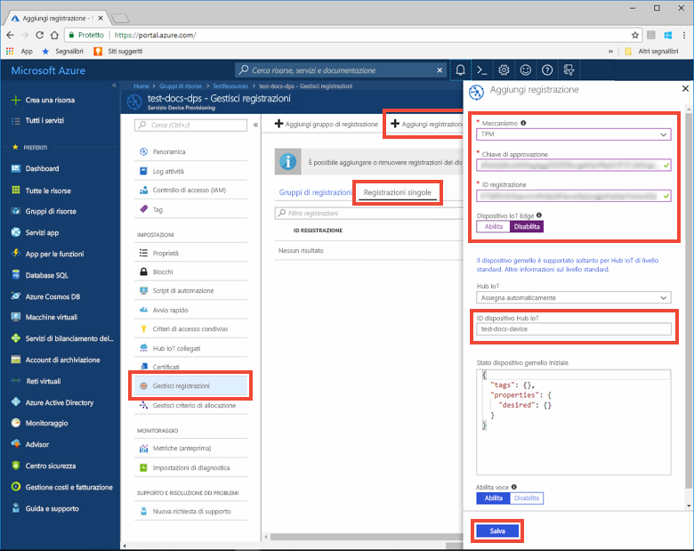
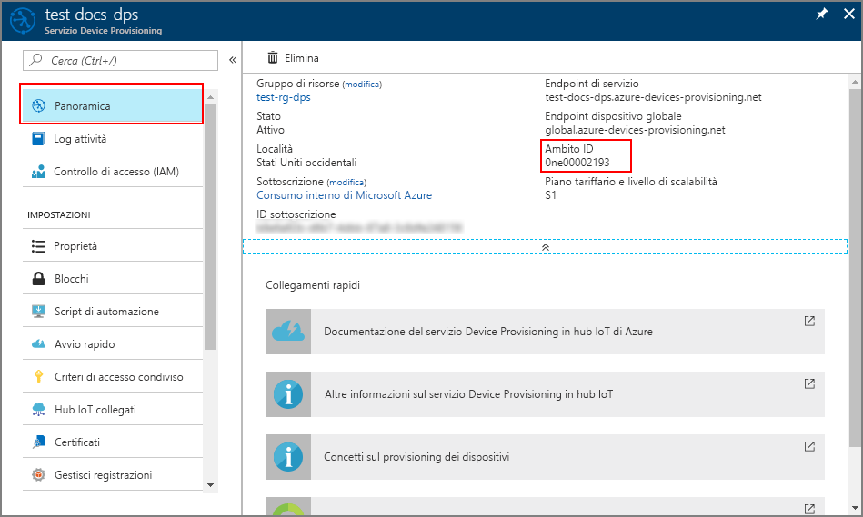
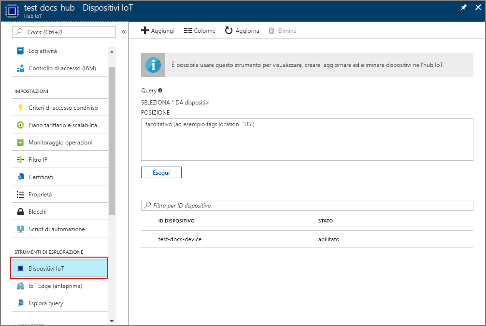

# <a name="create-and-provision-a-simulated-tpm-device-using-nodejs-device-sdk-for-iot-hub-device-provisioning-service"></a>Creare ed effettuare il provisioning di un dispositivo simulato TPM usando Node.js Device SDK per il servizio Device Provisioning in hub IoT

[!INCLUDE [iot-dps-selector-quick-create-simulated-device-tpm](../../includes/iot-dps-selector-quick-create-simulated-device-tpm.md)]

Questi passaggi illustrano come creare un dispositivo simulato nel computer di sviluppo che esegue un sistema operativo Windows, eseguire il simulatore Windows TPM come [modulo di protezione hardware](https://azure.microsoft.com/blog/azure-iot-supports-new-security-hardware-to-strengthen-iot-security/) del dispositivo e usare l'esempio di codice per connettere questo dispositivo simulato con il servizio Device Provisioning e l'hub IoT. 

Assicurarsi di completare la procedura descritta in [Set up IoT Hub Device Provisioning Service with the Azure portal](./quick-setup-auto-provision.md) (Configurare il servizio Device Provisioning in hub IoT con il portale di Azure) prima di continuare.


## <a name="prepare-the-environment"></a>Preparare l'ambiente 

1. Verificare che [Node.js v4.0 o versione successiva](https://nodejs.org) sia installato nel computer.

1. Verificare che `git` sia installato nel computer e venga aggiunto alle variabili di ambiente accessibili alla finestra di comando. Vedere gli [strumenti client Git di Software Freedom Conservancy](https://git-scm.com/download/) per la versione più recente degli strumenti `git` da installare, tra cui **Git Bash**, l'app da riga di comando che è possibile usare per interagire con il repository Git locale. 


## <a name="simulate-a-tpm-device"></a>Simulare un dispositivo TPM

1. Aprire un prompt dei comandi o Git Bash. Clonare il repository GitHub `azure-utpm-c`:
    
    ```cmd/sh
    git clone https://github.com/Azure/azure-utpm-c.git
    ```

1. Passare alla cartella radice GitHub ed eseguire il simulatore [TPM](https://docs.microsoft.com/windows/device-security/tpm/trusted-platform-module-overview), che è in ascolto di un socket sulle porte 2321 e 2322. Non chiudere questa finestra di comando. Il simulatore dovrà restare in esecuzione fino alla fine di questa guida introduttiva: 

    ```cmd/sh
    .\azure-utpm-c\tools\tpm_simulator\Simulator.exe
    ```

1. Creare una nuova cartella vuota denominata **registerdevice**. Nella cartella **registerdevice** creare un file package.json eseguendo questo comando al prompt dei comandi. Rispondere a tutte le domande poste da `npm` o accettare i valori predefiniti, se idonei:
   
    ```cmd/sh
    npm init
    ```

1. Installare i pacchetti precursori seguenti:

    ```cmd/sh
    npm install node-gyp -g
    npm install ffi -g
    ```

    > [!NOTE]
    > Sono presenti alcuni problemi noti per l'installazione dei pacchetti indicati in precedenza. Per risolvere questi problemi, eseguire `npm install --global --production windows-build-tools` usando un prompt dei comandi in modalità **Esegui come amministratore**, eseguire `SET VCTargetsPath=C:\Program Files (x86)\MSBuild\Microsoft.Cpp\v4.0\V140` dopo aver sostituito il percorso con quello della versione installata e quindi eseguire di nuovo i comandi di installazione precedenti.
    >

1. Installare i pacchetti seguenti che contengono i componenti usati durante la registrazione:

    - un client di protezione che funziona con TPM: `azure-iot-security-tpm`
    - un trasporto per consentire al dispositivo di connettersi al servizio Device Provisioning: `azure-iot-provisioning-device-http` oppure `azure-iot-provisioning-device-amqp`
    - un client per usare il traporto e il client di protezione: `azure-iot-provisioning-device`

    Dopo aver registrato il dispositivo, è possibile usare i normali pacchetti dei client per dispositivi dell'hub IoT per connettere il dispositivo con le credenziali fornite durante la registrazione. Prerequisiti:

    - il client per dispositivi: `azure-iot-device`
    - un trasporto: `azure-iot-device-amqp`, `azure-iot-device-mqtt`, o `azure-iot-device-http`
    - il client di protezione già installato: `azure-iot-security-tpm`

    > [!NOTE]
    > Gli esempi seguenti usano i trasporti `azure-iot-provisioning-device-http` e `azure-iot-device-mqtt`.
    > 

    È possibile installare tutti questi componenti contemporaneamente eseguendo questo comando al prompt dei comandi nella cartella **registereddevice**:

        ```cmd/sh
        npm install --save azure-iot-device azure-iot-device-mqtt azure-iot-security-tpm azure-iot-provisioning-device-http azure-iot-provisioning-device
        ```

1. Con un editor di testo creare un nuovo file **ExtractDevice.js** nella cartella **registerdevice**.

1. Aggiungere le istruzioni `require` seguenti all'inizio del file **ExtractDevice.js**:
   
    ```
    'use strict';

    var tpmSecurity = require('azure-iot-security-tpm');
    var tssJs = require("tss.js");

    var myTpm = new tpmSecurity.TpmSecurityClient(undefined, new tssJs.Tpm(true));
    ```

1. Aggiungere la funzione seguente per implementare il metodo:
   
    ```
    myTpm.getEndorsementKey(function(err, endorsementKey) {
      if (err) {
        console.log('The error returned from get key is: ' + err);
      } else {
        console.log('the endorsement key is: ' + endorsementKey.toString('base64'));
        myTpm.getRegistrationId((getRegistrationIdError, registrationId) => {
          if (getRegistrationIdError) {
            console.log('The error returned from get registration id is: ' + getRegistrationIdError);
          } else {
            console.log('The Registration Id is: ' + registrationId);
            process.exit();
          }
        });
      }
    });
    ```

1. Salvare e chiudere il file **ExtractDevice.js**. Eseguire l'esempio:

    ```cmd/sh
    node ExtractDevice.js
    ```

1. La finestra di output visualizza la **_chiave di verifica dell'autenticità_** e l'**_ID registrazione_** necessari per la registrazione del dispositivo. Annotare questi valori. 


## <a name="create-a-device-entry"></a>Creare una voce del dispositivo

1. Accedere al portale di Azure, fare clic sul pulsante **Tutte le risorse** nel menu a sinistra e aprire il servizio Device Provisioning.

1. Nel pannello di riepilogo del servizio Device Provisioning selezionare **Manage enrollments** (Gestisci registrazioni). Selezionare la scheda **Individual Enrollments** (Registrazioni singole) e fare clic sul pulsante **Aggiungi** in alto. 

1. In **Add enrollment list entry** (Aggiungi voce elenco di registrazione) immettere le informazioni seguenti:
    - Selezionare **TPM** come *meccanismo* di attestazione dell'identità.
    - Immettere l'*ID registrazione* e la *chiave di verifica dell'autenticità* per il dispositivo TPM.
    - Facoltativamente, è possibile specificare le informazioni seguenti:
        - Selezionare un hub IoT collegato al servizio di provisioning.
        - Immettere un ID dispositivo univoco. Assicurarsi di non usare dati sensibili quando si assegna un nome al dispositivo.
        - Aggiornare lo **stato iniziale del dispositivo gemello** con la configurazione iniziale desiderata per il dispositivo.
    - Al termine, fare clic sul pulsante **Save** (Salva). 

      

   Dopo la corretta registrazione, l'*ID registrazione* del dispositivo viene visualizzato nell'elenco della scheda *Registrazioni singole*. 


## <a name="register-the-device"></a>Registrare il dispositivo

1. Nel portale di Azure selezionare il pannello **Panoramica** per il servizio Device Provisioning e prendere nota dei valori **_Endpoint dispositivo globale_** e **_Ambito ID_**.

     

1. Con un editor di testo creare un nuovo file **RegisterDevice.js** nella cartella **registerdevice**.

1. Aggiungere le istruzioni `require` seguenti all'inizio del file **RegisterDevice.js**:
   
    ```
    'use strict';

    var ProvisioningTransport = require('azure-iot-provisioning-device-http').Http;
    var iotHubTransport = require('azure-iot-device-mqtt').Mqtt;
    var Client = require('azure-iot-device').Client;
    var Message = require('azure-iot-device').Message;
    var tpmSecurity = require('azure-iot-security-tpm');
    var ProvisioningDeviceClient = require('azure-iot-provisioning-device').ProvisioningDeviceClient;
    ```

    > [!NOTE]
    > **Azure IoT SDK per Node.js** supporta altri protocolli come _AMQP_, _AMQP WS_ e _MQTT WS_.  Per altri esempi vedere [Esempi di Device Provisioning Service SDK per Node.js](https://github.com/Azure/azure-iot-sdk-node/tree/master/provisioning/device/samples).
    > 

1. Aggiungere le variabili **globalDeviceEndpoint** e **idScope** e usarle per creare un'istanza di **ProvisioningDeviceClient**. Sostituire **{globalDeviceEndpoint}** e **{idScope}** con i valori di **_endpoint dispositivo globale_** e **_ID ambito_** del **passaggio 1**:
   
    ```
    var provisioningHost = '{globalDeviceEndpoint}';
    var idScope = '{idScope}';

    var tssJs = require("tss.js");
    var securityClient = new tpmSecurity.TpmSecurityClient('', new tssJs.Tpm(true));
    // if using non-simulated device, replace the above line with following:
    //var securityClient = new tpmSecurity.TpmSecurityClient();

    var provisioningClient = ProvisioningDeviceClient.create(provisioningHost, idScope, new ProvisioningTransport(), securityClient);
    ```

1. Aggiungere la funzione seguente per implementare il metodo nel dispositivo:
   
    ```
    provisioningClient.register(function(err, result) {
      if (err) {
        console.log("error registering device: " + err);
      } else {
        console.log('registration succeeded');
        console.log('assigned hub=' + result.registrationState.assignedHub);
        console.log('deviceId=' + result.registrationState.deviceId);
        var tpmAuthenticationProvider = tpmSecurity.TpmAuthenticationProvider.fromTpmSecurityClient(result.registrationState.deviceId, result.registrationState.assignedHub, securityClient);
        var hubClient = Client.fromAuthenticationProvider(tpmAuthenticationProvider, iotHubTransport);

        var connectCallback = function (err) {
          if (err) {
            console.error('Could not connect: ' + err.message);
          } else {
            console.log('Client connected');
            var message = new Message('Hello world');
            hubClient.sendEvent(message, printResultFor('send'));
          }
        };

        hubClient.open(connectCallback);

        function printResultFor(op) {
          return function printResult(err, res) {
            if (err) console.log(op + ' error: ' + err.toString());
            if (res) console.log(op + ' status: ' + res.constructor.name);
            process.exit(1);
          };
        }
      }
    });
    ```

1. Salvare e chiudere il file **RegisterDevice.js**. Eseguire l'esempio:

    ```cmd/sh
    node RegisterDevice.js
    ```

1. Si notino i messaggi che simulano l'avvio e la connessione del dispositivo al servizio Device Provisioning per ottenere le informazioni dell'hub IoT. Dopo il corretto provisioning del dispositivo simulato nell'hub IoT collegato al servizio di provisioning, l'ID del dispositivo viene visualizzato nel pannello **Iot Devices** (Dispositivi IoT) dell'hub. 

     

    Se si è modificato lo *stato iniziale del dispositivo gemello* rispetto al valore predefinito della voce di registrazione del dispositivo, è possibile eseguire il pull dello stato del dispositivo desiderato dall'hub e agire di conseguenza. Per altre informazioni, vedere [Comprendere e usare dispositivi gemelli nell'hub IoT](../iot-hub/iot-hub-devguide-device-twins.md)


## <a name="clean-up-resources"></a>Pulire le risorse

Se si prevede di continuare a usare ed esplorare l'esempio di client del dispositivo, non pulire le risorse create in questa guida introduttiva. Se non si prevede di continuare, usare i passaggi seguenti per eliminare tutte le risorse create da questa guida introduttiva.

1. Chiudere la finestra di output di esempio di client del dispositivo sul computer.
1. Chiudere la finestra del simulatore TPM sul computer.
1. Nel portale di Azure fare clic su **Tutte le risorse** nel menu a sinistra e quindi selezionare il servizio Device Provisioning. Aprire il pannello **Gestisci registrazioni** per il servizio, quindi fare clic sulla scheda **Registrazioni singole**. Selezionare l'*ID registrazione* del dispositivo registrato in questa guida introduttiva e fare clic sul pulsante **Elimina** nella parte superiore. 
1. Nel portale di Azure fare clic su **Tutte le risorse** nel menu a sinistra e quindi selezionare l'hub IoT. Aprire il pannello **Dispositivi IoT** per l'hub, selezionare l'*ID* del dispositivo registrato in questa guida introduttiva e quindi fare clic su **Elimina** nella parte superiore.


## <a name="next-steps"></a>Passaggi successivi

In questa guida introduttiva è stato creato un dispositivo simulato TPM nel computer e ne è stato effettuato il provisioning nell'hub IoT usando il servizio Device Provisioning in hub IoT. Per informazioni su come registrare il dispositivo TPM a livello di codice, passare alla guida introduttiva per la registrazione a livello di codice di un dispositivo TPM. 

> [!div class="nextstepaction"]
> [Guida introduttiva di Azure - Registrare un dispositivo TPM nel servizio Device Provisioning in hub IoT di Azure](quick-enroll-device-tpm-node.md)
