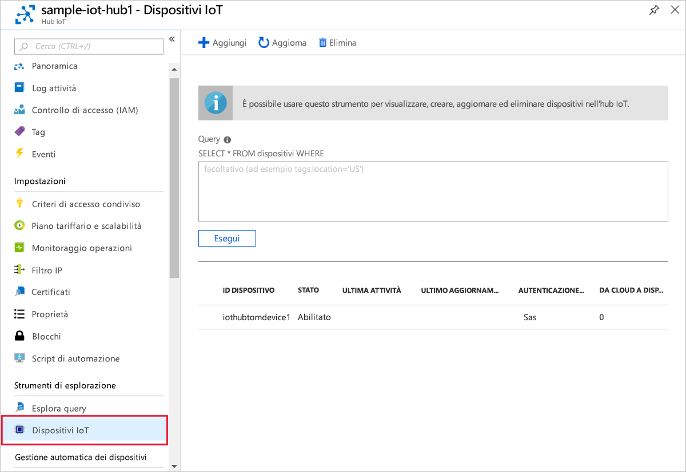

# <a name="quickstart-create-and-provision-a-simulated-x509-device-using-c-device-sdk-for-iot-hub-device-provisioning-service"></a>Guida introduttiva: Creare ed effettuare il provisioning di un dispositivo simulato X.509 usando l'SDK per dispositivi C# per il servizio Device Provisioning in hub IoT
[!INCLUDE [iot-dps-selector-quick-create-simulated-device-x509](../../includes/iot-dps-selector-quick-create-simulated-device-x509.md)]

Questa procedura illustra come usare gli [esempi di Azure IoT per C#](https://github.com/Azure-Samples/azure-iot-samples-csharp) per simulare un dispositivo X.509 in un computer di sviluppo che esegue il sistema operativo Windows. L'esempio consente anche di connettere il dispositivo simulato a un hub IoT usando il servizio Device Provisioning.

Se non si ha familiarità con il processo di provisioning automatico, è necessario vedere [Concetti relativi al provisioning automatico](concepts-auto-provisioning.md). È anche necessario aver completato la procedura descritta in [Configurare il servizio Device Provisioning in hub IoT con il portale di Azure](./quick-setup-auto-provision.md) prima di continuare. 

Il servizio Device Provisioning in Azure IoT supporta due tipi di registrazione:
- [Gruppi di registrazioni](concepts-service.md#enrollment-group): Usato per registrare più dispositivi correlati.
- [Registrazioni singole](concepts-service.md#individual-enrollment): Usato per registrare un singolo dispositivo.

Questo articolo descrive le registrazioni singole.

[!INCLUDE [IoT Device Provisioning Service basic](../../includes/iot-dps-basic.md)]

<a id="setupdevbox"></a>
## <a name="prepare-the-development-environment"></a>Preparare l'ambiente di sviluppo 

1. Verificare che nel computer sia installato [.NET Core 2.1 SDK o versione successiva](https://www.microsoft.com/net/download/windows). 

1. Verificare che `git` sia installato nel computer e venga aggiunto alle variabili di ambiente accessibili alla finestra di comando. Vedere gli [strumenti client Git di Software Freedom Conservancy](https://git-scm.com/download/) per la versione più recente degli strumenti `git` da installare, tra cui **Git Bash**, l'app da riga di comando che è possibile usare per interagire con il repository Git locale. 

1. Aprire un prompt dei comandi o Git Bash. Clonare gli esempi di Azure IoT per il repository GitHub C#:
    
    ```cmd
    git clone https://github.com/Azure-Samples/azure-iot-samples-csharp.git
    ```

## <a name="create-a-self-signed-x509-device-certificate-and-individual-enrollment-entry"></a>Creare un certificato dispositivo X.509 autofirmato e la voce di registrazione singola

In questa sezione si userà un certificato X.509 autofirmato. È importante tenere presente quanto segue:

* I certificati autofirmati sono destinati solo alle operazioni di testing e non dovrebbero essere usati nell'ambiente di produzione.
* La data di scadenza predefinita per un certificato autofirmato è un anno.

Si userà il codice di esempio incluso nell'[esempio di client Provisioning Device con attestazione X.509](https://github.com/Azure-Samples/azure-iot-samples-csharp/tree/master/provisioning/Samples/device/X509Sample) per creare il certificato da usare con la voce di registrazione singola per il dispositivo simulato.


1. In un prompt dei comandi sostituire le directory con la directory del progetto per l'esempio di provisioning del dispositivo X.509.

    ```cmd
    cd .\azure-iot-samples-csharp\provisioning\Samples\device\X509Sample
    ```

2. Il codice di esempio è configurato per usare i certificati X.509 archiviati in un file di formato PKCS12 protetto da password (certificate.pfx). È anche necessario un file certificato di chiave pubblica (certificate.cer) per creare una registrazione singola più avanti in questa guida introduttiva. Per generare un certificato autofirmato e i file CER e PFX associati, eseguire il comando seguente:

    ```cmd
    powershell .\GenerateTestCertificate.ps1
    ```

3. Lo script chiede una password PFX. Prendere nota di questa password che è necessario usare quando si esegue l'esempio.

      


4. Accedere al portale di Azure, fare clic sul pulsante **All resources** (Tutte le risorse) nel menu a sinistra e aprire il servizio di provisioning.

5. Nel pannello di riepilogo del servizio Device Provisioning selezionare **Manage enrollments** (Gestisci registrazioni). Selezionare la scheda **Individual Enrollments** (Registrazione singola) e fare clic sul pulsante in alto **Add individual enrollment** (Aggiungi registrazione singola). 

6. Nel riquadro **Add Enrollment** (Aggiungi registrazione) immettere le informazioni seguenti:
   - Selezionare **X.509** come *meccanismo* di attestazione dell'identità.
   - In *Primary certificate .pem or .cer file* (File di certificato primario con estensione pem o cer) fare clic su *Selezionare un file* per selezionare il file di certificato **certificate.cer** creato nei passaggi precedenti.
   - Lasciare **ID dispositivo** vuoto. Il provisioning del dispositivo verrà effettuato con l'ID dispositivo impostato sul nome comune del certificato X.509, **iothubx509device1**. Questo nome verrà usato anche per l'ID registrazione per la voce di registrazione singola. 
   - Facoltativamente, è possibile specificare le informazioni seguenti:
       - Selezionare un hub IoT collegato al servizio di provisioning.
       - Aggiornare lo **stato iniziale del dispositivo gemello** con la configurazione iniziale desiderata per il dispositivo.
   - Al termine, fare clic sul pulsante **Save** (Salva). 

     [](./media/quick-create-simulated-device-x509-csharp/device-enrollment.png#lightbox)
    
   Al termine della registrazione, la voce di registrazione X.509 verrà visualizzata come **iothubx509device1** nella colonna *ID registrazione* della scheda *Registrazioni singole*. 

## <a name="provision-the-simulated-device"></a>Effettuare il provisioning del dispositivo simulato

1. Nel pannello **Panoramica** per il servizio di provisioning prendere nota del valore di **_Ambito ID_** .

     


2. Digitare il comando seguente per compilare ed eseguire l'esempio di provisioning di dispositivo X.509. Sostituire il valore di `<IDScope>` con l'ID ambito del servizio di provisioning. 

    ```cmd
    dotnet run <IDScope>
    ```

3. Quando richiesto, immettere la password per il file PFX creato in precedenza. Si notino i messaggi che simulano l'avvio e la connessione del dispositivo al servizio Device Provisioning per ottenere le informazioni dell'hub IoT. 

     

4. Verificare che il provisioning del dispositivo sia stato effettuato. Dopo il corretto provisioning del dispositivo simulato nell'hub IoT collegato al servizio di provisioning, l'ID del dispositivo viene visualizzato nel pannello **Iot Devices** (Dispositivi IoT) dell'hub. 

     

    Se si è modificato lo *stato iniziale del dispositivo gemello* rispetto al valore predefinito della voce di registrazione del dispositivo, è possibile eseguire il pull dello stato del dispositivo desiderato dall'hub e agire di conseguenza. Per altre informazioni, vedere [Comprendere e usare dispositivi gemelli nell'hub IoT](../iot-hub/iot-hub-devguide-device-twins.md)


## <a name="clean-up-resources"></a>Pulire le risorse

Se si prevede di continuare a usare ed esplorare l'esempio di client del dispositivo, non pulire le risorse create in questa guida introduttiva. Se non si prevede di continuare, usare i passaggi seguenti per eliminare tutte le risorse create da questa guida introduttiva.

1. Chiudere la finestra di output di esempio di client del dispositivo sul computer.
1. Chiudere la finestra del simulatore TPM sul computer.
1. Nel portale di Azure fare clic su **Tutte le risorse** nel menu a sinistra e quindi selezionare il servizio Device Provisioning. Nella parte superiore del pannello **Tutte le risorse** fare clic su **Elimina**.  
1. Nel portale di Azure fare clic su **Tutte le risorse** nel menu a sinistra e quindi selezionare l'hub IoT. Nella parte superiore del pannello **Tutte le risorse** fare clic su **Elimina**.  

## <a name="next-steps"></a>Passaggi successivi

In questa guida introduttiva è stato creato un dispositivo X.509 simulato nel computer Windows e ne è stato effettuato il provisioning nell'hub IoT usando il servizio Device Provisioning in hub IoT di Azure nel portale. Per informazioni su come registrare il dispositivo X.509 a livello di codice, passare alla guida introduttiva per la registrazione a livello di codice dei dispositivi X.509. 

> [!div class="nextstepaction"]
> [Guida introduttiva di Azure - Registrare dispositivi X.509 nel servizio Device Provisioning in hub IoT di Azure](quick-enroll-device-x509-csharp.md)
