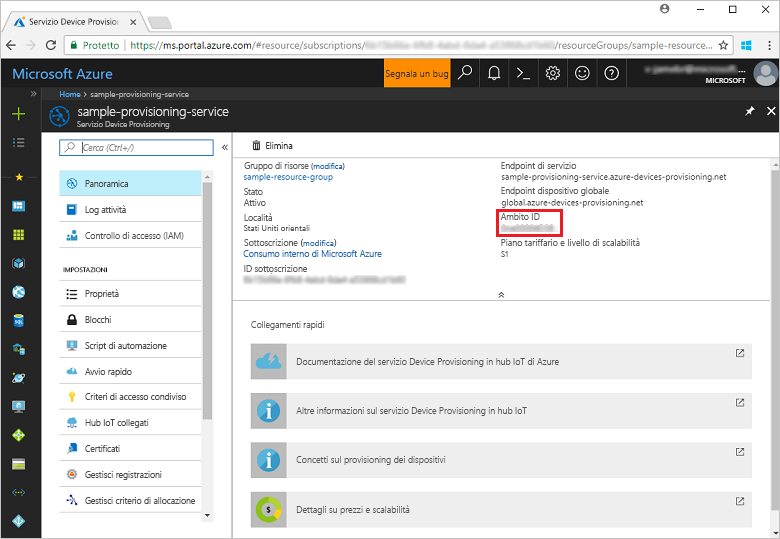
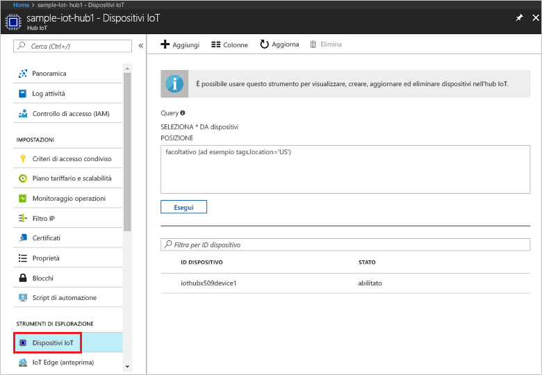

# <a name="create-and-provision-a-simulated-x509-device-using-c-device-sdk-for-iot-hub-device-provisioning-service"></a>Creare ed effettuare il provisioning di un dispositivo simulato X.509 usando l'SDK per dispositivi C# per il servizio Device Provisioning in hub IoT
> [!div class="op_single_selector"]
> * [C](quick-create-simulated-device-x509.md)
> * [Java](quick-create-simulated-device-x509-java.md)
> * [C#](quick-create-simulated-device-x509-csharp.md)
> * [Python](quick-create-simulated-device-x509-python.md)

Questi passaggi illustrano come compilare l'esempio di dispositivo X.509 simulato con [Azure IoT Hub C# SDK](https://github.com/Azure/azure-iot-sdk-csharp) in un computer di sviluppo con sistema operativo Windows e connettere il dispositivo simulato con il servizio Device Provisioning e l'hub IoT.

Assicurarsi di completare la procedura descritta in [Set up IoT Hub Device Provisioning Service with the Azure portal](./quick-setup-auto-provision.md) (Configurare il servizio Device Provisioning in hub IoT con il portale di Azure) prima di continuare.

<a id="setupdevbox"></a>
## <a name="prepare-the-development-environment"></a>Preparare l'ambiente di sviluppo 

1. Verificare che [.NET Core SDK](https://www.microsoft.com/net/download/windows) sia installato nel computer. 

1. Verificare che `git` sia installato nel computer e venga aggiunto alle variabili di ambiente accessibili alla finestra di comando. Vedere gli [strumenti client Git di Software Freedom Conservancy](https://git-scm.com/download/) per la versione più recente degli strumenti `git` da installare, tra cui **Git Bash**, l'app da riga di comando che è possibile usare per interagire con il repository Git locale. 

4. Aprire un prompt dei comandi o Git Bash. Clonare il repository GitHub [Azure IoT SDK per C#](https://github.com/Azure/azure-iot-sdk-csharp):
    
    ```cmd
    git clone --recursive https://github.com/Azure/azure-iot-sdk-csharp.git
    ```

## <a name="create-a-self-signed-x509-device-certificate-and-individual-enrollment-entry"></a>Creare un certificato dispositivo X.509 autofirmato e la voce di registrazione singola

1. In un prompt dei comandi sostituire le directory con la directory del progetto per l'esempio di provisioning del dispositivo X.509.

    ```cmd
    cd .\azure-iot-sdk-csharp\provisioning\device\samples\ProvisioningDeviceClientX509
    ```

1. Il codice di esempio è configurato per usare i certificati X.509 archiviati in un file di formato PKCS12 protetto da password (certificate.pfx). È anche necessario un file certificato di chiave pubblica (certificate.cer) per creare una registrazione singola più avanti in questa guida introduttiva. Per generare un certificato autofirmato e i file CER e PFX associati, eseguire il comando seguente:

    ```cmd
    powershell .\GenerateTestCertificate.ps1
    ```

2. Lo script chiede una password PFX. Prendere nota di questa password che è necessario usare quando si esegue l'esempio.

      


4. Accedere al portale di Azure, fare clic sul pulsante **Tutte le risorse** nel menu a sinistra e aprire il servizio di provisioning.

4. Nel pannello di riepilogo del servizio Device Provisioning selezionare **Manage enrollments** (Gestisci registrazioni). Selezionare la scheda **Individual Enrollments** (Registrazioni singole) e fare clic sul pulsante **Aggiungi** in alto. 

5. In **Add enrollment list entry** (Aggiungi voce elenco di registrazione) immettere le informazioni seguenti:
    - Selezionare **X.509** come *meccanismo* di attestazione dell'identità.
    - In *File di certificato con estensione pem o cer* selezionare il file di certificato **certificate.cer** creato nei passaggi precedenti con il widget *Esplora file*.
    - Lasciare **ID dispositivo** vuoto. Il provisioning del dispositivo verrà effettuato con l'ID dispositivo impostato sul nome comune del certificato X.509, **iothubx509device1**. Questo nome verrà usato anche per l'ID registrazione per la voce di registrazione singola. 
    - Facoltativamente, è possibile specificare le informazioni seguenti:
        - Selezionare un hub IoT collegato al servizio di provisioning.
        - Aggiornare lo **stato iniziale del dispositivo gemello** con la configurazione iniziale desiderata per il dispositivo.
    - Al termine, fare clic sul pulsante **Save** (Salva). 

      

   Al termine della registrazione, la voce di registrazione X.509 verrà visualizzata come **iothubx509device1** nella colonna *ID registrazione* della scheda *Registrazioni singole*. 

## <a name="provision-the-simulated-device"></a>Effettuare il provisioning del dispositivo simulato

1. Nel pannello **Panoramica** per il servizio di provisioning prendere nota del valore di **_Ambito ID_**.

     


2. Digitare il comando seguente per compilare ed eseguire l'esempio di provisioning di dispositivo X.509. Sostituire il valore di `<IDScope>` con l'ID ambito del servizio di provisioning. 

    ```cmd
    dotnet run <IDScope>
    ```

6. Quando richiesto, immettere la password per il file PFX creata prima. Si notino i messaggi che simulano l'avvio e la connessione del dispositivo al servizio Device Provisioning per ottenere le informazioni dell'hub IoT. 

     

1. Verificare che il provisioning del dispositivo sia stato effettuato. Dopo il corretto provisioning del dispositivo simulato nell'hub IoT collegato al servizio di provisioning, l'ID del dispositivo viene visualizzato nel pannello **Iot Devices** (Dispositivi IoT) dell'hub. 

     

    Se si è modificato lo *stato iniziale del dispositivo gemello* rispetto al valore predefinito della voce di registrazione del dispositivo, è possibile eseguire il pull dello stato del dispositivo desiderato dall'hub e agire di conseguenza. Per altre informazioni, vedere [Comprendere e usare dispositivi gemelli nell'hub IoT](../iot-hub/iot-hub-devguide-device-twins.md)


## <a name="clean-up-resources"></a>Pulire le risorse

Se si prevede di continuare a usare ed esplorare l'esempio di client del dispositivo, non pulire le risorse create in questa guida introduttiva. Se non si prevede di continuare, usare i passaggi seguenti per eliminare tutte le risorse create da questa guida introduttiva.

1. Chiudere la finestra di output di esempio di client del dispositivo sul computer.
1. Chiudere la finestra del simulatore TPM sul computer.
1. Nel portale di Azure fare clic su **Tutte le risorse** nel menu a sinistra e quindi selezionare il servizio Device Provisioning. Nella parte superiore del pannello **Tutte le risorse** fare clic su **Elimina**.  
1. Nel portale di Azure fare clic su **Tutte le risorse** nel menu a sinistra e quindi selezionare l'hub IoT. Nella parte superiore del pannello **Tutte le risorse** fare clic su **Elimina**.  

## <a name="next-steps"></a>Passaggi successivi

In questa guida introduttiva è stato creato un dispositivo X.509 simulato nel computer Windows e ne è stato effettuato il provisioning nell'hub IoT usando il servizio Device Provisioning in hub IoT di Azure nel portale. Per informazioni su come registrare il dispositivo X.509 a livello di codice, passare alla guida introduttiva per la registrazione a livello di codice dei dispositivi X.509. 

> [!div class="nextstepaction"]
> [Guida introduttiva di Azure - Registrare dispositivi X.509 nel servizio Device Provisioning in hub IoT di Azure](quick-enroll-device-x509-node.md)
